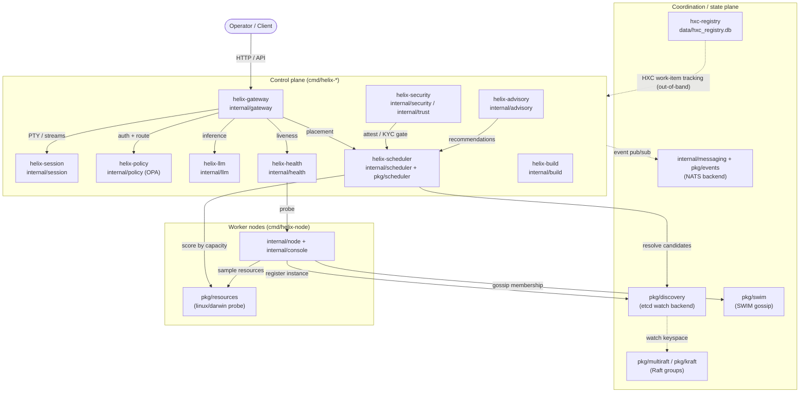
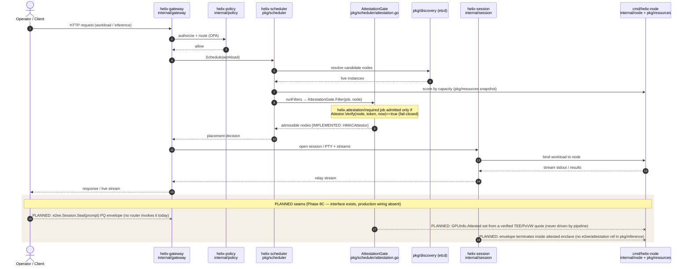
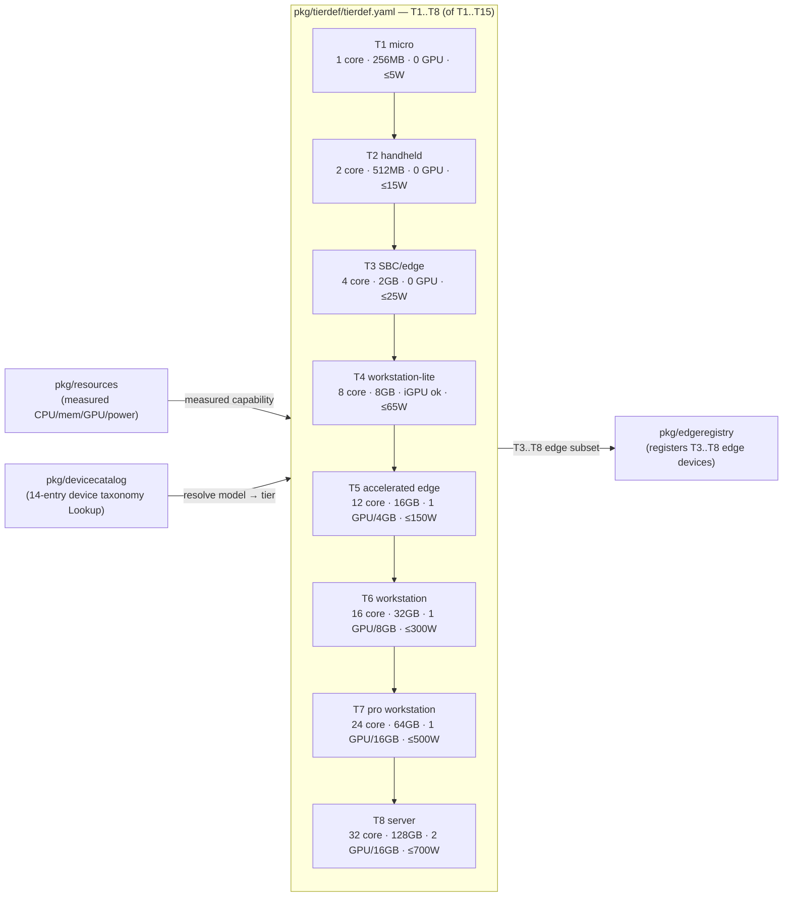

# Helix Cluster OS — Consolidated Architecture Diagrams

| Field | Value |
|---|---|
| Revision | 1 |
| Created | 2026-06-03 |
| Status | active |

> **Scope & honesty contract (CLAUDE-1 / CLAUDE-3, Constitution §11.4.106).** This
> document collects the Helix Cluster OS architecture into a small set of
> **Mermaid** diagrams. It is a *visual companion* to the prose docs — it does not
> restate them. Every node in every diagram is labelled with a **real** package
> (`pkg/…`, `internal/…`) or binary (`cmd/…`) path that exists in this repository;
> the module path is `github.com/HelixDevelopment/helix_cluster`. Where an edge
> represents an integration that is **not yet wired in code**, it is drawn dashed
> and tagged `PLANNED`, matching
> [`architecture/PHASE_8C_INTEGRATION.md`](architecture/PHASE_8C_INTEGRATION.md).
>
> **For the authoritative, lint-enforced component→package→origin mapping** see
> [`ARCHITECTURE.md`](ARCHITECTURE.md) (enforced by [`pkg/archlint`](../pkg/archlint)).
> **For runtime service prose, the registry schema, and foundation-package
> interfaces** see [`MVP_ARCHITECTURE.md`](MVP_ARCHITECTURE.md). **For the full
> foundation-library catalogue** see [`FOUNDATION_PACKAGES.md`](FOUNDATION_PACKAGES.md).
> This file duplicates none of that prose; it diagrams it.
>
> **Legend for integration state:** solid edge = runtime/coordination path
> grounded in code today; **dashed edge tagged `PLANNED`** = the interface/seam
> exists but the production wiring to the named package is not present yet (per
> `PHASE_8C_INTEGRATION.md`, verified file:symbol). Do not read dashed edges as
> live integration.

---

## 1. The L0–L7 layered stack

Helix is a seven-layer stack (L0–L7) over a hardware substrate, coordinated via
**SWIM gossip** ([`pkg/swim`](../pkg/swim)) for membership and **Raft** consensus
([`pkg/multiraft`](../pkg/multiraft), [`pkg/kraft`](../pkg/kraft)) for
strongly-consistent state, with an **Omega-model** two-level scheduler
([`pkg/scheduler`](../pkg/scheduler)). Each layer consumes only the layers
beneath it. Node labels below are representative real packages from the
[`ARCHITECTURE.md`](ARCHITECTURE.md) Component Map; that table is the exhaustive,
lint-checked source.

```mermaid
flowchart TB
    subgraph L7["L7 — Federation, multi-cluster & observability"]
        direction LR
        l7a["pkg/federation"]
        l7b["pkg/fedtopology"]
        l7c["pkg/metrics"]
        l7d["pkg/tracing"]
        l7e["pkg/grafanadash"]
    end
    subgraph L6["L6 — Control-plane services (cmd/helix-*)"]
        direction LR
        l6a["internal/gateway"]
        l6b["internal/session"]
        l6c["internal/health"]
        l6d["internal/policy"]
        l6e["internal/llm"]
        l6f["internal/scheduler"]
        l6g["internal/build"]
        l6h["internal/advisory"]
        l6i["internal/trust"]
    end
    subgraph L5["L5 — Secure transport & networking"]
        direction LR
        l5a["pkg/hybridkex<br/>(X25519+ML-KEM-768)"]
        l5b["cmd/e2ee-proxy"]
        l5c["internal/wireguard"]
        l5d["pkg/ice"]
        l5e["pkg/hashslot"]
    end
    subgraph L4["L4 — Scheduling, placement & economics"]
        direction LR
        l4a["pkg/scheduler<br/>(Omega)"]
        l4b["pkg/constraints"]
        l4c["pkg/preempt"]
        l4d["pkg/workloadrouter"]
        l4e["pkg/carbonsched"]
        l4f["pkg/economics"]
    end
    subgraph L3["L3 — Consensus & replicated state"]
        direction LR
        l3a["pkg/voting"]
        l3b["pkg/mvcc"]
        l3c["pkg/crdt"]
        l3d["pkg/deltacrdt"]
        l3e["pkg/antientropy"]
        l3f["pkg/hlc"]
    end
    subgraph L2["L2 — Membership & discovery"]
        direction LR
        l2a["pkg/swim"]
        l2b["pkg/discovery"]
        l2c["pkg/scan"]
        l2d["pkg/nattraversal"]
        l2e["pkg/cellmesh"]
    end
    subgraph L1["L1 — Node lifecycle & boot"]
        direction LR
        l1a["internal/node"]
        l1b["internal/console"]
        l1c["cmd/helix-node"]
        l1d["pkg/local<br/>(TCO)"]
    end
    subgraph L0["L0 — Hardware / resource substrate"]
        direction LR
        l0a["pkg/resources<br/>(linux/darwin)"]
        l0b["pkg/gpuattest"]
        l0c["internal/gpu"]
        l0d["pkg/devicecatalog"]
        l0e["pkg/capability"]
        l0f["pkg/exportcontrol"]
    end

    L7 --> L6 --> L5 --> L4 --> L3 --> L2 --> L1 --> L0
```

**Cross-cutting concerns** (attestation, metrics, compliance) are surfaced as
dedicated components rather than threaded implicitly through every layer — see
the Component Map in [`ARCHITECTURE.md`](ARCHITECTURE.md) for the full
per-component origin/HXC mapping.

---

## 2. Control-plane services & how they communicate

Each `cmd/helix-*` binary's `main.go` imports the correspondingly named
`internal/*` package (verified: `cmd/helix-gateway/main.go` imports
`internal/gateway`; `cmd/helix-node/main.go` imports `internal/node`). The
operator drives the cluster through the gateway; the gateway fronts session,
policy, LLM-router, health and scheduler; nodes register through discovery and
gossip membership over SWIM.

This diagram is the visual form of [`MVP_ARCHITECTURE.md` §2](MVP_ARCHITECTURE.md);
see that section for edge-by-edge verifiability notes.

**Edge grounding.** Discovery's etcd backend is
[`pkg/discovery/etcd_backend.go`](../pkg/discovery/etcd_backend.go); the gateway
routing surface is [`internal/gateway/api.go`](../internal/gateway/api.go) and
[`internal/gateway/inference.go`](../internal/gateway/inference.go); the NATS
event path is [`pkg/events/nats_backend.go`](../pkg/events/nats_backend.go) plus
the in-process bus [`internal/messaging/bus.go`](../internal/messaging/bus.go);
Raft groups are [`pkg/multiraft`](../pkg/multiraft) / [`pkg/kraft`](../pkg/kraft).
The dotted `hxc-registry` edge is the development work-item registry
([`cmd/hxc-registry`](../cmd/hxc-registry) over
[`data/hxc_registry.db`](../data/hxc_registry.db)), not a traffic-serving service.

> **Honest note.** The `internal/messaging` ↔ `pkg/events` bus and the
> `discovery → raft` keyspace edge are drawn dotted because they are
> coordination-plane substrates rather than a single fixed request path; the
> exact per-service NATS subjects/Raft groups a given binary uses are
> configuration-driven, not hard-wired in a way this diagram should overstate.

---

## 3. Request / data flow (workload → gateway → scheduler → session → node)

End-to-end placement of a workload, including the **attestation** and **E2EE**
seams. Per [`architecture/PHASE_8C_INTEGRATION.md`](architecture/PHASE_8C_INTEGRATION.md),
the **attestation admission predicate itself is live** (the scheduler runs the
`AttestationGate` plugin with an in-repo `HMACAttestor`), but **population of the
node-trust flag from a real TEE/PoVW quote, and termination of an E2EE envelope
inside an attested enclave, are PLANNED** (interface present, production backend
not wired). Those seams are dashed below.

**Grounding & honesty.** The live admission path —
`Scheduler.Schedule → runFilters → AttestationGate.Filter → Attestor.Verify` — is
[`pkg/scheduler/scheduler.go`](../pkg/scheduler/scheduler.go) +
[`pkg/scheduler/attestation.go`](../pkg/scheduler/attestation.go); the in-repo
`HMACAttestor` does genuine constant-time HMAC-SHA256 token verification and
fails closed when no `Attestor` is configured. The E2EE envelope itself is a
complete PQ implementation in the `digital.vasic.security` submodule
(`security/pkg/e2ee/package.go`: ML-KEM-768 + HKDF-SHA256 + AES-256-GCM), **but no
main-repo router/inference package imports it yet** — hence the dashed `PLANNED`
arrows. See `PHASE_8C_INTEGRATION.md` §5.1/§5.2 for the verified file:symbol index.
The full multi-node distributed flow over a real deployed fleet is **not yet
validated end-to-end** (tracked separately; requires a deployed cluster).

---

## 4. Tier matrix (high level)

Node capability tiers are defined as data in
[`pkg/tierdef/tierdef.yaml`](../pkg/tierdef/tierdef.yaml) (loaded by
[`pkg/tierdef/loader.go`](../pkg/tierdef/loader.go)), with each tier gated on
minimum CPU cores, memory, GPU count/VRAM, network, and a power ceiling. The
task focuses on **T1–T8**; the table below transcribes those rows verbatim from
the YAML. (**Honest scope note:** the YAML actually defines a continuum **T1
through T15** — T9–T15 cover server+ through extreme multi-GPU flagship nodes;
they are omitted here only for brevity, not because they are absent.) Edge-class
tiers **T3–T8** are also the registration range of
[`pkg/edgeregistry`](../pkg/edgeregistry); device→tier resolution is via the
device taxonomy in [`pkg/devicecatalog`](../pkg/devicecatalog) (a
case-insensitive substring `Lookup` over the in-code `catalog`, which today
ships **14 well-known device-family entries**, ordered most-specific-first;
the broader "64-device" master taxonomy is a Phase-5 roadmap target tracked as
queued issue HXC-1331, not yet authored in code).

**Grounding & honesty.** The thresholds shown are the literal
`min_cpu_cores` / `min_memory_mb` / `min_gpu` / `min_gpu_vram_mb` / `max_power_w`
fields from [`pkg/tierdef/tierdef.yaml`](../pkg/tierdef/tierdef.yaml) (schema
version 1); memory is shown converted from MB to GB for readability. Resource
measurement feeding tier assignment is the per-OS probe in
[`pkg/resources`](../pkg/resources) (linux sysfs / darwin `system_profiler`,
CLAUDE-2 cross-platform parity); device-model→tier resolution is
[`pkg/devicecatalog`](../pkg/devicecatalog). This diagram shows tier *definitions
and their data sources*; it does not assert that every tier has been exercised on
real hardware.

---

## Maintenance

This document is a visual companion and is kept in sync under CLAUDE-3 /
§11.4.106 alongside its sources: when the layer stack, control-plane service set,
request flow, Phase 8C integration state, or the tier definitions change, update
the corresponding diagram here in the same work unit. The canonical, lint-checked
component map remains [`ARCHITECTURE.md`](ARCHITECTURE.md); runtime prose and the
registry schema remain [`MVP_ARCHITECTURE.md`](MVP_ARCHITECTURE.md); the Phase 8C
seam states (IMPLEMENTED vs PLANNED) remain
[`architecture/PHASE_8C_INTEGRATION.md`](architecture/PHASE_8C_INTEGRATION.md);
the foundation-library catalogue remains
[`FOUNDATION_PACKAGES.md`](FOUNDATION_PACKAGES.md). The `docs_chain` engine keeps
this file's HTML/PDF/DOCX exports in sync (`docs_chain sync`) and gates them
(`docs_chain verify`).
