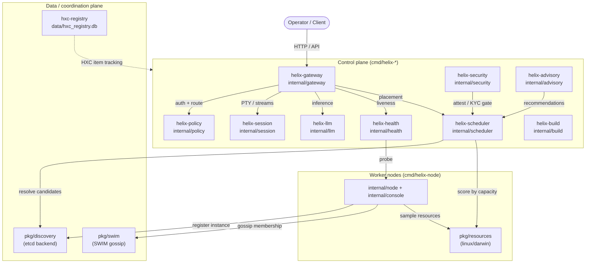

# Helix Cluster OS — MVP Architecture

| Field | Value |
|---|---|
| Revision | 1 |
| Created | 2026-06-03 |
| Status | active |

> **HXC-1145.** This is a **living** MVP architecture document: every component,
> service, package path, and schema described below is checkable against the
> source tree as it exists today (CLAUDE-3 / Constitution §11.4.106 — "No
> documentation ever can be out of sync with its codebase"). It complements the
> canonical [`docs/ARCHITECTURE.md`](ARCHITECTURE.md) hardened component map
> (lint-enforced by [`pkg/archlint`](../pkg/archlint)) and the reader-facing
> [`phase_02_architecture.md`](guides/phase_02_architecture.md) guide. Where this
> document names a package, that package is a real directory in the repository;
> where it names a service it is a real `cmd/` binary; where it names a table it
> exists in `data/hxc_registry.db`.

---

## 1. Seven-layer stack (L0–L7)

Helix is organised as a seven-layer stack over a hardware substrate, coordinated
via **SWIM gossip** ([`pkg/swim`](../pkg/swim)) for membership and **Raft**
consensus ([`pkg/multiraft`](../pkg/multiraft), [`pkg/kraft`](../pkg/kraft)) for
strongly-consistent state, with an **Omega-model** two-level scheduler using
optimistic concurrency ([`pkg/scheduler`](../pkg/scheduler)).

| Layer | Concern | Representative real packages |
|---|---|---|
| **L7** | Federation, multi-cluster & observability | [`pkg/federation`](../pkg/federation), [`pkg/fedtopology`](../pkg/fedtopology), [`pkg/metrics`](../pkg/metrics), [`pkg/tracing`](../pkg/tracing), [`pkg/grafanadash`](../pkg/grafanadash) |
| **L6** | Control-plane services | [`internal/gateway`](../internal/gateway), [`internal/session`](../internal/session), [`internal/health`](../internal/health), [`internal/policy`](../internal/policy), [`internal/llm`](../internal/llm), [`internal/scheduler`](../internal/scheduler), [`internal/build`](../internal/build), [`internal/advisory`](../internal/advisory) |
| **L5** | Secure transport & networking | [`pkg/hybridkex`](../pkg/hybridkex), [`internal/wireguard`](../internal/wireguard), [`pkg/ice`](../pkg/ice), [`pkg/nattraversal`](../pkg/nattraversal), [`pkg/hashslot`](../pkg/hashslot) |
| **L4** | Scheduling, placement & economics | [`pkg/scheduler`](../pkg/scheduler), [`pkg/constraints`](../pkg/constraints), [`pkg/preempt`](../pkg/preempt), [`pkg/workloadrouter`](../pkg/workloadrouter), [`pkg/carbonsched`](../pkg/carbonsched), [`pkg/economics`](../pkg/economics) |
| **L3** | Consensus & replicated state | [`pkg/voting`](../pkg/voting), [`pkg/mvcc`](../pkg/mvcc), [`pkg/crdt`](../pkg/crdt), [`pkg/deltacrdt`](../pkg/deltacrdt), [`pkg/antientropy`](../pkg/antientropy), [`pkg/hlc`](../pkg/hlc) |
| **L2** | Membership & discovery | [`pkg/swim`](../pkg/swim), [`pkg/discovery`](../pkg/discovery), [`pkg/scan`](../pkg/scan), [`pkg/cellmesh`](../pkg/cellmesh) |
| **L1** | Node lifecycle & boot | [`internal/node`](../internal/node), [`internal/console`](../internal/console), [`cmd/helix-node`](../cmd/helix-node), [`pkg/local`](../pkg/local) |
| **L0** | Hardware / resource substrate | [`pkg/resources`](../pkg/resources), [`pkg/gpuattest`](../pkg/gpuattest), [`internal/gpu`](../internal/gpu), [`pkg/devicecatalog`](../pkg/devicecatalog), [`pkg/capability`](../pkg/capability) |

Each layer consumes only the layers beneath it. The exhaustive, lint-enforced
component→package→origin mapping lives in [`docs/ARCHITECTURE.md`](ARCHITECTURE.md);
this MVP document focuses on the runtime services and the foundation-package
interfaces an integrator touches first.

---

## 2. Service-communication matrix

The diagram below is grounded in the **real control-plane binaries** under
[`cmd/`](../cmd) and the `internal/` packages they import. Each `cmd/helix-*`
`main.go` imports the correspondingly named `internal/*` package (verifiable, e.g.
[`cmd/helix-gateway/main.go`](../cmd/helix-gateway/main.go) imports
`internal/gateway`). The operator drives the cluster through the gateway and the
session/console subsystem; the gateway fronts the session, policy, LLM-router,
health and scheduler services; nodes register through discovery and run work
placed by the scheduler.



Edge legend: solid edges are runtime request/coordination paths between the named
binaries and packages; the dotted edge is the out-of-band development registry
(`cmd/hxc-registry`, §4) used for work-item tracking rather than serving traffic.

**Verifiability.** The binaries exist (`cmd/helix-gateway`, `cmd/helix-session`,
`cmd/helix-policy`, `cmd/helix-llm`, `cmd/helix-health`, `cmd/helix-scheduler`,
`cmd/helix-security`, `cmd/helix-build`, `cmd/helix-advisory`, `cmd/helix-node`,
`cmd/hxc-registry`). The gateway routing surface is implemented in
[`internal/gateway/api.go`](../internal/gateway/api.go) /
[`internal/gateway/inference.go`](../internal/gateway/inference.go); discovery's
etcd backend is [`pkg/discovery/etcd_backend.go`](../pkg/discovery/etcd_backend.go);
node resource sampling is the `Reader` interface in
[`pkg/resources/types.go`](../pkg/resources/types.go).

---

## 3. Component specifications (foundation packages)

The following are the key interfaces an integrator depends on. Signatures below
are reproduced from the source and are kept in sync with it.

### 3.1 Resource substrate — `pkg/resources`

The node resource probe is split behind a single `Reader` interface, with **real
per-OS implementations selected by build tags** (CLAUDE-2 cross-platform parity —
no `!linux` stub for a real-operation feature):

```go
// pkg/resources/types.go
type Reader interface {
    Read(nodeID string) (NodeResources, error)
}

type Aggregator interface {
    Collect() error
    GetNode(id string) (ResourceSnapshot, bool)
    ListNodes() []ResourceSnapshot
}
```

Real implementations: cgroup-v2 + `/proc` on Linux
([`proc_linux.go`](../pkg/resources/proc_linux.go),
[`cgroup_v2.go`](../pkg/resources/cgroup_v2.go),
[`drm_linux.go`](../pkg/resources/drm_linux.go)); `sysctl` / `vm_stat` / Metal on
macOS ([`proc_darwin.go`](../pkg/resources/proc_darwin.go),
[`drm_darwin.go`](../pkg/resources/drm_darwin.go),
[`accel_darwin.go`](../pkg/resources/accel_darwin.go)). The
[`NodeAggregator.RegisterReader`](../pkg/resources/aggregator.go) fans multiple
readers into one node view consumed by the scheduler.

### 3.2 Membership — `pkg/swim`

SWIM gossip provides eventually-consistent failure detection and membership for
the node mesh (L2). It is the membership feed underneath discovery and is the
substrate the scheduler trusts for "which nodes are alive."

### 3.3 Discovery — `pkg/discovery`

The service registry maps logical service names to live instances, with an etcd
watch backend and a federated multi-cell layer:

```go
// pkg/discovery
type Instance struct { /* service identity + address */ }

// EtcdBackend implements registration/resolution over an etcd keyspace.
func NewEtcdBackend(client EtcdClient, prefix string) *EtcdBackend

// FederatedDiscovery overlays a local *ServiceRegistry with remote cells.
func NewFederatedDiscovery(localCellID string, local *ServiceRegistry) *FederatedDiscovery
```

See [`etcd_backend.go`](../pkg/discovery/etcd_backend.go) and
[`federated.go`](../pkg/discovery/federated.go).

### 3.4 Scheduling — `pkg/scheduler`

The Omega-model scheduler filters and scores candidate nodes through a plugin
model (ClassAd matching, cost/GPU/edge-aware placement, gang scheduling with
preemption) and gates placement on attestation:

```go
// pkg/scheduler/attestation.go
type Attestor interface { /* verify node attestation evidence */ }
func NewHMACAttestor(key []byte) *HMACAttestor
```

Placement plugins live alongside it: [`classad_match.go`](../pkg/scheduler/classad_match.go),
[`cost_gpu.go`](../pkg/scheduler/cost_gpu.go),
[`edgeaware.go`](../pkg/scheduler/edgeaware.go),
[`gang_preempt.go`](../pkg/scheduler/gang_preempt.go). Constraints and preemption
are in [`pkg/constraints`](../pkg/constraints) and [`pkg/preempt`](../pkg/preempt).

### 3.5 Secure transport — `pkg/hybridkex`, `internal/wireguard`, `pkg/ice`

Post-quantum hybrid key exchange (X25519 + ML-KEM-768) in
[`pkg/hybridkex`](../pkg/hybridkex) seeds the mesh; the WireGuard overlay
([`internal/wireguard`](../internal/wireguard)) carries inter-node traffic, with
[`pkg/ice`](../pkg/ice) / [`pkg/nattraversal`](../pkg/nattraversal) establishing
connectivity where peers are not directly routable.

---

## 4. Registry schema (`data/hxc_registry.db`)

The work-item registry is a **real SQLite database** at
[`data/hxc_registry.db`](../data/hxc_registry.db), served by the
[`pkg/hxcregistry`](../pkg/hxcregistry) library and the
[`cmd/hxc-registry`](../cmd/hxc-registry) CLI. It is **not** a 15-table schema;
the live database contains exactly five tables: `items`, `item_history`, `meta`,
`document_sources`, and the SQLite-internal `sqlite_sequence`. The two
load-bearing tables are described below, transcribed from the live `.schema`.

### 4.1 `items` — primary HXC ticket registry

| Column | Type / constraint |
|---|---|
| `hxc_id` | `TEXT PRIMARY KEY NOT NULL` |
| `type` | `TEXT NOT NULL CHECK (type IN ('Bug','Feature','Task','Research','Docs'))` |
| `status` | `TEXT NOT NULL CHECK (status IN ('Queued','In progress','Ready for testing','In testing','Completed','Obsolete'))` |
| `priority` | `TEXT NOT NULL CHECK (priority IN ('P0','P1','P2','P3'))` |
| `phase` | `INTEGER NOT NULL DEFAULT 0` |
| `title` | `TEXT NOT NULL` |
| `description` | `TEXT NOT NULL` |
| `commit_sha` | `TEXT` |
| `forensic_anchor` | `TEXT` |
| `closure_criteria` | `TEXT` |
| `composes_with` | `TEXT` |
| `current_location` | `TEXT NOT NULL CHECK (current_location IN ('Issues','Fixed')) DEFAULT 'Issues'` |
| `heading_hash` | `TEXT NOT NULL UNIQUE` |
| `created_at` | `TEXT NOT NULL DEFAULT (datetime('now'))` |
| `last_modified` | `TEXT NOT NULL DEFAULT (datetime('now'))` |

Indexes: `idx_items_status`, `idx_items_type`, `idx_items_priority`,
`idx_items_phase`, `idx_items_location`.

### 4.2 `item_history` — append-only audit log

| Column | Type / constraint |
|---|---|
| `id` | `INTEGER PRIMARY KEY AUTOINCREMENT` |
| `hxc_id` | `TEXT NOT NULL REFERENCES items(hxc_id) ON DELETE CASCADE` |
| `event_type` | `TEXT NOT NULL CHECK (event_type IN ('Opened','Updated','StatusChanged','Completed','Obsolete'))` |
| `by_entity` | `TEXT CHECK (by_entity IN ('AI','User','System',NULL))` |
| `on_date` | `TEXT NOT NULL DEFAULT (datetime('now'))` |
| `reason` | `TEXT` |
| `evidence_path` | `TEXT` |
| `created_at` | `TEXT NOT NULL DEFAULT (datetime('now'))` |

Indexes: `idx_item_history_hxc_id`, `idx_item_history_event_type`.

> Note: the live database is the source of truth. The seed DDL committed at
> [`pkg/hxcregistry/schema.sql`](../pkg/hxcregistry/schema.sql) is an earlier
> variant; the columns and CHECK sets above were transcribed from the live
> `.schema` of `data/hxc_registry.db` and supersede it for documentation
> purposes. A separate content-addressed artifact store
> ([`pkg/hxcregistry/artifact_schema.sql`](../pkg/hxcregistry/artifact_schema.sql))
> defines `artifacts` / `artifact_tags` for the Postgres-backed registry and is
> not part of the SQLite work-item DB.

---

## 5. Maintenance

This document is registered in
[`.docs_chain/contexts/tracked_docs.yaml`](../.docs_chain/contexts/tracked_docs.yaml)
(node group `mvp_*`) so its HTML/PDF/DOCX exports are kept in sync by
`docs_chain sync` and gated by `docs_chain verify` (§11.4.106). When a control-plane
service, foundation-package interface, or the registry schema changes, update this
document in the same work unit. For the exhaustive lint-enforced component map see
[`ARCHITECTURE.md`](ARCHITECTURE.md); for the foundation-library catalogue see
[`FOUNDATION_PACKAGES.md`](FOUNDATION_PACKAGES.md); for the work-item registry doc
see [`HXC_REGISTRY.md`](HXC_REGISTRY.md).
