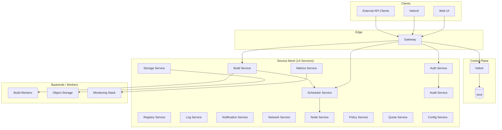

# Architecture Overview

This document describes the high-level architecture of Helix Cluster OS, its service mesh, data flows, and component interactions.

---

## High-Level Diagram



---

## Service Mesh Description

Helix Cluster OS comprises **14 specialized services** that communicate over a unified service mesh:

| # | Service | Responsibility |
|---|---------|--------------|
| 1 | Build Service | Image builds, artifact generation |
| 2 | Scheduler Service | Job placement, resource allocation |
| 3 | Registry Service | Container image metadata and indexing |
| 4 | Log Service | Centralized log aggregation and querying |
| 5 | Metrics Service | Metrics collection, dashboards, alerts |
| 6 | Auth Service | Authentication, token validation, SSO |
| 7 | Notification Service | Alerts, webhooks, email delivery |
| 8 | Storage Service | Object and volume storage abstraction |
| 9 | Network Service | Overlay networking, DNS, load balancing |
| 10 | Node Service | Node lifecycle, health, capacity |
| 11 | Policy Service | Admission control, compliance rules |
| 12 | Quota Service | Resource quotas, rate limiting |
| 13 | Audit Service | Event logging, audit trails |
| 14 | Config Service | Dynamic configuration, feature flags |

All inter-service traffic is encrypted with **mutual TLS (mTLS)**. See [TLS Setup](../security/tls-setup.md) for details.

---

## Data Flow

A typical API request flows through the system as follows:

```
Client → Gateway → Service → Backend
```

### Example: Submitting a Build Job

1. **Client** sends `POST /api/v1/builds` to the **Gateway**.
2. **Gateway** authenticates the request via the **Auth Service**.
3. **Gateway** routes the request to the **Build Service**.
4. **Build Service** validates the payload against the **Policy Service**.
5. **Build Service** asks the **Scheduler Service** to allocate a worker.
6. **Scheduler Service** selects a node via the **Node Service** and enforces **Quota Service** limits.
7. **Build Service** dispatches the job to a **Build Worker**.
8. **Build Service** writes job state to **etcd** via **helixd**.
9. **Log Service** and **Metrics Service** stream worker output to **Backends**.

---

## etcd as Source of Truth

**etcd** is the single source of truth for all cluster state:

- Service registrations and discovery
- Node topology and health
- Job definitions and statuses
- RBAC policies and configuration
- Audit event indices

Every service watches relevant etcd prefixes to react to state changes in real time. `helixd` acts as the administrative gateway to etcd, enforcing schema validation and access control.

---

## Component Interactions

| Interaction | Protocol | Purpose |
|-------------|----------|---------|
| Gateway ↔ Services | gRPC over mTLS | Request routing |
| Services ↔ etcd | etcd client v3 | State storage and watches |
| Services ↔ Backends | gRPC / HTTP / S3 | Data plane operations |
| Web UI ↔ Gateway | HTTPS / WebSocket | User-facing API and real-time updates |
| helixctl ↔ Gateway | HTTPS | CLI operations |

---

## Deployment Topology

In a Kubernetes deployment, each service runs as a **Deployment** with a **Service** resource. The Gateway is exposed via an **Ingress** or **LoadBalancer**. etcd runs as a **StatefulSet** with persistent volumes.

For more details, see the [Operations Guide](./operations.md).
