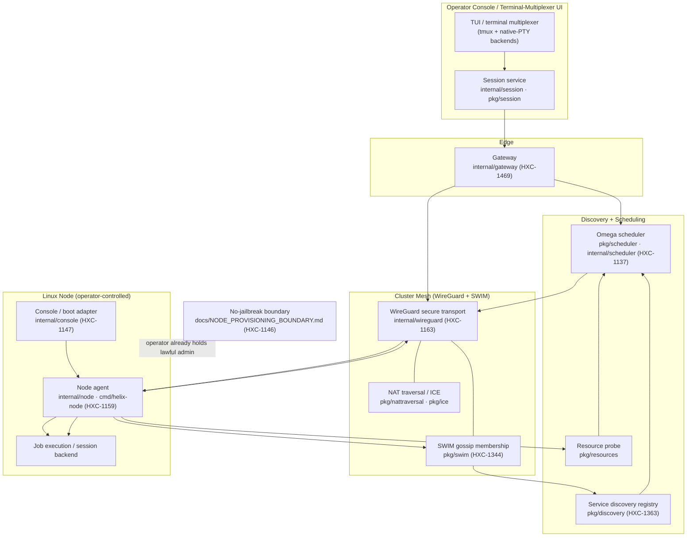

# Helix Cluster OS — Phase 02 Architecture Guide

| Field | Value |
|---|---|
| Revision | 1 |
| Created | 2026-06-03 |
| Status | active |

> **HXC-1164.** This guide describes the Phase 02 runtime architecture: how an
> operator drives the cluster from the **operator console / terminal-multiplexer
> UI**, how nodes are knit together by the **WireGuard + SWIM mesh**, how
> **discovery and the scheduler** place work, and where the **Linux-node
> integration boundary** sits. It is a reader-facing companion to the canonical
> [`docs/ARCHITECTURE.md`](../ARCHITECTURE.md) (L0–L7 component map) and to the
> normative [`docs/NODE_PROVISIONING_BOUNDARY.md`](../NODE_PROVISIONING_BOUNDARY.md)
> no-jailbreak boundary (HXC-1146). Use it to trace a single job from console
> submission all the way to execution on a Linux node.

---

## 1. Scope

Phase 02 turns the single-node prototype into a multi-node distributed system
(see [`docs/research/PHASE_2_ROADMAP.md`](../research/PHASE_2_ROADMAP.md)). The
four moving parts a reader must understand to follow a job are:

1. **Operator console / terminal-multiplexer UI** — the human entry point. Built
   on the session subsystem (`internal/session` / `pkg/session` with
   `pkg/session/backends` tmux + native-PTY backends) and reached through the
   gateway (`internal/gateway`).
2. **The mesh** — secure transport (`internal/wireguard`, HXC-1163) plus
   membership (`pkg/swim`, HXC-1344), with NAT traversal (`pkg/nattraversal`,
   HXC-1383) and ICE connectivity (`pkg/ice`, HXC-1349) where peers are not
   directly routable.
3. **Discovery + scheduler** — the service registry (`pkg/discovery`, HXC-1363)
   feeds the Omega-model scheduler (`pkg/scheduler` / `internal/scheduler`,
   HXC-1137), which filters and scores candidate nodes using node resource data
   (`pkg/resources`).
4. **The Linux node** — the node agent (`internal/node`, HXC-1159 →
   `cmd/helix-node`) and, for console/boot specifics, the operator-console boot
   adapter (`internal/console`, HXC-1147). This is where the
   **no-jailbreak boundary** applies.

Each component above is a real package; the authoritative component→package→origin
mapping lives in [`docs/ARCHITECTURE.md`](../ARCHITECTURE.md)'s Component Map,
which is lint-enforced by [`pkg/archlint`](../../pkg/archlint).

---

## 2. Architecture Diagram

The dashed edge marks the **provisioning boundary**: everything inside the
*Linux Node* box presupposes the operator already holds lawful administrative
control of that node. Helix never crosses that line to *obtain* control — see
§5.

---

## 3. Tracing a Job: Console Submission → Node Execution

Follow one job end-to-end. Each step names the package that does the work.

1. **Submit from the console.** The operator types into the
   terminal-multiplexer UI. The session subsystem (`internal/session`,
   `pkg/session`, with a `pkg/session/backends` tmux or native-PTY backend)
   captures the request and forwards it through the gateway
   (`internal/gateway`).
2. **Gateway admits the request.** `internal/gateway` authenticates and routes
   the submission toward the scheduler. All cluster-internal hops ride the
   secure transport rather than the public network.
3. **Discovery supplies candidates.** The scheduler reads the live service
   registry (`pkg/discovery`), whose membership view is fed by **SWIM gossip**
   (`pkg/swim`): only nodes currently *alive* in the membership list are
   eligible. Per-node capacity comes from the resource probe (`pkg/resources`).
4. **Scheduler places the job.** The Omega-model scheduler
   (`pkg/scheduler` / `internal/scheduler`) runs its **filter → score** pipeline
   under optimistic concurrency and selects a target Linux node.
5. **The mesh carries the dispatch.** The placement decision and the job I/O
   travel over the **WireGuard** tunnel (`internal/wireguard`) to the chosen
   node. Where the node is behind NAT, `pkg/nattraversal` + `pkg/ice` establish
   connectivity first; SWIM keeps the path's liveness honest.
6. **The node agent executes.** On the target, the node agent (`internal/node`
   / `cmd/helix-node`) accepts the dispatch and runs the workload (or attaches
   the session backend). For console/boot-specific nodes, `internal/console`
   (HXC-1147) is the adapter that brought the agent up and exposes its
   resources.
7. **Results stream back.** Output flows back over the same WireGuard path to
   the gateway and into the operator's terminal-multiplexer session — closing
   the loop the operator started in step 1.

A reader can therefore trace the request as:
**console UI → session → gateway → discovery(SWIM) → scheduler → WireGuard mesh
→ node agent → execution → back to the console.**

---

## 4. Component Reference

| Stage | Component | Package | Origin |
|---|---|---|---|
| Console / UI | Session service + multiplexer backends | `internal/session`, `pkg/session`, `pkg/session/backends` | HXC-1136 |
| Edge | Gateway | `internal/gateway` | HXC-1469 |
| Mesh transport | WireGuard mesh | `internal/wireguard` | HXC-1163 |
| Mesh membership | SWIM gossip | `pkg/swim` | HXC-1344 |
| Mesh reachability | NAT traversal / ICE | `pkg/nattraversal`, `pkg/ice` | HXC-1383 / HXC-1349 |
| Discovery | Service registry | `pkg/discovery` | HXC-1363 |
| Scheduling | Omega scheduler | `pkg/scheduler`, `internal/scheduler` | HXC-1137 |
| Node capacity | Resource probe | `pkg/resources` | HXC-1153 |
| Node | Node agent + binary | `internal/node`, `cmd/helix-node` | HXC-1159 |
| Node boot | Console / boot adapter | `internal/console` | HXC-1147 |

The canonical, lint-enforced mapping is [`docs/ARCHITECTURE.md`](../ARCHITECTURE.md);
the rows above are the Phase-02 job-path subset.

---

## 5. The Linux-Node Integration Boundary (No-Jailbreak)

Everything in §3 step 6–7 runs **on a node the operator already controls**. The
mesh-join, membership, discovery, and attestation flows operate *after* the
operator holds lawful root/admin access to the device — they are a means of
**admission by attestation, never of seizing a device**.

Helix Cluster OS therefore **MUST NOT** jailbreak, root, unlock bootloaders,
defeat secure/verified boot, or bypass DRM/TPM/fuse protections to bring a node
in. Obtaining administrative control of a device is the operator's own,
independently-acquired responsibility and is **out of scope**. The in-scope
paths — flashing operator-owned SBCs, side-loading the agent on
operator-controlled devices, and enrolling owned servers/workstations — all
begin at the dashed boundary in the diagram above.

This guide is descriptive; the **normative** statement, its MUST/MUST-NOT
rules, the lawful-control precondition, and the security/trust rationale live in
[`docs/NODE_PROVISIONING_BOUNDARY.md`](../NODE_PROVISIONING_BOUNDARY.md)
(HXC-1146), which is binding on every component named here.

---

## 6. Cross-References

- [`docs/ARCHITECTURE.md`](../ARCHITECTURE.md) — canonical L0–L7 stack and
  lint-enforced Component Map (the source of every package name above).
- [`docs/NODE_PROVISIONING_BOUNDARY.md`](../NODE_PROVISIONING_BOUNDARY.md) —
  normative node-provisioning / no-jailbreak boundary (HXC-1146).
- [`docs/research/PHASE_2_ROADMAP.md`](../research/PHASE_2_ROADMAP.md) — Phase 02
  scope, sub-phases, and package breakdown.
- [`README.md`](../../README.md) — project overview and Documentation index.
- [`CLAUDE.md`](../../CLAUDE.md) — governance (CLAUDE-1 usability, CLAUDE-2
  cross-platform parity, CLAUDE-3 docs-sync).
