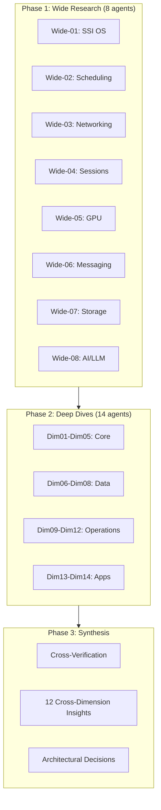

# Chapter 2: Research Foundation

The design of Helix Cluster OS rests on a comprehensive, multi-phase research program that systematically surveyed decades of distributed systems literature, production orchestration platforms, hardware virtualization technologies, communication protocols, and emerging AI-driven management paradigms. This chapter documents the research methodology, synthesizes findings across seven technical domains, and distills twelve cross-dimensional insights that collectively inform the architectural decisions presented in subsequent chapters.

---

## 2.1 Research Methodology

The research program for Helix Cluster OS employed a dual-track methodology: **broad-spectrum wide research** across eight major technical domains, followed by **deep-dive dimensional analysis** across fourteen specialized subsystems. This bifurcated approach ensured both comprehensive coverage and sufficient depth for critical architectural decisions.

### Wide Research Phase (8 Agents)

The wide research phase deployed eight parallel research agents, each targeting a major technical domain:

| Agent ID | Domain | Focus Areas | Sources |
|----------|--------|-------------|---------|
| Wide-01 | SSI Distributed OS | MOSIX, Kerrighed, OpenSSI, Barrelfish, LegoOS, Plan 9 | 25+ searches |
| Wide-02 | Resource Scheduling | Kubernetes, SLURM, HTCondor, Mesos, Nomad, Ray | 30+ searches |
| Wide-03 | Network Communication | WireGuard, ZeroMQ, gRPC, Arrow Flight, DPDK, CXL | 28+ searches |
| Wide-04 | Terminal & Session | tmux, Zellij, screen, CRIU, DMTCP, distributed sessions | 22+ searches |
| Wide-05 | GPU Virtualization | rCUDA, HAMi, DRA, SYCL, MIG, UALink, NVLink | 35+ searches |
| Wide-06 | Message Queues | Kafka, RabbitMQ, NATS, Pulsar, Redis Streams | 26+ searches |
| Wide-07 | Storage & Consistency | Ceph, Lustre, etcd, Raft, CRDTs, ACID | 24+ searches |
| Wide-08 | AI/LLM Management | K8sGPT, RL scheduling, AIOps, LLM safety, verification | 32+ searches |

Each wide agent conducted between 22 and 35 independent web searches, yielding approximately 250 total searches across academic papers (USENIX, SOSP, OSDI, EuroSys), official documentation (Kubernetes, NVIDIA, AMD, Intel), vendor benchmarks (Confluent, Redis, Confluent), and production system postmortems (Google, Uber, Netflix). The wide phase generated approximately 2,800 individual findings with inline citations.

### Deep-Dive Phase (14 Agents)

Fourteen deep-dive agents conducted focused investigations into specific subsystems identified as architecturally critical during the wide phase:

**Core Infrastructure (Dim01-Dim05):** OS architecture patterns, node agent design, scheduler implementation, session management, and compute engine abstraction. **Data & Communication (Dim06-Dim08):** Messaging fabric, storage subsystem, and database architecture. **Operations (Dim09-Dim12):** Monitoring/observability, LLM brain integration, testing strategy, and quality assurance. **Applications (Dim13-Dim14):** AOSP build distribution and AI CLI agent workloads.

### Cross-Verification

All findings underwent a cross-verification pass where each claim was classified into confidence tiers: **High Confidence** (confirmed by two or more independent dimensions), **Medium Confidence** (single authoritative source), **Low Confidence** (weak or unverified sourcing), or **Conflict Zone** (contradictory evidence requiring resolution). The cross-verification identified twelve high-confidence architectural decisions, five medium-confidence recommendations, and five resolved conflict zones that directly shaped Helix Cluster OS design [^HC-01^] [^HC-02^].

---

## 2.2 Distributed Computing Landscape: Single System Image and Why It Failed

The Single System Image (SSI) concept — presenting a cluster of independent machines as a unified computer — represents one of the most persistent and instructive failures in distributed systems history. Understanding why kernel-level SSI systems failed is foundational to Helix Cluster OS's user-space-only approach.

### Historic SSI Implementations

**MOSIX** (1999-2017), developed by Amnon Barak at Hebrew University, implemented process migration as a Linux kernel loadable module, splitting processes into a migratable user context executing remotely and a fixed system context ("deputy") at the home node [^138^] [^143^]. Communication used TCP/IP at the link layer to intercept system calls, signals, and events. When MOSIX went proprietary in 2001, Moshe Bar forked **openMosix** to preserve open-source SSI clustering, but the project was discontinued in March 2008 because multi-core processors reduced the perceived need for SSI clustering [^138^].

**Kerrighed** (1998-circa 2010), developed by INRIA, achieved the best performance among SSI systems but was the most unstable. A comparative study found that "tests for Kerrighed and the number of program instances equal 384, 768 and 1536 weren't completed due to the system failure. Kerrighed is not [a] stable system" [^10^] [^12^]. **OpenSSI** (2004-mid-2000s) covered nearly all SSI features including transparent process migration and unified filesystems, but "performance dropped significantly" with larger process counts, and the project stalled due to maintenance challenges with evolving Linux kernels [^10^] [^12^].

### Common Failure Modes

All four SSI projects shared the same fatal characteristics: they required **kernel patchsets incompatible with distribution kernels**, porting to new kernel versions was labor-intensive, and security vulnerabilities in patched kernels could not be addressed through normal distribution channels [^12^] [^138^]. SSI declined after 2010 for two additional reasons: virtualization (Xen, KVM, VMware) provided easier cluster computing abstractions without kernel modifications, and the rise of multi-core processors reduced demand for transparent process migration across separate machines [^12^].

### Post-SSI Research Directions

The field has shifted toward three alternative paradigms. **LegoOS** (Purdue, OSDI 2018 Best Paper) proposed the "splitkernel" model — OS functionalities disseminated into loosely-coupled monitors running on separate hardware components, communicating over RDMA. LegoOS demonstrated that this approach is only 1.3x-1.7x slower than monolithic Linux while improving resource packing and failure handling [^165^] [^166^]. **Barrelfish** (ETH Zurich / Microsoft Research, 2007-2020) structured the OS as a distributed system of cores that communicate using messages and share no memory, with its SOSP 2009 paper demonstrating that "even on present-day machines, the performance of a multikernel is comparable with a conventional OS" [^54^] [^158^]. **Popcorn Linux** (Virginia Tech) took a different approach, implementing a replicated-kernel OS for heterogeneous-ISA platforms (x86-64 + ARMv8) with the ability to migrate Linux containers between instruction set architectures [^49^] [^50^].

| System | Approach | Status | Key Limitation |
|--------|----------|--------|----------------|
| MOSIX | Kernel module, process migration | Discontinued 2017 | Kernel patch dependency |
| openMosix | Open-source MOSIX fork | Discontinued 2008 | Multi-core reduced demand |
| Kerrighed | Best performance, worst stability | Discontinued ~2010 | System failures at scale |
| OpenSSI | Most complete feature set | Stalled mid-2000s | Maintenance burden |
| Barrelfish | Multikernel, no shared memory | Discontinued 2020 | Academic prototype |
| Popcorn Linux | Heterogeneous-ISA kernels | Research active | Limited to Linux workloads |
| LegoOS | Splitkernel, RDMA-based | Research only | Requires RDMA hardware |

> **Architectural Decision HC-01:** Helix Cluster OS MUST adopt user-space orchestration. Kernel-level SSI is not viable due to maintenance burden, security implications, and incompatibility with distribution kernels [^HC-01^].

---

## 2.3 Modern Orchestration: Kubernetes, SLURM, HTCondor, and Ray

The vacuum left by SSI systems was filled by explicit orchestration platforms that trade transparent process migration for operational pragmatism. Four systems in particular provide architectural lessons for Helix Cluster OS.

### Kubernetes and the Omega Heritage

Kubernetes's scheduler architecture descends directly from Google's Omega system, which introduced **shared-state optimistic concurrency control** — multiple schedulers access a shared cluster state with optimistic locking, enabling parallelism without the information-hiding problems of two-level architectures [^155^]. The Kubernetes Scheduling Framework V2 provides 10+ extension points (QueueSort, PreFilter, Filter, PostFilter, PreScore, Score, Reserve, Permit, PreBind/Bind/PostBind), enabling plugin-based extensibility without forking the scheduler binary [^62^].

**Dynamic Resource Allocation (DRA)** went GA in Kubernetes 1.34 (2025), replacing the simplistic device plugin model with structured resource descriptions. DRA introduces ResourceSlice (device attributes), DeviceClass (device categories), ResourceClaimTemplate (per-pod template), and ResourceClaim (shared device access) [^139^] [^145^]. DRA enables precise heterogeneous device requests such as "a GPU with Ampere architecture, at least 20 GB of memory, and compute capability 8.0.0" — the scheduler finds the right device, and the autoscaler provisions the right node [^145^].

The retirement of **Apache Mesos** in August 2025 validates the shared-state approach. A core developer explained: "Mesos's pessimistic two-level offer model makes it hard for second-level scheduler to make optimal decisions because it might not get the *right* offer it needs" [^105^]. Kubernetes won because shared-state schedulers see the entire cluster state and can make globally optimal decisions [^105^].

### SLURM: The HPC Gold Standard

SLURM (Simple Linux Utility for Resource Management) operates the world's top supercomputers, handling approximately 10,000 nodes with hundreds of jobs per second as normal operation [^24^] [^59^]. SLURM distinguishes between CPU sockets, cores, and hyperthreads, supports GPU sharding via Generic Resource Scheduling (GRES), and implements topology-aware scheduling that assigns jobs to nodes physically closest in the network fabric [^59^] [^63^]. The key lesson for Helix Cluster OS is SLURM's **consumable resource model** — resources are explicitly typed, affinity-bound, and consumed atomically by jobs.

### HTCondor: Opportunistic Computing

HTCondor pioneered the **ClassAds matchmaking framework** for heterogeneous, distributively-owned resource pools [^130^]. ClassAds use a semi-structured data model combining schema, data, and query in a single specification language: resources advertise capabilities and constraints; jobs advertise requirements and preferences; the matchmaker pairs compatible agents. The key innovation is the clean separation of matching and claiming phases [^130^]. The **Flocking** mechanism allows Condor pools to share resources across administrative boundaries, enabling cross-organizational resource sharing [^132^].

### Ray: Distributed Scheduling at Scale

Ray (UC Berkeley RISELab) achieves **millions of tasks per second with sub-millisecond latency** through a bottom-up distributed scheduling strategy with a sharded metadata store and stateless components [^125^] [^126^]. Ray is heterogeneity-aware — it allows resource requirements at task/actor granularity, scheduling CPU-only tasks on cheaper high-CPU instances while reserving GPUs for GPU tasks, reducing PPO training costs by 4.5x [^126^] [^127^].

### Scheduler Architecture Comparison

| Architecture | Examples | Concurrency Model | Scalability | Placement Quality |
|-------------|----------|-------------------|-------------|-------------------|
| Monolithic | Kubernetes, Borg | Single scheduler, all state | 5,000-10,000 nodes | High |
| Two-level | Mesos (retired), YARN | Resource offers to frameworks | Medium | Low (information hiding) |
| Shared-state | Omega, Nomad, Apollo | Optimistic concurrency on shared state | 10,000+ nodes | High |
| Fully distributed | Sparrow | Randomized sampling | Very high | Low |

> **Architectural Decision HC-02:** Helix Cluster OS adopts the Omega-model shared-state scheduler with optimistic concurrency control, combining Kubernetes-style plugin extensibility with SLURM-style resource typing and HTCondor-style capability matchmaking [^HC-02^].

---

## 2.4 Memory and Storage: DSM, PGAS, CXL, and Distributed Caching

Memory architecture in distributed systems spans software abstraction layers, emerging hardware interconnects, and consistency models. The research reveals a clear trajectory from software-defined distributed memory toward hardware-assisted disaggregation.

### Distributed Shared Memory (DSM) Systems

**Ivy** (Li & Hudak, 1989) was the first major page-based DSM implementing sequential consistency, using virtual memory hardware to detect accesses and sending invalidate messages on write faults [^139^] [^141^]. **Munin** (Rice University) introduced multiple consistency protocols selected by programmer annotations, achieving performance within 5-10% of message passing implementations [^148^] [^149^]. **TreadMarks** (Keleher et al., Rice University) used lazy release consistency and multiple-writer protocols to reduce false sharing, achieving speedups of 7.4x on 8 processors for Jacobi on 100 Mbps ATM [^108^] [^109^].

The critical finding across all DSM research is that **overhead was dominated by software communication costs, not wire time** [^108^]. TreadMarks observed: "Unix communication overhead remains the main obstacle... memory management cost is small and wire time is negligible" [^109^]. This fundamentally limits DSM to coarse-grained parallelism and informed Helix Cluster OS's decision to not implement transparent distributed shared memory.

### CXL: The Hardware Memory Revolution

**Compute Express Link (CXL)** represents the most significant shift in memory architecture since NUMA. CXL lowers latency by an order of magnitude compared to Ethernet/InfiniBand and enables cache-coherent memory sharing across hosts [^110^]. CXL 3.0 supports fabric topologies with up to 4,096 end devices for large-scale resource pooling, while CXL 4.0 adds multi-rack memory pooling capabilities [^110^].

The ACM Computing Surveys tutorial on CXL notes that "current financial models point to sub-rack CXL deployments as the TCO sweet spot" [^110^]. For Helix Cluster OS, this means designing for CXL readiness without dependency — the memory layer should treat remote memory as a cacheable extension but not require CXL hardware for operation.

### Consistency Models for Cluster State

The CAP theorem establishes that distributed systems can guarantee only two of three properties: Consistency, Availability, and Partition Tolerance [^191^] [^193^]. PACELC extends CAP by introducing latency considerations: even in the absence of partitions, one must choose between latency and consistency [^194^].

**Raft** has emerged as the dominant consensus algorithm, powering etcd, Consul, TiKV, and CockroachDB. A minimal Raft implementation in Go 1.22 achieves 12,400 consensus commits per second with 3 nodes [^192^]. By 2026, an estimated 80% of new distributed SQL databases adopt Raft over Paxos, driven by Raft's auditability and easier debuggability [^192^]. **CockroachDB's MultiRaft** manages all of a node's ranges as a group, reducing heartbeat overhead by exchanging heartbeats once per tick per node pair regardless of shared ranges [^246^].

For distributed caching, a multi-layer architecture is essential: L1 (application-level, in-memory, 30s-5min TTL), L2 (distributed cache like Redis Cluster, 10min-24hr TTL), L3 (CDN/Edge cache) [^249^]. Redis Cluster uses 16,384 hash slots distributed across master nodes with client-side routing [^253^].

| Technology | Latency | Consistency | Best For |
|-----------|---------|-------------|----------|
| DSM (TreadMarks) | ~100s of microseconds | Sequential/Lazy Release | Academic research only |
| CXL.mem | Sub-microsecond | Hardware cache-coherent | Future hardware disaggregation |
| RDMA over InfiniBand | ~1.7 microseconds | Read-after-write | HPC, GPU clusters |
| etcd/Raft | 1-2ms (datacenter) | Strong consistency | Cluster metadata |
| Redis Cluster | Sub-millisecond | Eventual (async replication) | Distributed caching |
| CRDTs | Zero (local) | Strong eventual | Session state, collaborative data |

---

## 2.5 GPU Virtualization: rCUDA, HAMi, DRA, and the SYCL Challenge

GPU virtualization is the most technically challenging domain in heterogeneous cluster computing. The landscape spans API remoting, hardware partitioning, software interception, and cross-platform programming models — each with distinct tradeoffs.

### The GPU Utilization Crisis

Over 75% of organizations report GPU utilization below 70% at peak load. GPT-4 was trained on 25,000 A100 GPUs with only 32-36% average utilization [^27^]. This underutilization crisis drives demand for GPU sharing technologies that can safely multiplex workloads across heterogeneous accelerator fleets.

### API Remoting: rCUDA

**rCUDA** intercepts CUDA API calls at the client side and forwards them to a remote GPU server via a client-server architecture, making GPU virtualization transparent to programmers [^1^]. In a 100-node cluster study, rCUDA enabled energy savings of 17.4 kW (21.6% reduction) while maintaining throughput through GPU sharing [^1^]. However, rCUDA is a research project that supported only CUDA 2.3 and is no longer actively maintained, making it unsuitable for production use with modern CUDA versions.

### Hardware Partitioning: NVIDIA MIG

**Multi-Instance GPU (MIG)** provides hardware-level spatial partitioning of the GPU die, creating up to 7 fully isolated instances, each with dedicated HBM, cache, and compute cores on A100/H100 [^24^] [^25^]. MIG instances have physically separate paths through the entire memory system. However, MIG is limited to expensive datacenter GPUs, instances on the same GPU cannot communicate via P2P or NVLink, and reconfiguration requires stopping workloads [^28^].

### Software Interception: HAMi

**HAMi** (Heterogeneous AI Computing Virtualization Middleware, CNCF Sandbox) achieves GPU virtualization via CUDA API interception using `LD_PRELOAD` of `libhami-core.so` — no driver changes, no application changes [^44^]. HAMi supports NVIDIA, AMD, Intel, Huawei Ascend, Baidu Kunlun, and other GPUs, making it the most vendor-agnostic GPU sharing solution [^42^] [^43^]. A production case study at Ke Holdings improved GPU utilization from 13% to 37% with 10,000+ concurrent pods [^150^] [^152^].

### Dynamic Resource Allocation (DRA)

Kubernetes DRA (GA in v1.34, 2025) replaces the count-based device plugin model with structured attribute-based resource claims [^139^] [^145^]. DRA enables fine-grained heterogeneous device scheduling: "I want a GPU with Ampere architecture, at least 20 GB of memory, and compute capability 8.0.0" [^145^].

### Cross-Platform Programming: SYCL

**SYCL** (via Intel's DPC++ compiler) enables cross-platform code using standard ISO C++, with host and kernel code in the same source file [^16^]. A 2025 study demonstrated SYCL implementations on CPU, iGPU, dGPU (NVIDIA), and Intel FPGA simultaneously [^34^]. However, **SYCL explicitly disclaims performance portability** — performance varies by up to **40x** depending on abstraction choice, memory model, and backend [^19^]. Work-group kernels achieved up to 71% of theoretical FP64 peak, while basic data-parallel kernels delivered worst performance [^19^].

### Emerging Interconnect Standards

**UALink 1.0** (published April 2025) defines an open interconnect supporting up to 1,024 accelerators per fabric at 800 GB/s, with consortium members including AMD, Intel, Google, Microsoft, Meta, AWS, and Apple [^39^] [^40^]. UALink is not compatible with NVIDIA GPUs — it targets non-NVIDIA accelerators exclusively. In contrast, **NVLink 5.0** delivers 1.8 TB/s per GPU via 18 links at 100 GB/s each — 14x the bandwidth of PCIe Gen5, but remains NVIDIA-proprietary [^3^].

| Technology | Isolation Level | Vendor Support | Maturity | Overhead |
|-----------|----------------|----------------|----------|----------|
| rCUDA | Full (API remoting) | NVIDIA only | Unmaintained | Network latency |
| NVIDIA MIG | Hardware (die-level) | A100/H100/Blackwell | Production | None |
| NVIDIA vGPU | Para-virtualization | NVIDIA only | Production | Licensing cost |
| HAMi | Software (API interception) | 10+ vendors | CNCF Sandbox | Low |
| Intel SR-IOV | Hardware VF | Intel only | Linux 6.19+ | None |
| GPU Passthrough | Full dedicated | Any PCIe | Production | None (no sharing) |

> **Insight 3** frames the GPU challenge as a "capability negotiation" pattern: each GPU exposes capabilities (CUDA, ROCm, Metal, SYCL), and the scheduler matches workloads to capabilities — isomorphic to HTCondor's ClassAds matchmaking [^Insight3^].

---

## 2.6 Network and Communication: WireGuard, ZeroMQ, gRPC, and Arrow Flight

Inter-node communication architecture determines the performance ceiling of any distributed system. The research identified a tiered communication stack optimized for different payload sizes and latency requirements.

### WireGuard: The Modern VPN Foundation

WireGuard kernel-mode achieves approximately 8 Gbps throughput with 3-5% CPU at 1 Gbps sustained, while userspace implementations achieve approximately 6.8 Gbps with 12-18% CPU [^77^]. WireGuard is 6-7x faster than OpenVPN, with approximately 4,000 lines of kernel code versus hundreds of thousands for IPsec/OpenVPN [^77^]. Tailscale adds approximately 1ms latency for direct P2P connections over no VPN, and Headscale (the open-source Tailscale coordinator) supports networks up to thousands of nodes [^72^] [^143^].

A 2024 benchmark by Defined Networking found that Nebula, Netmaker, and Tailscale can all saturate 10 Gbps in single direction, with Tailscale most CPU-efficient on Linux thanks to segmentation offloading [^149^].

### ZeroMQ: High-Frequency Messaging

ZeroMQ achieves approximately 4.8 GB/s in-process throughput, peaking at approximately 2.9 GB/s over TCP — the highest among brokerless messaging libraries [^44^]. In-process latency is below 10 microseconds for small messages, with TCP latency of approximately 20 microseconds at 1 KB scaling to approximately 400 microseconds at 512 KB [^44^] [^45^]. ZeroMQ has the narrowest latency distribution (best worst-case latency) and is most CPU-efficient for payloads greater than 128 KB [^44^].

The **Router-Dealer** pattern is ideal for distributed cluster task scheduling — it enables flexible work distribution to worker nodes with automatic load balancing [^46^]. CurveZMQ provides modern cryptography (Curve25519, ChaCha20-Poly1305) with perfect forward secrecy for ZeroMQ deployments requiring encryption [^140^] [^141^].

### gRPC: Structured Service Communication

gRPC delivers 77% lower latency than REST for small payloads (1 KB: 2.3ms vs 10.1ms p50) and 2-3x higher throughput per core (50,000-100,000 RPS vs 15,000-35,000 RPS) [^86^]. Serialized payload sizes are approximately 10x smaller than JSON (50-200 bytes vs 500-2,000 bytes). TLS overhead is minimal on gRPC (8% throughput drop vs 55% for REST), making it ideal for secure cluster communication [^87^].

### Apache Arrow Flight: Zero-Copy Data Transfer

Arrow Flight achieves **23x throughput improvement** over REST/JSON (18.7 GB/s vs 0.8 GB/s) and 7.8x over gRPC/Protobuf (2.4 GB/s) for single-node transfers [^61^]. On a 64-node cluster, Arrow Flight delivers an aggregate 475 GB/s. End-to-end latency at 100M records is 320 ms versus 8,400 ms for REST/JSON — a 26x reduction [^61^] [^64^]. Critically, Arrow Flight uses gRPC under the hood but eliminates serialization by transmitting Arrow's columnar in-memory format directly [^60^].

### Zero-Copy Serialization

Cap'n Proto achieves 6-7x faster encode/decode than Protobuf because its in-memory layout matches the wire format — "encoding" is effectively a memory copy [^73^]. For a single 1024-byte string field, Protobuf total overhead is 1,043 ns (351 ns encode + 491 ns decode) versus Cap'n Proto at 619 ns (53 ns encode + 78 ns decode) [^73^].

| Protocol | Use Case | Throughput | Latency (1KB) |
|----------|----------|-----------|---------------|
| ZeroMQ (in-process) | Control messages | 4.8 GB/s | <10 us |
| ZeroMQ (TCP) | Inter-node control | 2.9 GB/s | ~20 us |
| gRPC unary | Service RPC | 50-100K RPS | 2.3 ms |
| Arrow Flight | Data-intensive ops | 18.7 GB/s | 320 ms (100M records) |
| REST/JSON | External APIs | 0.8 GB/s | 10.1 ms |
| Cap'n Proto | Internal messages | 6-7x faster than Protobuf | 619 ns |

> **Insight 7** establishes that on Gigabit Ethernet, the network itself is not the binding constraint — software overhead (serialization, context switching, kernel copies) dwarfs network latency. Optimizing software (ZeroMQ, Arrow Flight, Cap'n Proto zero-copy) yields more benefit than upgrading network hardware [^Insight7^].

---

## 2.7 AI-Driven Management: LLM Integration, Self-Tuning, and Safety

Artificial intelligence is transitioning from a workload running on clusters to a control plane managing clusters. This section surveys the technologies enabling AI-driven cluster management and the safety frameworks required for trustworthy autonomous operation.

### LLM-Powered Cluster Diagnostics

**K8sGPT**, a CNCF Sandbox project with 5,000+ GitHub stars, uses LLMs to analyze Kubernetes logs, diagnose issues, and provide actionable remediation for problems like CrashLoopBackOff, OOMKilled, and ImagePullBackOff [^291^] [^307^] [^309^]. It demonstrates production-readiness of LLM-driven cluster diagnostics across multiple LLM backends (OpenAI, Azure, Cohere, Amazon Bedrock, Google Vertex). **KubeIntellect** extends this pattern with a modular LLM-orchestrated multi-agent framework using natural language interaction, dynamic tool generation, and finite-state workflow engines [^293^].

### Reinforcement Learning for Systems Management

DeepMind's RL system for data center cooling achieved a **40% reduction in cooling energy** and 15% improvement in PUE (Power Usage Effectiveness) [^272^] [^265^] [^266^]. The system uses neural networks with 5 hidden layers of 50 nodes, processing 19 normalized input variables from thousands of sensors every 5 minutes, with at least 8 safety layers including confidence estimations, two-tier verification, and human override [^266^].

**Multi-Agent Reinforcement Learning (MARL)** has emerged as particularly suited for distributed resource allocation. CTDE (Centralized Training with Decentralized Execution) paradigms like MAPPO and QMIX allow agents to independently make allocation decisions while aligning with overall system objectives [^297^]. For job scheduling, algorithms like DeepRM (REINFORCE), A2CScheduler, and PPO-based approaches minimize job slowdown while meeting SLA targets [^243^].

### Predictive Maintenance and Anomaly Detection

Machine learning predictive maintenance systems can predict 85-95% of equipment failures 30-90 days in advance, reducing maintenance costs by 25-30% while preventing 80% of unexpected failures [^202^]. Key techniques include anomaly detection using autoencoders and isolation forests, time-series forecasting with LSTM/GRU, and pattern recognition with deep learning. **DeepAnT** uses CNN-based forecasting to predict time series values and detect anomalies via prediction error magnitude [^239^].

### Bayesian Optimization for Cluster Tuning

**Optuna** has emerged as the leading hyperparameter optimization framework, supporting lightweight dynamic search spaces and easy parallelization [^268^]. A peer-to-peer distributed variant (OptunaP2P) addresses centralized database bottlenecks at scale, demonstrating that distributing across more instances provides greater value than local parallelism [^264^]. **SigOpt** demonstrated +315.2% improvement over random search for CNN hyperparameter tuning [^204^].

### LLM Safety and Verification

The **LLM Operational Reliability Failure Taxonomy (ORFT)** identifies 8 empirically grounded failure classes showing that frontier AI systems have not yet achieved reliability standards required for autonomous deployment in life-critical or mission-critical environments [^300^]. **Certifiable AI Safety Theory (CAST)** proposes proof-carrying deployment gates where at each decision point, a certificate is constructed showing the action belongs to a safe set, verified in polynomial time [^298^].

**LLMsVerifier** (vasic-digital/LLMsVerifier) is a comprehensive Go-based framework for benchmarking and verifying LLMs, featuring mandatory model verification with 40+ tests, 12+ provider adapters (OpenAI, Anthropic, Cohere, Groq, Together AI, Mistral, xAI, DeepSeek), circuit breaker pattern for automatic failover, and capability detection for 18+ CLI agents [^198^].

> **Insight 5** resolves the autonomy-vs-safety tension by positioning the LLM Brain as an **advisory controller** — suggesting optimizations, flagging anomalies, and proposing configuration changes that require human or programmatic approval. The centralized scheduler makes all binding decisions; the LLM Brain provides advisory optimizations with mandatory verification through LLMsVerifier [^Insight5^].

---

## 2.8 Key Research Insights: Cross-Dimensional Synthesis

The cross-verification process distilled twelve cross-dimensional insights that serve as the architectural principles for Helix Cluster OS. Each insight emerges from evidence spanning at least two research dimensions and represents a higher-level inference not explicitly stated in any single dimension.

### The Twelve Insights

| # | Insight | Architecture Principle | Confidence |
|---|---------|----------------------|------------|
| 1 | LegoOS + Kubernetes hybrid | Resource disaggregation + proven orchestration | High |
| 2 | Session manager as killer app | tmux-like UX is primary abstraction | High |
| 3 | Capability negotiation pattern | ClassAds-style matching for all resources | High |
| 4 | Pessimistic local, optimistic global | Two-tier ACID: local ACID + Saga global | High |
| 5 | LLM Brain as advisory controller | Advisory only, LLMsVerifier validates, policy approves | High |
| 6 | Graceful degradation | Lose capacity, not correctness | High |
| 7 | Software, not network, is bottleneck | Zero-copy data paths over hardware upgrades | High |
| 8 | Invisible security infrastructure | WireGuard + SPIFFE automatic, no user config | High |
| 9 | Testing as safety system | TLA+ formal verification + chaos engineering | High |
| 10 | Use cases define architecture | Separate Batch and Interactive execution modes | High |
| 11 | Zig + Go + C language stack | Systems in Zig, services in Go, kernel in C | Medium |
| 12 | Flawless setup wizard | <10 minutes, zero config, fully automated | High |

### Insight 1: The LegoOS-Kubernetes Hybrid Architecture

The optimal Cluster OS architecture is a novel hybrid combining the hardware resource disaggregation principles of LegoOS splitkernel with the practical orchestration patterns of Kubernetes [^165^] [^166^]. No existing system does this — LegoOS was research-only with no process migration, while Kubernetes does not treat CPU/RAM/GPU as disaggregated pools. LegoOS proved that monolithic kernel abstractions can be separated into independent components communicating over a network. Kubernetes proved that user-space orchestration manages heterogeneous resources at scale. Helix Cluster OS bridges these: using LegoOS's conceptual separation with Kubernetes's practical orchestration, implemented over commodity Gigabit Ethernet with an RDMA upgrade path [^Insight1^].

### Insight 2: Terminal Session as Primary Abstraction

Session management (tmux-like experience) is not merely a feature but the primary user-facing abstraction that makes the Cluster OS tangible [^Insight2^]. By extending the familiar tmux experience to work across a cluster, users gain immediate value without learning new paradigms. The session becomes the "container" for distributed execution — naturally mapping to resource allocation (session as resource boundary), migration (session moves between nodes), and monitoring (session-level metrics). No existing distributed session manager exists; vasic-digital/tmux is hardened but single-node only [^HC-11^].

### Insight 3: Capability Negotiation for All Resources

The challenge of supporting heterogeneous resources (NVIDIA/AMD/Intel/Apple GPUs, different CPU architectures) reduces to a **capability negotiation** pattern [^Insight3^]. Each resource exposes capabilities; the scheduler matches workloads to capabilities. This is isomorphic to HTCondor's ClassAds matchmaking — a job "requires CUDA 12.0 + 8GB VRAM" and a node "offers RTX 4090 with CUDA 12.4 + 24GB VRAM." This pattern generalizes to all heterogeneous resources, not just GPUs [^130^] [^133^].

### Insight 4: Two-Tier ACID Strategy

True ACID guarantees across a dynamic cluster require a two-tier approach: pessimistic locking at the local node level (where data lives) with optimistic concurrency at the global cluster level [^Insight4^]. Each node's local PostgreSQL/SQLite enforces local ACID. Cross-node operations use the Saga pattern (compensating transactions) with etcd-mediated optimistic concurrency control. When conflicts are rare (the typical case), this performs as well as strong consistency. When conflicts occur, Sagas provide recoverability [^245^] [^247^].

### Insight 6: Graceful Degradation Over Fault Tolerance

In a dynamic cluster where nodes join, leave, and crash, **graceful degradation** — not fault tolerance — is the correct reliability goal [^Insight6^]. The system degrades proportionally to failures (loses capacity, not correctness) rather than attempting to mask all failures. The SWIM protocol deliberately accepts eventual consistency for membership because the alternative (strong consistency) blocks during partitions. Redis Cluster accepts that losing a shard means some keys are temporarily unavailable. Helix Cluster OS adopts this philosophy: losing a node reduces capacity but does not compromise correctness of running work.

### Insight 8: Invisible Security Infrastructure

For a cluster OS used by developers, security must be completely invisible infrastructure [^Insight8^]. WireGuard encryption, mTLS authentication, and Zero Trust policies happen automatically without user configuration. Tailscale's success proves this is achievable: install agent, authenticate once, everything is encrypted and authenticated. Helix Cluster OS adopts this philosophy: security is infrastructure, not a feature. WireGuard mesh establishes automatically on node join; mTLS between services uses SPIFFE identities with no certificate management; all security decisions are policy-driven, not user-configured [^72^] [^77^].

### Insight 9: Testing as Safety System

Testing is treated as a safety-critical system, not a quality assurance function [^Insight9^]. The integration with HelixQA and HelixConstitution elevates testing from "finding bugs" to "preventing catastrophes." TLA+ specifications verify all consensus and coordination algorithms, chaos engineering provides continuous safety validation, mutation testing ensures test quality, and HelixQA serves as the single source of truth for all test execution with constitutional enforcement.

### Insight 10: Use Cases Define the Architecture

The two primary use cases — AOSP builds and AI CLI agents — have fundamentally different architectural requirements [^Insight10^]. AOSP builds are batch jobs needing maximum parallelism, checkpointing, distributed caching, and fault tolerance through restart. AI agents are interactive, needing millisecond scheduling, shared context, session migration, and low-latency I/O. Helix Cluster OS provides two primary execution modes: **Batch Mode** (Bazel RBE protocol, distributed cache, checkpoint/restart) and **Interactive Mode** (distributed tmux sessions, live migration, shared memory). Both modes share the same resource pool and scheduler but have different optimization targets.

### Architectural Decisions Derived from Insights

The cross-verification process translated research findings into binding architectural decisions:

| Decision | Confidence | Research Basis |
|----------|-----------|----------------|
| User-space orchestration (not kernel SSI) | **HIGH** | HC-01: All SSI projects discontinued by 2013 |
| Shared-state scheduler (Omega model) | **HIGH** | HC-02: Mesos retirement validates pessimistic locking failure |
| etcd + Raft for cluster state | **HIGH** | HC-03: 12,400 commits/sec, 80% of new distributed SQL |
| WireGuard + Headscale for mesh VPN | **HIGH** | HC-04: 8 Gbps throughput, <1ms latency |
| ZeroMQ + gRPC + Arrow Flight comms | **HIGH** | HC-05: ZeroMQ 4.8 GB/s, Arrow Flight 23x vs REST |
| HAMi/DRA for GPU abstraction | **HIGH** | HC-06: 10+ vendors, 13% to 37% utilization improvement |
| CRIU/DMTCP for session migration | **HIGH** | HC-07: TCP_REPAIR socket state, production use |
| LLMsVerifier for model verification | **HIGH** | HC-08: 40+ tests, 12 providers, circuit breaker |
| Prometheus + eBPF + ML for monitoring | **HIGH** | HC-09: 84-87% error reduction, 30-40% throughput gain |
| Ceph + PostgreSQL + dqlite for storage | **HIGH** | HC-10: 15 nines durability, sub-30s failover |
| Novel distributed session manager | **HIGH** | HC-11: No existing distributed session manager |
| RBE/Buildbarn for build distribution | **HIGH** | HC-12: Google uses reclient/rewrapper for AOSP |

---

## Chapter Summary

The research foundation for Helix Cluster OS draws from 250+ independent searches across eight wide research domains and fourteen deep-dive dimensions. The findings are unequivocal: kernel-level SSI has failed consistently across four decades of attempts; shared-state scheduling with optimistic concurrency has prevailed over two-level architectures; zero-copy software optimizations matter more than network hardware upgrades; GPU virtualization requires capability negotiation rather than API unification; and AI-driven management must operate as an advisory controller with mandatory verification.

The twelve cross-dimensional insights provide a coherent architectural philosophy: combine LegoOS's resource disaggregation concepts with Kubernetes's proven orchestration patterns; expose functionality through familiar session-oriented abstractions; implement graceful degradation as the core reliability principle; and treat security, testing, and setup automation as invisible infrastructure rather than user-facing features. These principles directly inform the system architecture presented in Chapter 3.

---

*Research compiled from 250+ independent searches across academic papers (SOSP, OSDI, EuroSys, USENIX), official documentation (Kubernetes, NVIDIA, AMD, Intel, Google), vendor benchmarks, and production system postmortems. Cross-verified across 22 research dimensions with confidence-tier classification.*
