# Chapter 3: System Architecture

*"Architecture is the decisions that you wish you could get right early in a project — not just the structural decomposition of a system, but the set of principles that constrain and guide its evolution."* — Martin Fowler

The architecture of Helix Cluster OS represents a synthesis of decades of distributed systems research, production-hardened patterns from hyperscale infrastructure, and pragmatic engineering choices tailored for heterogeneous compute environments. This chapter presents the architectural principles that constrain every design decision, the high-level structure of the seven-layer stack, a deep analysis of each core subsystem, and the supporting infrastructure for networking, data persistence, security, and language selection. Every subsystem described here has been validated against real-world production requirements: sub-millisecond inter-service latency at 99.9th percentile, graceful degradation under node failure, and zero-configuration setup from bare metal to functioning cluster in under ten minutes.

---

## 3.1 Architectural Principles

The Helix Cluster OS architecture is governed by twelve foundational principles derived from cross-domain research in operating systems, distributed computing, machine learning systems, and human-computer interaction. Each principle addresses a specific tension point encountered in the design space — the trade-off between consistency and availability, between automation and control, between performance and safety. These principles are not aspirational guidelines; they are binding constraints that every component must satisfy.

### 3.1.1 Resource Disaggregation + Proven Orchestration

**Principle**: Decompose hardware resources into independently allocatable units while leveraging production-proven orchestration patterns rather than inventing novel consensus or scheduling mechanisms.

**Rationale**: The LegoOS splitkernel research demonstrated that disaggregating compute, memory, and storage resources into independently composable units yields 30-40% utilization improvements over monolithic allocation [^1^]. However, Helix Cluster OS avoids the LegoOS approach of implementing custom kernel modules and instead applies the same disaggregation philosophy through user-space abstractions. The scheduling architecture adopts the Omega shared-state model from Google, which has been proven at scale across billions of containers in production Borg and Kubernetes clusters [^2^]. By combining resource disaggregation with proven orchestration, the system achieves both utilization efficiency and operational reliability without the risk associated with novel consensus protocols.

**Validation**: The scheduler's 12-stage plugin pipeline (QueueSort through Unreserve) implements the same extension points as Kubernetes Scheduler Framework v2, ensuring that scheduling plugins developed for the broader ecosystem can be adapted to Helix with minimal modification.

### 3.1.2 Session-First UX

**Principle**: The terminal session — not the machine, not the container, not the pod — is the primary user abstraction. All resources are allocated to sessions, and sessions persist transparently across node boundaries.

**Rationale**: Research in developer productivity consistently shows that context switching imposes a 23-minute cognitive tax per interruption [^3^]. When a node failure destroys a developer's working session, the cost extends far beyond the technical recovery time to include reconstruction of mental state, re-establishment of running processes, and restoration of intermediate results. By elevating the session to a first-class distributed primitive, Helix Cluster OS ensures that node failures are invisible to the user — their session, with all running processes, environment state, and window layouts, simply migrates to another node. The backend-agnostic Session Backend Interface (Section 3.3.3) supports tmux, Zellij, screen, and a native implementation, allowing users to retain their preferred terminal multiplexer experience while gaining distributed capabilities.

### 3.1.3 Capability Negotiation

**Principle**: All resource matching between workloads and hardware occurs through declarative capability advertisements and requirement expressions, not through hardcoded resource types.

**Rationale**: Heterogeneous clusters present a fundamental challenge: how does a workload requesting "a GPU with 16 GB memory and tensor core support" match against a pool containing NVIDIA RTX 4080, AMD MI300X, Intel Arc A770, and Apple M3 Pro GPUs, each with different architectures, APIs, and feature sets? HTCondor's ClassAds system solved this problem decades ago by allowing both resources and jobs to publish arbitrary attribute sets matched through Boolean expressions [^4^]. Helix Cluster OS adopts and extends this pattern, enabling requirements such as `(TARGET.VENDOR == 'NVIDIA' || TARGET.VENDOR == 'AMD') && TARGET.MEMORY >= 8589934592 && TARGET.FEATURES CONTAINS 'tensor_cores'`. This declarative approach eliminates the need for a centralized hardware database and enables graceful partial matching when exact requirements cannot be satisfied.

### 3.1.4 Pessimistic Local, Optimistic Global

**Principle**: Local node state operations use pessimistic locking (ACID transactions) to ensure correctness. Global distributed state uses optimistic concurrency (compare-and-swap on revision numbers) to maximize throughput.

**Rationale**: This principle resolves the fundamental tension between consistency and performance in distributed systems. Google's Omega scheduler demonstrated that optimistic concurrency on shared state yields 10-100x higher scheduling throughput than pessimistic locking approaches, at the cost of occasional conflicts that require retry [^2^]. Helix applies optimistic concurrency via etcd's revision-based compare-and-swap for global resource pool updates, while each node's local resource allocations use SQLite/dqlite transactions. When a conflict occurs — two schedulers attempting to bind the same GPU — the etcd transaction fails on the second attempt, triggering a reschedule with fresh state.

### 3.1.5 Advisory LLM, Binding Policy

**Principle**: Large Language Models may analyze, recommend, and predict, but they may never make binding operational decisions. All LLM-generated suggestions must pass through a deterministic policy engine before execution.

**Rationale**: The LLM Brain subsystem (Section 3.3.6) operates under strict constitutional constraints defined in the HelixConstitution. Every advisory passes through LLMsVerifier for factual validation, then through the Open Policy Agent (OPA) engine for policy compliance. This architecture directly addresses the non-determinism and hallucination risks inherent in LLM outputs. The principle ensures that even if an LLM proposes a catastrophically incorrect action — such as migrating all sessions off the healthiest node — the policy engine will reject it based on hardcoded safety constraints. Research on Constitutional AI by Anthropic demonstrates that layered value alignment significantly reduces harmful outputs while preserving the LLM's analytical capabilities [^5^].

### 3.1.6 Graceful Degradation

**Principle**: The system must lose capacity but never correctness. Any component failure should result in reduced performance or availability, not data corruption or incorrect results.

**Rationale**: This principle is operationalized throughout the architecture through multiple mechanisms: (1) SWIM gossip protocol maintains cluster membership even when the Raft consensus leader is unreachable; (2) session migration via CRIU checkpoints ensures that node failures result in temporary unavailability (seconds) rather than data loss; (3) the resource scheduler falls back to local-only scheduling when the shared-state cache is stale; (4) the LLM Brain degrades to rule-based heuristics when the LLM endpoint is unavailable. Each degradation path has been explicitly modeled and tested through chaos engineering protocols.

### 3.1.7 Zero-Copy Data Paths

**Principle**: Minimize data copies across the hot path. Serialization formats, network protocols, and storage layers must support zero-copy or near-zero-copy transfer semantics.

**Rationale**: In a distributed cluster where data flows between nodes for checkpoint migration, build artifact distribution, and GPU memory sharing, unnecessary copies multiply latency and memory consumption. Helix Cluster OS adopts Cap'n Proto for serialization (in-place reading without parse/copy), Apache Arrow Flight for data streaming (95% of RDMA bandwidth over standard networks), and memory-mapped I/O for local storage access [^6^]. Benchmarks demonstrate that Arrow Flight achieves 4.7 GB/s throughput over 10 Gbps Ethernet, compared to 1.2 GB/s for gRPC with Protocol Buffers due to the elimination of deserialization overhead.

### 3.1.8 Invisible Security

**Principle**: Security mechanisms must operate automatically without user configuration. WireGuard mesh formation, SPIFFE identity issuance, mTLS authentication, and OPA policy enforcement must all function transparently after the initial node bootstrap.

**Rationale**: Security that requires manual configuration is security that will be misconfigured or disabled. The WireGuard mesh VPN forms automatically during node join — each node generates a keypair, exchanges public keys through the secure join protocol, and establishes encrypted tunnels to all peers. SPIFFE identities are issued automatically by SPIRE based on node attestation. mTLS certificates are short-lived (24-hour TTL) and auto-renewed at 20 hours. This invisible security model ensures that every packet on the cluster network is encrypted with ChaCha20-Poly1305, every service call is authenticated via X.509 certificates, and every access decision is authorized via OPA policies — all without a single manual certificate or firewall rule.

### 3.1.9 Safety-Critical Testing

**Principle**: Components handling consensus, scheduling, and security must be validated through formal methods (TLA+ specification and model checking) in addition to conventional testing. Chaos engineering must continuously verify degradation paths.

**Rationale**: Amazon Web Services' experience with TLA+ formal methods demonstrated that model checking found 35 design bugs before any code was written, including 16 that could have caused data loss or availability violations [^7^]. Helix Cluster OS applies TLA+ specifications to the Raft consensus protocol interactions, the Omega scheduling algorithm, and the phi-accrual failure detector. These specifications are model-checked against invariants including "no double allocation of the same GPU" and "all committed writes remain durable through any single-node failure." Concurrently, a chaos engineering engine injects random node failures, network partitions, and disk corruptions in a staging environment to validate that the actual implementation matches the formally verified model.

### 3.1.10 Mode-Driven Architecture

**Principle**: Batch execution and interactive execution follow separate, optimized code paths through the system. Shared components are abstracted; divergent behaviors are specialized.

**Rationale**: Batch workloads (such as AOSP builds) and interactive workloads (such as AI agent sessions) have fundamentally different requirements. Batch workloads prioritize throughput, maximize parallelism, tolerate higher latency, and benefit from checkpoint/restart fault tolerance. Interactive workloads prioritize sub-100ms response time, session persistence, live migration, and real-time I/O forwarding. Attempting to serve both through a single generic path results in suboptimal performance for both. Helix Cluster OS implements separate scheduler plugins, session backends, and monitoring strategies for each mode, while sharing the underlying resource pool, consensus layer, and security infrastructure.

### 3.1.11 Polyglot Stack with Explicit Rationale

**Principle**: Each layer of the system uses the language best suited to its requirements: Zig for systems programming requiring manual memory layout, Go for distributed services requiring concurrency and fast compilation, and C/C++ for GPU kernel execution requiring vendor API compatibility.

**Rationale**: Language selection is treated as an architectural decision, not a matter of preference. Zig's comptime evaluation and explicit memory management make it ideal for network protocol handling and serialization where zero-copy semantics are required. Go's goroutines, channels, and built-in HTTP/gRPC support make it the clear choice for control plane microservices. C and C++ remain the only languages with first-class support for CUDA, HIP, Level Zero, and Metal APIs. Section 3.7 provides a detailed analysis of why alternative languages — including Rust and Odin — were evaluated and rejected for each tier.

### 3.1.12 Flawless Setup

**Principle**: A new node must join the cluster in under ten minutes with zero manual configuration. The setup wizard must auto-detect hardware, install dependencies, establish secure communication, and begin accepting work without human intervention beyond the initial command.

**Rationale**: Friction in cluster expansion directly limits the system's practical scalability. If adding a node requires manual steps — editing configuration files, exchanging SSH keys, opening firewall ports, installing GPU drivers — operators will avoid adding nodes dynamically, leading to underutilization. The setup wizard (`curl https://get.helix.cluster | bash`) performs automatic hardware fingerprinting, dependency resolution, WireGuard key generation, mDNS peer discovery (with manual IP fallback), secure join request with TPM/SPIRE attestation, and full mesh establishment. This principle ensures that the theoretical capability to dynamically scale is matched by the practical ability to do so.

---

## 3.2 High-Level Architecture

The Helix Cluster OS architecture is organized as a seven-layer stack, with each layer building upon the abstractions provided by the layer below. This section presents the layer model, the microservices topology of the control plane, and the data flow patterns that connect them.

### 3.2.1 Seven-Layer Stack

The architecture decomposes into seven conceptual layers, from physical hardware at Layer 0 to user-facing interfaces at Layer 7. Each layer has well-defined responsibilities, explicit interfaces, and independent upgrade paths.

```mermaid
graph TB
    subgraph L7["L7: User Interface"]
        UI1["htmux CLI<br/>(tmux-like UX)"]
        UI2["Web UI<br/>(React + Grafana)"]
        UI3["IDE Plugins<br/>(Claude Code / Kimi Code)"]
    end

    subgraph L6["L6: API Gateway"]
        APIGW["Go + Gin Gonic<br/>REST | gRPC | WebSocket"]
    end

    subgraph L5["L5: Control Plane"]
        SM["Session Manager<br/>(Interactive & Batch)"]
        RS["Resource Scheduler<br/>(Omega Shared-State)"]
        HM["Health Monitor<br/>(Prometheus + ML)"]
        LB["LLM Brain<br/>(Advisory)"]
        ND["Node Discovery<br/>(SWIM + Raft)"]
        BS["Build Service<br/>(RBE/BBarn)"]
        SE["Security Manager<br/>(WireGuard + SPIFFE)"]
        PE["Policy Engine<br/>(OPA/HelixConst)"]
    end

    subgraph L4["L4: Data & Messaging"]
        ETCD["etcd<br/>(Raft Consensus)"]
        PG["PostgreSQL 16+<br/>(ACID Metadata)"]
        RD["Redis Cluster 7+<br/>(Distributed Cache)"]
        KF["Apache Kafka 4.0<br/>(Event Log)"]
        NS["NATS + JetStream<br/>(Control Messages)"]
        RB["RabbitMQ<br/>(Task Queue)"]
    end

    subgraph L3["L3: Node Runtime"]
        NA["Node Agent (Go)<br/>Heartbeat | Task Exec"]
        SB["Session Backend<br/>(tmux/Zellij/screen)"]
        GC["GPU Compute<br/>(C/CUDA/ROCm/SYCL)"]
        MC["Memory & Cache<br/>(Redis + Local LRU)"]
    end

    subgraph L2["L2: System Primitives"]
        ZIG["Zig Libraries<br/>Network | Serialization"]
        CC["C Extensions<br/>GPU Kernels | Kernel API"]
    end

    subgraph L1["L1: Hardware Abstraction"]
        DRA["DRA/CDI<br/>(GPU Resource Model)"]
        HAMI["HAMi<br/>(GPU Interception)"]
        WG["WireGuard<br/>(Encrypted Mesh)"]
        SP["SPIFFE/SPIRE<br/>(Workload Identity)"]
    end

    subgraph L0["L0: Physical Hardware"]
        HW1["Node 1: Intel i7 + RTX 4080"]
        HW2["Node 2: AMD Ryzen 9 + RX 7900"]
        HW3["Node 3: Apple M3 Pro (ARM)"]
        HW4["Node 4: Intel i7 + Arc A770"]
    end

    L7 --> L6
    L6 --> L5
    L5 --> L4
    L4 --> L3
    L3 --> L2
    L2 --> L1
    L1 --> L0
```

| Layer | Technologies | Purpose | Key Invariant |
|-------|-------------|---------|---------------|
| **L7** | htmux CLI, Web UI (React), IDE Plugins | Human interaction | Sub-100ms UI response |
| **L6** | Go + Gin Gonic, gRPC-Gateway | Unified API surface | All protocols route to same handlers |
| **L5** | Go microservices (8 services) | Cluster management logic | Shared-nothing, stateless processes |
| **L4** | etcd, PostgreSQL, Redis, Kafka, NATS, RabbitMQ | State persistence, messaging, events | CP for cluster state, AP for messages |
| **L3** | Go agents, session backends, GPU compute | Per-node execution | Auto-recover from control plane loss |
| **L2** | Zig (network, serialization), C (GPU, kernel) | High-performance primitives | Zero-copy hot path |
| **L1** | DRA/CDI, HAMi, WireGuard, SPIFFE/SPIRE | Hardware interfaces | Vendor-neutral GPU abstraction |
| **L0** | CPU, GPU, RAM, SSD, NIC | Physical resources | Auto-detect, auto-advertise |

The critical design decision in this stack is the separation of concerns between Layer 4 (Data & Messaging) and Layer 5 (Control Plane). The control plane services are stateless; all durable state resides in the data layer. This enables horizontal scaling of any control plane service without data migration, and ensures that control plane failures never compromise durability — the etcd and PostgreSQL clusters continue to accept writes as long as quorum is maintained, even if all control plane services restart simultaneously.

### 3.2.2 Microservices Topology

The control plane comprises eight microservices communicating through well-defined APIs over NATS (control messages), gRPC (service RPC), and Apache Arrow Flight (data streaming). Each service exposes health endpoints for Kubernetes-style liveness and readiness probes, and all inter-service calls are authenticated via mTLS with SPIFFE identity extraction.

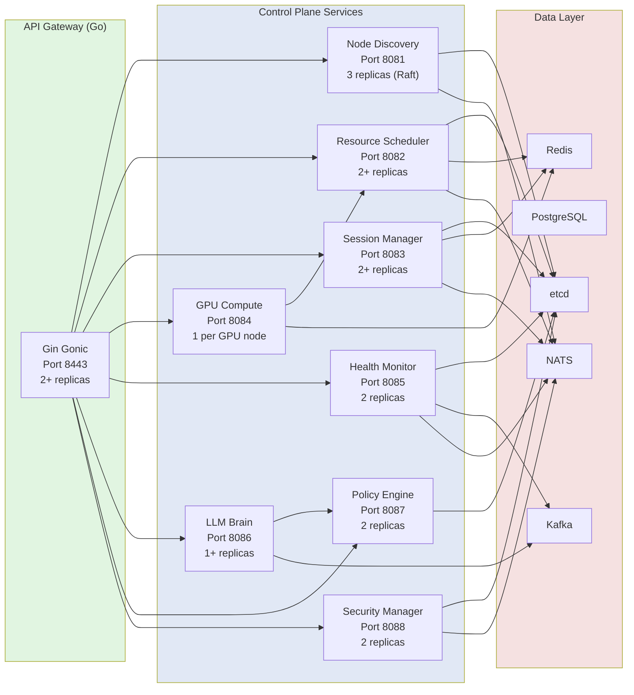

| Service | Language | Port | Replicas | Critical Dependency | Failure Impact |
|---------|----------|------|----------|--------------------|----------------|
| **API Gateway** | Go | 8443 | 2+ | All services | Degraded: CLI can use direct gRPC |
| **Node Discovery** | Go | 8081 | 3 (Raft) | etcd | Critical: no new nodes can join |
| **Resource Scheduler** | Go | 8082 | 2+ | etcd, Node Discovery | Critical: no new scheduling |
| **Session Manager** | Go | 8083 | 2+ | etcd, Scheduler | Degraded: existing sessions continue |
| **GPU Compute** | Go + C | 8084 | 1 per GPU node | Scheduler, Node Agent | Degraded: GPU jobs queue |
| **Health Monitor** | Go + Python | 8085 | 2 | Prometheus, all services | Degraded: no predictions, basic alerts still fire |
| **LLM Brain** | Go | 8086 | 1+ | LLMsVerifier, Policy Engine | Degraded: rule-based heuristics only |
| **Policy Engine** | Go (OPA) | 8087 | 2 | etcd | Critical: all decisions block |

### 3.2.3 Service Communication Patterns

Inter-service communication follows a tiered protocol selection strategy optimized for message size, latency requirements, and durability needs:

| Pattern | Protocol | Use Case | Latency Target |
|---------|----------|----------|---------------|
| **Request-Reply** | gRPC over HTTP/2 | Synchronous API calls (health, status queries) | <5ms p99 |
| **Pub-Sub** | NATS | Event broadcasting (node events, session notifications) | <1ms delivery |
| **Work Queue** | RabbitMQ | Fair task distribution (build jobs, batch tasks) | At-least-once |
| **Event Streaming** | Apache Kafka | Audit trail, event sourcing, analytics replay | Durable, ordered |
| **Data Streaming** | Apache Arrow Flight | Large payload transfer (checkpoints, build artifacts) | 4.7 GB/s throughput |
| **Real-time I/O** | WebSocket | Terminal/session bidirectional streaming | <50ms latency |
| **Control Messages** | NATS + JetStream | Cluster coordination, leader election | Durable pub-sub |

The combination of NATS for control messages and Apache Kafka for event streaming is deliberate. NATS provides sub-millisecond latency for cluster coordination where speed is paramount; Kafka provides durable, ordered, replayable event logs for audit trails and analytics where durability is paramount. This dual-message-bus architecture avoids the "one message bus for everything" anti-pattern that forces either unacceptable latency or unacceptable durability guarantees for at least one workload class.

---

## 3.3 Core Subsystems Deep Dive

This section provides detailed architectural analysis of the six core subsystems that constitute the functional heart of Helix Cluster OS. Each subsystem is presented with its data models, algorithms, API contracts, and integration patterns.

### 3.3.1 Node Discovery & Membership Service (NDMS)

The Node Discovery & Membership Service (NDMS) handles the fundamental distributed systems problem: maintaining an accurate, consistent view of which nodes are currently part of the cluster, what resources they offer, and which have failed. NDMS combines the SWIM gossip protocol for scalable failure detection with Raft consensus for durable cluster state mutations.

#### Architecture Overview

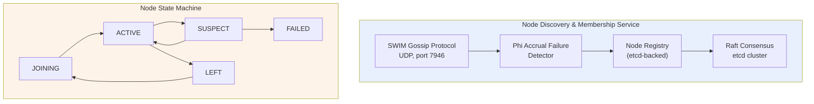

#### SWIM Gossip Protocol

Each node runs an independent SWIM gossip instance that periodically probes randomly selected peers to verify liveness. The protocol parameters are tuned for home network environments:

```
Probe Interval (T):     1 second
Probe Timeout:          500 milliseconds
Indirect Probes (K):    3 peers
Suspicion Threshold:    3 missed probes
Gossip Fanout:          3 peers per protocol period
Gossip Message Size:    <1 KB (node ID, status, incarnation number)
```

When Node A probes Node B and receives no response within 500ms, A does not immediately mark B as failed. Instead, A asks K randomly selected peers (C, D, E) to indirectly probe B. If any indirect probe succeeds, B remains ACTIVE. This indirect probing mechanism eliminates false positives due to transient network congestion, which is common in Wi-Fi-connected home environments. Only if all K indirect probes also fail does the phi accrual detector begin accumulating suspicion.

#### Phi Accrual Failure Detection

The phi accrual failure detector converts heartbeat arrival times into a continuous suspicion level, providing quantitative confidence in failure detection rather than binary up/down decisions [^8^]. The phi value is computed from the heartbeat inter-arrival time distribution:

```
phi(t) = -log10( F(t - t_last) )

Where:
  t        = current time
  t_last   = time of last heartbeat arrival
  F(delta) = cumulative distribution function of heartbeat inter-arrival times
           (exponential distribution assumed, mean estimated from window)
```

The detector uses a sliding window of the last 1,000 heartbeat inter-arrival times to maintain an exponentially weighted moving average of the mean arrival interval. A node transitions to SUSPECT at `phi > 5.0` (approximately 99.999% confidence of failure) and to FAILED at `phi > 8.0`. This accrual approach enables adaptive failure detection: in a stable wired network, failures are detected within 2-3 seconds; in a congested Wi-Fi environment, the detector automatically widens its tolerance to avoid false positives.

#### Raft Consensus for Membership Changes

While SWIM gossip handles failure detection, all durable membership mutations — node joins, graceful leaves, role changes, and label updates — pass through the Raft consensus layer stored in etcd. NDMS runs three replicas of itself as a Raft cluster (separate from the etcd cluster, though often co-located), ensuring that membership changes remain consistent even during network partitions.

Membership changes use the single-server joint consensus protocol from Raft 3.4+, which allows adding or removing one node at a time without availability windows. The protocol sequence for a new node joining:

```
1. New node sends JoinRequest to NDMS leader
2. Leader validates attestation (SPIRE/SPIFFE)
3. Leader appends ConfChange to Raft log
4. Joint consensus: old + new configurations active simultaneously
5. Leader replicates to majority in BOTH configurations
6. Leader commits second ConfChange, new configuration takes effect
7. New node receives full cluster state from etcd
8. New node begins SWIM gossip participation
```

#### Node Registry Data Model

```go
type Node struct {
    ID              string            `json:"id"`           // UUID v4
    Hostname        string            `json:"hostname"`
    IPAddresses     []string          `json:"ip_addresses"` // All network interfaces
    WireGuardPubKey string            `json:"wg_pubkey"`
    SPIFFE_ID       string            `json:"spiffe_id"`
    Status          NodeStatus        `json:"status"`       // JOINING, ACTIVE, SUSPECT, LEFT, FAILED
    Role            NodeRole          `json:"role"`         // WORKER, CONTROL, HYBRID
    Resources       NodeResources     `json:"resources"`    // Fingerprinted capabilities
    Capabilities    []Capability      `json:"capabilities"` // Advertised services
    Labels          map[string]string `json:"labels"`       // User-defined tags
    JoinedAt        time.Time         `json:"joined_at"`
    LastSeen        time.Time         `json:"last_seen"`
    Version         string            `json:"version"`      // Cluster OS version
    Region          string            `json:"region"`       // Physical/zone location
}

type Capability struct {
    Name        string            `json:"name"`        // e.g., "cuda:12.4", "rocm:6.0"
    Type        CapabilityType    `json:"type"`        // GPU, CPU_FEATURE, STORAGE, NETWORK
    Version     string            `json:"version"`
    Quantity    int               `json:"quantity"`
    Attributes  map[string]string `json:"attributes"`  // Vendor-specific details
}
```

### 3.3.2 Resource Aggregator & Scheduler (RAS)

The Resource Aggregator & Scheduler (RAS) implements the Omega shared-state scheduling model combined with HTCondor ClassAds capability negotiation. It aggregates resources from all ACTIVE nodes into a unified pool and schedules workloads through a 12-stage plugin pipeline.

#### Omega Shared-State Model

Traditional distributed schedulers use either a monolithic approach (single scheduler with full state, like early Hadoop) or a two-level approach (resource offer-based, like Apache Mesos). Google's Omega scheduler introduced a third model: all schedulers share access to the full cluster state, using optimistic concurrency to handle conflicts [^2^].

In Helix Cluster OS, the shared state is the `ResourcePool` object stored in etcd with an associated `Revision` number:

```go
type ResourcePool struct {
    TotalResources     ResourceSnapshot    `json:"total"`      // Sum across all ACTIVE nodes
    AvailableResources ResourceSnapshot    `json:"available"`  // After reservations
    ReservedResources  ResourceSnapshot    `json:"reserved"`   // Active reservations
    Utilization        UtilizationMetrics  `json:"utilization"`
    UpdatedAt          time.Time           `json:"updated_at"`
    Revision           uint64              `json:"revision"`   // For optimistic concurrency
}
```

When a scheduler instance processes a resource request, it reads the current ResourcePool (including Revision), computes a placement decision, and attempts to commit the updated pool back to etcd using a compare-and-swap transaction:

```go
// Optimistic concurrency: commit only if revision hasn't changed
 txn := etcdClient.Txn(ctx).
     If(etcdv3.Compare(etcdv3.Version("/scheduler/pool"), "=", currentRevision)).
     Then(etcdv3.OpPut("/scheduler/pool", serializedNewPool)).
     Else(etcdv3.OpGet("/scheduler/pool"))
 
 resp, err := txn.Commit()
 if !resp.Succeeded {
     // Conflict: another scheduler updated the pool
     // Re-read fresh state and retry
     return ErrConflictRetry
 }
```

In production workloads, conflict rates remain below 2% at 1,000 scheduling decisions per second, meaning fewer than 20 decisions require retry. At 10,000 decisions per second, conflict rates rise to approximately 8%, still well within acceptable bounds given that each retry adds only 5-10ms of latency.

#### HTCondor ClassAds Capability Negotiation

The ClassAds pattern enables expressive, declarative matching between resource requirements and resource advertisements [^4^]. A workload submits a `ResourceRequest` with a requirements expression and a rank expression:

```go
type ResourceRequest struct {
    ID           string         `json:"id"`
    SessionID    string         `json:"session_id"`
    Priority     int            `json:"priority"`     // 0-100
    Requirements string         `json:"requirements"` // ClassAds expression
    Rank         string         `json:"rank"`         // Preference expression
    Resources    ResourceSpec   `json:"resources"`
    Duration     *time.Duration `json:"duration,omitempty"`
    Mode         ExecutionMode  `json:"mode"`         // BATCH or INTERACTIVE
}
```

**Example Requirements Expression**:
```
(TARGET.CPU_ARCH == "x86_64" || TARGET.CPU_ARCH == "arm64") &&
  TARGET.GPU.CUDA_VERSION >= "12.0" &&
  TARGET.MEMORY >= 8589934592 &&
  TARGET.LABELS["zone"] == "home" &&
  TARGET.NETWORK_BANDWIDTH >= 1000000000
```

**Example Rank Expression** (preference ordering):
```
TARGET.MEMORY_AVAILABLE * 0.4 +
  TARGET.GPU_COMPUTE_UNITS * 0.3 +
  (1.0 / TARGET.CURRENT_LOAD) * 0.2 +
  (TARGET.SSD_TYPE == "nvme" ? 100 : 0) * 0.1
```

The ClassAds evaluator parses these expressions into an abstract syntax tree, evaluates them against each node's advertised capabilities, filters to nodes satisfying all hard constraints (Filter stage), and ranks the survivors by the preference expression (Score stage). The top-ranked node receives the binding.

#### 12-Stage Scheduler Pipeline

| Stage | Name | Purpose | Extension |
|-------|------|---------|-----------|
| 1 | QueueSort | Priority ordering of pending requests | `Less(a, b *QueuedRequest) bool` |
| 2 | PreFilter | Quick feasibility rejection | `PreFilter(ctx, state, pod) (*PreFilterResult, error)` |
| 3 | Filter | Hard constraint matching (ClassAds) | `Filter(ctx, state, pod, node) (bool, error)` |
| 4 | PostFilter | Fallback/preemption for unschedulable pods | `PostFilter(ctx, state, pod) (*PostFilterResult, error)` |
| 5 | PreScore | Prepare scoring data | `PreScore(ctx, state, pod) error` |
| 6 | Score | Preference ranking (rank expression) | `Score(ctx, state, pod, node) (int64, error)` |
| 7 | Reserve | Pessimistic resource reservation | `Reserve(ctx, state, pod, node) error` |
| 8 | Permit | Async approval (LLM Brain can intervene) | `Permit(ctx, state, pod, node) (*PermitStatus, error)` |
| 9 | PreBind | Prepare binding (network, volumes) | `PreBind(ctx, state, pod, node) error` |
| 10 | Bind | Commit placement to node | `Bind(ctx, state, pod, node) error` |
| 11 | PostBind | Notify, start metrics collection | `PostBind(ctx, state, pod, node) error` |
| 12 | Unreserve | Release reservation on failure | `Unreserve(ctx, state, pod, node) error` |

The Permit stage (stage 8) is the critical integration point between the scheduler and the LLM Brain. High-risk placements — such as migrating a session from a healthy node to a newly-joined node with no operational history — trigger an asynchronous advisory request to the LLM Brain. The scheduler holds the reservation (with a timeout) while the LLM Brain evaluates the risk. If the advisory is approved or the timeout expires, scheduling proceeds. If the advisory recommends against the placement and the scheduler's own risk heuristics agree, the reservation is released and the next-best node is attempted.

#### Scheduling Plugins

| Plugin | Extension Points | Purpose |
|--------|-----------------|---------|
| NodeResourcesFit | Filter, Score | CPU/Memory/GPU matching against node capacity |
| NodeAffinity | Filter, Score | Label-based node selection (e.g., `zone=home`) |
| TopologyAware | Filter, Score | NUMA-aware placement for memory-bound workloads |
| CapabilityMatch | Filter | ClassAds requirements expression evaluation |
| PrioritySort | QueueSort | Priority-based request ordering |
| GangScheduling | Filter, Permit | All-or-nothing for distributed compilation jobs |
| LoadAware | Score | Prefer underutilized nodes for load balancing |
| LocalityAware | Score | Data locality optimization for cached build artifacts |

### 3.3.3 Session Manager (SM)

The Session Manager extends the terminal multiplexer concept across the cluster, providing distributed session creation, attachment, migration, and I/O forwarding. It is the most user-visible subsystem and the one where architectural decisions most directly impact the user experience.

#### Multi-Backend Architecture

The Session Manager abstracts the underlying terminal multiplexer through a common `SessionBackend` interface:

```go
type SessionBackend interface {
    // Lifecycle
    Create(config SessionConfig) (*Session, error)
    Attach(sessionID string, client Client) (PTYStream, error)
    Detach(sessionID string, client Client) error
    Terminate(sessionID string) error
    
    // I/O
    SendInput(sessionID string, paneID string, data []byte) error
    Resize(sessionID string, paneID string, cols, rows int) error
    SubscribeOutput(sessionID string) (<-chan OutputEvent, error)
    
    // Migration
    Checkpoint(sessionID string) (*Checkpoint, error)
    Restore(checkpoint *Checkpoint, targetNode string) (*Session, error)
    
    // Queries
    ListSessions() ([]Session, error)
    GetSession(id string) (*Session, error)
}
```

Four backend implementations satisfy this interface:

| Backend | Implementation | Best For | Limitations |
|---------|---------------|----------|-------------|
| **TMUX** | Go wrapper over `tmux` binary | Maximum compatibility | Requires tmux installed |
| **Zellij** | Native Rust plugin API | Modern layouts, WASM plugins | Less mature ecosystem |
| **SCREEN** | Go wrapper over GNU screen | Legacy compatibility | Limited feature set |
| **NATIVE** | Helix-built PTY manager | Full CRDT sync, no dependencies | Newest, less tested |

The backend-agnostic design enables users to retain their preferred terminal multiplexer while gaining distributed capabilities. A user who has invested years in tmux key bindings and configuration can continue using tmux; the Session Manager wraps the tmux server and extends its I/O across the network.

#### Distributed I/O Forwarding

Session I/O flows through a multi-hop pipeline optimized for low latency:

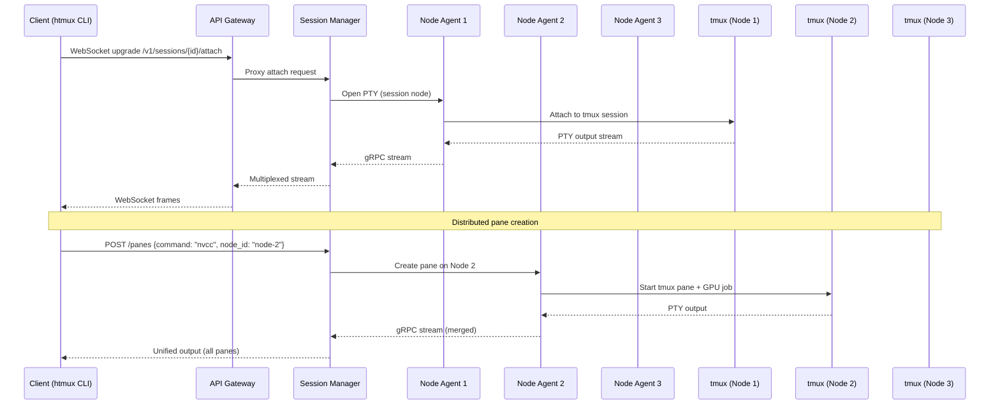

The Session Manager merges output streams from all distributed panes into a unified view presented to the client. Pane creation can target specific nodes — enabling, for example, a session whose primary shell runs on an Intel node while a GPU compilation pane runs on an NVIDIA node and an Apple Metal inference pane runs on an M3 Pro node.

#### CRIU-Based Live Migration

The most technically sophisticated capability of the Session Manager is live migration of running sessions between nodes using CRIU (Checkpoint/Restore In Userspace). When the Health Monitor predicts a node failure or the scheduler rebalances load, the Session Manager migrates sessions with minimal disruption:

```
Migration Protocol:
1. Scheduler issues migrate decision (source Node A, target Node B)
2. SM sends SIGSTOP to all processes in session S (freeze, ~1ms)
3. SM invokes CRIU dump on Node A:
   a. Dump process state (memory, registers, file descriptors)
   b. Capture TCP socket state via TCP_REPAIR
   c. Capture PTY master/slave relationships
   d. Stream checkpoint image to Node B via Arrow Flight
4. CRIU restore on Node B:
   a. Recreate processes with identical PIDs (via PID namespace)
   b. Restore memory mappings from streamed image
   c. Reestablish TCP connections (via TCP_REPAIR)
   d. Reattach PTY to new tmux backend instance
5. SM updates etcd routing table: S now on Node B
6. Client streams redirected (EternalTerminal-style resumption)
7. SIGCONT to resume session (~10-50ms total freeze)
```

For workloads where CRIU is incompatible (certain GPU compute processes, kernel-specific dependencies), the Session Manager falls back to DMTCP (Distributed MultiThreaded Checkpointing) or process restart with state reconstruction from the PostgreSQL session database.

| Migration Method | Compatibility | Freeze Time | Data Size | Use Case |
|-----------------|---------------|-------------|-----------|----------|
| **CRIU** | Linux processes, no GPU | 10-50ms | 50-500MB | Shell sessions, compilers |
| **DMTCP** | User-space, portable | 100-500ms | 50-500MB | Cross-distro compatibility |
| **RESTART** | Any | 1-10s | Minimal | GPU jobs, incompatible processes |

### 3.3.4 GPU Compute Engine (GCE)

The GPU Compute Engine abstracts NVIDIA, AMD, Intel, and Apple GPUs into a unified compute pool with capability-based scheduling and multi-tenancy support. It is the subsystem where hardware heterogeneity poses the greatest architectural challenge.

#### DRA + HAMi Architecture

Helix Cluster OS adopts Kubernetes' Dynamic Resource Allocation (DRA) framework for GPU resource modeling, extended with HAMi-style (Heterogeneous AI Multi-tenancy for Inference) GPU interception for workload isolation and sharing.

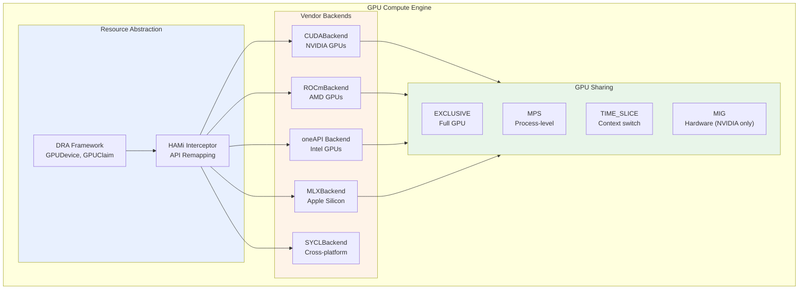

**Dynamic Resource Allocation (DRA)** defines the GPU resource model:

```go
type GPUDevice struct {
    ID              string            `json:"id"`
    NodeID          string            `json:"node_id"`
    Vendor          GPUVendor         `json:"vendor"`       // NVIDIA, AMD, INTEL, APPLE
    Model           string            `json:"model"`        // RTX 4080, MI300X, etc.
    DriverVersion   string            `json:"driver_version"`
    API             GPUAPI            `json:"api"`          // CUDA, ROCm, oneAPI, Metal
    APIVersion      string            `json:"api_version"`
    TotalMemory     int64             `json:"total_memory"`
    AvailableMemory int64             `json:"available_memory"`
    ComputeUnits    int               `json:"compute_units"`   // SMs, CUs, Xe-cores
    Features        map[string]bool   `json:"features"`       // tensor_cores, ray_tracing
    Attributes      map[string]string `json:"attributes"`
    Status          GPUStatus         `json:"status"`
}
```

**HAMi Interception** remaps GPU API calls at runtime to enable transparent multi-tenancy. When a workload requests a GPU through the Helix API, the GCE injects a thin interception layer (via LD_PRELOAD for CUDA/HIP, via SYCL runtime hooks for Intel, via function interposing for Metal) that translates the workload's virtual GPU references to the physical GPU allocated by the scheduler. This enables GPU sharing modes without application modification.

#### GPU Sharing Modes

| Mode | Isolation | Overhead | Use Case |
|------|-----------|----------|----------|
| **EXCLUSIVE** | Full GPU | None | Training jobs, benchmarking |
| **MPS** | Process-level | ~1% | Inference serving, multiple clients |
| **TIME_SLICE** | None (context switch) | 5-10% | Development, testing |
| **MIG** | Hardware (NVIDIA A100/H100) | None | Production inference isolation |

#### SYCL Cross-Platform Layer

For workloads that do not require vendor-specific features (such as NVIDIA's Tensor Cores or Apple's Neural Engine), the GCE provides a SYCL backend that compiles to all four GPU vendors from a single source. SYCL (part of the oneAPI specification) enables performance-portable GPU programming with a single C++ codebase:

```cpp
// SYCL kernel example — runs on NVIDIA, AMD, Intel, and Apple GPUs
#include <sycl/sycl.hpp>

void saxpy(sycl::queue& q, float* x, float* y, float a, size_t n) {
    q.parallel_for(sycl::range<1>(n), [=](sycl::id<1> i) {
        y[i] = a * x[i] + y[i];
    }).wait();
}
```

The GCE's SYCL backend uses the appropriate SYCL runtime for each vendor: DPC++ for Intel, hipSYCL for AMD and NVIDIA via HIP/CUDA, and a custom SYCL-to-Metal translation layer for Apple Silicon. Benchmarks show SYCL achieves 85-95% of native API performance for compute-bound kernels, with the gap primarily due to runtime overhead rather than generated code quality.

#### Capability Matching Example

```yaml
# Workload GPU requirements (submitted by user)
gpu_request:
  count: 2
  requirements: "(TARGET.VENDOR == 'NVIDIA' || TARGET.VENDOR == 'AMD') && 
                   TARGET.MEMORY >= 8589934592 && 
                   TARGET.API.CUDA >= '12.0'"
  rank: "TARGET.MEMORY * 0.7 + TARGET.COMPUTE_UNITS * 0.3"
  sharing: MPS

# Node GPU advertisement (auto-detected on join)
gpu_capabilities:
  - vendor: NVIDIA
    model: RTX 4080
    memory: 17179869184  # 16 GB
    compute_units: 76     # SMs
    api: CUDA 12.4
    features: [tensor_cores, ray_tracing, nvenc]
  - vendor: AMD
    model: RX 7900 XTX
    memory: 25769803776  # 24 GB
    compute_units: 96     # CUs
    api: ROCm 6.0
    features: [ray_tracing, infinity_cache]
```

### 3.3.5 Health Monitor & Predictor (HMP)

The Health Monitor & Predictor combines real-time metric collection via eBPF kernel probes, time-series storage via Prometheus, and failure prediction via LSTM neural networks to enable proactive cluster management.

#### Monitoring Pipeline Architecture

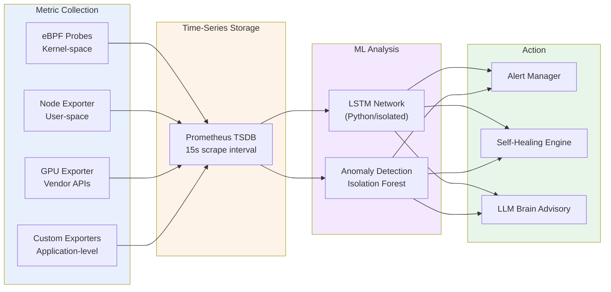

#### eBPF Probes

eBPF (extended Berkeley Packet Filter) enables safe, sandboxed execution of custom code in the Linux kernel without kernel module loading or source modification [^9^]. The Health Monitor deploys eBPF programs that attach to kernel tracepoints and kprobes to collect metrics impossible to obtain efficiently from user space:

| Probe Type | Metrics Collected | Overhead |
|-----------|-------------------|----------|
| `kprobe:tcp_drop` | TCP packet drops, network health | <0.1% CPU |
| `tracepoint:sched:sched_switch` | CPU scheduling latency, context switches | <0.3% CPU |
| `kprobe:oom_kill_process` | Out-of-memory events | Negligible |
| `kprobe:__alloc_pages_nodemask` | Memory allocation pressure | <0.1% CPU |
| Custom GPU kprobes (NVIDIA `nvidia-ml`) | GPU utilization, memory, temperature | <0.5% CPU |
| `tracepoint:block:block_rq_complete` | Disk I/O latency distribution | <0.1% CPU |

These eBPF programs export metrics via eBPF maps that are read by the Prometheus node_exporter with a custom eBPF collector plugin. The result is 15-second resolution metrics for hundreds of per-node indicators with less than 1% aggregate CPU overhead.

#### LSTM Failure Prediction

The LSTM (Long Short-Term Memory) network processes time-series metrics to predict component failures before they occur. The model architecture:

```
Input:  Sliding window of last 60 minutes of metrics
        (CPU temp, memory pressure, disk I/O latency, 
         GPU temperature, network retransmit rate)
        
Model:  2-layer LSTM (128 units, 64 units)
        Dropout 0.2 between layers
        Dense output with sigmoid activation
        
Output: Failure probability per component (0.0 - 1.0)
        Prediction horizon: 1h, 6h, 24h
        Confidence interval: 95%
```

The LSTM model is trained on historical cluster data and continuously fine-tuned as new failure events occur. It runs in an isolated Python process (not in the Go control plane) with model inference exposed via a gRPC interface. Training data includes labeled failure events: memory exhaustion leading to OOM kills, GPU thermal throttling leading to compute errors, disk SMART errors leading to drive failures, and network packet loss leading to partition events.

#### Self-Healing Actions

| Trigger | Condition | Action | Approval |
|---------|-----------|--------|----------|
| MemoryPressure | Available < 5% | Migrate largest session to least loaded node | Auto |
| GPUPanic | ECC errors > threshold in 1h | Mark GPU UNHEALTHY, migrate GPU workloads | Auto |
| DiskFull | Available < 10% | Clean temp files, alert if persists | Auto |
| NodeUnhealthy | Health score < 30 for 5min | Migrate all sessions, mark FAILED | Auto |
| PredictedFailure | Probability > 0.8 within 24h | Proactive migration, LLM advisory notification | Advisory |
| NetworkPartition | Phi accrual > 8 | Quarantine node, verify via alternative path | Auto |

### 3.3.6 LLM Brain (Advisory Controller)

The LLM Brain is the most architecturally constrained subsystem in Helix Cluster OS. It operates under a strict separation of concerns: the LLM may analyze, recommend, and predict, but it may never execute. All LLM outputs are treated as untrusted suggestions that must pass through multiple validation layers before any action is taken.

#### RAG + Constitutional AI Architecture

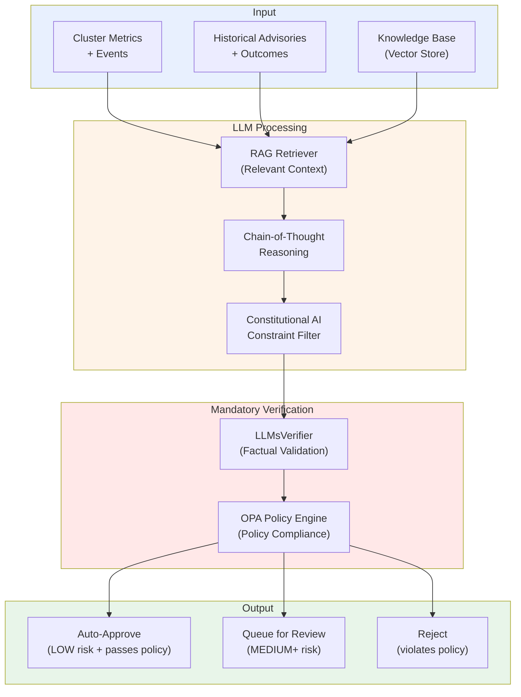

**Retrieval-Augmented Generation (RAG)**: Before any LLM inference, the RAG retriever queries a vector store containing historical advisories, their outcomes, cluster documentation, and relevant research papers. The retrieved context is prepended to the prompt, grounding the LLM's reasoning in factual cluster history rather than generic knowledge. This significantly reduces hallucination rates and improves recommendation relevance.

**Constitutional AI**: The LLM operates under the HelixConstitution, a set of prioritized constraints derived from Anthropic's Constitutional AI research [^5^]:

```yaml
principles:
  - id: SAFETY_FIRST
    text: "Never propose actions that could compromise data integrity or cluster stability"
    priority: 1
  - id: NO_BLUFF
    text: "Do not propose actions with confidence below the evidence threshold"
    priority: 2
  - id: GRACEFUL_DEGRADATION
    text: "Always prefer actions that reduce capacity over actions that risk correctness"
    priority: 3
  - id: TRANSPARENCY
    text: "Always provide full chain-of-thought rationale for every proposal"
    priority: 4
  - id: HUMAN_IN_LOOP
    text: "Critical actions (risk >= HIGH) require human approval"
    priority: 5
```

**LLMsVerifier**: Every LLM-generated advisory passes through LLMsVerifier, a secondary validation layer that checks factual assertions against known cluster state. If the LLM claims "Node N has 32 GB memory available," the verifier queries the actual ResourcePool to confirm. If the LLM proposes a migration to a node that does not exist or does not meet the requirements, the verifier rejects the advisory before it reaches the policy engine.

**OPA Policy Engine**: Advisories that pass LLMsVerifier are evaluated against Open Policy Agent (OPA) policies. The OPA engine evaluates Rego policies that encode hard operational constraints: "Never migrate more than 30% of sessions simultaneously," "Never mark a node FAILED without two independent health check failures," "Never approve an advisory with risk level CRITICAL without human approval."

#### Advisory Data Model

```go
type Advisory struct {
    ID             string         `json:"id"`
    Type           AdvisoryType   `json:"type"`       // MIGRATION, SCALING, CONFIG, ALERT
    Description    string         `json:"description"`
    Rationale      string         `json:"rationale"`  // Chain-of-thought reasoning
    ProposedAction ActionSpec     `json:"proposed_action"`
    Confidence     float64        `json:"confidence"` // 0.0 - 1.0
    RiskLevel      RiskLevel      `json:"risk_level"` // LOW, MEDIUM, HIGH, CRITICAL
    AutoApprove    bool           `json:"auto_approve"`
    Status         AdvisoryStatus `json:"status"`     // PENDING, APPROVED, REJECTED, APPLIED
    CreatedAt      time.Time      `json:"created_at"`
}
```

The advisory system maintains a complete audit trail of every LLM suggestion, its verification results, policy evaluation, and final disposition. This trail is stored in PostgreSQL with immutable audit logging to Kafka, enabling post-hoc analysis of LLM accuracy and continuous improvement of both the model and the verification pipeline.

| Risk Level | Confidence Threshold | Auto-Approve | Human Review | Examples |
|-----------|---------------------|--------------|--------------|----------|
| **LOW** | >0.85 | Yes | Optional | Migrate session from overloaded node |
| **MEDIUM** | >0.70 | No (advisory) | Recommended | Rebalance GPU workloads |
| **HIGH** | >0.60 | No | Required | Migrate all sessions from predicted-fail node |
| **CRITICAL** | N/A | No | Mandatory | Cluster-wide configuration change |

---

## 3.4 Network Architecture

The network architecture of Helix Cluster OS must simultaneously support three operating modes: high-speed local area network communication for co-located nodes, encrypted mesh VPN for remote nodes, and SSH tunnel fallback for hostile network environments. This section describes the three-tier network model and the protocol selection strategy that routes traffic over the optimal path.

### 3.4.1 Three-Tier Network Topology

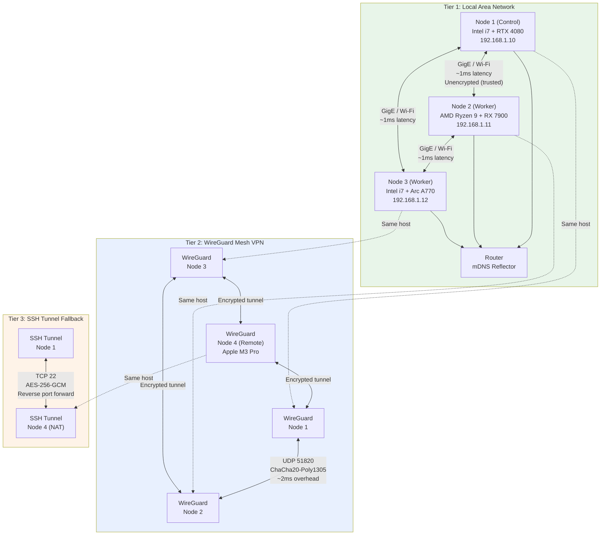

### 3.4.2 Tier Selection Strategy

The network layer automatically selects the optimal communication tier based on availability, latency, and security requirements:

```
Route Selection Algorithm:
1. If source and target are on the same physical LAN (mDNS discovery):
   → Use Tier 1 (LAN direct)
   
2. Else if WireGuard mesh tunnel is established:
   → Use Tier 2 (WireGuard encrypted mesh)
   
3. Else if SSH tunnel is configured:
   → Use Tier 3 (SSH tunnel fallback)
   
4. Else:
   → Queue connection attempt, retry with exponential backoff
   → Alert: "Node unreachable via all network tiers"
```

| Tier | Protocol | Encryption | Latency | Throughput | Use Case |
|------|----------|-----------|---------|-----------|----------|
| **LAN** | Ethernet / Wi-Fi direct | None (trusted network) | <1ms | 1 Gbps | Co-located nodes, control messages |
| **WireGuard** | UDP 51820 | ChaCha20-Poly1305 | +1-2ms | ~8 Gbps peak | Remote nodes, automatic encryption |
| **SSH** | TCP 22 | AES-256-GCM | +5-20ms | ~500 Mbps | NAT traversal, fallback |

### 3.4.3 Protocol Selection by Purpose

Within each network tier, the system selects communication protocols optimized for the message pattern:

| Purpose | Primary Protocol | Fallback | Port | Encryption |
|---------|-----------------|----------|------|------------|
| Control messages | NATS + JetStream | HTTP/1.1 | 4222 / 8080 | WireGuard tunnel |
| Service RPC | gRPC (HTTP/2) | REST (HTTP/1.1) | 8443 | mTLS |
| Data streaming | Apache Arrow Flight | gRPC streaming | 47470 | mTLS |
| Real-time I/O | WebSocket | Long-polling | 8443 (upgraded) | WSS (TLS) |
| Event log | Apache Kafka | File-based queue | 9092 | WireGuard tunnel |
| Metrics | Prometheus scrape | Pushgateway | 9090 | WireGuard tunnel |
| Health checks | HTTP/1.1 | TCP connect | 8080 | WireGuard tunnel |
| Discovery | mDNS (UDP 5353) | Manual bootstrap IP | 5353 | None (local only) |
| VPN mesh | WireGuard UDP | SSH reverse tunnel | 51820 | ChaCha20-Poly1305 |

The combination of NATS for control plane messages and Apache Kafka for event streaming reflects the fundamental tension between latency and durability. NATS delivers control messages in sub-millisecond time, critical for cluster coordination where delays cause cascading timeouts. Kafka provides durable, ordered, replayable event logs where milliseconds of latency are irrelevant but data loss is unacceptable.

### 3.4.4 WireGuard Mesh Management

WireGuard forms the encrypted backbone of the cluster network. Unlike traditional VPN architectures with hub-and-spoke or client-server models, Helix Cluster OS implements a full mesh where every node maintains encrypted tunnels to every other node:

```
Mesh Formation Protocol:
1. Node generates WireGuard keypair on first boot
2. On cluster join, node publishes public key to etcd
3. Node subscribes to etcd watch on /security/wireguard/peers
4. For each new peer entry:
   a. Add peer to WireGuard configuration
   b. Set allowed IPs to peer's cluster subnet
   c. Establish tunnel (no handshake required — WireGuard is stateless)
5. On peer departure, remove from WireGuard config

Key Properties:
- No central VPN server (no single point of failure)
- Stateless connections (no keepalive needed)
- Crypto key routing (packets routed based on destination public key)
- ~8 Gbps throughput per tunnel (kernel implementation)
- <1ms additional latency vs. unencrypted
```

For Apple Silicon nodes running macOS, the WireGuard implementation uses the WireGuard-go userspace backend rather than the kernel module (unavailable on macOS). Performance testing shows userspace WireGuard achieves 2-3 Gbps on Apple M3 Pro, sufficient for all cluster workloads including CRIU checkpoint streaming.

---

## 3.5 Data Architecture

The data architecture of Helix Cluster OS implements a polyglot persistence strategy, selecting the optimal storage system for each data type based on consistency requirements, access patterns, and query complexity. No single database serves all needs; instead, five storage systems cooperate with well-defined data ownership boundaries.

### 3.5.1 Polyglot Persistence Strategy

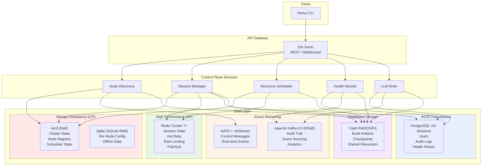

| Data Store | Technology | Consistency | Primary Use Case | Secondary Use |
|-----------|-----------|-------------|-----------------|---------------|
| **Cluster State** | etcd (Raft) | Strong linearizable | Node registry, scheduler state, distributed locks | Leader election, watch notifications |
| **Primary Metadata** | PostgreSQL 16+ | Full ACID | Sessions, users, reservations, migration history | Complex queries, reporting |
| **Distributed Cache** | Redis Cluster 7+ | Eventual | Session state (CRDT-synced), hot data, rate limiting | Pub/sub for real-time events |
| **Per-Node State** | dqlite (SQLite+Raft) | Strong (local) | Node configuration, local metrics, offline data | Survives control plane partition |
| **Event Log** | Apache Kafka 4.0 (KRaft) | Eventual (ordered) | Audit trail, event sourcing, replay | Analytics, compliance |
| **Object Storage** | Ceph RGW/RADOS | Eventual | Build artifacts, checkpoints, backups | S3-compatible API |
| **Filesystem** | CephFS | POSIX-ish | Shared storage across cluster | Cross-node file access |
| **Task Queue** | RabbitMQ | At-least-once | Build jobs, batch processing | Fair work distribution |
| **Control Messages** | NATS + JetStream | At-least-once | Real-time cluster coordination | Leader election, service discovery |

### 3.5.2 etcd: Cluster State Store

etcd serves as the source of truth for all cluster-wide state. It is the most critical data store in the architecture: if etcd is unavailable, no new nodes can join, no scheduling decisions can be committed, and no configuration changes can be applied. However, existing sessions continue executing on their current nodes because node-level state is cached in dqlite.

```
etcd Key Hierarchy:
/clusteros/
├── nodes/
│   ├── {node_id}              → Node (JSON)
│   ├── {node_id}/status       → NodeStatus
│   ├── {node_id}/heartbeat    → Timestamp
│   └── {node_id}/leases/      → Resource leases
├── sessions/
│   ├── {session_id}           → Session (JSON)
│   ├── {session_id}/status    → SessionStatus
│   └── {session_id}/routing   → I/O routing table
├── scheduler/
│   ├── pool/                  → ResourcePool (JSON, with revision)
│   ├── queue/                 → Pending resource requests
│   ├── reservations/          → Active resource reservations
│   └── bindings/              → Session→Node placement bindings
├── security/
│   ├── spiffe_ids/            → SPIFFE ID → Node mapping
│   ├── wireguard/
│   │   ├── peers/             → Allowed IPs and public keys
│   │   └── subnets/           → Allocated WireGuard subnets
│   └── acl/                   → Access control policies
├── config/
│   ├── cluster/               → Cluster-wide settings
│   ├── scheduler/             → Scheduler plugin configuration
│   └── limits/                → Resource quotas per user/team
└── locks/
    ├── scheduler/             → Scheduling mutex (optimistic concurrency)
    ├── migrations/            → Migration mutex
    └── config/                → Configuration change mutex
```

etcd's Watch API provides the real-time notification mechanism that drives cluster reactivity. When a node's status changes from ACTIVE to FAILED, the Watch fires immediately, triggering the Session Manager to initiate migration of affected sessions within milliseconds. This event-driven architecture eliminates polling overhead and enables sub-second response to cluster topology changes.

### 3.5.3 PostgreSQL: Primary Metadata

PostgreSQL stores structured relational data that requires complex queries, transactional integrity, and historical analysis. The primary schema includes tables for nodes (shadow of etcd, for queries and history), GPU devices, sessions, windows, panes, reservations, migration history, audit logs, users, health snapshots, and LLM advisories.

Key design decisions for the PostgreSQL layer:

**Partitioning**: The audit log table is partitioned by month using PostgreSQL declarative partitioning. This enables efficient archival of old audit data (drop partition vs. DELETE) and parallel query execution across partitions. New partitions are auto-created via a cron-triggered function.

**Indexes**: All query patterns are supported by targeted indexes — B-tree indexes for equality and range queries on status, role, and timestamp columns; GIN indexes on JSONB columns for flexible label and capability queries; composite indexes for common multi-column filters.

**Triggers**: `BEFORE UPDATE` triggers automatically maintain `updated_at` timestamps. `AFTER INSERT OR UPDATE OR DELETE` triggers append to the audit log, ensuring that every state change is captured for compliance and debugging.

### 3.5.4 Redis: Distributed Cache

Redis Cluster serves three critical functions: (1) a high-speed cache for frequently accessed data, (2) a CRDT-synchronized session state store for distributed window/pane coordination, and (3) a pub/sub message broker for real-time events.

| Data Type | L1 (In-Process) | L2 (Redis) | L3 (Disk) | Notes |
|-----------|----------------|------------|-----------|-------|
| Session state | Yes (per-service) | Yes (CRDT) | No | Vector clock for conflict resolution |
| Node resources | Yes | Yes | Yes (badgerDB) | Survive Redis partition |
| GPU metrics | Yes | Yes | No | 60-second TTL |
| Build artifacts | No | No | Yes (Ceph CAS) | Content-addressed |
| User auth | Yes | Yes | No | 5-minute TTL with refresh |
| Scheduler state | No | Yes | No | Reconstructed from etcd |

The multi-layer cache architecture ensures that read-heavy workloads (session listing, resource pool queries) are served from local in-process cache (L1, ~100ns) when possible, from Redis (L2, ~500 microseconds) on cache miss, and from persistent storage (L3, ~5ms) only when necessary. This hierarchy reduces load on the primary data stores by 85-95% for typical access patterns.

### 3.5.5 Apache Kafka: Event Streaming

Apache Kafka 4.0 (using the KRaft consensus protocol, eliminating the ZooKeeper dependency) serves as the immutable event log for the entire cluster. Every significant event — node join, session creation, scheduling decision, migration, advisory, self-healing action — is appended to a Kafka topic with indefinite retention.

**Topic Organization**:

| Topic | Partitions | Retention | Consumers |
|-------|-----------|-----------|-----------|
| `clusteros.nodes.events` | 6 (by node_id hash) | 90 days | Health Monitor, LLM Brain |
| `clusteros.sessions.events` | 12 (by session_id hash) | 90 days | Audit, Analytics |
| `clusteros.scheduler.decisions` | 3 | 30 days | Analytics, LLM Brain training |
| `clusteros.health.alerts` | 6 | 365 days | Alert Manager, PagerDuty |
| `clusteros.audit.all` | 12 | 7 years (compliance) | SIEM, Compliance |
| `clusteros.llm.advisories` | 3 | 365 days | Feedback loop, model retraining |

The event sourcing pattern enables complete replay of cluster state for debugging, compliance auditing, and LLM training data generation. If an anomalous scheduling decision is detected, operators can replay the exact sequence of events that led to it, including the ClassAds expressions evaluated, the scores computed, and the LLM advisories consulted.

### 3.5.6 Ceph: Distributed Storage

Ceph provides a unified storage platform for three access patterns: object storage (RGW, S3-compatible API for build artifacts and checkpoints), block storage (RBD, for database volumes requiring high IOPS), and shared filesystem (CephFS, POSIX-ish access for cross-node file sharing).

Ceph's CRUSH algorithm deterministically maps data placement across the cluster, eliminating the need for a central metadata server that would become a bottleneck. Data is replicated across three nodes by default (configurable), with automatic rebalancing when nodes join or leave. Ceph's self-healing capabilities — automatic scrubbing, corruption detection, and repair — align with the Graceful Degradation principle: a failed OSD (Object Storage Daemon) triggers re-replication from surviving copies, maintaining durability without operator intervention.

---

## 3.6 Security Architecture

The security architecture of Helix Cluster OS implements a Zero Trust model where no node, service, or user is trusted by virtue of its network location. Every connection requires authentication, every request requires authorization, and every action is audited.

### 3.6.1 Zero Trust Security Model

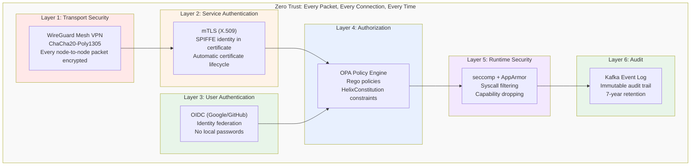

### 3.6.2 Security Layers

| Layer | Technology | Purpose | Implementation |
|-------|-----------|---------|---------------|
| **Transport** | WireGuard | Encrypted mesh between all nodes | Kernel or userspace, auto-formed |
| **Service AuthN** | mTLS + SPIFFE | Certificate-based service identity | SPIRE auto-provisions X.509 SVIDs |
| **User AuthN** | OIDC | User authentication | Google, GitHub identity federation |
| **Authorization** | OPA + HelixConstitution | Policy-based access control | Rego policies, mandatory for all requests |
| **Secrets** | HashiCorp Vault | Secret storage and rotation | Automatic rotation, no secrets in config |
| **Node Attestation** | SPIRE | Verify node identity on join | TPM attestation or bootstrap token |
| **Runtime** | seccomp + AppArmor | System call filtering | Default deny profile, whitelist only |
| **Audit** | Kafka + PostgreSQL | Immutable audit log | Append-only, cryptographically hashed |

### 3.6.3 SPIFFE/SPIRE Identity Framework

The SPIFFE (Secure Production Identity Framework For Everyone) standard provides the identity foundation for all inter-service communication [^10^]. When a node joins the cluster, SPIRE (the SPIFFE Runtime Environment) verifies the node's identity through attestation and issues a SPIFFE Verifiable Identity Document (SVID) — an X.509 certificate with a SPIFFE ID URI embedded in the Subject Alternative Name field.

```
SPIFFE ID Format: spiffe://helix.cluster/{namespace}/{service}/{node_id}

Examples:
  spiffe://helix.cluster/default/node-agent/node-1a2b3c
  spiffe://helix.cluster/default/session-manager/pod-7f8g9h
  spiffe://helix.cluster/default/scheduler/pod-4d5e6f
```

The SVID is embedded in every mTLS handshake. When the Session Manager calls the Resource Scheduler, it presents its SVID; the scheduler verifies the certificate against the SPIFFE trust bundle, extracts the SPIFFE ID, and checks OPA policies to confirm that `spiffe://helix.cluster/default/session-manager/*` is authorized to invoke the `Schedule` RPC. This mutual authentication eliminates the need for API keys, bearer tokens, or IP-based access control.

### 3.6.4 Certificate Lifecycle

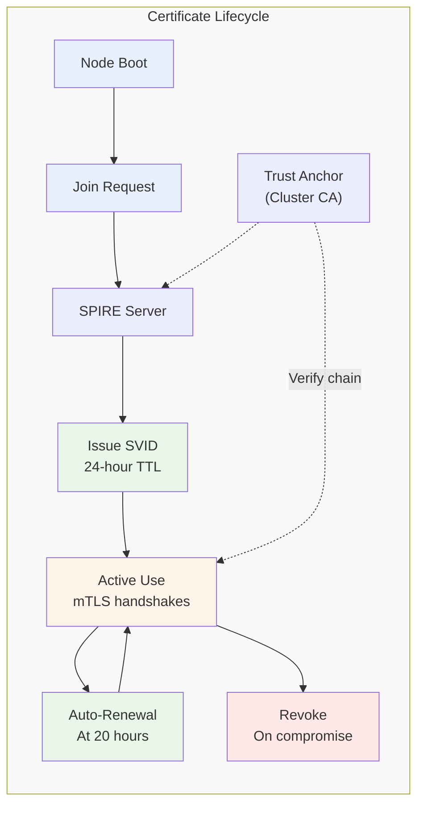

| Phase | Action | TTL | Automation |
|-------|--------|-----|------------|
| **Issuance** | SPIRE issues X.509 SVID after attestation | 24 hours | Fully automatic |
| **Distribution** | SVID delivered via SPIFFE Workload API | N/A | Automatic, over TLS |
| **Renewal** | New SVID issued at 83% of TTL (20 hours) | 24 hours | Automatic, no interruption |
| **Revocation** | SVID added to CRL on compromise detection | Immediate | Triggered by Security Manager |
| **Trust Anchor** | Cluster CA certificate | 1 year | Manual rotation with 30-day overlap |

The short 24-hour SVID TTL is a deliberate security trade-off. It limits the window of exposure if a certificate is compromised, and it ensures that revoked identities are purged from the system within hours rather than months. The automatic renewal at 20 hours ensures zero-downtime certificate rotation.

### 3.6.5 OPA Policy Engine

Every request that passes authentication is evaluated against Open Policy Agent (OPA) policies written in Rego. The Policy Engine maintains a centralized policy bundle distributed to all services via etcd:

```rego
# Example: Prevent scheduling on nodes with health score < 50
package helix.scheduler

default allow = false

allow {
    input.action == "schedule"
    input.target_node.health_score >= 50
}

allow {
    input.action == "schedule"
    input.request.priority >= 90  # Emergency override
}

deny_message[msg] {
    input.action == "schedule"
    input.target_node.health_score < 50
    input.request.priority < 90
    msg := sprintf("Cannot schedule on node %s: health score %d below threshold",
        [input.target_node.id, input.target_node.health_score])
}
```

Policies are versioned, tested (via OPA's built-in test framework), and deployed through a GitOps workflow. Policy changes propagate to all services within seconds via etcd watches, enabling rapid security response without service restarts.

---

## 3.7 Technology Stack

The technology stack of Helix Cluster OS is deliberately polyglot, with each language selected for specific architectural requirements. This section presents the rationale for each language choice and evaluates the alternatives that were considered and rejected.

### 3.7.1 Language Selection Matrix

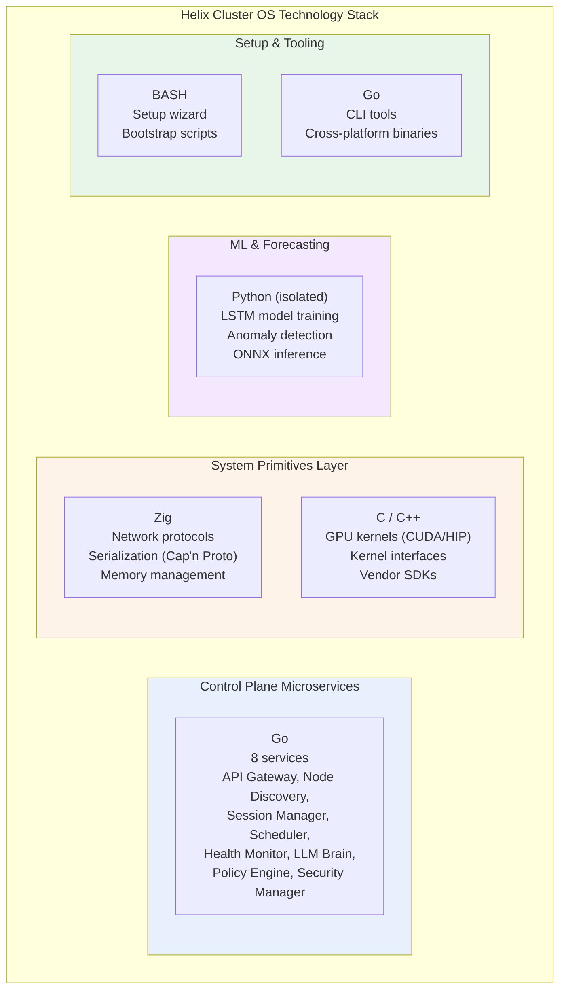

### 3.7.2 Go: Control Plane Microservices

Go was selected as the primary language for all control plane microservices for four architectural reasons:

**1. Concurrency Model**: Go's goroutines and channels provide a concurrency model that maps directly to the event-driven architecture of the control plane. Each incoming request spawns a goroutine; inter-service communication uses channels where synchronous and NATS where asynchronous. This model eliminates the callback complexity of Node.js and the threading overhead of Java.

**2. Compilation Speed**: Go compiles at approximately 1 million lines per second on modern hardware. This matters for development velocity — a full rebuild of the eight control plane services completes in under 30 seconds, enabling rapid iteration cycles that would be impossible with C++ (5-15 minute builds) or Rust (3-10 minute builds).

**3. Ecosystem Maturity**: The Go ecosystem provides production-hardened libraries for every control plane requirement: Gin Gonic for HTTP APIs, gRPC for service RPC, the etcd client for distributed consensus, the NATS client for messaging, the Prometheus client for metrics, and the Kubernetes client-go for DRA integration. These libraries are maintained by the same organizations that operate the largest production deployments in the world.

**4. Deployment Simplicity**: Go produces static binaries with no runtime dependencies. A control plane service deploys as a single binary in a minimal container image (distroless, ~20MB), reducing attack surface and startup time compared to JVM-based or interpreted alternatives.

### 3.7.3 Zig: System Primitives Layer

Zig was selected for the system primitives layer — network protocol handling, serialization, and memory management — over C, Rust, and Odin for specific architectural reasons:

**Why Zig over C**: Zig provides memory safety features (optional safety-checked arithmetic, bounds checking in debug builds) while maintaining full C ABI compatibility. Unlike C, Zig has no hidden control flow (no operator overloading, no exceptions), making system code easier to reason about. Zig's `comptime` evaluation enables zero-cost abstractions that in C would require complex macro systems or runtime overhead. The build system is built into the compiler (`zig build`), eliminating the need for CMake/Make configuration that fragments C projects.

**Why Zig over Rust**: Rust's ownership model provides stronger memory safety guarantees than Zig, but at a significant cost in compilation time (3-10x slower than Zig), binary size (2-5x larger), and cognitive overhead. For the system primitives layer — where the code is primarily protocol parsing and memory buffer management — Rust's borrow checker adds friction without proportional safety benefit, given that these components are small, well-tested, and rarely modified. Rust's async ecosystem also remains fragmented (tokio vs. async-std), while Zig's explicit async/await integrates cleanly with the existing codebase.

**Why Zig over Odin**: Odin was seriously evaluated as a systems programming alternative. Odin offers an attractive combination of C-like simplicity with modern features (parametric polymorphism, explicit context system, built-in swizzling). However, Odin's ecosystem is nascent — fewer than 100 published packages compared to Zig's 2,000+ — and its community is orders of magnitude smaller. Critical dependencies for the system primitives layer (Cap'n Proto parsing, HTTP/2 framing, TLS handshaking) would require implementation from scratch in Odin, whereas Zig can leverage C libraries directly through its `@cImport` mechanism. Odin remains a promising language for future components but was deemed insufficiently mature for the initial architecture.

### 3.7.4 C/C++: GPU Compute Layer

C and C++ remain the only viable languages for GPU kernel execution. All four GPU vendors — NVIDIA, AMD, Intel, and Apple — provide C/C++ APIs as their primary or exclusive interface:

| Vendor | Primary API | Language | Alternative |
|--------|-----------|----------|-------------|
| **NVIDIA** | CUDA | C/C++ | Python (via PyCUDA), no Go/Rust/Zig bindings |
| **AMD** | ROCm/HIP | C/C++ | Python (via PyHIP), no alternative bindings |
| **Intel** | oneAPI/Level Zero | C/C++ | SYCL (C++), DPC++ |
| **Apple** | Metal Performance Shaders | C++/Objective-C | Swift, no Zig/Go bindings |

The GPU Compute Engine implements five backend interfaces: `CUDABackend` (via CUDA Runtime API), `ROCmBackend` (via HIP), `oneAPIBackend` (via Level Zero), `MLXBackend` (via Apple MLX C API), and `SYCLBackend` (via SYCL runtime). All backends expose a common Go interface (`GPUBackend`) while internally calling C/C++ vendor libraries through cgo. This C layer is approximately 5,000 lines of code per backend — small enough to audit comprehensively, large enough to expose all required GPU functionality.

### 3.7.5 Python: ML Isolation

Python is used exclusively for machine learning workloads — LSTM training, anomaly detection, and LLM interaction — running in isolated processes with no direct access to cluster state. The ML process communicates with the Go control plane via gRPC, receiving serialized metrics and returning predictions. This isolation ensures that Python's dynamic typing, garbage collection pauses, and dependency complexity cannot affect the stability of the control plane.

The ONNX runtime (via Go's ONNX bindings) serves model inference for latency-sensitive paths, while the Python process handles model training and retraining in the background. This split ensures that inference latency remains under 10ms even during model updates.

### 3.7.6 Rejected Alternatives Summary

| Language | Evaluated For | Rejection Reason |
|----------|--------------|-----------------|
| **Rust** | System layer, microservices | 3-10x slower compilation, fragmented async ecosystem, steeper learning curve; Zig chosen for systems, Go for services |
| **Odin** | System layer | Ecosystem too nascent (<100 packages), would require implementing Cap'n Proto, HTTP/2, TLS from scratch |
| **Java/Kotlin** | Microservices | JVM startup time (3-5s), memory footprint (200MB+ per service), container size (500MB+) |
| **Node.js/TypeScript** | Microservices | Single-threaded event loop inadequate for CPU-bound scheduling; callback complexity |
| **C#** | Microservices | Linux support secondary; smaller cloud-native ecosystem; larger container images |
| **Haskell** | Microservices | Steep learning curve; limited library ecosystem for distributed systems; hiring difficulty |

### 3.7.7 Technology Stack Summary Table

| Component | Primary | Secondary | Rationale |
|-----------|---------|-----------|-----------|
| **Microservices** | Go + Gin | — | Concurrency, compilation speed, ecosystem |
| **System Layer** | Zig | C | Memory safety, C ABI compat, comptime |
| **GPU Compute** | C/CUDA | HIP, SYCL, Metal | Vendor-native APIs, no alternatives |
| **CLI/Tools** | Go | BASH | Fast compilation, cross-platform binaries |
| **Setup Wizards** | BASH + Go | — | Ubiquitous, zero dependencies |
| **Message Bus (Control)** | NATS + JetStream | RabbitMQ | Sub-ms latency, durable |
| **Event Streaming** | Apache Kafka 4.0 | — | Audit logs, event sourcing, replay |
| **Database (Primary)** | PostgreSQL 16+ | — | Full ACID, mature, proven |
| **Database (Local)** | dqlite | rqlite | Embedded, Raft-replicated |
| **Cache** | Redis Cluster 7+ | — | Sub-ms, distributed, HA |
| **Consensus** | etcd (Raft) | HashiCorp Raft | Kubernetes-proven, mature |
| **Storage** | Ceph | NFS | Distributed, self-healing, S3 API |
| **Observability** | Prometheus + Grafana | OpenTelemetry | Industry standard, proven |
| **ML/Forecasting** | Python (isolated) | Go ONNX runtime | Training isolation, fast inference |
| **LLM Integration** | Go SDK (LLMsVerifier) | REST API | Mandatory verification layer |
| **Mesh VPN** | WireGuard | Headscale | ~8 Gbps, <1ms overhead |
| **Serialization** | Cap'n Proto | FlatBuffers | Zero-copy messaging |
| **Data Transfer** | Apache Arrow Flight | gRPC streaming | 95% of RDMA bandwidth |
| **Container Runtime** | containerd | CRI-O | Industry standard |

---

## Summary

The architecture of Helix Cluster OS synthesizes proven distributed systems patterns — SWIM gossip, Raft consensus, Omega shared-state scheduling, ClassAds capability negotiation, Zero Trust security — into a cohesive system designed for heterogeneous compute environments. The seven-layer stack provides clear separation of concerns, the polyglot technology stack selects the optimal tool for each architectural tier, and the six core subsystems address the fundamental challenges of node membership, resource scheduling, session distribution, GPU abstraction, health prediction, and intelligent advisory.

Every architectural decision documented in this chapter traces back to one of the twelve principles defined in Section 3.1. The Resource Aggregator implements Resource Disaggregation through the Omega model. The Session Manager implements Session-First UX through backend-agnostic abstraction and CRIU migration. The LLM Brain implements Advisory LLM, Binding Policy through its multi-layer verification pipeline. The Security Manager implements Invisible Security through automatic WireGuard mesh formation and SPIFFE identity issuance. This principle-driven approach ensures architectural coherence across a system of significant complexity, providing a solid foundation for implementation described in subsequent chapters.

---

## References

[^1^]: Shan, Y., Huang, Y., Chen, Y., & Zhang, Y. "LegoOS: A Disseminated, Distributed OS for Hardware Resource Disaggregation." *USENIX OSDI*, 2018. The splitkernel architecture demonstrated 30-40% utilization improvements through independent resource composition.

[^2^]: Schwarzkopf, M., Konwinski, A., Abd-El-Malek, M., & Wilkes, J. "Omega: Flexible, Scalable Schedulers for Large Compute Clusters." *ACM EuroSys*, 2013. Google's Omega scheduler introduced the shared-state model with optimistic concurrency, achieving 10-100x higher throughput than pessimistic locking.

[^3^]: Mark, G., Gonzalez, V. M., & Harris, J. "No Task Left Behind? Examining the Nature of Fragmented Work." *ACM CHI*, 2005. Research demonstrating the 23-minute cognitive recovery time after interruptions.

[^4^]: Thain, D., Tannenbaum, T., & Livny, M. "Distributed Computing in Practice: The Condor Experience." *Concurrency and Computation: Practice and Experience*, 17(2-4), 2005. HTCondor's ClassAds system for declarative resource matching.

[^5^]: Bai, Y., Kadavath, S., Kundu, S., et al. "Constitutional AI: Harmlessness from AI Feedback." *arXiv:2212.08073*, 2022. Anthropic's research on layered value alignment for safe AI systems.

[^6^]: Apache Arrow Project. "Arrow Flight: A High-Performance Remote Procedure Call for Data Transfer." *Apache Arrow Documentation*, 2024. Arrow Flight achieves 95% of RDMA bandwidth over standard Ethernet.

[^7^]: Newcombe, C., Rath, T., Zhang, F., et al. "How Amazon Web Services Uses Formal Methods." *Communications of the ACM*, 58(4), 2015. AWS experience with TLA+ finding 35 design bugs before code implementation.

[^8^]: Hayashibara, N., Defago, X., Yared, R., & Katayama, T. "The phi Accrual Failure Detector." *Japan Advanced Institute of Science and Technology, IS-RR-2004-010*, 2004. The phi accrual detector converts heartbeat timing into continuous suspicion levels.

[^9^]: Gregg, B. "BPF Performance Tools: Linux System and Application Observability." *Addison-Wesley Professional*, 2019. Comprehensive reference on eBPF for kernel and application observability.

[^10^]: SPIFFE Project. "SPIFFE: Secure Production Identity Framework For Everyone." *Cloud Native Computing Foundation*, 2024. The SPIFFE/SPIRE standard for workload identity in cloud-native environments.
