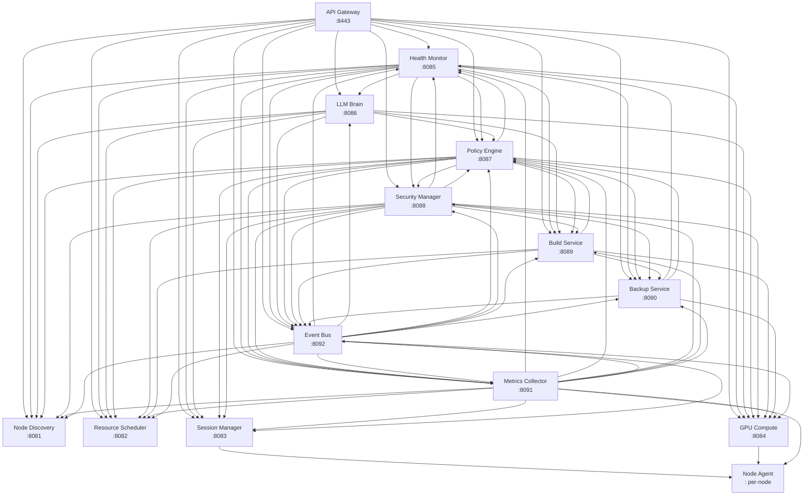

# Chapter 4: Component Specifications

This chapter provides exhaustive technical specifications for every deployable component, data schema, API contract, and interface definition within the Helix Cluster OS. All specifications derive directly from the system architecture [^1^] and the 50-week implementation plan [^2^], and serve as the primary reference for developers during the implementation phases. Each section includes concrete type definitions, wire formats, indexing strategies, and Go interface declarations where applicable.

---

## 4.1 Microservices Catalog

The control plane comprises fourteen distinct services, each owning a single bounded context. The following table enumerates every service with its runtime identity, language, port assignment, purpose statement, and upstream dependencies.

| # | Service | Language | Port | Purpose | Dependencies |
|---|---------|----------|------|---------|-------------|
| 1 | **API Gateway** | Go (Gin Gonic) | 8443 | Unified ingress for REST, gRPC-Gateway, and WebSocket upgrades; mTLS termination; rate limiting; OPA policy enforcement | All downstream services |
| 2 | **Node Discovery** | Go | 8081 | SWIM gossip protocol, phi-accrual failure detection, node lifecycle state machine (JOINING → ACTIVE → SUSPECT → FAILED), bootstrap rendezvous | etcd |
| 3 | **Resource Scheduler** | Go | 8082 | Omega-model shared-state scheduling with 12 extension points; HTCondor ClassAds matching; optimistic concurrency via etcd revisions | etcd, Node Discovery |
| 4 | **Session Manager** | Go | 8083 | Distributed session orchestration; backend-agnostic pane placement; CRIU/DMTCP migration coordination; CRDT state synchronization | etcd, Scheduler, Node Agent |
| 5 | **GPU Compute** | Go + C/CUDA/HIP | 8084 | Vendor-agnostic GPU abstraction; DRA-compatible device plugin; MPS/time-slice sharing; HAMi-style interception | Scheduler, Node Agent |
| 6 | **Health Monitor** | Go + Python (LSTM) | 8085 | eBPF probe ingestion; Prometheus TSDB aggregation; LSTM failure prediction; anomaly detection; self-healing action dispatch | Prometheus, all services |
| 7 | **LLM Brain** | Go | 8086 | RAG-powered advisory engine; chain-of-thought reasoning; constitutional constraint validation; LLMsVerifier mandatory verification | Policy Engine, LLMsVerifier |
| 8 | **Policy Engine** | Go (OPA/WASM) | 8087 | Open Policy Agent evaluation; HelixConstitution rule enforcement; RBAC; auto-approval logic for low-risk advisories | etcd |
| 9 | **Security Manager** | Go | 8088 | WireGuard mesh administration; SPIFFE/SPIRE identity provisioning; mTLS certificate lifecycle; secret rotation via Vault | etcd, WireGuard |
| 10 | **Build Service** | Go | 8089 | Bazel Remote Build Execution (RBE) protocol server; Buildbarn-compatible CAS; distcc/icecream worker pool; AOSP build orchestration | Scheduler, Ceph |
| 11 | **Backup Service** | Go | 8090 | etcd snapshot scheduling; PostgreSQL WAL archival; Ceph RADOS checkpoint streaming; cross-region replication | PostgreSQL, Ceph |
| 12 | **Metrics Collector** | Go | 8091 | Per-node Prometheus scrape endpoint; cgroup /proc parser; GPU metrics aggregation (NVML/rocSM/Level Zero); 15 s resolution | Prometheus TSDB |
| 13 | **Event Bus** | Go | 8092 | Schema-validated event routing; Avro serialization; Kafka producer/consumer management; NATS JetStream stream administration | NATS, Kafka |
| 14 | **Setup Wizard** | BASH + Go | 8093 | Single-command (`curl \| bash`) node onboarding; hardware auto-detection; driver installation; mesh auto-formation; ephemeral lifecycle | — |

### Service Communication Matrix

The following Mermaid diagram illustrates the inter-service call topology. Arrow direction indicates the caller-to-callee relationship.



All inter-service communication traverses the WireGuard mesh (UDP 51820) and uses gRPC over HTTP/2 with mandatory mTLS authenticated via SPIFFE X.509 SVIDs. The API Gateway additionally exposes REST endpoints (HTTP/1.1 and HTTP/2) and WebSocket upgrades for client-facing traffic.

---

## 4.2 Database Schemas

### 4.2.1 PostgreSQL Primary Schema

PostgreSQL 16+ serves as the authoritative store for relational metadata, audit trails, and historical time-series. The schema consists of fifteen tables, fifty-three indexes, and automated triggers for temporal bookkeeping and immutable audit logging. All tables use UUID primary keys (v4) unless otherwise noted.

#### Table 1: `nodes`

The `nodes` table is the persistent shadow of the etcd node registry, optimized for analytical queries and historical reporting.

```sql
CREATE TABLE nodes (
    id              UUID PRIMARY KEY,
    hostname        VARCHAR(255) NOT NULL,
    ip_addresses    INET[] NOT NULL,
    wg_pubkey       TEXT NOT NULL UNIQUE,
    spiffe_id       TEXT NOT NULL UNIQUE,
    status          VARCHAR(20) NOT NULL DEFAULT 'JOINING'
                    CHECK (status IN ('JOINING','ACTIVE','SUSPECT','LEFT','FAILED')),
    role            VARCHAR(20) NOT NULL DEFAULT 'WORKER'
                    CHECK (role IN ('WORKER','CONTROL','HYBRID')),
    cpu_arch        VARCHAR(20) NOT NULL,       -- x86_64, arm64, riscv64
    cpu_cores       INT NOT NULL CHECK (cpu_cores > 0),
    cpu_threads     INT NOT NULL CHECK (cpu_threads >= cpu_cores),
    memory_bytes    BIGINT NOT NULL CHECK (memory_bytes > 0),
    gpu_count       INT NOT NULL DEFAULT 0 CHECK (gpu_count >= 0),
    storage_bytes   BIGINT NOT NULL CHECK (storage_bytes > 0),
    labels          JSONB DEFAULT '{}',
    region          VARCHAR(100),
    version         VARCHAR(50) NOT NULL,
    joined_at       TIMESTAMPTZ NOT NULL DEFAULT NOW(),
    last_seen       TIMESTAMPTZ NOT NULL DEFAULT NOW(),
    left_at         TIMESTAMPTZ,
    created_at      TIMESTAMPTZ NOT NULL DEFAULT NOW(),
    updated_at      TIMESTAMPTZ NOT NULL DEFAULT NOW()
);

CREATE INDEX idx_nodes_status    ON nodes(status) WHERE status IN ('ACTIVE','SUSPECT');
CREATE INDEX idx_nodes_role      ON nodes(role);
CREATE INDEX idx_nodes_region    ON nodes(region);
CREATE INDEX idx_nodes_labels    ON nodes USING GIN(labels);
CREATE INDEX idx_nodes_last_seen ON nodes(last_seen);
```

#### Table 2: `gpu_devices`

Per-GPU device inventory with DRA-compatible attribute storage.

```sql
CREATE TABLE gpu_devices (
    id              UUID PRIMARY KEY,
    node_id         UUID NOT NULL REFERENCES nodes(id) ON DELETE CASCADE,
    vendor          VARCHAR(20) NOT NULL
                    CHECK (vendor IN ('NVIDIA','AMD','INTEL','APPLE')),
    model           VARCHAR(100) NOT NULL,
    driver_version  VARCHAR(50) NOT NULL,
    api             VARCHAR(20) NOT NULL
                    CHECK (api IN ('CUDA','ROCm','oneAPI','Metal','SYCL')),
    api_version     VARCHAR(20) NOT NULL,
    total_memory    BIGINT NOT NULL CHECK (total_memory > 0),
    compute_units   INT NOT NULL CHECK (compute_units > 0),
    features        TEXT[] DEFAULT '{}',          -- e.g., {tensor_cores,ray_tracing}
    attributes      JSONB DEFAULT '{}',            -- DRA attribute bag
    status          VARCHAR(20) NOT NULL DEFAULT 'AVAILABLE'
                    CHECK (status IN ('AVAILABLE','ALLOCATED','UNHEALTHY')),
    allocated_to    UUID REFERENCES sessions(id) ON DELETE SET NULL,
    created_at      TIMESTAMPTZ NOT NULL DEFAULT NOW(),
    updated_at      TIMESTAMPTZ NOT NULL DEFAULT NOW()
);

CREATE INDEX idx_gpu_node    ON gpu_devices(node_id);
CREATE INDEX idx_gpu_status  ON gpu_devices(status) WHERE status = 'AVAILABLE';
CREATE INDEX idx_gpu_vendor  ON gpu_devices(vendor);
CREATE INDEX idx_gpu_allocated ON gpu_devices(allocated_to) WHERE allocated_to IS NOT NULL;
```

#### Table 3: `sessions`

Central session registry tracking lifecycle from CREATING through TERMINATED.

```sql
CREATE TABLE sessions (
    id              UUID PRIMARY KEY,
    name            VARCHAR(255) NOT NULL,
    owner           TEXT NOT NULL,                 -- SPIFFE ID
    status          VARCHAR(20) NOT NULL DEFAULT 'CREATING'
                    CHECK (status IN ('CREATING','RUNNING','MIGRATING','PAUSED','TERMINATED')),
    mode            VARCHAR(20) NOT NULL DEFAULT 'INTERACTIVE'
                    CHECK (mode IN ('INTERACTIVE','BATCH')),
    backend         VARCHAR(20) NOT NULL DEFAULT 'TMUX'
                    CHECK (backend IN ('TMUX','ZELLIJ','SCREEN','NATIVE')),
    backend_id      TEXT,                          -- Backend-specific opaque ID
    node_id         UUID REFERENCES nodes(id),
    cpu_request     INT NOT NULL DEFAULT 1000 CHECK (cpu_request > 0),   -- millicores
    memory_request  BIGINT NOT NULL DEFAULT 1073741824 CHECK (memory_request > 0), -- bytes
    gpu_request     JSONB DEFAULT NULL,            -- Serialized GPURequest
    priority        INT NOT NULL DEFAULT 50 CHECK (priority BETWEEN 0 AND 100),
    labels          JSONB DEFAULT '{}',
    created_at      TIMESTAMPTZ NOT NULL DEFAULT NOW(),
    started_at      TIMESTAMPTZ,
    terminated_at   TIMESTAMPTZ,
    updated_at      TIMESTAMPTZ NOT NULL DEFAULT NOW()
);

CREATE INDEX idx_sessions_owner  ON sessions(owner);
CREATE INDEX idx_sessions_status ON sessions(status) WHERE status IN ('CREATING','RUNNING','MIGRATING');
CREATE INDEX idx_sessions_node   ON sessions(node_id) WHERE node_id IS NOT NULL;
CREATE INDEX idx_sessions_mode   ON sessions(mode);
```

#### Table 4: `session_windows`

Window entities within a session, carrying CRDT state for distributed synchronization.

```sql
CREATE TABLE session_windows (
    id              UUID PRIMARY KEY,
    session_id      UUID NOT NULL REFERENCES sessions(id) ON DELETE CASCADE,
    name            VARCHAR(255) NOT NULL,
    layout          VARCHAR(50) NOT NULL DEFAULT 'tiled'
                    CHECK (layout IN ('tiled','stacked','tabbed','floating')),
    active          BOOLEAN NOT NULL DEFAULT FALSE,
    crdt_state      JSONB DEFAULT NULL,            -- Yjs-style CRDT document state
    created_at      TIMESTAMPTZ NOT NULL DEFAULT NOW()
);

CREATE INDEX idx_windows_session ON session_windows(session_id);
CREATE INDEX idx_windows_active  ON session_windows(session_id, active) WHERE active = TRUE;
```

#### Table 5: `session_panes`

Individual panes within a window. A pane may execute on a different node than its parent session, enabling distributed pane placement.

```sql
CREATE TABLE session_panes (
    id              UUID PRIMARY KEY,
    window_id       UUID NOT NULL REFERENCES session_windows(id) ON DELETE CASCADE,
    node_id         UUID REFERENCES nodes(id),    -- Distributed pane: may differ from session node
    command         TEXT,
    working_dir     TEXT,
    environment     JSONB DEFAULT '{}',
    cpu_limit       INT CHECK (cpu_limit > 0),    -- millicores
    memory_limit    BIGINT CHECK (memory_limit > 0), -- bytes
    gpu_id          UUID REFERENCES gpu_devices(id) ON DELETE SET NULL,
    status          VARCHAR(20) NOT NULL DEFAULT 'CREATING'
                    CHECK (status IN ('CREATING','RUNNING','MIGRATING','STOPPED','CRASHED')),
    crdt_state      JSONB DEFAULT NULL,
    created_at      TIMESTAMPTZ NOT NULL DEFAULT NOW()
);

CREATE INDEX idx_panes_window ON session_panes(window_id);
CREATE INDEX idx_panes_node   ON session_panes(node_id) WHERE node_id IS NOT NULL;
CREATE INDEX idx_panes_gpu    ON session_panes(gpu_id) WHERE gpu_id IS NOT NULL;
```

#### Table 6: `reservations`

Pessimistic resource reservations held by the scheduler until a session binds or the reservation expires.

```sql
CREATE TABLE reservations (
    id              UUID PRIMARY KEY,
    session_id      UUID NOT NULL REFERENCES sessions(id),
    node_id         UUID NOT NULL REFERENCES nodes(id),
    cpu_millicores  INT NOT NULL CHECK (cpu_millicores > 0),
    memory_bytes    BIGINT NOT NULL CHECK (memory_bytes > 0),
    gpu_ids         UUID[] DEFAULT '{}',
    status          VARCHAR(20) NOT NULL DEFAULT 'PENDING'
                    CHECK (status IN ('PENDING','BOUND','EXPIRED','RELEASED')),
    expires_at      TIMESTAMPTZ NOT NULL,
    created_at      TIMESTAMPTZ NOT NULL DEFAULT NOW(),
    updated_at      TIMESTAMPTZ NOT NULL DEFAULT NOW()
);

CREATE INDEX idx_reservations_session ON reservations(session_id);
CREATE INDEX idx_reservations_node    ON reservations(node_id);
CREATE INDEX idx_reservations_status  ON reservations(status) WHERE status IN ('PENDING','BOUND');
CREATE INDEX idx_reservations_expires ON reservations(expires_at) WHERE status = 'PENDING';
```

#### Table 7: `migration_history`

Immutable log of every session migration event, including CRIU/DMTCP/RESTART method metadata.

```sql
CREATE TABLE migration_history (
    id              UUID PRIMARY KEY,
    session_id      UUID NOT NULL REFERENCES sessions(id),
    source_node     UUID NOT NULL REFERENCES nodes(id),
    target_node     UUID NOT NULL REFERENCES nodes(id),
    method          VARCHAR(20) NOT NULL
                    CHECK (method IN ('CRIU','DMTCP','RESTART','LIVE')),
    duration_ms     INT NOT NULL CHECK (duration_ms >= 0),
    data_size_bytes BIGINT CHECK (data_size_bytes >= 0),
    success         BOOLEAN NOT NULL,
    error_message   TEXT,
    created_at      TIMESTAMPTZ NOT NULL DEFAULT NOW()
);

CREATE INDEX idx_migrations_session  ON migration_history(session_id);
CREATE INDEX idx_migrations_source   ON migration_history(source_node);
CREATE INDEX idx_migrations_target   ON migration_history(target_node);
CREATE INDEX idx_migrations_created  ON migration_history(created_at);
```

#### Table 8: `audit_log` (Partitioned)

Immutable, append-only audit trail partitioned by month for retention management.

```sql
CREATE TABLE audit_log (
    id              BIGSERIAL,
    timestamp       TIMESTAMPTZ NOT NULL DEFAULT NOW(),
    event_type      VARCHAR(50) NOT NULL,       -- e.g., NODE_JOINED, SESSION_CREATED
    severity        VARCHAR(10) NOT NULL DEFAULT 'INFO'
                    CHECK (severity IN ('DEBUG','INFO','WARNING','ERROR','CRITICAL')),
    actor           TEXT NOT NULL,              -- SPIFFE ID or 'system'
    resource_type   VARCHAR(50) NOT NULL,       -- table or domain name
    resource_id     TEXT,
    action          VARCHAR(50) NOT NULL,       -- CREATE, UPDATE, DELETE, READ
    details         JSONB DEFAULT '{}',
    source_ip       INET,
    session_id      UUID,
    PRIMARY KEY (id, timestamp)
) PARTITION BY RANGE (timestamp);

-- Monthly partitions generated by cron trigger
CREATE INDEX idx_audit_time     ON audit_log(timestamp);
CREATE INDEX idx_audit_event    ON audit_log(event_type);
CREATE INDEX idx_audit_actor    ON audit_log(actor);
CREATE INDEX idx_audit_resource ON audit_log(resource_type, resource_id);
```

#### Table 9: `users`

Identity shadow synchronized from the OIDC provider, augmented with cluster-specific resource quotas.

```sql
CREATE TABLE users (
    id              UUID PRIMARY KEY,
    spiffe_id       TEXT NOT NULL UNIQUE,
    email           TEXT,
    name            VARCHAR(255),
    role            VARCHAR(20) NOT NULL DEFAULT 'USER'
                    CHECK (role IN ('USER','ADMIN','OPERATOR','READONLY')),
    quota_cpu       INT NOT NULL DEFAULT 8000 CHECK (quota_cpu >= 0),          -- millicores
    quota_memory    BIGINT NOT NULL DEFAULT 17179869184 CHECK (quota_memory >= 0), -- 16 GiB
    quota_gpu       INT NOT NULL DEFAULT 0 CHECK (quota_gpu >= 0),
    labels          JSONB DEFAULT '{}',
    last_login      TIMESTAMPTZ,
    created_at      TIMESTAMPTZ NOT NULL DEFAULT NOW(),
    updated_at      TIMESTAMPTZ NOT NULL DEFAULT NOW()
);

CREATE INDEX idx_users_spiffe ON users(spiffe_id);
CREATE INDEX idx_users_role   ON users(role);
```

#### Table 10: `health_snapshots`

Time-series health scores ingested from the Health Monitor at 15-second intervals.

```sql
CREATE TABLE health_snapshots (
    id              BIGSERIAL PRIMARY KEY,
    node_id         UUID NOT NULL REFERENCES nodes(id) ON DELETE CASCADE,
    overall_score   INT NOT NULL CHECK (overall_score BETWEEN 0 AND 100),
    cpu_score       INT NOT NULL CHECK (cpu_score BETWEEN 0 AND 100),
    memory_score    INT NOT NULL CHECK (memory_score BETWEEN 0 AND 100),
    disk_score      INT NOT NULL CHECK (disk_score BETWEEN 0 AND 100),
    network_score   INT NOT NULL CHECK (network_score BETWEEN 0 AND 100),
    gpu_score       INT NOT NULL CHECK (gpu_score BETWEEN 0 AND 100),
    temperature_score INT NOT NULL CHECK (temperature_score BETWEEN 0 AND 100),
    services_score  INT NOT NULL CHECK (services_score BETWEEN 0 AND 100),
    predictions     JSONB DEFAULT '[]',          -- Array of FailurePrediction
    metrics         JSONB NOT NULL DEFAULT '{}', -- Raw Prometheus metric snapshot
    recorded_at     TIMESTAMPTZ NOT NULL DEFAULT NOW()
);

CREATE INDEX idx_health_node  ON health_snapshots(node_id);
CREATE INDEX idx_health_time  ON health_snapshots(recorded_at);
CREATE INDEX idx_health_score ON health_snapshots(overall_score) WHERE overall_score < 50;
```

#### Table 11: `llm_advisories`

Advisory records generated by the LLM Brain, tracking the full lifecycle from proposal through resolution.

```sql
CREATE TABLE llm_advisories (
    id              UUID PRIMARY KEY,
    type            VARCHAR(20) NOT NULL
                    CHECK (type IN ('MIGRATION','SCALING','CONFIG','ALERT','OPTIMIZATION')),
    description     TEXT NOT NULL,
    rationale       TEXT NOT NULL,               -- Chain-of-thought reasoning
    proposed_action JSONB NOT NULL,
    confidence      FLOAT NOT NULL CHECK (confidence BETWEEN 0.0 AND 1.0),
    risk_level      VARCHAR(10) NOT NULL
                    CHECK (risk_level IN ('LOW','MEDIUM','HIGH','CRITICAL')),
    auto_approve    BOOLEAN NOT NULL DEFAULT FALSE,
    status          VARCHAR(20) NOT NULL DEFAULT 'PENDING'
                    CHECK (status IN ('PENDING','APPROVED','REJECTED','APPLIED','FAILED')),
    applied_by      TEXT,                        -- SPIFFE ID of approving human
    applied_at      TIMESTAMPTZ,
    result          JSONB,                       -- Outcome telemetry
    created_at      TIMESTAMPTZ NOT NULL DEFAULT NOW()
);

CREATE INDEX idx_advisories_status ON llm_advisories(status) WHERE status = 'PENDING';
CREATE INDEX idx_advisories_type   ON llm_advisories(type);
CREATE INDEX idx_advisories_risk   ON llm_advisories(risk_level);
```

#### Table 12: `build_jobs`

Batch-mode build job tracking with RBE protocol integration.

```sql
CREATE TABLE build_jobs (
    id              UUID PRIMARY KEY,
    session_id      UUID REFERENCES sessions(id),
    owner           TEXT NOT NULL,
    status          VARCHAR(20) NOT NULL DEFAULT 'QUEUED'
                    CHECK (status IN ('QUEUED','SCHEDULED','RUNNING','COMPLETED','FAILED','CANCELLED')),
    build_system    VARCHAR(20) NOT NULL
                    CHECK (build_system IN ('BAZEL','AOSP','NINJA','MAKE','CUSTOM')),
    target          TEXT NOT NULL,               -- Build target label
    priority        INT NOT NULL DEFAULT 50 CHECK (priority BETWEEN 0 AND 100),
    parallelism     INT NOT NULL DEFAULT 1,      -- -j factor
    cache_hit_ratio FLOAT DEFAULT 0.0,
    artifacts       JSONB DEFAULT '[]',          -- Output artifact references
    started_at      TIMESTAMPTZ,
    completed_at    TIMESTAMPTZ,
    created_at      TIMESTAMPTZ NOT NULL DEFAULT NOW(),
    updated_at      TIMESTAMPTZ NOT NULL DEFAULT NOW()
);

CREATE INDEX idx_buildjobs_status ON build_jobs(status) WHERE status IN ('QUEUED','SCHEDULED','RUNNING');
CREATE INDEX idx_buildjobs_owner  ON build_jobs(owner);
CREATE INDEX idx_buildjobs_session ON build_jobs(session_id);
```

#### Table 13: `build_artifacts`

Content-addressed build artifact metadata stored in Ceph RADOS.

```sql
CREATE TABLE build_artifacts (
    id              UUID PRIMARY KEY,
    job_id          UUID NOT NULL REFERENCES build_jobs(id) ON DELETE CASCADE,
    name            TEXT NOT NULL,
    sha256          BYTEA NOT NULL,                -- Content hash for CAS dedup
    size_bytes      BIGINT NOT NULL CHECK (size_bytes >= 0),
    ceph_oid        TEXT NOT NULL,                 -- RADOS object identifier
    mime_type       TEXT,
    created_at      TIMESTAMPTZ NOT NULL DEFAULT NOW()
);

CREATE INDEX idx_artifacts_job   ON build_artifacts(job_id);
CREATE INDEX idx_artifacts_sha256 ON build_artifacts(sha256); -- CAS lookup
```

#### Table 14: `network_policies`

WireGuard mesh network policies controlling inter-node traffic segmentation.

```sql
CREATE TABLE network_policies (
    id              UUID PRIMARY KEY,
    name            VARCHAR(255) NOT NULL UNIQUE,
    description     TEXT,
    source_selector JSONB NOT NULL DEFAULT '{}',   -- Label selector for source nodes
    dest_selector   JSONB NOT NULL DEFAULT '{}',   -- Label selector for destination nodes
    allowed_ports   INT[] NOT NULL DEFAULT '{}',
    action          VARCHAR(10) NOT NULL DEFAULT 'ALLOW'
                    CHECK (action IN ('ALLOW','DENY')),
    priority        INT NOT NULL DEFAULT 100,
    enabled         BOOLEAN NOT NULL DEFAULT TRUE,
    created_at      TIMESTAMPTZ NOT NULL DEFAULT NOW(),
    updated_at      TIMESTAMPTZ NOT NULL DEFAULT NOW()
);

CREATE INDEX idx_netpol_selector ON network_policies USING GIN(source_selector, dest_selector);
```

#### Table 15: `cluster_config`

Cluster-wide configuration key-value store with versioning and rollback support.

```sql
CREATE TABLE cluster_config (
    id              UUID PRIMARY KEY,
    key             TEXT NOT NULL UNIQUE,
    value           JSONB NOT NULL,
    version         INT NOT NULL DEFAULT 1,
    changed_by      TEXT NOT NULL,
    changed_at      TIMESTAMPTZ NOT NULL DEFAULT NOW(),
    previous_value  JSONB          -- For rollback
);

CREATE INDEX idx_config_key ON cluster_config(key);
```

#### Triggers and Functions

Every table carrying an `updated_at` column receives the following automatic trigger:

```sql
CREATE OR REPLACE FUNCTION helix_update_updated_at_column()
RETURNS TRIGGER AS $$
BEGIN
    NEW.updated_at = NOW();
    RETURN NEW;
END;
$$ LANGUAGE plpgsql;

-- Applied to: nodes, gpu_devices, sessions, reservations, users,
--             health_snapshots, build_jobs, network_policies, cluster_config
CREATE TRIGGER trg_nodes_updated_at
    BEFORE UPDATE ON nodes
    FOR EACH ROW EXECUTE FUNCTION helix_update_updated_at_column();
```

The audit trigger fires on all mutating DML operations, producing immutable audit log entries:

```sql
CREATE OR REPLACE FUNCTION helix_audit_trigger()
RETURNS TRIGGER AS $$
BEGIN
    INSERT INTO audit_log (event_type, severity, actor, resource_type, resource_id, action, details)
    VALUES (
        TG_OP || '_' || TG_TABLE_NAME,
        CASE WHEN TG_OP = 'DELETE' THEN 'WARNING' ELSE 'INFO' END,
        COALESCE(current_setting('app.current_user', true), 'system'),
        TG_TABLE_NAME,
        COALESCE(NEW.id::text, OLD.id::text),
        TG_OP,
        COALESCE(to_jsonb(NEW), '{}'::jsonb) || COALESCE(to_jsonb(OLD), '{}'::jsonb)
    );
    RETURN COALESCE(NEW, OLD);
END;
$$ LANGUAGE plpgsql;
```

### 4.2.2 etcd Key Structure

etcd stores the strongly-consistent cluster state using a hierarchical key namespace. All keys share the `/clusteros` prefix.

```
/clusteros/
├── nodes/
│   ├── {node_id}                         → Node JSON (full node descriptor)
│   ├── {node_id}/status                  → NodeStatus enum (ACTIVE, SUSPECT, FAILED)
│   ├── {node_id}/heartbeat               → RFC3339Nano timestamp (lease-bound)
│   ├── {node_id}/leases/
│   │   ├── cpu                           → Leased millicores
│   │   ├── memory                        → Leased bytes
│   │   └── gpu/{gpu_id}                  → GPU lease record
│   └── {node_id}/capabilities            → Capability[] JSON array
├── sessions/
│   ├── {session_id}                      → Session JSON
│   ├── {session_id}/status               → SessionStatus
│   ├── {session_id}/routing              → I/O routing table (node→pane mapping)
│   ├── {session_id}/checkpoint           → CRIU checkpoint metadata
│   └── {session_id}/windows/{window_id}  → Window JSON (CRDT state inline)
├── scheduler/
│   ├── pool/                             → ResourcePool JSON (optimistic concurrency)
│   ├── pool/revision                     → Monotonic revision counter (uint64)
│   ├── queue/{request_id}                → Pending ResourceRequest
│   ├── reservations/{reservation_id}     → Active Reservation
│   └── bindings/{session_id}             → Session→Node binding record
├── security/
│   ├── spiffe_ids/{spiffe_id}            → Node ID mapping
│   ├── wireguard/
│   │   ├── peers/{node_id}               → WireGuard peer config (pubkey, allowed_ips)
│   │   └── subnets/{subnet_cidr}         → Allocated subnet record
│   └── acl/{policy_id}                   → OPA policy bundle reference
├── config/
│   ├── cluster/                          → Cluster-wide key-value pairs
│   ├── scheduler/                        → Scheduler plugin configuration
│   └── limits/{user_spiffe_id}           → Per-user resource quotas
└── locks/
    ├── scheduler/lease                     → Scheduling mutex (etcd lease)
    ├── migrations/{session_id}             → Per-session migration lock
    └── config/                             → Configuration change lock
```

The Go constants defining these key prefixes:

```go
package etcd

const (
    Prefix              = "/clusteros"
    NodesPrefix         = Prefix + "/nodes"
    SessionsPrefix      = Prefix + "/sessions"
    SchedulerPrefix     = Prefix + "/scheduler"
    SecurityPrefix      = Prefix + "/security"
    ConfigPrefix        = Prefix + "/config"
    LocksPrefix         = Prefix + "/locks"
)

func NodeKey(nodeID string) string           { return NodesPrefix + "/" + nodeID }
func NodeStatusKey(nodeID string) string     { return NodesPrefix + "/" + nodeID + "/status" }
func NodeHeartbeatKey(nodeID string) string  { return NodesPrefix + "/" + nodeID + "/heartbeat" }
func SessionKey(sessionID string) string     { return SessionsPrefix + "/" + sessionID }
func SessionRoutingKey(sessionID string) string { return SessionsPrefix + "/" + sessionID + "/routing" }
func SchedulerPoolKey() string               { return SchedulerPrefix + "/pool" }
func SchedulerQueueKey(reqID string) string  { return SchedulerPrefix + "/queue/" + reqID }
func LockSchedulerKey() string               { return LocksPrefix + "/scheduler/lease" }
)
```

### 4.2.3 Redis Key Structure

Redis Cluster serves as the distributed L2 cache, pub/sub backbone, and rate-limiting store. All keys use the `clusteros:` namespace prefix.

| Key Pattern | Type | TTL | Content |
|---|---|---|---|
| `clusteros:session:{id}:state` | String | 300 s | Session JSON with vector clock (CRDT sync) |
| `clusteros:session:{id}:routing` | Hash | 300 s | Field→node_id mapping for I/O routing |
| `clusteros:session:{id}:windows` | List | 300 s | Ordered window IDs |
| `clusteros:session:{id}:panes` | Hash | 300 s | pane_id→node_id mapping |
| `clusteros:node:{id}:resources` | String | 60 s | ResourceSnapshot JSON (current availability) |
| `clusteros:node:{id}:health` | String | 60 s | Latest HealthScore JSON |
| `clusteros:node:{id}:metrics` | Sorted Set | 300 s | Last 5 min of (score, metric_json) pairs |
| `clusteros:gpu:{id}:status` | String | 30 s | GPU status enum |
| `clusteros:gpu:{id}:metrics` | String | 30 s | Temperature, utilization, memory JSON |
| `clusteros:cache:sessions` | Sorted Set | 60 s | (last_active_ts, session_id) — LRU ordering |
| `clusteros:cache:pool` | String | 15 s | ResourcePool snapshot |
| `clusteros:cache:capabilities` | String | 300 s | Aggregated capability list |
| `clusteros:ratelimit:{user_id}` | Hash | 60 s | Token bucket state (tokens, last_refill_ts) |
| `clusteros:ratelimit:global` | String | 60 s | Global request counter |

Pub/Sub channels:

| Channel | Message Type | Consumers |
|---|---|---|
| `clusteros:events:nodes` | NodeEvent JSON | Session Manager, Scheduler, Health Monitor |
| `clusteros:events:sessions` | SessionEvent JSON | Metrics Collector, LLM Brain |
| `clusteros:events:scheduler` | PoolEvent JSON | Session Manager, Build Service |
| `clusteros:events:alerts` | Alert JSON | Event Bus, LLM Brain, Notification adapters |

---

## 4.3 API Specifications

### 4.3.1 REST API

The API Gateway exposes a versioned REST surface (HTTPS, port 8443) with OpenAPI 3.0 documentation. Authentication is mandatory mTLS with the client SPIFFE ID extracted from the X.509 SVID. The following table summarizes the key endpoint groups.

| Group | Base Path | Endpoints | AuthZ Scope |
|---|---|---|---|
| Nodes | `/v1/nodes` | GET, POST /join, /{id}, /{id}/heartbeat, /{id}/leave, /{id}/resources, /{id}/labels | `node:read`, `node:write` |
| Sessions | `/v1/sessions` | GET, POST, /{id}, /{id}/attach, /{id}/detach, /{id}/terminate, /{id}/migrate | `session:read`, `session:write` |
| Windows | `/v1/sessions/{id}/windows` | GET, POST, /{wid}, /{wid}/panes | `session:write` |
| Resources | `/v1/pool`, `/v1/schedule` | GET /pool, /pool/utilization, POST /schedule, /reserve | `pool:read`, `schedule:write` |
| Health | `/v1/health` | GET, /nodes/{id}, /predict | `health:read` |
| Advisories | `/v1/advisories` | GET, /{id}/approve, /{id}/reject | `advisory:admin` |

#### Example: Session Creation

**Request:**

```bash
curl -X POST https://cp.helix.local:8443/v1/sessions \
  --cacert cluster-ca.crt --cert client.svid.crt --key client.svid.key \
  -H "Content-Type: application/json" \
  -d '{
    "name": "aosp-build-r83",
    "mode": "BATCH",
    "backend": "TMUX",
    "resources": {
      "cpu": 16000,
      "memory": 34359738368,
      "gpu": {"count": 2, "vendor": "NVIDIA", "min_memory": 8589934592, "sharing": "MPS"}
    },
    "command": "m aosp_arm64-eng -j64",
    "working_dir": "/src/aosp",
    "labels": {"project": "aosp", "branch": "main"}
  }'
```

**Response (201 Created):**

```json
{
  "id": "550e8400-e29b-41d4-a716-446655440000",
  "name": "aosp-build-r83",
  "owner": "spiffe://helix.local/user/alice",
  "status": "CREATING",
  "mode": "BATCH",
  "backend": "TMUX",
  "node_id": "7c9e6679-7425-40de-944b-e07fc1f90ae7",
  "resources": {
    "cpu": 16000,
    "memory": 34359738368,
    "gpu": {"allocated": ["gpu-uuid-1", "gpu-uuid-2"]}
  },
  "created_at": "2026-01-15T09:23:47.123Z",
  "started_at": null
}
```

#### Example: Resource Pool Query

**Request:**

```bash
curl https://cp.helix.local:8443/v1/pool/utilization \
  --cacert cluster-ca.crt --cert client.svid.crt --key client.svid.key
```

**Response (200 OK):**

```json
{
  "cpu_percent": 67.4,
  "memory_percent": 82.1,
  "gpu_percent": 45.0,
  "node_count": 8,
  "active_nodes": 7,
  "suspect_nodes": 1,
  "active_sessions": 23,
  "reservations_pending": 3,
  "total_millicores": 128000,
  "available_millicores": 41728,
  "total_memory_bytes": 549755813888,
  "available_memory_bytes": 98283464704
}
```

### 4.3.2 gRPC Services

Internal service-to-service communication uses Protocol Buffers over gRPC (HTTP/2, port 8443). The `.proto` definitions are managed with `buf` and generate Go, Zig, and Python stubs. The following services are defined.

#### NodeService

```protobuf
service NodeService {
  rpc Join(JoinRequest) returns (JoinResponse);
  rpc Heartbeat(HeartbeatRequest) returns (HeartbeatResponse);
  rpc Leave(LeaveRequest) returns (google.protobuf.Empty);
  rpc GetNode(GetNodeRequest) returns (Node);
  rpc ListNodes(ListNodesRequest) returns (stream Node);
  rpc WatchNodes(WatchNodesRequest) returns (stream NodeEvent);
}

message JoinRequest {
  string hostname = 1;
  bytes wireguard_pubkey = 2;
  NodeResources resources = 3;
  repeated Capability capabilities = 4;
  bytes attestation = 5;          // TPM quote or SPIFFE attestation
}

message JoinResponse {
  string node_id = 1;
  bytes cluster_ca_cert = 2;
  repeated PeerInfo peers = 3;
  ClusterConfig config = 4;
}

message HeartbeatRequest {
  string node_id = 1;
  int32 health_score = 2;         // 0-100 composite
  ResourceUsage resource_usage = 3;
  map<string, double> metrics = 4;
}

message NodeEvent {
  enum Type { JOINED = 0; LEFT = 1; FAILED = 2; SUSPECTED = 3; RESOURCES_CHANGED = 4; }
  Type type = 1;
  Node node = 2;
  google.protobuf.Timestamp timestamp = 3;
}
```

#### SessionService

```protobuf
service SessionService {
  rpc CreateSession(CreateSessionRequest) returns (Session);
  rpc AttachSession(AttachSessionRequest) returns (stream IOEvent);
  rpc DetachSession(DetachSessionRequest) returns (google.protobuf.Empty);
  rpc TerminateSession(TerminateSessionRequest) returns (google.protobuf.Empty);
  rpc MigrateSession(MigrateSessionRequest) returns (MigrationStatus);
  rpc GetSession(GetSessionRequest) returns (Session);
  rpc ListSessions(ListSessionsRequest) returns (stream Session);
  rpc SendInput(SendInputRequest) returns (google.protobuf.Empty);
  rpc ResizePty(ResizePtyRequest) returns (google.protobuf.Empty);
}

message CreateSessionRequest {
  string name = 1;
  ExecutionMode mode = 2;         // INTERACTIVE or BATCH
  BackendType backend = 3;        // TMUX, ZELLIJ, SCREEN, NATIVE
  ResourceSpec resources = 4;
  string command = 5;
  string working_dir = 6;
  map<string, string> environment = 7;
  map<string, string> labels = 8;
}

message IOEvent {
  oneof event {
    OutputEvent output = 1;
    InputAck input_ack = 2;
    ResizeEvent resize = 3;
    SessionEvent session = 4;
  }
}

message OutputEvent {
  string pane_id = 1;
  bytes data = 2;                 // Raw PTY output (ANSI sequences)
  google.protobuf.Timestamp timestamp = 3;
}

message SendInputRequest {
  string session_id = 1;
  string pane_id = 2;
  bytes data = 3;                 // Keyboard input
}

message MigrateSessionRequest {
  string session_id = 1;
  string target_node = 2;
  MigrationMethod method = 3;     // CRIU, DMTCP, RESTART
}
```

#### SchedulerService

```protobuf
service SchedulerService {
  rpc Schedule(ScheduleRequest) returns (ScheduleResponse);
  rpc CancelSchedule(CancelScheduleRequest) returns (google.protobuf.Empty);
  rpc GetResourcePool(google.protobuf.Empty) returns (ResourcePool);
  rpc Reserve(ReserveRequest) returns (Reservation);
  rpc ReleaseReservation(ReleaseRequest) returns (google.protobuf.Empty);
  rpc WatchPool(WatchPoolRequest) returns (stream PoolEvent);
}

message ScheduleRequest {
  string session_id = 1;
  int32 priority = 2;             // 0-100, higher = more important
  string requirements = 3;        // ClassAds expression: "TARGET.CPU >= 4000 ..."
  string rank = 4;                // Preference expression: "TARGET.MEMORY * 0.7 + ..."
  ResourceSpec resources = 5;
  ExecutionMode mode = 6;
}

message ScheduleResponse {
  string request_id = 1;
  ScheduleStatus status = 2;      // QUEUED, SCHEDULED, FAILED
  string node_id = 3;             // Populated when SCHEDULED
  string reservation_id = 4;
  int32 estimated_wait_seconds = 5;
}
```

#### HealthService

```protobuf
service HealthService {
  rpc GetClusterHealth(google.protobuf.Empty) returns (ClusterHealth);
  rpc GetNodeHealth(GetNodeHealthRequest) returns (HealthScore);
  rpc StreamHealth(stream HealthReport) returns (stream HealthAdvice);
  rpc PredictFailures(PredictRequest) returns (PredictResponse);
}
```

#### AdvisoryService

```protobuf
service AdvisoryService {
  rpc ListAdvisories(ListAdvisoriesRequest) returns (stream Advisory);
  rpc ApproveAdvisory(ApproveRequest) returns (Advisory);
  rpc RejectAdvisory(RejectRequest) returns (Advisory);
  rpc GetExplanation(ExplanationRequest) returns (Explanation);
}
```

### 4.3.3 WebSocket Streaming Protocols

Real-time bidirectional I/O uses WebSocket (WSS, port 8443, upgraded from HTTPS). The wire format is binary-framed MessagePack for minimal overhead. Three primary stream types are supported.

| Stream | Path | Direction | Payload | Use Case |
|---|---|---|---|---|
| Session I/O | `/ws/sessions/{id}/stream` | Bidirectional | `IOEvent` MessagePack frames | Terminal input/output |
| Node Watch | `/ws/nodes/watch` | Server→Client | `NodeEvent` JSON | Real-time cluster topology |
| Pool Watch | `/ws/pool/watch` | Server→Client | `PoolEvent` JSON | Resource utilization dashboards |

The WebSocket message envelope:

```go
package websocket

// MessageType identifies the payload category.
type MessageType uint8

const (
    MsgTypeOutput      MessageType = 0x01  // PTY output data
    MsgTypeInput       MessageType = 0x02  // Keyboard input
    MsgTypeResize      MessageType = 0x03  // Terminal resize (cols, rows)
    MsgTypeHeartbeat   MessageType = 0x04  // Keep-alive ping/pong
    MsgTypeSessionEvt  MessageType = 0x05  // Session lifecycle event
    MsgTypeError       MessageType = 0xFF  // Error notification
)

// Envelope is the wire-format wrapper for every WebSocket frame.
type Envelope struct {
    Type      MessageType `msgpack:"t"`
    PaneID    string      `msgpack:"p,omitempty"`  // Target pane (empty = session-level)
    Timestamp int64       `msgpack:"ts"`           // Unix nano
    Payload   []byte      `msgpack:"d"`            // Opaque MessagePack payload
}
```

---

## 4.4 Message Schemas

All events crossing service boundaries are schema-validated using Apache Avro. Schema evolution follows the "backward and forward compatible" model: producers may add fields with defaults, consumers must ignore unknown fields.

### 4.4.1 Avro Event Types

#### Node Events (`schemas/node-events.avsc`)

```json
{
  "type": "record",
  "name": "NodeEvent",
  "namespace": "com.helix.clusteros.events",
  "fields": [
    {"name": "event_id", "type": "string"},
    {"name": "event_type", "type": {"type": "enum", "name": "NodeEventType",
      "symbols": ["JOINED", "LEFT", "FAILED", "SUSPECTED", "RESOURCES_CHANGED", "LABELS_CHANGED"]}},
    {"name": "node_id", "type": "string"},
    {"name": "node", "type": ["null", "Node"], "default": null},
    {"name": "previous_status", "type": ["null", "string"], "default": null},
    {"name": "timestamp", "type": "long", "logicalType": "timestamp-millis"},
    {"name": "source_ip", "type": ["null", "string"], "default": null}
  ]
}
```

#### Session Events (`schemas/session-events.avsc`)

```json
{
  "type": "record",
  "name": "SessionEvent",
  "namespace": "com.helix.clusteros.events",
  "fields": [
    {"name": "event_id", "type": "string"},
    {"name": "event_type", "type": {"type": "enum", "name": "SessionEventType",
      "symbols": ["CREATED", "TERMINATED", "MIGRATED", "PAUSED", "RESUMED", "PANE_CREATED", "PANE_CLOSED"]}},
    {"name": "session_id", "type": "string"},
    {"name": "node_id", "type": ["null", "string"], "default": null},
    {"name": "source_node", "type": ["null", "string"], "default": null},
    {"name": "target_node", "type": ["null", "string"], "default": null},
    {"name": "duration_ms", "type": ["null", "long"], "default": null},
    {"name": "timestamp", "type": "long", "logicalType": "timestamp-millis"}
  ]
}
```

#### Scheduler Events (`schemas/scheduler-events.avsc`)

```json
{
  "type": "record",
  "name": "SchedulerEvent",
  "namespace": "com.helix.clusteros.events",
  "fields": [
    {"name": "event_id", "type": "string"},
    {"name": "event_type", "type": {"type": "enum", "name": "SchedulerEventType",
      "symbols": ["JOB_SCHEDULED", "JOB_PREEMPTED", "RESOURCES_RESERVED", "BINDING_CHANGED", "QUEUE_DEPTH_CHANGED"]}},
    {"name": "request_id", "type": "string"},
    {"name": "session_id", "type": "string"},
    {"name": "node_id", "type": ["null", "string"], "default": null},
    {"name": "resources", "type": ["null", "ResourceSpec"], "default": null},
    {"name": "timestamp", "type": "long", "logicalType": "timestamp-millis"}
  ]
}
```

#### Audit Events (`schemas/audit-events.avsc`)

```json
{
  "type": "record",
  "name": "AuditEvent",
  "namespace": "com.helix.clusteros.events",
  "fields": [
    {"name": "event_id", "type": "string"},
    {"name": "timestamp", "type": "long", "logicalType": "timestamp-millis"},
    {"name": "actor", "type": "string"},
    {"name": "action", "type": "string"},
    {"name": "resource_type", "type": "string"},
    {"name": "resource_id", "type": ["null", "string"], "default": null},
    {"name": "details", "type": {"type": "map", "values": "string"}, "default": {}},
    {"name": "severity", "type": {"type": "enum", "name": "Severity",
      "symbols": ["DEBUG", "INFO", "WARNING", "ERROR", "CRITICAL"]}, "default": "INFO"}
  ]
}
```

### 4.4.2 Kafka Topics

Apache Kafka 4.0 (KRaft mode, no ZooKeeper) hosts the durable event log. Topics are created with the following configuration.

| Topic | Partitions | Replication | Retention | Compression | Purpose |
|---|---|---|---|---|---|
| `helix.audit.events` | 12 | 3 | 90 days | zstd | Immutable audit trail |
| `helix.node.events` | 6 | 3 | 7 days | lz4 | Node lifecycle events |
| `helix.session.events` | 12 | 3 | 7 days | lz4 | Session lifecycle events |
| `helix.scheduler.events` | 6 | 3 | 3 days | lz4 | Scheduling decisions |
| `helix.metrics.raw` | 24 | 3 | 1 day | snappy | Prometheus metric samples |
| `helix.llm.advisories` | 3 | 3 | 30 days | zstd | LLM advisory log |
| `helix.build.events` | 6 | 3 | 14 days | lz4 | Build job lifecycle |

Producer configuration guarantees `acks=all` with idempotent delivery enabled. Consumers use the Kafka Go client (`franz-go`) with automatic consumer-group rebalancing and offset commits every 5 seconds.

### 4.4.3 NATS JetStream Streams

NATS with JetStream provides the low-latency control-plane messaging backbone. Streams are configured as follows.

| Stream | Subjects | Retention | Max Age | Replicas | Purpose |
|---|---|---|---|---|---|
| `HELIX_NODES` | `nodes.>` | Limits (10M msgs) | 7 days | 3 | Node heartbeat + gossip |
| `HELIX_SESSIONS` | `sessions.>` | Limits (5M msgs) | 3 days | 3 | Session I/O routing |
| `HELIX_SCHEDULER` | `scheduler.>` | Limits (5M msgs) | 1 day | 3 | Scheduling queue ops |
| `HELIX_HEALTH` | `health.>` | Limits (50M msgs) | 1 day | 3 | Health reports + predictions |
| `HELIX_ALERTS` | `alerts.>` | Limits (1M msgs) | 30 days | 3 | Alert dispatch + escalation |

Subject naming convention: `{domain}.{entity_id}.{action}`. Example: `nodes.550e8400-e29b-41d4-a716-446655440000.heartbeat`.

---

## 4.5 Network Protocol Stack

### 4.5.1 ZeroMQ Message Patterns

ZeroMQ (via the `zeromq/goczmq` binding) provides high-throughput, low-latency messaging for specific internal data planes. Four patterns are deployed, each matched to a workload characteristic.

| Pattern | Socket Types | Use Case | Reliability |
|---|---|---|---|
| **ROUTER-DEALER** | `ROUTER` ←→ `DEALER` | Task distribution from Scheduler to Node Agents; async replies with correlation IDs | Automatic retry on dealer reconnect |
| **PUB-SUB** | `PUB` → `SUB[]` | Event broadcasting (NodeEvents, metric floods); fire-and-forget | Loss acceptable (metrics are sampled) |
| **PUSH-PULL** | `PUSH` → `PULL[]` | Log aggregation from Node Agents to Event Bus; fair queuing | At-least-once (consumer ack) |
| **REQ-REP** | `REQ` ↔ `REP` | Synchronous health probes and configuration queries | Timeout + retry with exponential backoff |

The ZMTP framing layer uses Curve25519 encryption with ephemeral keys rotated every 24 hours. Message payloads are serialized with Cap'n Proto (see below) for zero-copy deserialization.

### 4.5.2 Serialization: Cap'n Proto and FlatBuffers

Two zero-copy serialization frameworks are used for distinct latency budgets.

#### Cap'n Proto

Cap'n Proto is the default wire format for all internal control-plane messages (NATS payloads, ZeroMQ frames, etcd values). It enables true zero-copy deserialization: the in-memory layout is identical to the wire format, eliminating parse/serialize overhead.

The Go integration uses `capnp` generated structs with the `capnproto.org/go/capnp/v3` runtime. Example schema and usage:

```capnp
# schemas/node.capnp
@0xbf4e1e0f4f7e5c9c;

struct Node {
  id          @0 :Text;
  hostname    @1 :Text;
  status      @2 :NodeStatus;
  role        @3 :NodeRole;
  cpuArch     @4 :Text;
  cpuCores    @5 :UInt16;
  memoryBytes @6 :UInt64;
  gpuCount    @7 :UInt8;
  labels      @8 :List(Label);
  joinedAt    @9 :Int64;  # Unix nanoseconds
}

enum NodeStatus {
  joining @0;
  active  @1;
  suspect @2;
  left    @3;
  failed  @4;
}

struct Label {
  key   @0 :Text;
  value @1 :Text;
}
```

```go
package node

import (
    "context"
    capnp "capnproto.org/go/capnp/v3"
)

// DeserializeNode performs a zero-copy parse of a Cap'n Proto message.
func DeserializeNode(data []byte) (*Node, error) {
    msg, err := capnp.Unmarshal(data)
    if err != nil {
        return nil, err
    }
    root, err := ReadRootNode(msg)
    if err != nil {
        return nil, err
    }
    // root is a direct view into 'data' — no heap allocation for fields
    return &root, nil
}
```

#### FlatBuffers

FlatBuffers is reserved for GPU compute payloads (kernel arguments, tensor descriptors) where C/CUDA interoperability is required. The `flatc` compiler generates C++ headers for the GPU backend and Go structs for the control plane.

```fbs
// schemas/tensor.fbs
namespace Helix.GPU;

enum DataType : byte { FLOAT32 = 0, FLOAT16 = 1, INT32 = 2, INT8 = 3, BFLOAT16 = 4 }

table TensorDesc {
  id:string;
  data_type:DataType;
  dimensions:[ulong];
  strides:[ulong];
  device_id:string;
  memory_offset:ulong;
  total_bytes:ulong;
}

table ComputeTask {
  task_id:string;
  kernel_name:string;
  inputs:[TensorDesc];
  outputs:[TensorDesc];
  workspace_bytes:ulong = 0;
}

root_type ComputeTask;
```

The Go serializer for FlatBuffers reuses a pre-allocated `flatbuffers.Builder` from a `sync.Pool` to eliminate GC pressure on the hot path:

```go
package gpu

import (
    "sync"
    flatbuffers "github.com/google/flatbuffers/go"
)

var builderPool = sync.Pool{
    New: func() interface{} {
        return flatbuffers.NewBuilder(4096)
    },
}

// SerializeComputeTask encodes a ComputeTask into a FlatBuffer,
// reusing pooled builders to minimize allocations.
func SerializeComputeTask(task *ComputeTask) []byte {
    b := builderPool.Get().(*flatbuffers.Builder)
    b.Reset()
    defer builderPool.Put(b)

    offset := task.Pack(b)
    b.Finish(offset)
    // Return a copy — the builder is returned to the pool
    out := make([]byte, len(b.FinishedBytes()))
    copy(out, b.FinishedBytes())
    return out
}
```

---

## 4.6 GPU Backend Interface

The GPU Compute Engine exposes a unified interface abstracting all four GPU vendors (NVIDIA, AMD, Intel, Apple). The design follows the Kubernetes Dynamic Resource Allocation (DRA) pattern with HAMi-style API interception for transparent multi-tenancy.

### 4.6.1 Unified Abstraction

```go
package gpu

import "context"

// GPUVendor identifies the hardware manufacturer.
type GPUVendor uint8

const (
    VendorNVIDIA GPUVendor = iota
    VendorAMD
    VendorIntel
    VendorApple
)

// GPUAPI identifies the compute API exposed by the device.
type GPUAPI uint8

const (
    APICUDA GPUAPI = iota
    APIROCm
    APIOneAPI
    APIMetal
    APISYCL
)

// GPUStatus represents the device lifecycle state.
type GPUStatus uint8

const (
    GPUAvailable GPUStatus = iota
    GPUAllocated
    GPUUnhealthy
)

// GPUSharingMode controls how a device is shared between workloads.
type GPUSharingMode uint8

const (
    ShareExclusive GPUSharingMode = iota   // Full device isolation
    ShareMPS                               // NVIDIA Multi-Process Service
    ShareTimeSlice                         // Temporal multiplexing
    ShareMIG                               // NVIDIA Multi-Instance GPU (A100/H100)
)

// GPUDevice is the canonical descriptor for a GPU in the cluster pool.
type GPUDevice struct {
    ID              string
    NodeID          string
    Vendor          GPUVendor
    Model           string           // e.g., "NVIDIA GeForce RTX 4080"
    DriverVersion   string           // e.g., "550.54.15"
    API             GPUAPI
    APIVersion      string           // e.g., "12.4"
    TotalMemory     int64            // Bytes
    AvailableMemory int64            // Bytes (runtime)
    ComputeUnits    int              // SMs, CUs, Xe-cores, or Apple GPU cores
    Features        map[string]bool  // tensor_cores, ray_tracing, nvenc, etc.
    Attributes      map[string]string // DRA attribute bag
    Status          GPUStatus
    NUMAAffinity    int              // NUMA node for local memory allocation
}

// GPURequest is submitted by the scheduler to allocate GPU resources.
type GPURequest struct {
    Count      int
    Vendor     *GPUVendor        // nil = any vendor
    MinMemory  int64             // Per-GPU minimum bytes
    API        *GPUAPI           // nil = any API
    MinVersion string            // Semantic version constraint, e.g., ">= 12.0"
    Features   []string          // Required capability flags
    Sharing    GPUSharingMode
}
```

### 4.6.2 Backend Interface

```go
package gpu

import "context"

// GPUBackend is implemented by every vendor-specific plugin.
type GPUBackend interface {
    // Discovery enumerates all GPU devices visible to this node.
    DetectDevices(ctx context.Context) ([]GPUDevice, error)

    // GetDeviceStatus returns real-time telemetry for a single device.
    GetDeviceStatus(ctx context.Context, deviceID string) (*GPUDeviceStatus, error)

    // Execute runs a single-device compute task.
    Execute(ctx context.Context, spec ComputeSpec) (*ComputeResult, error)

    // ExecuteDistributed runs a multi-device collective operation.
    ExecuteDistributed(ctx context.Context, spec DistributedComputeSpec) (<-chan ComputeEvent, error)

    // Memory management
    AllocateMemory(ctx context.Context, deviceID string, size int64) (*MemoryAllocation, error)
    FreeMemory(ctx context.Context, alloc *MemoryAllocation) error

    // Sharing control
    EnableMPS(ctx context.Context, deviceID string, fraction float64) error
    DisableMPS(ctx context.Context, deviceID string) error

    // Metrics collection
    GetMetrics(ctx context.Context, deviceID string) (*GPUMetrics, error)
}

// ComputeSpec describes a single-device kernel execution.
type ComputeSpec struct {
    TaskID      string
    KernelName  string
    DeviceID    string
    Inputs      []TensorDesc
    Outputs     []TensorDesc
    WorkspaceBytes int64
    StreamID    string            // For async execution ordering
}

// ComputeResult carries the outcome of a kernel launch.
type ComputeResult struct {
    TaskID      string
    Success     bool
    DurationMs  int64
    OutputSizes []int64
    ErrorMessage string
}

// GPUDeviceStatus provides real-time device telemetry.
type GPUDeviceStatus struct {
    DeviceID        string
    TemperatureC    int
    UtilizationPct  float64          // 0.0 - 100.0
    MemoryUsed      int64
    MemoryFree      int64
    PowerDrawW      float64
    ECCErrorCount   int64
    ProcessCount    int
}

// GPUMetrics is the Prometheus-compatible metric snapshot.
type GPUMetrics struct {
    TemperatureC      float64
    UtilizationGpu    float64
    UtilizationMemory float64
    MemoryUsedBytes   float64
    MemoryTotalBytes  float64
    PowerDrawWatts    float64
    ClocksSmMhz       float64
    ClocksMemoryMhz   float64
    PcieRxBytes       float64
    PcieTxBytes       float64
}
```

### 4.6.3 Vendor-Specific Implementations

| Backend | Package | Language | API Used | Platform |
|---|---|---|---|---|
| `CUDABackend` | `internal/gpu/cuda` | C + Go (cgo) | CUDA Runtime 12.x, NVML, cuBLAS | Linux x86_64 |
| `ROCmBackend` | `internal/gpu/rocm` | C + Go (cgo) | HIP 6.x, rocSM | Linux x86_64 |
| `OneAPIBackend` | `internal/gpu/oneapi` | C + Go (cgo) | Level Zero, SYCL 2020 | Linux x86_64 |
| `MLXBackend` | `internal/gpu/mlx` | C + Go (cgo) | Apple MLX framework | macOS arm64 |
| `SYCLBackend` | `internal/gpu/sycl` | C + Go (cgo) | Intel oneAPI SYCL runtime | Cross-platform |

The backend registry initializes implementations dynamically based on runtime library detection:

```go
package gpu

import (
    "context"
    "plugin"
)

// BackendRegistry holds loaded vendor backends keyed by GPUVendor.
type BackendRegistry struct {
    backends map[GPUVendor]GPUBackend
}

// AutoDetect probes the local system for GPU libraries and registers
// every backend for which the corresponding .so/.dylib is available.
func (r *BackendRegistry) AutoDetect(ctx context.Context) error {
    probes := []struct {
        vendor  GPUVendor
        libPath string
        factory func() GPUBackend
    }{
        {VendorNVIDIA, "libcuda.so.1", newCUDABackend},
        {VendorAMD, "libamdhip64.so", newROCmBackend},
        {VendorIntel, "libze_loader.so", newOneAPIBackend},
        {VendorApple, "libmlx.dylib", newMLXBackend},
    }

    for _, p := range probes {
        if _, err := plugin.Open(p.libPath); err == nil {
            r.backends[p.vendor] = p.factory()
        }
    }
    return nil
}

// BackendFor returns the appropriate backend for a vendor, or ErrNoBackend.
func (r *BackendRegistry) BackendFor(v GPUVendor) (GPUBackend, error) {
    if b, ok := r.backends[v]; ok {
        return b, nil
    }
    return nil, ErrNoBackend{Vendor: v}
}
```

---

## 4.7 Session Backend Interface

The Session Manager abstracts terminal multiplexers (tmux, Zellij, GNU screen) and a custom native PTY backend behind a unified `SessionBackend` interface. This plugin architecture allows the system to leverage battle-tested terminal software while supporting a zero-dependency fallback.

### 4.7.1 Plugin Architecture

```go
package session

import (
    "context"
    "io"
)

// BackendType identifies the session backend implementation.
type BackendType uint8

const (
    BackendTmux   BackendType = iota
    BackendZellij
    BackendScreen
    BackendNative              // Pure Go PTY implementation
)

// SessionConfig carries the parameters for creating a new session.
type SessionConfig struct {
    Name        string
    Owner       string            // SPIFFE ID
    Mode        ExecutionMode     // INTERACTIVE or BATCH
    Command     string            // Initial command (optional)
    WorkingDir  string
    Environment map[string]string
    Resources   ResourceAllocation
    NodeID      string            // Preferred node (empty = scheduler decides)
}

// PTYStream represents a bidirectional byte stream to a pseudo-terminal.
type PTYStream interface {
    io.ReadWriteCloser
    Resize(cols, rows int) error
    SetWindowTitle(title string) error
}

// OutputEvent carries data from a pane's PTY to the client.
type OutputEvent struct {
    PaneID    string
    Data      []byte
    Timestamp int64  // Unix nano
}

// Client identifies an attached client for multiplexed sessions.
type Client struct {
    ID       string   // Client session UUID
    SPIFFEID string
    Terminal string   // TERM value, e.g., "xterm-256color"
    Size     Winsize
}

// Winsize describes terminal dimensions.
type Winsize struct {
    Cols uint16
    Rows uint16
    X    uint16  // Pixel width (optional)
    Y    uint16  // Pixel height (optional)
}

// Checkpoint captures the full serialized state of a session for migration.
type Checkpoint struct {
    ID          string
    SessionID   string
    Method      MigrationMethod   // CRIU, DMTCP, or RESTART
    ImageData   []byte            // CRIU/DMTCP image archive
    Metadata    *CheckpointMetadata
    CreatedAt   int64
}

// CheckpointMetadata records the migration-relevant state.
type CheckpointMetadata struct {
    SourceNode   string
    ProcessCount int
    OpenFiles    []string
    TCPConnections []TCPConnState
    PTYState     map[string][]byte // pane_id → PTY buffer snapshot
}
```

### 4.7.2 SessionBackend Interface

```go
package session

// SessionBackend is the contract implemented by every session backend plugin.
type SessionBackend interface {
    // Lifecycle operations
    Create(ctx context.Context, config SessionConfig) (*Session, error)
    Attach(ctx context.Context, sessionID string, client Client) (PTYStream, error)
    Detach(ctx context.Context, sessionID string, clientID string) error
    Terminate(ctx context.Context, sessionID string) error

    // I/O operations
    SendInput(ctx context.Context, sessionID string, paneID string, data []byte) error
    Resize(ctx context.Context, sessionID string, paneID string, cols, rows int) error
    SubscribeOutput(ctx context.Context, sessionID string) (<-chan OutputEvent, error)

    // Migration operations
    Checkpoint(ctx context.Context, sessionID string, method MigrationMethod) (*Checkpoint, error)
    Restore(ctx context.Context, checkpoint *Checkpoint, targetNode string) (*Session, error)

    // Query operations
    List(ctx context.Context) ([]Session, error)
    Get(ctx context.Context, sessionID string) (*Session, error)
    GetWindows(ctx context.Context, sessionID string) ([]Window, error)
    GetPanes(ctx context.Context, sessionID string, windowID string) ([]Pane, error)

    // Backend metadata
    Type() BackendType
    Version() string            // Backend version for compatibility checks
    Capabilities() BackendCapabilities
}

// BackendCapabilities advertises feature support for scheduler decisions.
type BackendCapabilities struct {
    SupportsMigration    bool
    SupportsDistributed  bool  // Panes on different nodes
    SupportsCRDT         bool  // Native CRDT window sync
    MaxPanesPerWindow    int
    MaxWindowsPerSession int
}
```

### 4.7.3 Backend Implementations

| Backend | Package | Binary Dependency | Migration Method | CRDT Support | Best For |
|---|---|---|---|---|---|
| **tmux** | `internal/session/tmux` | `tmux >= 3.3` | CRIU + tmux-resurrect | Via tmux hooks | Maximum compatibility |
| **Zellij** | `internal/session/zellij` | `zellij >= 0.39` | Native serialization | Built-in CRDT | Distributed panes, collaboration |
| **GNU screen** | `internal/session/screen` | `screen >= 4.09` | DMTCP fallback | None | Legacy environments |
| **Native** | `internal/session/native` | None (pure Go) | CRIU only | Custom CRDT implementation | Minimal-dependency deployments |

### 4.7.4 Backend Factory and Selection

```go
package session

import (
    "context"
    "fmt"
    "sync"
)

// BackendFactory creates SessionBackend instances based on type and node capabilities.
type BackendFactory struct {
    mu       sync.RWMutex
    plugins  map[BackendType]SessionBackend
}

// NewBackendFactory initializes the factory with available backends.
func NewBackendFactory() *BackendFactory {
    bf := &BackendFactory{plugins: make(map[BackendType]SessionBackend)}

    // Probe for tmux
    if path, err := exec.LookPath("tmux"); err == nil {
        bf.plugins[BackendTmux] = NewTmuxBackend(path)
    }
    // Probe for Zellij
    if path, err := exec.LookPath("zellij"); err == nil {
        bf.plugins[BackendZellij] = NewZellijBackend(path)
    }
    // Probe for screen
    if path, err := exec.LookPath("screen"); err == nil {
        bf.plugins[BackendScreen] = NewScreenBackend(path)
    }
    // Native is always available as fallback
    bf.plugins[BackendNative] = NewNativeBackend()

    return bf
}

// Select chooses the best backend given user preference and node capabilities.
// Preference order: user request → node default → most capable available.
func (bf *BackendFactory) Select(
    ctx context.Context,
    preferred BackendType,
    mode ExecutionMode,
    nodeCaps BackendCapabilities,
) (SessionBackend, error) {
    bf.mu.RLock()
    defer bf.mu.RUnlock()

    // 1. Honor explicit user preference if available
    if preferred != BackendNative { // BackendNative = "no preference"
        if b, ok := bf.plugins[preferred]; ok {
            return b, nil
        }
    }

    // 2. For interactive mode with distributed panes, prefer Zellij
    if mode == ModeInteractive && nodeCaps.SupportsDistributed {
        if b, ok := bf.plugins[BackendZellij]; ok {
            return b, nil
        }
    }

    // 3. Prefer tmux for maximum compatibility
    if b, ok := bf.plugins[BackendTmux]; ok {
        return b, nil
    }

    // 4. Fallback chain
    if b, ok := bf.plugins[BackendScreen]; ok {
        return b, nil
    }

    // 5. Native is guaranteed to exist
    return bf.plugins[BackendNative], nil
}

// All returns every available backend for capability advertisement.
func (bf *BackendFactory) All() []SessionBackend {
    bf.mu.RLock()
    defer bf.mu.RUnlock()
    out := make([]SessionBackend, 0, len(bf.plugins))
    for _, b := range bf.plugins {
        out = append(out, b)
    }
    return out
}
```

### 4.7.5 Migration Orchestration

The migration path varies by backend. The Session Manager abstracts these differences through a uniform `Migrate` operation that delegates to backend-specific checkpoint/restore logic.

```go
package session

import (
    "context"
    "fmt"
    "time"
)

// MigrationMethod identifies the checkpoint/restore technology.
type MigrationMethod uint8

const (
    MethodCRIU    MigrationMethod = iota   // Linux CRIU (full process state)
    MethodDMTCP                            // DMTCP (alternative checkpoint)
    MethodRestart                          // Graceful restart (state loss acceptable)
    MethodLive                             // Zellij native live migration
)

// Migrator coordinates session migration between nodes.
type Migrator struct {
    backends    *BackendFactory
    streamer    *ArrowFlightStreamer   // Zero-copy checkpoint transport
    scheduler   SchedulerClient
}

// Migrate performs a full session migration from source to target node.
func (m *Migrator) Migrate(
    ctx context.Context,
    sessionID string,
    targetNode string,
    method MigrationMethod,
) (*MigrationStatus, error) {
    // 1. Acquire distributed lock
    lock, err := acquireMigrationLock(ctx, sessionID)
    if err != nil {
        return nil, fmt.Errorf("acquire lock: %w", err)
    }
    defer lock.Release()

    // 2. Retrieve current session
    sess, err := m.getSession(ctx, sessionID)
    if err != nil {
        return nil, err
    }

    // 3. Pre-validate target node has capacity
    if err := m.validateTarget(ctx, sess, targetNode); err != nil {
        return nil, err
    }

    // 4. Signal SIGSTOP to freeze session
    if err := m.signalSession(ctx, sessionID, syscall.SIGSTOP); err != nil {
        return nil, fmt.Errorf("freeze session: %w", err)
    }
    freezeStart := time.Now()

    // 5. Backend-specific checkpoint
    backend, err := m.backends.Select(ctx, sess.Backend, sess.Mode, BackendCapabilities{})
    if err != nil {
        m.signalSession(ctx, sessionID, syscall.SIGCONT) // Unfreeze on failure
        return nil, err
    }

    checkpoint, err := backend.Checkpoint(ctx, sessionID, method)
    if err != nil {
        m.signalSession(ctx, sessionID, syscall.SIGCONT)
        return nil, fmt.Errorf("checkpoint: %w", err)
    }

    // 6. Stream checkpoint image via Arrow Flight
    transferStart := time.Now()
    if err := m.streamer.Send(ctx, checkpoint.ImageData, targetNode); err != nil {
        return nil, fmt.Errorf("transfer checkpoint: %w", err)
    }
    transferDuration := time.Since(transferStart)

    // 7. Restore on target node
    restored, err := backend.Restore(ctx, checkpoint, targetNode)
    if err != nil {
        // Attempt rollback: resume on source
        m.signalSession(ctx, sessionID, syscall.SIGCONT)
        return nil, fmt.Errorf("restore: %w", err)
    }

    // 8. Update routing table
    if err := m.updateRouting(ctx, sessionID, targetNode); err != nil {
        return nil, fmt.Errorf("update routing: %w", err)
    }

    // 9. Resume
    if err := m.signalSession(ctx, restored.ID, syscall.SIGCONT); err != nil {
        return nil, fmt.Errorf("resume: %w", err)
    }

    freezeDuration := time.Since(freezeStart)

    // 10. Record migration history
    status := &MigrationStatus{
        MigrationID:      uuid.New().String(),
        SessionID:        sessionID,
        SourceNode:       sess.NodeID,
        TargetNode:       targetNode,
        Method:           method,
        FreezeDurationMs: freezeDuration.Milliseconds(),
        TransferBytes:    int64(len(checkpoint.ImageData)),
        Success:          true,
    }
    m.recordMigration(ctx, status)

    // 11. Notify Event Bus
    m.publishEvent(ctx, &SessionEvent{
        Type:        SessionMigrated,
        SessionID:   sessionID,
        SourceNode:  sess.NodeID,
        TargetNode:  targetNode,
        DurationMs:  freezeDuration.Milliseconds(),
    })

    return status, nil
}
```

---

## References

[^1^]: *Helix Cluster OS — Complete Architecture Blueprint*, Version 1.0, 2026-05-30. Sections 6 (Microservices Specification), 7 (Network Architecture), 8 (Data Architecture), 12 (Database Schemas), 13 (API Specifications).

[^2^]: *Helix Cluster OS — Implementation Plan*, 10,000+ Granular Tasks, 50-Week Roadmap, Version 1.0. Technology stack definitions, Phase 0 protocol definitions, Phase 0 database setup, Phase 2 GPU Compute Engine, Phase 3 Session Manager.
