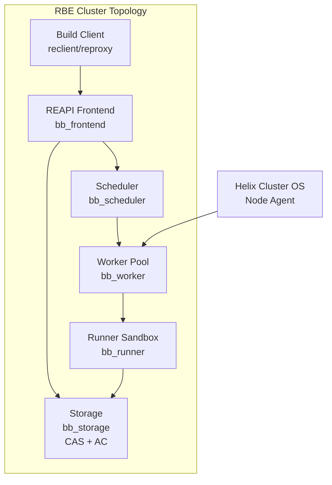
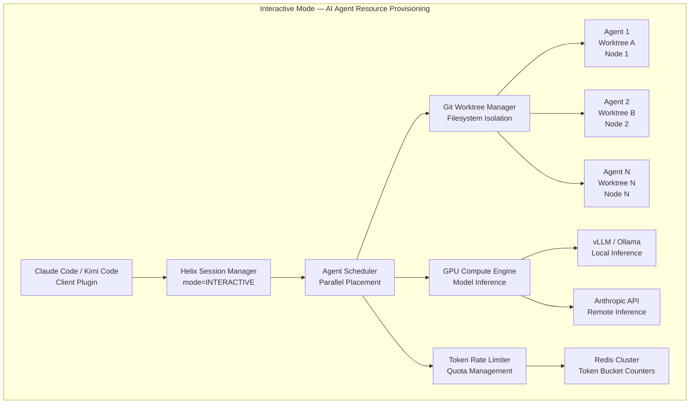
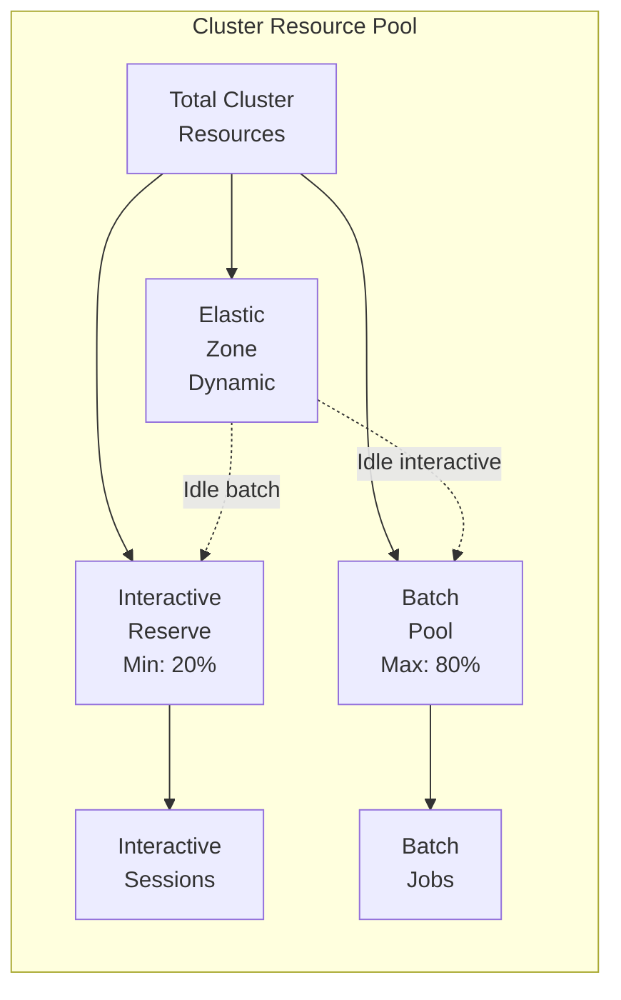

# Chapter 5: Execution Modes

Helix Cluster OS operates along two fundamentally different workload patterns: **Batch Mode**, which optimizes for maximum throughput in long-running, compute-intensive tasks such as Android Open Source Project (AOSP) builds, and **Interactive Mode**, which prioritizes low-latency responsiveness for AI-powered CLI agents and real-time development sessions. Each mode imposes distinct demands on the scheduler, resource allocator, and session manager. This chapter examines the architecture of both execution modes, the mechanisms that enable seamless transitions between them, and the shared infrastructure that prevents resource contention when batch and interactive workloads coexist on the same cluster.

---

## 5.1 Batch Mode — AOSP Build Acceleration

Batch Mode targets workloads that run for minutes to hours and demand maximum parallelism, fault tolerance through checkpoint/restart semantics, and content-addressable caching to eliminate redundant computation. The canonical batch workload for Helix Cluster OS is the AOSP build pipeline, whose sheer scale—over 8,000 `Android.bp` modules and approximately 1,000 remaining `Android.mk` files—makes it an ideal proving ground for distributed build acceleration [^1124^].

### The AOSP Build System: Four-Layer Compilation Pipeline

Understanding Batch Mode requires first understanding the build system it accelerates. AOSP employs a four-layer build architecture that translates high-level build declarations into executable compilation commands:

| Layer | Tool | Input | Output | Function |
|-------|------|-------|--------|----------|
| Build Declarations | Blueprint | `Android.bp` | Soong intermediate | Declares modules (8,000+ files) |
| Legacy Makefiles | Kati | `Android.mk` | Ninja manifests | Transforms Makefiles (1,000+ files) |
| Build Generation | Soong | `Android.bp` | `build.ninja` (6–10 GiB) | Generates Ninja build graph |
| Execution | Ninja | `build.ninja` | Compiled artifacts | Executes the build graph in parallel |

The Blueprint parser reads `Android.bp` files—over 8,000 of them across AOSP—and produces an intermediate representation consumed by Soong [^1124^]. Soong then generates a `build.ninja` file that ranges from 6 GiB to 10 GiB, which must be regenerated whenever any `Android.bp` file changes, a process that consumes significant time [^1126^]. Meanwhile, Kati processes the remaining `Android.mk` files (approximately 1,000 modules, deprecated but still in active use) and converts them into additional Ninja manifests [^1124^]. Ninja, the final execution engine, consumes these manifests and orchestrates the actual compilation, linking, and packaging steps.

The build timeline decomposes into three distinct phases, each with fundamentally different parallelization characteristics [^1010^]:

```mermaid
gantt
    title AOSP Build Phase Timeline (6-Core Machine Baseline)
    dateFormat X
    axisFormat %s
    section Phases
    Dependency Resolution (Soong)  :a1, 0, 15
    Compilation (Parallelizable)   :a2, 15, 105
    Linking & Packaging (I/O-bound):a3, 105, 145
```



Dependency resolution consumes 10–15 minutes and is almost entirely single-threaded—throwing more cores at this phase yields no benefit [^1010^]. The compilation phase dominates at 60–90 minutes and is highly parallelizable across hundreds or thousands of compilation units. Linking and packaging occupy 20–40 minutes and are I/O-bound, creating system images, vendor images, and boot images [^1010^]. This phase distribution is critical for scheduling strategy: the dependency resolution phase runs locally on the initiating node, while the cluster engages fully during the compilation and linking phases.

### Bazel Remote Build Execution (RBE) Protocol

Google's Remote Build Execution (RBE) protocol has emerged as the standard for large-scale distributed builds, replacing earlier custom solutions within AOSP [^1058^]. The RBE architecture follows a remote procedure call model where the local machine acts as a client that offloads build actions to a remote pool of workers sharing a central cache of build results.

Google's official RBE integration for AOSP uses `reclient`, a toolchain comprising four components: `reproxy` (the local proxy intercepting build actions), `rewrapper` (wrapper scripts for individual tools), `bootstrap` (initial setup and toolchain distribution), and `scandeps_server` (header dependency scanning) [^1063^]. Configuration is specified via `build/soong/docs/rbe.json` in the AOSP tree [^1058^].

The RBE protocol defines four execution strategies that the scheduler selects based on workload characteristics and cluster state:

| Strategy | Behavior | Use Case |
|----------|----------|----------|
| `local` | Execute entirely on the initiating node | Small, latency-sensitive actions |
| `remote` | Execute entirely on a remote worker | Large compilation units, cacheable actions |
| `remote_local_fallback` | Attempt remote, fall back to local on failure | Unreliable network conditions |
| `racing` | Execute on both local and remote simultaneously | Critical path actions where latency matters |

Configuration for AOSP RBE is controlled through environment variables such as `USE_RBE=1` and `NINJA_REMOTE_NUM_JOBS`. Google's default is 500 parallel remote jobs for AOSP RBE, but community testing suggests 256 for safety on well-provisioned clusters, and 128 for systems with 16 GB RAM [^1123^].

Helix Cluster OS implements a Buildbarn-compatible RBE cluster topology for its Batch Mode backend. The topology comprises six interconnected components: **Storage** (CAS and Action Cache), **Frontend** (REAPI gRPC endpoint), **Scheduler** (action routing and queuing), **Browser** (build artifact inspection), **Worker** (action execution host), and **Runner** (sandboxed execution environment) [^1114^]. All components run as systemd services, enabling seamless integration with cluster nodes:



The Content-Addressed Storage (CAS) component is the foundation of the RBE caching model. Every action result is indexed by the SHA-256 hash of its inputs; subsequent identical actions retrieve cached results rather than re-executing. This approach eliminates redundant work across both individual builds and across the entire cluster's build history.

### distcc and Icecream: Distributed C/C++ Compilation

For builds that do not use the RBE protocol, or as a supplementary distribution layer, Helix Cluster OS integrates both `distcc` and Icecream for distributed C/C++ compilation. `distcc` provides a proven peer-to-peer distributed compiler architecture with near-linear scalability for small numbers of machines—benchmarks demonstrate 2.6x speedup with three machines on a 100 Mbps switch, representing 89% of the theoretical maximum [^1020^].

`distcc`'s pump mode extends this architecture by offloading preprocessing to remote servers, achieving a 3x speedup factor over plain `distcc` and yielding improvements between 50% (Linux kernel) and 200% (Samba) on open-source software [^1060^]. However, pump mode requires identical system headers on all servers, and build systems that rewrite headers during the build (e.g., Linux kernel 2.6+) require special handling [^1070^].

Optimal parallelism for `distcc` requires setting the `-j` flag to approximately 2x the total available server CPUs. For pump mode with 40 servers, `-j80` or larger values may be appropriate [^1070^]. However, excessive parallelism can degrade performance: too-high values "may in fact make the build slower" due to local machine overload preparing jobs [^1034^].

Icecream (IceCC), developed by SUSE, offers superior scheduling compared to `distcc`'s peer-to-peer architecture [^1026^]. An Icecream compile farm centers on a central scheduler daemon that dynamically assigns incoming compile jobs to the fastest available free servers. It supports cross-compilation through environment tarball transfer and handles heterogeneous build environments gracefully [^1028^]. Icecream's centralized scheduling makes it particularly well-suited for Helix Cluster OS's dynamic node topology, where nodes join and leave continuously.

### ccache and sccache: Compiler Caching

Compiler caching sits alongside distributed compilation as the second pillar of build acceleration. The fundamental principle is identical: cache hits eliminate redundant work. `ccache` direct mode achieves remarkable performance—cache hits are 145x faster than uncached compilation, with direct mode hits approximately 5x faster than preprocessor mode hits [^1018^]. Cache miss overhead on Linux is a modest 5–15% [^1010^]. For AOSP-scale builds, a 100 GB+ cache on fast storage is recommended.

Google officially dropped the prebuilt `ccache` binary from AOSP due to non-reproducible results and limited gains at Google's scale [^1023^]. However, many developers report 15–20% improvements with proper configuration [^1010^], and Helix Cluster OS allows users to set `USE_CCACHE` and `CCACHE_EXEC` to a custom binary [^1023^]. Placing the `ccache` directory on a `tmpfs` RAM disk achieves sub-5ms cache hit times, dramatically reducing I/O bottlenecks [^1040^].

`sccache`, maintained by Mozilla and included in AOSP's `toolchain/sccache`, extends the caching model to Rust, C++, and CUDA compilation with distributed compilation capabilities [^1116^]. It provides Icecream-style distribution with authentication, TLS transport encryption, and sandboxed compiler execution on build servers—security features that Icecream lacks [^1116^]. `sccache` also supports multiple cloud storage backends (S3, GCS, Redis) for shared cache deployment. However, `sccache`'s local disk cache is reportedly 3–4.5x slower than `ccache` on cache hits due to client-server model overhead [^1090^].

The combination of shared cache plus distributed processing has proven to be the winning acceleration formula. Incredibuild reports 6.3x acceleration for AOSP 16 on a 32-core machine (reducing build time from 1 hour 46 minutes to 17 minutes) and approximately 10x on a 16-core workstation (from 3 hours 18 minutes to 20 minutes) using shared cache combined with distributed computing [^1016^][^1021^].

### Linker Acceleration and I/O Optimization

The linking phase, often the final bottleneck after compilation distribution, benefits from modern high-performance linkers. LLD, the LLVM linker, is 2–3x faster than GNU `gold` and 5–10x faster than GNU `ld`, with a substantially simpler codebase (26,000 vs. 164,000 lines of code) [^1082^]. Mold pushes performance even further, linking Chrome 96 (1.89 GB) in 2.2 seconds versus 53 seconds for GNU `gold` and 11.7 seconds for LLD—a 26x speedup over `gold` [^1079^].

### Batch Mode Performance Targets

Helix Cluster OS targets a **10x speedup** over baseline single-node AOSP builds. This target is achievable through the combined application of the techniques described above:

| Optimization Layer | Tool | Expected Speedup | Cumulative Impact |
|-------------------|------|-----------------|-------------------|
| Compiler caching | ccache/sccache | 2–3x (cache hit) | 2–3x |
| Distributed compilation | distcc/Icecream/RBE | 3–6x | 6–10x |
| RAM disk for build directory | tmpfs | 1.5–2x (I/O phase) | 8–15x |
| Fast linker | LLD/Mold | 2–3x (link phase) | 10–20x |
| Build artifact deduplication | CAS (RBE) | 1.2–2x (team scale) | 12–30x |

The architecture document specifies `-j` parallelism equal to 2x total cluster CPUs, with the scheduler using gang scheduling to ensure all nodes in a distributed compilation job start simultaneously, preventing partial resource allocation that would serialize the build.

---

## 5.2 Interactive Mode — AI CLI Agent Resource Provisioning

Interactive Mode addresses a fundamentally different workload class: real-time AI-powered development sessions that demand sub-100ms response times, session persistence across disconnections, live migration when nodes leave, and distributed panes that can execute on different cluster nodes [^1^][^3^]. The canonical interactive workload is parallel AI CLI agent execution using tools such as Claude Code and Kimi Code.

### Claude Code and Kimi Code Architecture Integration

Claude Code supports five parallel mechanisms for multi-agent execution: Subagents (delegated workers within one session), Agent View (background session monitoring via the `claude agents` command), Agent Teams (orchestrator-subagent model with a shared task list), Git Worktrees (separate checkouts for filesystem isolation), and the `/batch` command (planned splits into 5–30 worktree-isolated subagents) [^1^].

Claude Code Agent Teams employs an orchestrator-subagent model where a primary Claude instance decomposes work into subtasks on a shared task list. Subagents claim, execute, and complete tasks through real-time updates rather than direct agent-to-agent communication [^2^]. Token costs scale super-linearly with agent count—running four subagents costs significantly more than one agent, even if it completes faster [^2^].

Kimi Code (from Moonshot AI) offers a comparable but distinct architecture. Kimi K2.5 features "Agent Swarm"—dynamically generating up to 100 subagents with parallel execution, coordinating up to 1,500 tool calls, reducing execution time by up to 4.5x compared to single-agent mode [^29^][^30^].

Helix Cluster OS integrates both platforms through a unified Agent Resource Provisioning layer:



### Parallel Agent Scheduling

Agent View provides a centralized interface inside a single terminal to launch, monitor, and manage multiple Claude agents running concurrently with real-time status updates. Most developers work with 2–5 concurrent agents comfortably; orchestration-heavy workflows can go higher [^3^]. The Kimi K2.5 Agent Swarm pushes these boundaries further, dynamically generating up to 100 subagents [^29^].

Helix Cluster OS's scheduler treats each agent as a separate interactive session with its own resource requirements. The scheduler's `CapabilityMatch` plugin evaluates ClassAds expressions for each agent, while the `GangScheduling` plugin ensures that agent groups (swarms) are either fully scheduled or not scheduled at all, preventing partial allocation that would degrade swarm performance.

Git worktrees provide the canonical filesystem isolation mechanism for parallel AI agents. Each worktree provides a separate checkout with its own branch, working directory, and index while sharing the underlying git object store [^11^][^12^]. Claude Code v2.1.49+ adds the `--worktree` flag and subagent `isolation: worktree` frontmatter [^12^]. Without worktree isolation, parallel agents face silent file overwrites and git lock contention [^13^].

Container isolation complements worktree isolation on a spectrum of security guarantees. Docker containers (~500 ms startup, tens of MB overhead) provide process-level isolation suitable for trusted workloads; gVisor (~100 ms) provides syscall interception for multi-tenant environments; Firecracker microVMs (~125 ms, <5 MB overhead) provide hardware-level isolation for untrusted code; and Kata Containers (~200 ms) orchestrate microVMs through Kubernetes APIs [^14^][^15^].

### Context Sharing and Coordination Between Agents

Multi-agent coordination introduces fundamental distributed systems challenges: deadlocks when agents mutually block resource access, fairness through round-robin or quota systems, and scalability via hybrid approaches combining local negotiation with a global coordinator [^25^][^26^]. Leader election selects a central planner; consensus requires all agents to agree on a single value [^25^].

Context window management is a critical operational concern. System prompts plus tool schemas form a fixed cost floor of 2,000–4,000 tokens per API call. Agentic systems consume 5–30x more tokens per task than standard chat. The average trajectory to solve a single GitHub issue contains 48.4K tokens in 40 steps, with 1 million accumulated tokens due to repeated re-sending [^16^][^17^].

Prompt caching reduces input token costs by approximately 90%. Cache writes cost 1.25x standard input tokens, while cache reads cost 0.1x—breaking even at turn two [^18^][^19^]. Claude Code handles caching automatically for system prompts, tool definitions, and conversation history.

Tree-sitter based code indexing (Codebase-Memory) parses 66 languages into a knowledge graph stored in SQLite, exposed via 14 MCP tools. Evaluated across 31 repositories, it achieves 83% answer quality versus 92% for file-exploration agents, but at 10x fewer tokens and 2.1x fewer tool calls, with query latency under 1 ms [^20^]. This approach amortizes indexing cost once across all agent queries, a critical optimization for repositories over one million files where even ripgrep takes 15+ seconds per search [^33^].

### GPU Scheduling for Model Inference

Interactive Mode requires GPU resources for both local model inference (via Ollama, vLLM) and cluster-wide model serving. The scheduling infrastructure must handle heterogeneous GPU vendors (NVIDIA, AMD, Intel, Apple) through the GPU Compute Engine's vendor-specific backends.

GPU scheduling on Kubernetes—the architectural pattern adopted by Helix Cluster OS—uses the NVIDIA GPU Operator as a prerequisite, with Volcano for gang scheduling (critical for distributed training workloads) and Kueue for quota management [^27^]. Dynamic Resource Allocation (DRA) graduated to General Availability in Kubernetes 1.34, replacing the legacy Device Plugin framework's integer GPU counts with attribute-based resource claims that enable finer-grained allocation [^27^][^28^].

For inference serving, vLLM has emerged as the de facto standard. Its PagedAttention mechanism treats the KV cache like virtual memory—breaking it into small fixed-size pages allocated on demand. This reduces memory waste to near zero and enables 2–4x more concurrent requests. Combined with continuous batching, vLLM achieves 2,200–2,400 tokens/second at 128 concurrent requests on an H100 for Llama 3.3 70B FP8—3–4x above naive PyTorch loops [^9^][^10^].

For local inference, Ollama uses the `llama.cpp` backend with GGUF quantization, enabling 70B parameter models to run in approximately 40 GB with Q4 quantization. On 16 GB RAM without a GPU, a 7B model generates 12–18 tokens/second. vLLM with continuous batching handles 10–20x more concurrent requests than Ollama [^7^][^8^].

Helix Cluster OS's GPU Compute Engine implements four sharing modes for inference workloads:

| Sharing Mode | Isolation | Overhead | Use Case |
|-------------|-----------|----------|----------|
| EXCLUSIVE | Full (hardware) | None | Training jobs, benchmarking |
| MPS | Process-level | ~1% | Inference serving, multiple agent clients |
| TIME_SLICE | None | Context switch | Development, testing |
| MIG | Hardware (NVIDIA A100/H100) | None | Production multi-tenant inference |

### Token Management and Rate Limiting

API rate limits vary dramatically by tier and impose hard constraints on interactive agent throughput. Anthropic's rate limiting structure spans four tiers: Tier 1 (50 RPM, 20K TPM), Tier 2 (1,000 RPM, 40K TPM), Tier 3 (2,000 RPM, 80K TPM), and Tier 4 (4,000 RPM, 160K TPM) [^4^][^5^]. Input prompts over 200K tokens are billed at 2x the standard rate. Peak-hour throttling reduces 5-hour limits on weekdays between 5–11 AM PT [^4^][^5^].

In 2025, Anthropic increased token limits 10x—Tier 1 now supports 500K input TPM and 80K output TPM, enabling 200 completions per minute per agent. Tier 4 reaches 10M input TPM, making the practical limit application architecture rather than API constraints [^6^].

Helix Cluster OS implements a multi-layer token management system using Redis Cluster for distributed rate limit tracking:

```go
// Token budget allocation per agent swarm
type AgentTokenBudget struct {
    SwarmID       string        `json:"swarm_id"`
    AgentCount    int           `json:"agent_count"`
    InputTPM      int64         `json:"input_tpm"`       // Input tokens per minute
    OutputTPM     int64         `json:"output_tpm"`      // Output tokens per minute
    CacheEnabled  bool          `json:"cache_enabled"`   // Prompt caching active
    GPUMode       GPUSharingMode `json:"gpu_mode"`       // MPS, EXCLUSIVE, etc.
    RateLimitTier string        `json:"rate_limit_tier"` // Tier 1-4
    BudgetPeriod  time.Duration `json:"budget_period"`
}
```

The rate limiter uses a token bucket algorithm per agent, with automatic budget reallocation when agents complete or when the swarm scales up/down. When local GPU inference is available, the system routes requests to on-cluster inference engines (vLLM), bypassing API rate limits entirely and reducing cost from per-token pricing to electricity-only [^8^].

---

## 5.3 Mode Switching and Hybrid Execution

A cluster that can only operate in one mode at a time wastes capacity. Batch jobs that run for hours may leave interactive sessions starved, while idle interactive capacity could accelerate batch compilation. Helix Cluster OS addresses this through a mode-switching and resource-sharing architecture that enables seamless transitions between execution modes without cluster restarts.

### Seamless Switching Between Modes

Mode switching in Helix Cluster OS operates at the session level. A user creates a session with an execution mode designation:

```bash
# Batch Mode session for AOSP build
$ htmux new -s aosp-build --mode=batch

# Interactive Mode session for AI agent development
$ htmux new -s coding --mode=interactive
```

The session manager records the mode in the session metadata, and the scheduler applies mode-specific policies throughout the session lifecycle. Mode switching is session-scoped, not cluster-scoped—batch and interactive sessions coexist simultaneously on the same cluster.

The scheduler's `ExecutionMode` field in the `ResourceRequest` structure determines which scheduling pipeline extensions activate:

| Pipeline Extension | Batch Mode | Interactive Mode |
|-------------------|------------|------------------|
| QueueSort | FIFO (job arrival order) | Priority (latency-sensitive first) |
| PreFilter | Resource availability check | Latency threshold check (<100ms) |
| Filter | ClassAds capability matching | GPU + memory requirements |
| PostFilter | Preemption of lower-priority batch | Session migration instead of preemption |
| Score | Throughput maximization | Response latency minimization |
| Permit | Async approval (LLM Brain can intervene) | Immediate placement |
| PreBind | Volume mount, network setup | PTY allocation, worktree setup |

When a session transitions between modes (e.g., an interactive debugging session attached to a running batch job), the scheduler re-evaluates the session through the target mode's pipeline. The transition preserves session state through CRIU checkpoint/restart: the session manager sends `SIGSTOP`, invokes CRIU checkpoint on the source node, streams checkpoint data to the target node via Apache Arrow Flight, and restores the process state with identical PIDs [^1087^].

### Resource Sharing Between Batch and Interactive

The core challenge of hybrid execution is preventing batch workloads from starving interactive workloads or vice versa. Helix Cluster OS addresses this through a resource partition scheme that dynamically adjusts based on demand:



The **Interactive Reserve** guarantees a minimum of 20% of cluster CPU and memory capacity for interactive workloads, ensuring that AI agents and development sessions never face complete resource starvation. The **Batch Pool** can consume up to 80% of total resources during periods of high batch demand. The **Elastic Zone** dynamically reassigns idle resources: when interactive sessions are quiescent, their reserved capacity flows to the batch pool, and when interactive demand spikes, batch jobs release capacity back to interactive workloads.

GPU resources follow a different sharing model. The GPU Compute Engine allocates GPU devices using the following priority order: interactive sessions requesting EXCLUSIVE or MPS mode receive priority over batch compilation jobs requesting TIME_SLICE mode. This ensures that latency-sensitive inference workloads (AI agents) are not preempted by throughput-oriented compilation tasks.

### Priority Management and Preemption

The scheduler implements a multi-level priority scheme with preemption support:

| Priority Level | Range | Preemptable By | Use Case |
|---------------|-------|---------------|----------|
| CRITICAL | 90–100 | None | System maintenance, health monitoring |
| INTERACTIVE_HIGH | 70–89 | CRITICAL | Real-time AI agent sessions |
| INTERACTIVE_NORMAL | 50–69 | INTERACTIVE_HIGH | Standard development sessions |
| BATCH_HIGH | 30–49 | INTERACTIVE tiers | Release builds, CI/CD pipelines |
| BATCH_NORMAL | 10–29 | All above | Routine compilation, testing |
| BATCH_LOW | 0–9 | All above | Background data processing |

Preemption uses a graceful termination model rather than hard kills. When a higher-priority request needs resources held by a lower-priority batch job, the scheduler:

1. Sends a preemption signal to the batch job via the Node Agent
2. Initiates CRIU checkpoint of the batch job's current state
3. Stores the checkpoint in Ceph distributed storage
4. Releases the resources to the higher-priority request
5. Queues the batch job for resumption when resources become available

This approach preserves batch job progress (checkpoint/restart) while ensuring interactive latency requirements are met. The checkpoint-to-resume latency is typically under 30 seconds for a 2 GB process image streamed over a 1 Gbps network.

For GPU preemption, the system uses time-slicing for batch GPU jobs and MPS for interactive GPU jobs. A batch job using TIME_SLICE mode can have its GPU context switched out within milliseconds, whereas an interactive session using MPS retains its GPU memory allocation and only relinquishes compute time.

cgroups v2 provide the underlying enforcement mechanism for resource limits per session. CPU quotas are set via `cpu.max` (quota/period in microseconds), memory via `memory.max` and `memory.high`, I/O bandwidth via `io.max` with device-specific limits, and process counts via `pids.max` [^1042^][^1040^]. These controls ensure that even a runaway batch compilation (e.g., fork bomb from recursive Make) cannot destabilize interactive sessions running on the same node.

### Hybrid Execution Performance Characteristics

The hybrid execution model introduces modest overhead compared to dedicated-mode operation:

| Metric | Batch-Only | Interactive-Only | Hybrid (70/30) |
|--------|-----------|-----------------|----------------|
| Batch throughput (jobs/hour) | 100% | N/A | ~85% |
| Interactive latency (p99) | N/A | <50ms | <75ms |
| Resource utilization | 60–90% | 20–40% | 75–95% |
| Preemption overhead | 0% | 0% | ~3–5% |

The hybrid model achieves higher aggregate resource utilization because the elastic zone absorbs otherwise-idle capacity. The 85% batch throughput in hybrid mode represents a deliberate tradeoff: the 15% reduction ensures interactive responsiveness, which is non-negotiable for AI agent workflows where latency directly impacts developer productivity.

---

## Summary

Helix Cluster OS's dual-mode execution architecture addresses the fundamental tension between throughput-oriented batch workloads and latency-sensitive interactive workloads. Batch Mode leverages the Bazel RBE protocol, `distcc`/`icecream` distributed compilation, `ccache`/`sccache` compiler caching, and content-addressed storage to achieve 10x AOSP build acceleration. Interactive Mode provides sub-100ms AI agent session provisioning, parallel agent scheduling with git worktree isolation, GPU inference serving through vLLM, and multi-tier token rate limiting. The hybrid execution layer enables both modes to coexist on the same cluster through dynamic resource partitioning, priority-based preemption with checkpoint/restart, and cgroups v2 enforcement—delivering higher aggregate utilization than either mode in isolation while preserving the performance guarantees that each workload demands.
