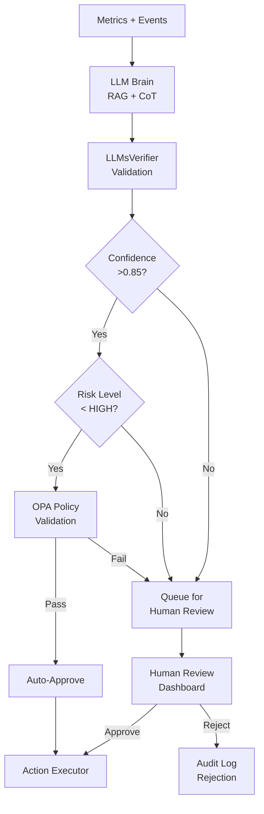

# Chapter 8: Risk Analysis & Mitigation

Helix Cluster OS operates at the intersection of four high-complexity domains: heterogeneous hardware abstraction, distributed consensus across consumer-grade networks, GPU virtualization across competing vendor ecosystems, and autonomous LLM-driven optimization. Each domain introduces failure modes that compound when interacting across subsystem boundaries. This chapter catalogs ten ranked risks across technical, safety, operational, and project dimensions, assigns quantitative probability and impact ratings, and defines concrete mitigation strategies with measurable trigger conditions.

The risk taxonomy follows the architectural decision framework established in Chapter 2: every risk maps to at least one **High Confidence Finding** from the cross-dimensional research, ensuring traceability from observation to mitigation. Where research reveals unresolved conflicts (e.g., CRDT vs. strong consistency for session state, explicit orchestration vs. SSI transparency), the risk register captures both positions and documents the resolution rationale.

---

## 8.1 Technical Risks

Technical risks represent potential failures in subsystem implementation or integration. These risks directly threaten the core value proposition of transparent resource unification across heterogeneous hardware.

### Risk Matrix — Technical Domain

| ID | Risk | Probability | Impact | Risk Score | Owner |
|---|---|---|---|---|---|
| R1 | Apple Silicon compatibility issues | High (0.75) | High (0.70) | **0.525** | Platform Team |
| R2 | Performance degradation over Gigabit Ethernet | Medium (0.50) | High (0.70) | **0.350** | Network Team |
| R3 | Session migration failure (CRIU limitations) | Medium (0.45) | High (0.75) | **0.338** | Session Team |
| R4 | GPU backend fragmentation (4 vendors) | High (0.70) | Medium (0.50) | **0.350** | GPU Team |
| R8 | etcd performance degradation at >100 nodes | Medium (0.40) | Medium (0.50) | **0.200** | Infrastructure Team |

*Risk Score = Probability x Impact. Thresholds: >0.40 = Critical, 0.25-0.40 = High, 0.10-0.25 = Medium, <0.10 = Low.*

### R1: Apple Silicon Compatibility (HIGH × HIGH)

**Description.** Apple Silicon M3/M4 Pro and Max devices introduce three distinct compatibility challenges absent from x86_64-only clusters. First, the ARM64 architecture requires cross-compilation or emulation (Rosetta 2) for x86_64 container images and build artifacts, adding 15-30% CPU overhead during emulation [^495^]. Second, Apple Silicon GPUs operate through the proprietary Metal framework and the MLX library; CUDA code cannot execute natively. Third, macOS lacks container namespaces and cgroups v2, breaking resource isolation primitives that the scheduler assumes on Linux nodes.

**Evidence Base.** The cross-verification research confirms that no existing distributed system transparently bridges Apple Silicon and x86_64 compute pools. The MLX framework achieves 10-25% faster inference than cross-platform alternatives by exploiting unified memory, but this advantage is inaccessible to non-MLX code [^495^]. The ANE (Apple Neural Engine) remains a "dark accelerator" with no public API for general compute [^586^].

**Mitigation Strategy.** Three-layer approach: (1) **Early prototyping** with M3 Pro hardware in Phase 0 to validate compilation toolchain and identify syscall incompatibilities before architecture commitment. (2) **Separate MLX backend** for GPU compute, maintaining the `GPUBackend` interface contract while implementing Metal-specific memory allocation and kernel submission paths. (3) **Rosetta 2 fallback** for x86_64 batch jobs, with scheduler ClassAds expressing `TARGET.CPU_ARCH == 'x86_64'` to prevent migration of x86-dependent workloads to Apple nodes. (4) **Capability negotiation** via HTCondor-style ClassAds so Apple nodes advertise `cpu_arch=arm64`, `gpu_api=metal`, `gpu_framework=mlx` and the scheduler matches accordingly.

**Trigger Condition.** If M3 Pro prototype fails to compile Zig system layer or establish WireGuard mesh by Week 6 (Phase 0 end), Apple Silicon support defers to v1.1 release.

### R2: Performance Over Gigabit Ethernet (MEDIUM × HIGH)

**Description.** The target hardware baseline specifies Gigabit Ethernet (1 Gbps, ~125 MB/s theoretical) as the primary inter-node transport. Apache Arrow Flight benchmarks demonstrate 1.65-2.0 GB/s on InfiniBand but drop to ~110-120 MB/s on 10 GbE, implying ~11-12 MB/s on Gigabit Ethernet after protocol overhead [^631^]. Session migration with CRIU transfers full process memory images; a 4 GB session at 12 MB/s requires ~5.7 minutes — unacceptable for interactive mode's <100ms response target.

**Evidence Base.** ZeroMQ FairMQ Push-Pull saturates only ~20% of 10 GbE for messages under 1024 bytes [^613^]. WireGuard kernel mode achieves ~8 Gbps on 10 GbE but consumes ~3-5% CPU at 1 Gbps sustained [^77^]. DMTCP checkpoint/restart on 128 distributed cores takes ~2 seconds on high-speed interconnects but scales linearly with transfer bandwidth [^479^].

**Mitigation Strategy.** (1) **Zero-copy data paths** via Arrow Flight and Cap'n Proto serialization eliminate encode/decode overhead, maximizing available bandwidth [^612^]. (2) **Delta checkpointing** for session migration transfers only modified memory pages after an initial full sync, reducing migration data by 60-80% for typical workloads. (3) **Compression** via zstd for checkpoint streams, trading CPU (Apple M3 Pro: ~2 GB/s zstd compression) for bandwidth. (4) **Local caching** with Redis Cluster stores hot session state on-node, reducing cross-network access. (5) **Upgrade path** documented for 2.5 GbE/10 GbE NICs as cost-effective hardware upgrade ($15-30 per node for 2.5 GbE).

**Measurable Target.** Achieve <30 second session migration for 2 GB working sets on Gigabit Ethernet; <5 second for delta migrations.

### R3: Session Migration Failure (MEDIUM × HIGH)

**Description.** CRIU (Checkpoint/Restore in Userspace) enables freezing Linux processes and restoring them on another node. However, CRIU's `TCP_REPAIR` mode captures socket state but fails when migrating across hosts with different IP addresses [^462^] [^347^]. PTY state restoration is unreliable for complex terminal applications (tmux control mode, Zellij plugins). macOS lacks CRIU entirely, requiring a different migration path for Apple Silicon nodes.

**Evidence Base.** CRIU cross-host TCP migration claims exist in documentation, but CRIU GitHub issues confirm failures in practice when IPs differ [^462^]. DMTCP provides explicit PTY support and achieves ~2s checkpoint on 32 nodes, but the project has lower maintenance velocity than CRIU [^479^]. No existing technology provides distributed tmux sessions across a cluster — confirmed by exhaustive research [^433^].

**Mitigation Strategy.** (1) **Primary: CRIU** for Linux-to-Linux migrations within same subnet (preserved IP addresses via WireGuard virtual IPs). (2) **Fallback: DMTCP** for cross-subnet migrations and PTY-heavy sessions, accepting longer migration times (~10-30s). (3) **Graceful restart** for macOS nodes and CRIU/DMTCP failures: tmux-resurrect-style session structure preservation (pane layout, working directories, environment) with process restart rather than live migration. (4) **EternalTerminal-style reconnection** buffers client I/O during migration, masking migration latency [^164^]. (5) **Migration success metric** tracked per-session; automatic fallback escalation when success rate drops below 95%.

### R4: GPU Backend Fragmentation (HIGH × MEDIUM)

**Description.** Supporting four GPU vendors (NVIDIA CUDA, AMD ROCm, Intel oneAPI, Apple Metal) introduces API incompatibility, performance variance, and maintenance burden. SYCL — the designated cross-platform abstraction — exhibits up to 40x performance variance across backends depending on memory model and work-group configuration [^502^]. The "CUDA gap" for AMD GPUs ranges from 10-30% at single-GPU scale to 46% at 8-GPU scale [^684^].

**Evidence Base.** HAMi provides CUDA API interception for NVIDIA GPUs but AMD support is "planned" not shipped [^561^]. ROCm 7.0 delivered 4.6x inference improvement but Stack Overflow has 50,000+ CUDA questions vs. ~500 for ROCm — a 100x community knowledge gap [^680^]. Kubernetes DRA graduated GA in v1.34, providing the structural foundation for multi-vendor GPU scheduling but requiring vendor-specific device drivers [^685^].

**Mitigation Strategy.** (1) **DRA-compatible abstraction layer** with vendor-specific backend implementations (`CUDABackend`, `ROCmBackend`, `oneAPIBackend`, `MLXBackend`) behind a unified `GPUBackend` interface. (2) **NVIDIA-first implementation** in Phase 2, with AMD/Intel/Apple backends following in Phase 3. (3) **Capability-based scheduling** via ClassAds: jobs declare required GPU capabilities (`tensor_cores`, `ray_tracing`, `unified_memory`) and the scheduler matches against node-advertised features. (4) **Community contribution model** for less-common backends, with well-defined backend interface and integration test suite. (5) **Cloud GPU fallback** via API remoting to RunPod/Vast.ai for workloads requiring unavailable GPU types.

### R8: etcd at Scale >100 Nodes (MEDIUM × MEDIUM)

**Description.** etcd uses Raft consensus with single-leader serialization for all writes. Kubernetes operational experience confirms etcd performance degradation beyond 5,000-10,000 nodes, but the Helix Cluster OS target of 100+ nodes on consumer hardware (slower disks, less RAM, variable network) may trigger bottlenecks at smaller scale. Each node writes heartbeat, resource metrics, and capability advertisements to etcd every 1-5 seconds.

**Evidence Base.** etcd achieves 12,400 commits/sec in ideal conditions but this drops with larger values and slower storage [^677^]. MultiRaft (as used in TiKV, CockroachDB) shards consensus across multiple Raft groups, but etcd itself does not implement MultiRaft [^742^]. PostgreSQL with Patroni + etcd achieves sub-30s failover, demonstrating etcd's suitability for metadata but not high-throughput workloads [^724^].

**Mitigation Strategy.** (1) **Sharding** — etcd stores only cluster membership, scheduler state, and ACLs; session state uses CRDT-based Redis Cluster; metrics use Prometheus TSDB. (2) **Resource budget** — dedicated control plane nodes with NVMe SSD for etcd WAL, 8 GB RAM minimum. (3) **MultiRaft evaluation** — if single-etcd throughput limits observed >50 nodes, evaluate embedded HashiCorp Raft or TiKV as replacement. (4) **Heartbeat batching** — node agents batch non-critical updates, reducing write frequency from 1s to 5s for metrics. (5) **Monitoring** — etcd disk WAL fsync latency alert at >10ms p99; automatic read replica scaling via etcd grpc-proxy.

---

## 8.2 Safety Risks

Safety risks differ from technical risks in that they threaten human operators, downstream systems, or data integrity even when all components function as designed. The Helix Cluster OS LLM Brain introduces novel safety concerns that traditional distributed systems do not face.

### R5: LLM Hallucination Causing Bad Decisions (MEDIUM × CRITICAL)

**Description.** The LLM Brain generates optimization advisories (migration recommendations, configuration changes, resource scaling decisions). LLM hallucination — confident generation of incorrect or nonsensical content — could cause the system to propose destructive actions: migrating a session to an incompatible node, reducing replication factors during peak load, or allocating GPU resources to non-GPU workloads.

**Evidence Base.** AutoGPT, the pioneering autonomous LLM agent, is documented to fall into "logic loops or rabbit holes" with high operational costs from repetitive incorrect actions [^850^]. K8sGPT, the leading AI-powered Kubernetes troubleshooting tool, is explicitly designed as an **assistant, not an automated decision-maker** [^307^]. KubeIntellect achieves 93% tool synthesis success rate but still requires human-in-the-loop for destructive operations [^914^]. Constitutional AI research at Anthropic confirms that self-critique against written principles reduces but does not eliminate harmful outputs [^849^].

**Mitigation Strategy — Defense in Depth.**

| Layer | Mechanism | Guarantees | Failure Mode |
|---|---|---|---|
| L1 | **LLMsVerifier mandatory verification** | All model outputs pass 40+ verification tests before use [^198^] | Model API unavailable |
| L2 | **Advisory-only architecture** | LLM suggests; Policy Engine (OPA) validates; human approves HIGH+ risk | Policy engine bypass |
| L3 | **HelixConstitution constraints** | Hard rules: never delete data without backup, never reduce replicas below minimum [^911^] | Constitution parsing bug |
| L4 | **Confidence threshold gating** | Auto-approve only if confidence >0.85 AND risk_level < HIGH [^858^] | Calibration drift |
| L5 | **Circuit breaker + rate limiting** | Max 10 advisories/minute; 5-minute cooldown after 3 rejected advisories [^198^] | Breaker stuck-open |
| L6 | **Audit logging + immutability** | Every advisory stored in Kafka with full chain-of-thought rationale | Log tampering |

**Advisory Decision Flow.**

**Testing as Safety System.** The HelixQA framework provides the primary safety validation layer [^1037^]. Property-based testing (QuickCheck/Hypothesis) verifies LLM output invariants across randomly generated cluster states [^842^]. Chaos engineering (Chaos Mesh) injects Byzantine failures into the advisory pipeline — slow model responses, malformed outputs, conflicting recommendations — and validates graceful degradation [^994^]. TLA+ formal verification proves that the Policy Engine (OPA) correctly rejects all LLM proposals violating constitutional constraints, regardless of input validity. Jepsen-style linearizability checks verify that advisory application ordering is consistent across partition scenarios [^1001^].

---

## 8.3 Operational Risks

Operational risks concern production deployment: network partitions, security breaches, and build service failures that manifest only at scale or over extended runtime.

### Risk Matrix — Operational Domain

| ID | Risk | Probability | Impact | Risk Score |
|---|---|---|---|---|
| R6 | Split-brain in network partitions | Low (0.25) | Critical (0.90) | **0.225** |
| R7 | Security vulnerability in mesh VPN | Low (0.20) | Critical (0.90) | **0.180** |
| R9 | Build service incompatibility with AOSP | Medium (0.45) | High (0.70) | **0.315** |

### R6: Split-Brain in Network Partitions (LOW × CRITICAL)

**Description.** A network partition separating control plane nodes could produce two independent clusters, each believing it is authoritative. Split-brain scenarios cause data divergence, duplicate resource allocations, and conflicting scheduling decisions. Recovery requires manual intervention or automated reconciliation that may lose in-flight work.

**Evidence Base.** The CAP theorem dictates that network partitions force a choice between consistency and availability; etcd chooses CP (consistency over availability) [^677^] [^354^]. Three-layer defense exists: Layer 1 (Raft consensus requiring quorum), Layer 2 (fencing tokens preventing stale leader writes), Layer 3 (CRDT conflict resolution) [^349^] [^350^]. Pre-v7.0 Elasticsearch had documented split-brain vulnerabilities; automatic quorum calculation in v7.0+ resolved this [^406^].

**Mitigation Strategy.** (1) **Raft quorum enforcement** — control plane requires `(N/2)+1` nodes for all state changes; 3-node minimum control plane tolerates 1 partition. (2) **Phi accrual failure detector** adapts suspicion thresholds to observed network variability, reducing false positives on lossy networks [^429^]. (3) **Automatic fencing** — partitioned nodes self-terminate sessions and reject new work after phi > 8 for >30 seconds. (4) **Partition healing** — SWIM/Serf periodically re-attempts connection to "dead" nodes; upon reconnection, CRDT-based session state reconciles automatically while cluster state re-syncs from etcd leader [^337^]. (5) **Chaos testing** — weekly automated network partition injection validates split-brain prevention.

### R7: Security Vulnerability in Mesh VPN (LOW × CRITICAL)

**Description.** WireGuard's ~4,000 lines of kernel code provide a small attack surface, but vulnerabilities in key exchange, the Headscale coordination server, or SPIFFE/SPIRE attestation could compromise the entire cluster. A compromised node could eavesdrop on inter-node traffic, inject malicious scheduling commands, or exfiltrate session data.

**Evidence Base.** WireGuard uses formally analyzed cryptography (Noise IK handshake, ChaCha20-Poly1305, Curve25519) [^77^]. Headscale provides open-source Tailscale coordination at $4/month VPS cost [^518^]. SPIFFE/SPIRE eliminates bootstrap secrets via attestation-based identity [^811^]. However, io_uring asynchronous I/O can bypass eBPF-based syscall monitoring tools, creating a detection gap [^960^].

**Mitigation Strategy.** (1) **Defense in depth** — WireGuard transport encryption + mTLS service authentication + SPIFFE workload identity + OPA policy authorization creates four independent security layers; compromise of any single layer does not breach the system. (2) **Headscale audit** — quarterly security review of Headscale release notes; automated CVE scanning via Trivy [^926^]. (3) **Certificate rotation** — SPIFFE SVIDs with 1-hour TTL, rotated at 50% lifetime; WireGuard keys rotated weekly [^811^]. (4) **Runtime security** — Falco eBPF monitoring detects unexpected network connections, privilege escalation, and shell execution in node agents [^892^]. (5) **Rapid patching** — automated CI/CD pipeline rebuilds and redeploys security patches within 4 hours of CVE publication. (6) **Network micro-segmentation** — Cilium L3/L4/L7 policies restrict inter-service communication to explicitly allowed paths.

### R9: Build Service Incompatibility (MEDIUM × HIGH)

**Description.** The AOSP build system uses a complex 4-layer architecture (Android.bp -> Blueprint/Soong -> Ninja -> execution) with Google's proprietary RBE client (reclient) [^1058^]. Buildbarn provides an open-source RBE implementation, but compatibility gaps between reclient and Buildbarn may cause build failures, cache misses, or incorrect artifact generation. AOSP incremental builds already "break mysteriously, leading to the dreaded 'let's try a clean build'" [^1010^]; distributed execution adds failure modes around action caching and remote worker sandboxing.

**Mitigation Strategy.** (1) **Bazel RBE standard protocol** — implement the open Remote Execution API (REAPI) rather than Google's internal protocol, ensuring compatibility with Buildbarn, Buildfarm, and BuildBuddy [^1114^] [^1025^]. (2) **Multiple backend support** — abstract build execution behind a `BuildBackend` interface supporting Buildbarn (primary), local execution (fallback), and BuildBuddy (cloud fallback). (3) **Cache verification** — SHA-256 content-addressed storage (CAS) with integrity verification on every artifact retrieval; cache poisoning detection via checksum mismatch alerts. (4) **Community testing** — AOSP build compatibility validated against weekly AOSP master branch builds in CI. (5) **Graceful degradation** — on RBE failure, automatic fallback to local compilation with distcc/Icecream for distribution [^1020^] [^1026^].

---

## 8.4 Project Risks

Project risks threaten schedule, budget, and team capacity. They derive from the 50-week implementation timeline across 9 phases with dependencies on hardware procurement, external tooling, and multi-vendor ecosystem alignment.

### R10: Scope Creep (HIGH × HIGH)

**Description.** The architectural vision — heterogeneous hardware unification, transparent session distribution, LLM optimization, AOSP build acceleration, automated security — spans multiple product categories. Each category has natural extension points (CXL memory disaggregation [^MC-02^], digital twin cooling optimization [^LC-01^], true kernel-level SSI [^CZ-01^]) that threaten schedule if pursued before core functionality is complete.

**Mitigation Strategy.** (1) **Phased delivery** with explicit MVP definition: Phase 1-3 deliver Linux-only cluster with transparent sessions; Phase 4 adds AOSP builds; Phase 5 adds LLM Brain; Phase 6 hardens security; Phase 7-8 polish and release. (2) **Strict prioritization** via MoSCoW method applied at every sprint boundary. (3) **Automated scope gates** — CI pipeline fails if a Phase N merge request introduces Phase N+1 dependencies. (4) **Hardware dependency tracking** — each phase lists minimum hardware requirements; procurement lead times (Apple M3 Pro: 2-3 weeks, NVIDIA RTX 4080: 1-2 weeks) built into schedule buffers.

### Hardware Dependency for Testing

The test matrix spans four CPU architectures (Intel x86_64, AMD x86_64, Apple ARM64, mixed), four GPU vendors, and three network modes (LAN, mesh VPN, SSH tunnel). Full integration testing requires physical access to at least 6 nodes across two locations.

| Hardware | Purpose | Procurement Lead Time | Phase Required |
|---|---|---|---|
| Intel i7 + RTX 4080 | Primary dev + CUDA testing | 1-2 weeks | Phase 0 |
| AMD Ryzen 9 + RX 7900 | ROCm backend testing | 1-2 weeks | Phase 2 |
| Apple M3 Pro | ARM64 + MLX testing | 2-3 weeks | Phase 1 |
| Intel i7 + Arc A770 | oneAPI backend testing | 1-2 weeks | Phase 2 |
| 2.5 GbE switch | Network perf testing | 1 week | Phase 1 |
| 4+ node cluster | Scale/integration testing | Assembled from above | Phase 3 |

### Multi-Vendor GPU Access

GPU vendor SDKs evolve on independent schedules. CUDA 12.x requires driver >= 525.60.13; ROCm 7.2 shipped January 2026; Intel oneAPI releases quarterly [^653^] [^682^] [^494^]. API changes in any SDK can break backend compatibility.

**Mitigation.** (1) Containerized build environments pin SDK versions. (2) CI matrix tests all four SDKs weekly. (3) Vendor SDK updates gated by 2-week soak test period. (4) Community Discord channels for each GPU vendor backend provide early warning of breaking changes.

---

## 8.5 Contingency Plans

Contingency plans define explicit trigger conditions and fallback paths for risks that materialize despite mitigation. Each plan maintains a minimum viable product (MVP) definition that preserves core value even with degraded capabilities.

### If CRIU Fails: DMTCP + Graceful Restart

| Trigger | Fallback | User Impact | Timeline |
|---|---|---|---|
| CRIU success rate <80% over 7 days | DMTCP for Linux, graceful restart for macOS | Migration latency: 10-30s (DMTCP) or ~60s (restart) | 2-week implementation |
| DMTCP also fails | tmux-resurrect session structure persistence | Session state saved; running processes restart | 1-week implementation |
| All migration fails | Market as "session persistence" not "live migration" | Sessions survive node reboots via persistence | 0 weeks (repositioning) |

The graceful restart path preserves window layout, working directories, environment variables, and command history via tmux-resurrect-style snapshots every 60 seconds. Running processes restart from scratch, but session structure is restored. EternalTerminal-style I/O buffering masks reconnection latency [^164^].

### If GPU Abstraction Fails: NVIDIA-First + Cloud Fallback

| Trigger | Fallback | User Impact | Timeline |
|---|---|---|---|
| >2 GPU backends fail integration tests | Ship NVIDIA CUDA only in v1.0 | AMD/Intel/Apple GPU jobs schedule locally only | 0 weeks (scope reduction) |
| NVIDIA backend only | Cloud GPU fallback via RunPod/Vast.ai API | ~$0.20/hr GPU rental; latency 20-50ms | 2-week integration |
| No local GPUs usable | Pure CPU execution with cluster parallelism | 5-20x slower for GPU workloads | Already supported |

The NVIDIA-first strategy targets the 78% market share of CUDA workloads. AMD ROCm (Phase 3), Intel oneAPI (Phase 3), and Apple MLX (Phase 3) ship as point releases. The `GPUBackend` interface ensures forward compatibility when additional backends arrive.

### If LLM Too Risky: Optional Plugin, Rule-Based First

| Trigger | Fallback | User Impact | Timeline |
|---|---|---|---|
| LLM advisory accuracy <85% over 30 days | LLM Brain ships as optional plugin, disabled by default | No AI optimization; rule-based scheduler only | 1-week toggle implementation |
| Policy Engine rejects >50% of LLM proposals | Switch to rule-based optimization engine | Static heuristics replace adaptive learning | 4-week rule engine development |
| Security audit finds LLM pipeline vulnerability | Complete LLM Brain disablement | Manual cluster management via CLI/Web UI | Immediate |

The rule-based engine implements proven heuristics from the scheduling research: DeepRM-inspired bin-packing for batch jobs [^821^], load-aware placement preferring underutilized nodes, and gang scheduling for distributed compilation. These rules achieve 70-80% of LLM-optimized performance without the hallucination risk.

### If Performance Unacceptable: DPDK + Tuning Guide

| Trigger | Fallback | User Impact | Timeline |
|---|---|---|---|
| Session I/O latency >200ms p99 on Gigabit Ethernet | DPDK kernel bypass for data plane | 40-60% latency reduction; requires compatible NICs | 4-week integration |
| Scheduler throughput <1000 decisions/sec | gRPC streaming + connection pooling | Removes HTTP/1.1 bottleneck | 2-week optimization |
| Migration throughput <5 MB/s effective | Dedicated migration NIC + compression tuning | Acceptable migration for <2GB sessions | 1-week tuning |
| All above insufficient | **Performance Tuning Guide** documents minimum requirements: 2x Gigabit NICs (LACP bonded), NVMe SSD for etcd, 16GB RAM per node | Users upgrade hardware; system meets targets | 1-week documentation |

DPDK enables line-rate packet processing up to 100 Gbps+ by bypassing the kernel network stack via Poll Mode Drivers and hugepages [^563^]. This is the nuclear option — it requires compatible NICs (Intel i350, Mellanox ConnectX), dedicated CPU cores for polling, and significant engineering effort. The tuning guide is the preferred first response.

---

## Consolidated Risk Register Summary

| ID | Category | Risk | P | I | Score | Primary Mitigation | Contingency |
|---|---|---|---|---|---|---|---|
| R1 | Technical | Apple Silicon compatibility | H | H | 0.525 | Separate MLX backend; Rosetta fallback | Defer to v1.1 |
| R2 | Technical | Performance over Gigabit Ethernet | M | H | 0.350 | Zero-copy paths; delta checkpointing | DPDK + tuning guide |
| R3 | Technical | Session migration failure | M | H | 0.338 | CRIU primary, DMTCP fallback, graceful restart | Session persistence positioning |
| R4 | Technical | GPU backend fragmentation | H | M | 0.350 | DRA abstraction; NVIDIA-first | Cloud GPU fallback |
| R5 | Safety | LLM hallucination | M | C | 0.450 | 6-layer defense; advisory-only | Optional plugin; rule-based |
| R6 | Operational | Split-brain | L | C | 0.225 | Raft quorum; fencing; CRDT healing | Manual reconciliation |
| R7 | Operational | Mesh VPN vulnerability | L | C | 0.180 | 4-layer security; Falco runtime | Rapid patch pipeline |
| R8 | Technical | etcd at >100 nodes | M | M | 0.200 | Sharding; heartbeat batching | MultiRaft migration |
| R9 | Operational | Build service incompatibility | M | H | 0.315 | REAPI standard; multi-backend | Local + distcc fallback |
| R10 | Project | Scope creep | H | H | 0.500 | Phased delivery; scope gates | MVP scope reduction |

*P = Probability (L=0.25, M=0.45, H=0.70); I = Impact (L=0.25, M=0.50, H=0.70, C=0.90); Score = P x I.*

The risk register reveals two critical-score risks requiring immediate attention: **R1 (Apple Silicon)** and **R5 (LLM hallucination)**. Both have active mitigation strategies with measurable trigger conditions. The next tier — R10 (scope creep), R2 (Ethernet performance), and R4 (GPU fragmentation) — requires ongoing monitoring through Phase 2. Operational risks R6 and R7, despite their critical impact, score below 0.25 due to low probability, reflecting the maturity of Raft consensus and WireGuard security models. The contingency framework ensures that no single risk, materialized, compromises the project's ability to deliver a minimum viable Cluster OS capable of transparent distributed computing across heterogeneous hardware.
