# Helix Cluster Architecture Diagrams

> **Version:** 2.4.0  
> **Last Updated:** 2026-03-04  
> **Classification:** Internal Engineering Reference  
> **Audience:** Platform Engineers, SRE, Security Architects, DevOps

---

## Table of Contents

1. [System Architecture L0-L7](#1-system-architecture-l0-l7)
2. [Control-Plane Service Communication](#2-control-plane-service-communication)
3. [Workload Placement Request Flow](#3-workload-placement-request-flow)
4. [SWIM Gossip Membership Lifecycle](#4-swim-gossip-membership-lifecycle)
5. [WireGuard Mesh Topology](#5-wireguard-mesh-topology)
6. [Omega Scheduler Architecture](#6-omega-scheduler-architecture)
7. [GPU Management Stack](#7-gpu-management-stack)
8. [Security Architecture](#8-security-architecture)
9. [Session Management](#9-session-management)
10. [Build Service Architecture](#10-build-service-architecture)
11. [Health Monitoring](#11-health-monitoring)
12. [Event/Messaging Architecture](#12-eventmessaging-architecture)
13. [Federation Architecture](#13-federation-architecture)
14. [Consensus Architecture](#14-consensus-architecture)
15. [Testing Architecture](#15-testing-architecture)
16. [Deployment Architecture](#16-deployment-architecture)
17. [Database Schema ER](#17-database-schema-er)
18. [Challenges Integration Lifecycle](#18-challenges-integration-lifecycle)
19. [Anti-Bluff Pipeline](#19-anti-bluff-pipeline)
20. [CI/CD Pipeline](#20-cicd-pipeline)

---

## Introduction

This document provides the definitive architectural reference for the Helix Cluster platform through twenty interconnected Mermaid diagrams. Each diagram captures a distinct architectural facet—from the seven-layer abstraction stack that governs how packages are organized, through the microservice communication mesh that defines runtime behavior, to the CI/CD pipeline that automates delivery. Together, they form a coherent and navigable map of the entire system.

The Helix Cluster is a distributed compute platform designed for heterogeneous workloads spanning CPU-bound microservices, GPU-accelerated machine learning inference, and latency-sensitive interactive sessions. It is built on the principle that a production-grade cluster must provide first-class support for workload placement, identity-driven security, and failure-tolerant membership—all while maintaining sub-second scheduling latency and five-nines availability. The twenty diagrams in this document are not isolated artifacts; they are cross-referenced through Appendix A and designed to be read as a unified specification. Engineers should consult this document when onboarding onto the platform, designing new services, diagnosing production incidents, or planning capacity expansions.

### Reading Conventions

- **Solid arrows** (`-->`) denote synchronous request/response paths or direct dependencies.
- **Dashed arrows** (`-.->`) denote asynchronous events, eventual-consistency flows, or optional paths.
- **Bold labels** on edges indicate the protocol, port, or data format in use.
- **Color-coded subgraphs** group components by domain or failure boundary.
- **L0–L7** refers to the seven abstraction layers of the Helix stack, not the OSI model.
- **Port numbers** (e.g., `:8002`) indicate the default TCP port for the service. In production, these are internal-only and exposed through the API Gateway.
- **Parenthetical technology references** (e.g., `(Rust/Tokio)`) indicate the primary implementation language and runtime for the component.

### Diagram Types Used

| Diagram Type | Mermaid Directive | Purpose | Count in This Document |
|---|---|---|---|
| Architecture | `graph TD` | Component layout, dependencies, data flow | 14 |
| Sequence | `sequenceDiagram` | Temporal message exchange, request tracing | 2 |
| State Machine | `stateDiagram-v2` | Lifecycle states, transitions, guard conditions | 1 |
| Entity-Relationship | `erDiagram` | Data model, foreign keys, cardinality | 1 |
| Class | `classDiagram` | Object hierarchies, interfaces, composition | 0 (future) |

### How to Navigate This Document

Each of the twenty diagrams follows a consistent four-part structure: **Title** (a descriptive name), **Mermaid Diagram** (the renderable code), **Description** (prose explaining the architecture), and **Key Relationships Highlighted** (a bulleted list of the most important connections). The descriptions are written for an engineer who is familiar with distributed systems concepts but new to the Helix platform specifically. Where Helix deviates from industry-standard approaches (e.g., CRDT-based sessions instead of sticky-load-balancer sessions, or deterministic simulation testing instead of purely stochastic chaos engineering), the rationale is explained inline.

For a quick overview, read the Title and Key Relationships of each diagram. For deep understanding, study the Mermaid code alongside the Description. For production operations, refer to Appendix D (Operational Runbooks) which links each runbook to the relevant diagrams.

---

## 1. System Architecture L0-L7

### Title

**Seven-Layer Abstraction Stack with Package Mapping**

### Mermaid Diagram

```mermaid
graph TD
    subgraph L7["L7 — Application Layer"]
        APP_CLI["helix-cli<br/>(Rust Binary)"]
        APP_SDK["helix-sdk<br/>(TypeScript/Python SDKs)"]
        APP_DASH["Dashboard<br/>(React SPA)"]
        APP_APIGW["API Gateway<br/>(Envoy 1.28)"]
    end

    subgraph L6["L6 — Orchestration Layer"]
        ORCH_SCHED["Omega Scheduler<br/>(scheduler-core)"]
        ORCH_WORKLOAD["Workload Controller<br/>(workload-ctrl)"]
        ORCH_SCALE["Autoscaler<br/>(autoscaler-engine)"]
        ORCH_ROLL["Rollout Manager<br/>(rollout-mgr)"]
        ORCH_FED["Federation Controller<br/>(fed-ctrl)"]
    end

    subgraph L5["L5 — Service Mesh Layer"]
        MESH_PROXY["Sidecar Proxy<br/>(Envoy Sidecar)"]
        MESH_CFG["Mesh Config<br/>(mesh-config-server)"]
        MESH_OBS["Mesh Observability<br/>(mesh-obs-collector)"]
        MESH_POLICY["Mesh Policy<br/>(policy-engine)"]
    end

    subgraph L4["L4 — Transport & Security Layer"]
        SEC_WG["WireGuard Mesh<br/>(wg-mesh-daemon)"]
        SEC_SPIFFE["SPIFFE Workload API<br/>(spire-agent)"]
        SEC_JWT["JWT Validation<br/>(jwt-validator)"]
        SEC_RBAC["RBAC Engine<br/>(rbac-engine)"]
        SEC_AUDIT["Audit Logger<br/>(audit-sink)"]
    end

    subgraph L3["L3 — Cluster Membership Layer"]
        MEM_SWIM["SWIM Gossip<br/>(swim-gossip-daemon)"]
        MEM_DISC["Service Discovery<br/>(disc-server)"]
        MEM_TOPO["Topology Manager<br/>(topo-mgr)"]
        MEM_PART["Partition Detector<br/>(partition-detector)"]
        MEM_ZONE["Zone Awareness<br/>(zone-awareness)"]
    end

    subgraph L2["L2 — Resource Management Layer"]
        RES_NODE["Node Agent<br/>(node-agent)"]
        RES_GPU["GPU Manager<br/>(gpu-mgr)"]
        RES_STORAGE["Storage Provider<br/>(storage-provisioner)"]
        RES_NET["Network CNI<br/>(helix-cni)"]
        RES_MEM["Memory Balloon<br/>(mem-balloon)"]
    end

    subgraph L1["L1 — Kernel & Runtime Layer"]
        KRN_LINUX["Linux Kernel 6.1+<br/>(cgroups v2, eBPF)"]
        KRN_CRI["Container Runtime<br/>(containerd 2.0 / CRI-O)"]
        KRN_HYPER["Hypervisor<br/>(Firecracker / Cloud-Hypervisor)"]
        KRN_NVML["NVIDIA Driver<br/>(v535+, NVML)"]
        KRN_DPDK["DPDK / SR-IOV<br/>(userspace networking)"]
    end

    subgraph L0["L0 — Hardware Layer"]
        HW_CPU["x86_64 / ARM64 CPUs"]
        HW_GPU["NVIDIA A100/H100 GPUs"]
        HW_NVME["NVMe SSD Arrays"]
        HW_NIC["100G+ NICs<br/>(Mellanox / Broadcom)"]
        HW_TPM["TPM 2.0 Modules"]
    end

    %% Cross-layer relationships
    APP_CLI --> ORCH_SCHED
    APP_SDK --> ORCH_WORKLOAD
    APP_DASH --> APP_APIGW
    APP_APIGW --> MESH_PROXY

    ORCH_SCHED --> MESH_POLICY
    ORCH_WORKLOAD --> RES_NODE
    ORCH_SCALE --> RES_GPU
    ORCH_ROLL --> MEM_SWIM
    ORCH_FED --> MEM_TOPO

    MESH_PROXY --> SEC_WG
    MESH_CFG --> SEC_SPIFFE
    MESH_OBS --> SEC_AUDIT
    MESH_POLICY --> SEC_RBAC

    SEC_WG --> MEM_SWIM
    SEC_SPIFFE --> MEM_DISC
    SEC_JWT --> MESH_PROXY

    MEM_SWIM --> RES_NODE
    MEM_DISC --> RES_NET
    MEM_TOPO --> RES_STORAGE
    MEM_ZONE --> RES_GPU

    RES_NODE --> KRN_LINUX
    RES_GPU --> KRN_NVML
    RES_STORAGE --> KRN_LINUX
    RES_NET --> KRN_DPDK
    RES_MEM --> KRN_HYPER

    KRN_LINUX --> HW_CPU
    KRN_CRI --> HW_CPU
    KRN_HYPER --> HW_CPU
    KRN_NVML --> HW_GPU
    KRN_DPDK --> HW_NIC

    HW_TPM --> SEC_SPIFFE

    style L7 fill:#e3f2fd,stroke:#1565c0,stroke-width:2px
    style L6 fill:#e8f5e9,stroke:#2e7d32,stroke-width:2px
    style L5 fill:#fff3e0,stroke:#e65100,stroke-width:2px
    style L4 fill:#fce4ec,stroke:#c62828,stroke-width:2px
    style L3 fill:#f3e5f5,stroke:#6a1b9a,stroke-width:2px
    style L2 fill:#e0f2f1,stroke:#00695c,stroke-width:2px
    style L1 fill:#fff9c4,stroke:#f9a825,stroke-width:2px
    style L0 fill:#efebe9,stroke:#4e342e,stroke-width:2px
```

### Description

This diagram presents the Helix Cluster's seven-layer abstraction stack, mapping every package and daemon to its correct layer. The stack begins at L0 (bare hardware with CPUs, GPUs, NVMe, NICs, and TPM modules) and rises through L1 (kernel and runtime with eBPF, containerd, Firecracker, NVML, and DPDK), L2 (resource managers for nodes, GPUs, storage, network, and memory), L3 (cluster membership via SWIM gossip, service discovery, topology awareness, and partition detection), L4 (transport and security encompassing WireGuard mesh, SPIFFE identity, JWT validation, RBAC, and audit), L5 (service mesh with Envoy sidecars, mesh config, observability, and policy), L6 (orchestration with the Omega Scheduler, workload controller, autoscaler, rollout manager, and federation controller), and finally L7 (application-facing components: CLI, SDKs, dashboard, and API gateway).

### Key Relationships Highlighted

- **L7 → L6**: The API Gateway at L7 routes all inbound traffic to the orchestration layer, where the Omega Scheduler and Workload Controller handle placement and lifecycle.
- **L5 → L4**: The service mesh proxy relies on WireGuard for encrypted transport and SPIFFE for workload identity; mesh policy enforces RBAC decisions.
- **L3 → L2**: SWIM gossip membership directly drives node-agent awareness at L2; topology changes at L3 trigger storage and network reconfiguration at L2.
- **L0 → L4**: The TPM 2.0 modules at L0 feed attestation evidence into the SPIFFE identity layer at L4, establishing hardware-rooted trust.
- **GPU path**: `APP_SDK → ORCH_WORKLOAD → RES_GPU → KRN_NVML → HW_GPU` traces the full vertical path from a user's SDK call to physical GPU hardware.

---

## 2. Control-Plane Service Communication

### Title

**Fourteen Microservices with Inter-Service Ports and Protocols**

### Mermaid Diagram

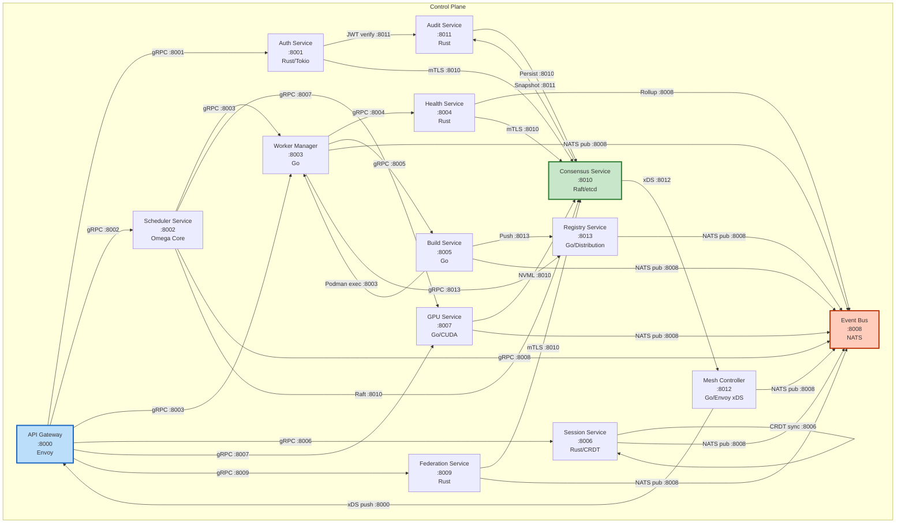

### Description

This diagram details the fourteen control-plane microservices and their communication paths, annotated with port numbers and protocols. The API Gateway (Envoy on port 8000) serves as the single ingress point, routing to Auth (8001), Scheduler (8002), Worker Manager (8003), Session (8006), GPU (8007), and Federation (8009) services over gRPC. The Event Bus (NATS on 8008) acts as the central nervous system—nearly every service publishes domain events to it, enabling loose coupling and eventual consistency. The Consensus Service (Raft/etcd on 8010) is the authoritative state store; Auth, Scheduler, Health, Federation, Audit, and GPU services all interact with it over mTLS-secured Raft channels. The Mesh Controller (8012) receives xDS snapshots from Consensus and pushes Envoy configuration to the API Gateway. The Registry Service (8013) stores container images pushed by the Build Service (8005) and pulled by the Worker Manager (8003).

### Key Relationships Highlighted

- **Hub-and-spoke event pattern**: The Event Bus (NATS :8008) is the hub; all services publish domain events, and interested services subscribe. This decouples producers from consumers.
- **Consensus as the source of truth**: Six services write/read state through the Consensus Service via Raft, ensuring linearizable consistency for critical state (scheduling decisions, GPU reservations, auth tokens, federation membership).
- **Bidirectional Mesh ↔ Gateway**: The Mesh Controller pushes xDS configuration to the API Gateway, while the Gateway reports runtime metrics back through the mesh observability pipeline.
- **CRDT peer sync**: Session Service nodes communicate directly with each other on :8006 using CRDT-based state replication, bypassing both the Event Bus and Consensus for low-latency session migration.

---

## 3. Workload Placement Request Flow

### Title

**End-to-End Sequence from API Request to Pod Running on Node**

### Mermaid Diagram

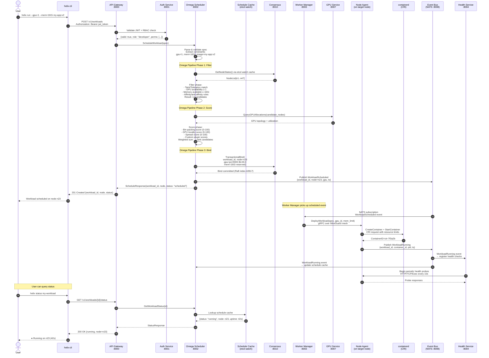

### Description

This sequence diagram traces the complete lifecycle of a workload placement request from the user's CLI command (`helix run --gpu=1 --mem=16Gi my-app:v2`) through scheduling, binding, deployment, and health-check registration. The flow proceeds in four major phases:

1. **Authentication & Authorization** (steps 1–4): The CLI sends the request to the API Gateway, which delegates JWT validation and RBAC checking to the Auth Service.
2. **Scheduling Pipeline** (steps 5–13): The Omega Scheduler executes its three-phase pipeline—Filter (eliminate unsuitable nodes), Score (rank remaining candidates using weighted multi-criteria scoring), and Bind (atomically commit the placement decision through the Consensus Service's Raft log).
3. **Deployment** (steps 14–18): The Worker Manager consumes the `WorkloadScheduled` event from NATS, sends the deployment spec over the WireGuard mesh to the target Node Agent, which creates and starts the container via the CRI (container runtime interface).
4. **Health Registration** (steps 19–21): The `WorkloadRunning` event triggers the Health Service to begin periodic probes, and updates the Scheduler's cache so subsequent status queries return accurate information.

### Key Relationships Highlighted

- **Etcd watch cache as the scheduling data plane**: The Scheduler reads node states from a local cache populated by etcd watches, avoiding direct Consensus reads during the hot path.
- **Transactional bind through Raft**: The Bind phase writes to the Consensus Service atomically, preventing double-scheduling of the same GPU or memory slot even under concurrent schedulers.
- **Event-driven deployment handoff**: The Scheduler does not directly invoke the Worker Manager; instead, it publishes to NATS, and the Worker Manager reacts asynchronously. This decouples scheduling latency from deployment latency.
- **Health probes begin only after `WorkloadRunning`**: The Health Service does not start probing until the container is confirmed running, avoiding false-negative health failures during startup.

---

## 4. SWIM Gossip Membership Lifecycle

### Title

**SWIM Gossip Protocol State Machine with Failure Detection and Dissemination**

### Mermaid Diagram

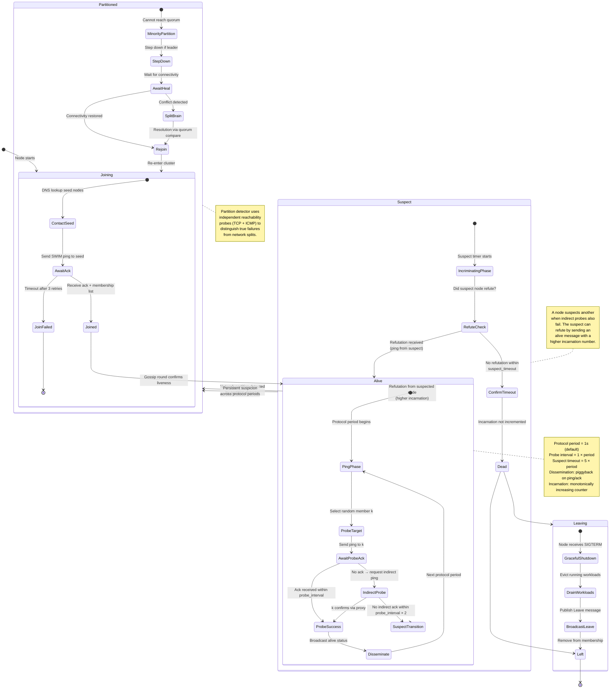

### Description

This state machine diagram captures the full lifecycle of a node in the SWIM (Scalable Weakly-consistent Infection-style Process Group Membership) gossip protocol as implemented by the `swim-gossip-daemon`. The lifecycle begins with a Joining phase where the node contacts seed nodes and awaits membership-list download. Once joined, the node enters the Alive state and begins the ping-probe cycle: each protocol period (default 1 second), a random member is selected for direct ping; if no ack arrives, indirect probing through k other members is attempted. If indirect probing also fails, the target transitions to Suspect. A suspect node can refute the suspicion by broadcasting an alive message with a higher incarnation number. If no refutation arrives within the suspect timeout (5 × protocol period), the node is declared Dead and removed from the membership list. The diagram also includes a Partitioned state for network partitions, where the partition-detector uses independent TCP and ICMP probes to distinguish true node failures from network splits.

### Key Relationships Highlighted

- **Alive ↔ Suspect cycle**: A node can oscillate between Alive and Suspect multiple times before being declared Dead; each refutation increments the incarnation counter, preventing stale suspicions.
- **Suspect → Dead → Left**: Once a node is confirmed Dead, it enters the Leaving phase only if it was the local node (graceful shutdown path); remote dead nodes are simply marked Left.
- **Partitioned → Rejoin**: After a network partition heals, nodes re-enter the Joining phase, ensuring membership state is reconciled through the full seed-contact protocol.
- **Piggyback dissemination**: Status changes (alive, suspect, dead) are piggybacked on regular ping/ack messages rather than sent as separate broadcasts, reducing network overhead.

---

## 5. WireGuard Mesh Topology

### Title

**Encrypted Mesh Network with NAT Traversal and Relay Fallback**

### Mermaid Diagram

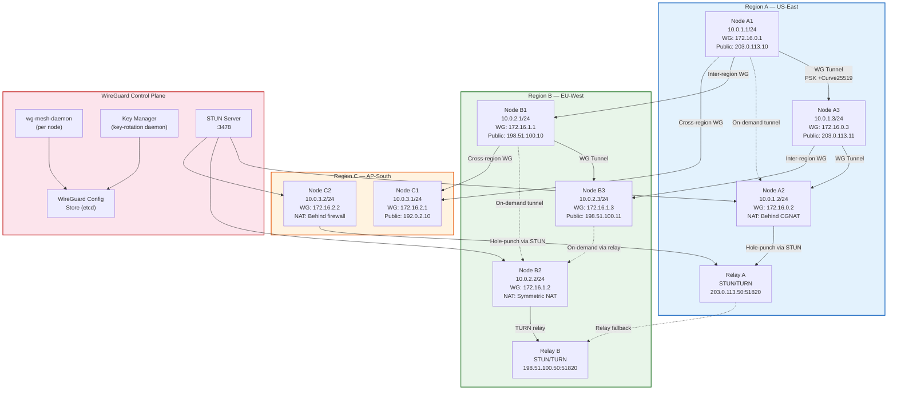

### Description

This network diagram illustrates the WireGuard mesh topology spanning three regions (US-East, EU-West, AP-South). Each node runs the `wg-mesh-daemon` which manages WireGuard interface configuration, peer management, and tunnel establishment. The mesh uses a hub-and-spoke-with-direct-links topology: nodes with public IP addresses establish direct WireGuard tunnels (using PSK + Curve25519 for post-quantum hybrid key exchange), while nodes behind NAT (CGNAT, symmetric NAT, or firewalls) use STUN-based hole punching or TURN relay fallback.

The WireGuard Control Plane comprises three components: the `wg-mesh-daemon` on each node, the configuration store in etcd (which holds peer public keys, allowed-ips, and endpoint addresses), and the key-rotation daemon that periodically rotates pre-shared keys. The STUN server on port 3478 helps NAT-ed nodes discover their external address and establish direct tunnels when possible. When hole punching fails (e.g., symmetric NAT), traffic falls back to the regional TURN relay, which forwards encrypted WireGuard packets without decrypting them.

Inter-region links are established between designated gateway nodes (those with public IPs and sufficient bandwidth). The `wg-mesh-daemon` monitors link quality using periodic latency probes and can dynamically reroute traffic through alternative paths when a direct link degrades.

### Key Relationships Highlighted

- **Direct tunnels between public-IP nodes**: NA1↔NA3, NB1↔NB3, and cross-region links NA1↔NB1, NA1↔NC1 carry the bulk of inter-node traffic with minimal latency.
- **NAT traversal for private-IP nodes**: NA2 (CGNAT) uses STUN hole-punching via Relay A; NB2 (symmetric NAT) falls back to TURN relay B; NC2 (firewall) uses STUN via Relay A.
- **On-demand tunnel establishment**: Dashed lines indicate tunnels that are not permanently established but created when traffic needs to flow, reducing idle connection overhead.
- **Key rotation through etcd**: The key-rotation daemon writes new pre-shared keys to etcd; the `wg-mesh-daemon` watches for changes and applies them without disrupting existing tunnels (WireGuard supports seamless rekeying).

---

## 6. Omega Scheduler Architecture

### Title

**Filter / Score / Bind Pipeline with Plugin Extensions**

### Mermaid Diagram

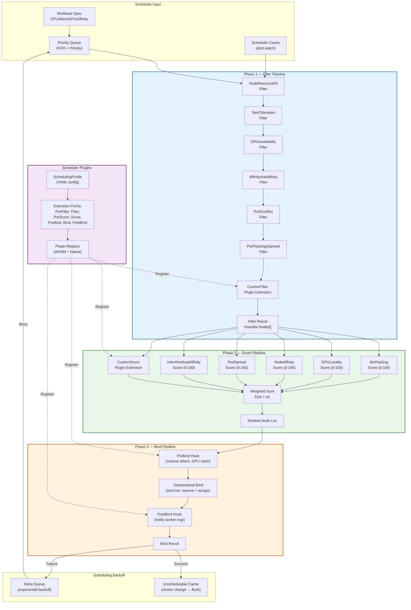

### Description

This diagram details the Omega Scheduler's three-phase pipeline architecture, modeled after but extending the Kubernetes scheduling framework. The scheduler accepts workload specifications (with CPU, memory, GPU, and affinity constraints) from a priority queue and processes them through:

**Phase 1 — Filter Pipeline**: Seven serial filter plugins eliminate nodes that cannot satisfy the workload's hard constraints. Each filter returns a binary yes/no decision; a node must pass all filters to be considered feasible. Custom filter plugins (registered via WASM or native extensions) can add domain-specific filtering logic.

**Phase 2 — Score Pipeline**: Six score plugins evaluate each feasible node on a 0–100 scale across multiple dimensions (bin-packing efficiency, GPU locality, node affinity, pod spread, inter-workload affinity, custom). Scores are combined using a weighted sum defined in the SchedulingProfile YAML configuration. The result is a ranked list of nodes.

**Phase 3 — Bind Pipeline**: The top-ranked node proceeds through PreBind hooks (volume attachment, GPU claim reservation), a transactional bind that atomically reserves resources in etcd, and PostBind hooks (notifying the Worker Manager). If the bind fails (e.g., due to a race condition), the workload is placed in a Retry Queue with exponential backoff.

### Key Relationships Highlighted

- **Filter → Score fan-out**: All score plugins receive the same set of feasible nodes and compute scores independently, enabling parallel evaluation.
- **Weighted sum configuration**: The SchedulingProfile YAML allows operators to adjust weights without code changes, enabling cluster-specific scheduling policies.
- **WASM plugin extensibility**: Custom filters and scorers can be deployed as WASM modules, providing sandboxed extensibility without compromising scheduler stability.
- **Unschedulable cache flush**: When cluster state changes (node added, workload deleted), the unschedulable cache is flushed, giving previously unschedulable workloads another chance.

---

## 7. GPU Management Stack

### Title

**Reservation, MIG Partitioning, and Backend Abstraction**

### Mermaid Diagram

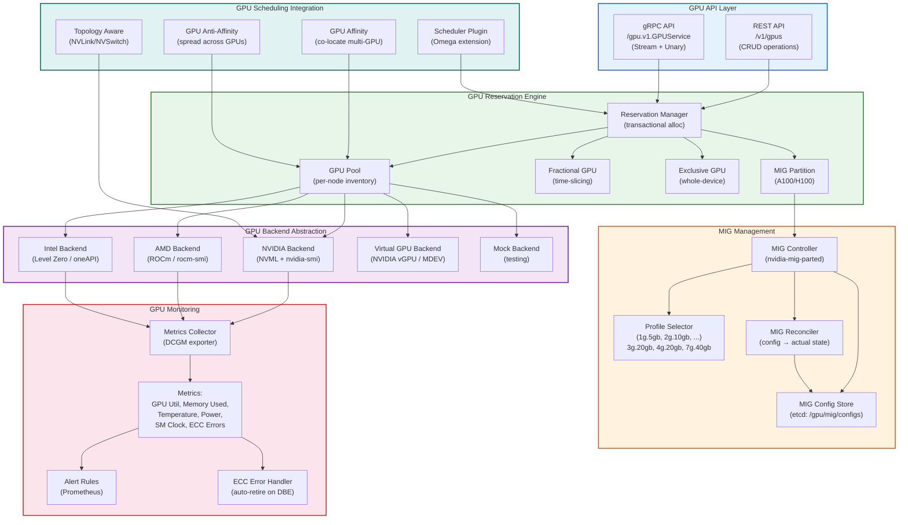

### Description

The GPU Management Stack is a multi-layered architecture that abstracts GPU hardware diversity, provides flexible reservation modes, and integrates deeply with the Omega Scheduler. The stack comprises five sub-components:

**GPU API Layer**: Exposes both REST and gRPC interfaces for GPU CRUD operations, including listing available GPUs, creating reservations, and querying utilization. The gRPC interface supports streaming for real-time metrics.

**Reservation Engine**: Manages three reservation modes—fractional GPU (time-slicing via NVIDIA MPS or AMD compute partitioning), exclusive GPU (whole-device allocation), and MIG partition (A100/H100 Multi-Instance GPU). All reservations are transactional, ensuring atomic allocation even under concurrent requests.

**MIG Management**: Uses `nvidia-mig-parted` to configure MIG profiles on A100/H100 GPUs. The Profile Selector maps workload GPU memory/compute requirements to the optimal MIG profile (1g.5gb through 7g.40gb). The MIG Reconciler continuously compares desired MIG configuration (stored in etcd) with actual GPU state and reconciles any drift.

**Backend Abstraction**: Provides a unified interface over vendor-specific GPU management libraries—NVML/nvidia-smi for NVIDIA, ROCm/rocm-smi for AMD, Level Zero/oneAPI for Intel, and vGPU/MDEV for virtualized environments. A mock backend enables testing without physical GPUs.

**GPU Monitoring**: Collects metrics via DCGM exporter, tracks GPU utilization, memory usage, temperature, power draw, SM clock speed, and ECC errors. The ECC Error Handler automatically retires GPUs that experience double-bit errors, draining workloads and marking the GPU as unschedulable.

### Key Relationships Highlighted

- **Reservation Engine ↔ MIG Controller**: When a MIG reservation is requested, the Reservation Engine delegates partition creation to the MIG Controller, which uses `nvidia-mig-parted` to reconfigure the GPU.
- **Backend Abstraction → Monitoring**: All backends feed metrics into the same collector, enabling unified dashboards across heterogeneous GPU fleets.
- **Scheduler Plugin → Reservation Engine**: The Omega Scheduler's GPU plugin queries the Reservation Engine to check availability and claim GPUs during the Bind phase.
- **ECC Error Handler → Reservation Engine**: When a double-bit ECC error is detected, the handler instructs the Reservation Engine to retire the GPU, triggering workload eviction.

---

## 8. Security Architecture

### Title

**SPIFFE Identity, JWT Validation, RBAC, and mTLS Mesh**

### Mermaid Diagram

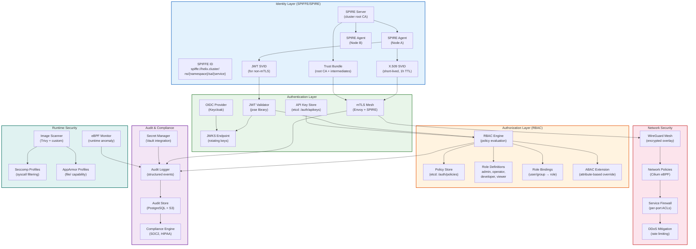

### Description

The Security Architecture is organized into six layers that together provide defense in depth: Identity, Authentication, Authorization, Network, Audit, and Runtime. At the core is the SPIFFE/SPIRE identity framework—each workload receives a SPIFFE ID of the form `spiffe://helix.cluster/ns/{namespace}/sa/{service}`, materialized as either an X.509 SVID (for mTLS) or a JWT SVID (for non-mTLS contexts like API calls from external clients). The SPIRE Server acts as the cluster root CA, signing SVIDs with a 1-hour TTL and distributing trust bundles to SPIRE Agents on each node.

Authentication operates in two modes: mTLS for service-to-service communication (Envoy sidecars present X.509 SVIDs verified against the trust bundle) and JWT for user-facing APIs (tokens validated against a JWKS endpoint served by an OIDC provider). API keys are stored in etcd for service account authentication.

Authorization uses a hierarchical RBAC engine with four built-in roles (admin, operator, developer, viewer) and an ABAC extension for attribute-based overrides. All policy decisions are logged to the Audit Logger, which writes structured events to PostgreSQL and archives them to S3. The Compliance Engine runs continuous checks against SOC2 and HIPAA requirements.

Network security layers WireGuard encryption (overlay), Cilium eBPF network policies (L3-L7 filtering), per-port ACLs (firewall), and rate limiting (DDoS mitigation). Runtime security includes seccomp and AppArmor profiles generated from image scans, plus an eBPF monitor that detects runtime anomalies (unexpected syscalls, file access patterns).

### Key Relationships Highlighted

- **SPIRE Server → SVID → mTLS**: The identity chain starts at the SPIRE Server, which signs X.509 SVIDs that Envoy sidecars use for mTLS. This eliminates the need for manual certificate management.
- **JWT SVID → JWT Validator → RBAC Engine**: User-facing requests carry JWT SVIDs; the JWT Validator verifies the signature against the JWKS endpoint, then the RBAC Engine evaluates the embedded claims against policy.
- **Image Scanner → Runtime Profiles**: Trivy image scans generate seccomp and AppArmor profiles tailored to each workload's required syscalls and file access patterns, applying least-privilege by default.
- **eBPF Monitor → Audit Logger**: The eBPF runtime monitor feeds anomaly events into the audit pipeline, enabling post-incident forensics and real-time alerting.

---

## 9. Session Management

### Title

**CRDT-Based Session State with Migration and Multi-Backend Support**

### Mermaid Diagram

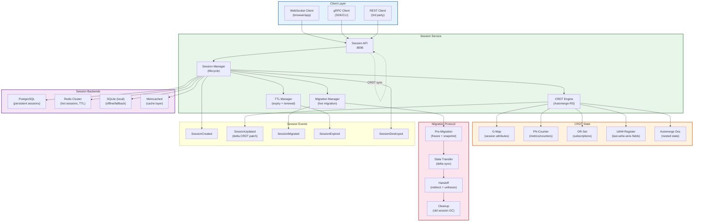

### Description

The Session Management architecture uses Conflict-free Replicated Data Types (CRDTs) to achieve low-latency, partition-tolerant session state without requiring strong consistency during normal operation. The Session Service exposes a unified API over WebSocket, gRPC, and REST, delegating to a Session Manager that orchestrates lifecycle operations.

The CRDT Engine (implemented with Automerge-RS) manages five CRDT types: G-Map for session attributes (add-only, mergeable), PN-Counter for metrics and counters (increment and decrement), OR-Set for subscriptions (observed-remove semantics), LWW-Register for last-write-wins fields (using hybrid logical clocks), and a nested Automerge Doc for complex session state. CRDTs enable any Session Service replica to accept writes independently; state is synchronized asynchronously via CRDT deltas published to the Event Bus.

The Migration Manager handles live session migration between nodes (e.g., during scaling or maintenance) through a four-phase protocol: Pre-Migration (freeze the session and snapshot CRDT state), State Transfer (delta-sync the snapshot to the target node), Handoff (redirect the client and unfreeze), and Cleanup (garbage-collect the old session). The entire migration is designed to complete within 500ms for typical sessions.

Session backends provide tiered storage: Redis for hot sessions with TTL-based expiry, PostgreSQL for persistent sessions that survive restarts, SQLite for offline/fallback mode when network connectivity is lost, and Memcached as a read-through cache layer.

### Key Relationships Highlighted

- **CRDT sync between replicas**: Session Service instances synchronize CRDT state directly (bypassing NATS for latency), with delta patches exchanged over gRPC streams.
- **Migration protocol preserves consistency**: The four-phase migration ensures no session state is lost or duplicated during handoff; the CRDT merge function resolves any concurrent writes that occur during the brief freeze window.
- **Tiered backend strategy**: Hot sessions in Redis are tiered to PostgreSQL for durability; SQLite enables offline operation; Memcached accelerates read-heavy access patterns.
- **TTL Manager drives expiry**: The TTL Manager independently tracks session expiry, publishing `SessionExpired` events that trigger cleanup across all backends and CRDT replicas.

---

## 10. Build Service Architecture

### Title

**Orchestrator, Worker Pool, and Dual Execution Backends (exec/podman)**

### Mermaid Diagram

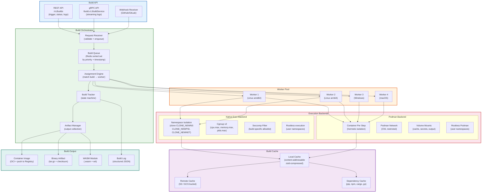

### Description

The Build Service is a distributed, multi-platform build system with dual execution backends for security and flexibility. The architecture has five major components:

**Build API**: Accepts build triggers via REST, gRPC (with streaming log output), and webhooks from GitHub/GitLab. Webhook payloads are validated (HMAC signature verification) before enqueuing.

**Build Orchestrator**: Manages the build lifecycle through a queue (Redis sorted set, prioritized by urgency and timestamp), an Assignment Engine that matches builds to workers based on platform requirements and resource availability, a Build Tracker that maintains a state machine per build (queued → running → success/failed/cancelled), and an Artifact Manager that collects outputs.

**Worker Pool**: Heterogeneous workers spanning Linux amd64, Linux arm64, Windows, and macOS. Workers register their capabilities and available capacity with the Orchestrator.

**Execution Backends**: Two mutually exclusive execution modes per build step. The Native Exec Backend uses Linux namespace isolation (mount, PID, network namespaces), cgroup v2 resource limits, and seccomp filters—all without a container runtime, offering the lowest overhead. The Podman Backend runs each step in a dedicated container, providing hermetic isolation with CNI networking, restricted volume mounts, and rootless execution. The backend is selected per build configuration; exec is preferred for trusted internal builds, while Podman is used for untrusted or third-party code.

**Build Cache**: A three-tier cache system—local content-addressable cache (zstd-compressed), remote cache in S3/GCS for cross-worker sharing, and dependency-specific caches (pip, npm, cargo, go) that prevent re-downloading packages.

### Key Relationships Highlighted

- **Orchestrator → Worker assignment**: The Assignment Engine considers platform requirements, resource availability, and cache locality (prefer workers with warm caches).
- **Dual execution backends**: The same worker can use either backend depending on the build's trust level; untrusted builds always use Podman for full container isolation.
- **Cache locality optimization**: The Assignment Engine prefers workers that already have relevant cache entries, reducing build times by 40-60% for incremental builds.
- **Artifact → Registry pipeline**: Container image outputs are pushed directly to the Registry Service (:8013), making them immediately available for deployment.

---

## 11. Health Monitoring

### Title

**Health Checker, Aggregator, and Rollup with Adaptive Probing**

### Mermaid Diagram

```mermaid
graph TD
    subgraph Checkers["Health Checkers"]
        HTTP_CHK["HTTP Checker<br/>(GET/HEAD, 2xx=healthy)"]
        TCP_CHK["TCP Checker<br/>(connection success)"]
        EXEC_CHK["Exec Checker<br/>(exit code 0=healthy)"]
        GRPC_CHK["gRPC Checker<br/>(grpc.health.v1)"]
        CUSTOM_CHK["Custom Checker<br/>(WASM plugin)"]
    end

    subgraph Probe["Probe Configuration"]
        PROBE_CFG["Probe Config<br/>(per-workload YAML)"]
        PROBE_INIT["Initial Delay<br/>(startup probe)"]
        PROBE_INT["Probe Interval<br/>(adaptive: 1s–30s)"]
        PROBE_THRESH["Failure Threshold<br/>(consecutive failures)"]
        PROBE_SUCCESS["Success Threshold<br/>(consecutive successes)"]
    end

    subgraph Aggregator["Health Aggregator"]
        AGG_RECV["Result Receiver<br/>(check results in)"]
        AGG_STATE["State Tracker<br/>(per-workload FSM)"]
        AGG_WINDOW["Sliding Window<br/>(last N results)"]
        AGG_ADAPT["Adaptive Controller<br/>(adjust intervals)"]
        AGG_ROLLUP["Health Rollup<br/>(node → zone → cluster)"]
    end

    subgraph FSM["Health State Machine"]
        H_UNKNOWN["Unknown<br/>(initial)"]
        H_STARTING["Starting<br/>(startup probe phase)"]
        H_HEALTHY["Healthy<br/>(passing checks)"]
        H_DEGRADED["Degraded<br/>(partial failures)"]
        H_UNHEALTHY["Unhealthy<br/>(threshold exceeded)"]
        H_DRAINING["Draining<br/>(graceful removal)"]
    end

    subgraph Actions["Health Actions"]
        ACT_RESTART["Auto-Restart<br/>(restartPolicy: Always)"]
        ACT_DRAIN["Drain Node<br/>(evict workloads)"]
        ACT_NOTIFY["Notify Event Bus<br/>(NATS publish)"]
        ACT_SCALE["Trigger Autoscale<br/>(HPA-like)"]
        ACT_CIRCUIT["Circuit Breaker<br/>(stop sending traffic)"]
    end

    subgraph Store["Health Data Store"]
        H_PG["PostgreSQL<br/>(historical metrics)"]
        H_REDIS["Redis<br/>(current state cache)"]
        H_PROM["Prometheus<br/>(metrics + alerting)"]
        H_ETCD["etcd<br/>(authoritative state)"]
    end

    HTTP_CHK --> AGG_RECV
    TCP_CHK --> AGG_RECV
    EXEC_CHK --> AGG_RECV
    GRPC_CHK --> AGG_RECV
    CUSTOM_CHK --> AGG_RECV

    PROBE_CFG --> PROBE_INIT
    PROBE_CFG --> PROBE_INT
    PROBE_CFG --> PROBE_THRESH
    PROBE_CFG --> PROBE_SUCCESS

    AGG_RECV --> AGG_STATE
    AGG_STATE --> AGG_WINDOW
    AGG_WINDOW --> AGG_ADAPT
    AGG_ADAPT --> PROBE_INT
    AGG_STATE --> AGG_ROLLUP

    AGG_STATE --> H_UNKNOWN
    H_UNKNOWN --> H_STARTING
    H_STARTING --> H_HEALTHY
    H_STARTING --> H_UNHEALTHY
    H_HEALTHY --> H_DEGRADED
    H_DEGRADED --> H_HEALTHY
    H_DEGRADED --> H_UNHEALTHY
    H_UNHEALTHY --> H_STARTING
    H_HEALTHY --> H_DRAINING
    H_DRAINING --> ACT_DRAIN

    AGG_STATE --> ACT_RESTART
    AGG_STATE --> ACT_NOTIFY
    AGG_STATE --> ACT_SCALE
    AGG_STATE --> ACT_CIRCUIT

    AGG_ROLLUP --> H_PG
    AGG_STATE --> H_REDIS
    AGG_ROLLUP --> H_PROM
    AGG_STATE --> H_ETCD

    style Checkers fill:#e3f2fd,stroke:#1565c0,stroke-width:2px
    style Aggregator fill:#e8f5e9,stroke:#2e7d32,stroke-width:2px
    style FSM fill:#fff3e0,stroke:#e65100,stroke-width:2px
    style Actions fill:#fce4ec,stroke:#c62828,stroke-width:2px
    style Store fill:#f3e5f5,stroke:#6a1b9a,stroke-width:2px
```

### Description

The Health Monitoring system provides multi-tier health checking with adaptive probing and hierarchical rollup. Five checker types evaluate workload health: HTTP (status code validation), TCP (connection success), Exec (command exit code), gRPC (standard health protocol), and Custom (WASM plugin for domain-specific checks).

The Health Aggregator receives check results and feeds them into a per-workload finite state machine that transitions through six states: Unknown (initial), Starting (startup probe phase), Healthy (passing), Degraded (partial failures, e.g., 2 of 3 checks passing), Unhealthy (threshold exceeded), and Draining (graceful removal in progress). A sliding window of the last N results determines transitions, and an Adaptive Controller dynamically adjusts probe intervals—reducing intervals for unstable workloads (detecting failures faster) and increasing intervals for stable workloads (reducing overhead).

The Health Rollup aggregates workload health into node-level, zone-level, and cluster-level health scores, stored in PostgreSQL for historical analysis and Prometheus for alerting. Current state is cached in Redis for low-latency queries, while authoritative state is persisted in etcd.

Health Actions are triggered by state transitions: auto-restart for `Always` restart policies, node draining for hardware failures, Event Bus notifications, autoscale triggers, and circuit-breaker activation to stop routing traffic to unhealthy workloads.

### Key Relationships Highlighted

- **Adaptive Controller ↔ Probe Interval**: The feedback loop between the sliding window analysis and probe interval adjustment ensures that flapping services are probed more frequently while stable services are probed less often.
- **Health FSM → Actions**: State transitions directly trigger actions—entering Unhealthy triggers auto-restart and circuit-breaker; entering Draining triggers workload eviction.
- **Rollup hierarchy**: Workload health rolls up to node health, which rolls up to zone health, which rolls up to cluster health. This enables operators to quickly identify failure scopes.
- **Multi-store strategy**: etcd holds authoritative state (for scheduler decisions), Redis caches current state (for dashboard queries), PostgreSQL stores history (for post-incident analysis), and Prometheus exposes metrics (for alerting).

---

## 12. Event/Messaging Architecture

### Title

**NATS JetStream with Avro Schema Registry and Event Bus**

### Mermaid Diagram

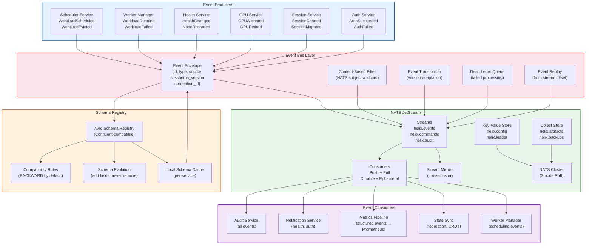

### Description

The Event/Messaging Architecture is built on NATS JetStream with an Avro Schema Registry for type-safe event processing. The system is organized into five layers:

**Event Producers**: Six services publish domain events. Each event is wrapped in a standardized envelope containing an id (UUID), type (e.g., `WorkloadScheduled`), source service, timestamp, schema version, and correlation id for distributed tracing.

**Schema Registry**: An Avro Schema Registry enforces BACKWARD compatibility by default—new fields can be added but existing fields cannot be removed or renamed. Each service maintains a local schema cache to avoid round-trips during serialization. Schema evolution enables services to upgrade independently.

**Event Bus Layer**: Provides envelope formatting, content-based filtering (using NATS subject wildcards like `helix.events.workload.>`), version adaptation (transforming events between schema versions), dead-letter queuing for failed processing (with automatic retry), and event replay from any stream offset for recovery scenarios.

**NATS JetStream**: The messaging backbone with three streams (events, commands, audit), push and pull consumers (durable for services, ephemeral for ad-hoc queries), a key-value store for configuration and leader election, an object store for large artifacts and backups, and stream mirroring for cross-cluster replication. The NATS cluster runs a 3-node Raft group for fault tolerance.

**Event Consumers**: Five consumer groups with different consumption patterns—Audit Service consumes all events, Notification Service filters for health and auth events, Metrics Pipeline converts structured events to Prometheus metrics, State Sync uses events for federation and CRDT synchronization, and Worker Manager reacts to scheduling events.

### Key Relationships Highlighted

- **Schema Registry → Event Envelope**: Every event is validated against its Avro schema before publishing; invalid events are rejected with a schema error.
- **NATS subject wildcards → Content filtering**: The subject hierarchy (`helix.events.workload.scheduled`, `helix.events.health.changed`) enables efficient content-based routing without deserialization.
- **Stream mirrors → Federation**: Cross-cluster stream mirroring replicates events between federated clusters, enabling global event visibility.
- **Dead Letter Queue → Replay**: Events that fail processing are moved to the DLQ; after the consumer fixes the bug, events can be replayed from the DLQ or from the original stream offset.

---

## 13. Federation Architecture

### Title

**Hub-Spoke Federation with Policy Distribution and Selector-Based Routing**

### Mermaid Diagram

```mermaid
graph TD
    subgraph Hub["Federation Hub"]
        FED_CTRL["Federation Controller<br/>(hub mode)"]
        FED_POLICY["Policy Distributor<br/>(RBAC + network policies)"]
        FED_SCHED["Federated Scheduler<br/>(cross-cluster placement)"]
        FED_DNS["Federated DNS<br/>(multi-cluster service discovery)"]
        FED_MIRROR["Event Mirror<br/>(NATS cross-cluster)"]
        FED_STATUS["Status Aggregator<br/>(cluster health rollup)"]
    end

    subgraph SpokeA["Spoke Cluster A — US-East"]
        SA_CTRL["Federation Agent<br/>(spoke mode)"]
        SA_SCHED["Local Scheduler<br/>(Omega)"]
        SA_WORK["Worker Manager"]
        SA_REGISTRY["Local Registry"]
        SA_NODE["Nodes n1..n20"]
    end

    subgraph SpokeB["Spoke Cluster B — EU-West"]
        SB_CTRL["Federation Agent<br/>(spoke mode)"]
        SB_SCHED["Local Scheduler<br/>(Omega)"]
        SB_WORK["Worker Manager"]
        SB_REGISTRY["Local Registry"]
        SB_NODE["Nodes n1..n15"]
    end

    subgraph SpokeC["Spoke Cluster C — AP-South"]
        SC_CTRL["Federation Agent<br/>(spoke mode)"]
        SC_SCHED["Local Scheduler<br/>(Omega)"]
        SC_WORK["Worker Manager"]
        SC_REGISTRY["Local Registry"]
        SC_NODE["Nodes n1..n8"]
    end

    subgraph Selector["Workload Selector"]
        SEL_LABEL["Label Selector<br/>(region, tier, gpu)"]
        SEL_AFFINITY["Cluster Affinity<br/>(topology key matching)"]
        SEL_SPREAD["Spread Constraints<br/>(max-skew, min-domains)"]
        SEL_POLICY["Placement Policy<br/>(cost, latency, compliance)"]
    end

    subgraph Sync["Federation Sync"]
        SYNC_STATE["State Sync<br/>(CRDT merge)"]
        SYNC_EVENT["Event Sync<br/>(NATS mirror)"]
        SYNC_RES["Resource Sync<br/>(inventory aggregation)"]
        SYNC_HB["Heartbeat<br/>(per-cluster, 5s interval)"]
    end

    FED_CTRL --> SA_CTRL
    FED_CTRL --> SB_CTRL
    FED_CTRL --> SC_CTRL

    FED_POLICY --> SA_CTRL
    FED_POLICY --> SB_CTRL
    FED_POLICY --> SC_CTRL

    FED_SCHED --> SEL_LABEL
    FED_SCHED --> SEL_AFFINITY
    FED_SCHED --> SEL_SPREAD
    FED_SCHED --> SEL_POLICY

    FED_DNS --> SA_CTRL
    FED_DNS --> SB_CTRL
    FED_DNS --> SC_CTRL

    FED_MIRROR --> SA_CTRL
    FED_MIRROR --> SB_CTRL
    FED_MIRROR --> SC_CTRL

    FED_STATUS --> SA_CTRL
    FED_STATUS --> SB_CTRL
    FED_STATUS --> SC_CTRL

    SA_CTRL --> SA_SCHED
    SA_SCHED --> SA_WORK
    SA_WORK --> SA_NODE
    SA_WORK --> SA_REGISTRY

    SB_CTRL --> SB_SCHED
    SB_SCHED --> SB_WORK
    SB_WORK --> SB_NODE
    SB_WORK --> SB_REGISTRY

    SC_CTRL --> SC_SCHED
    SC_SCHED --> SC_WORK
    SC_WORK --> SC_NODE
    SC_WORK --> SC_REGISTRY

    SA_CTRL --> SYNC_STATE
    SB_CTRL --> SYNC_STATE
    SC_CTRL --> SYNC_STATE
    SA_CTRL --> SYNC_EVENT
    SB_CTRL --> SYNC_EVENT
    SC_CTRL --> SYNC_EVENT
    SA_CTRL --> SYNC_RES
    SB_CTRL --> SYNC_RES
    SC_CTRL --> SYNC_RES
    SA_CTRL --> SYNC_HB
    SB_CTRL --> SYNC_HB
    SC_CTRL --> SYNC_HB

    style Hub fill:#e3f2fd,stroke:#1565c0,stroke-width:2px
    style SpokeA fill:#e8f5e9,stroke:#2e7d32,stroke-width:2px
    style SpokeB fill:#fff3e0,stroke:#e65100,stroke-width:2px
    style SpokeC fill:#fce4ec,stroke:#c62828,stroke-width:2px
    style Selector fill:#f3e5f5,stroke:#6a1b9a,stroke-width:2px
    style Sync fill:#e0f2f1,stroke:#00695c,stroke-width:2px
```

### Description

The Federation Architecture follows a hub-spoke model where a central Federation Hub coordinates three spoke clusters across regions (US-East, EU-West, AP-South). The hub does not run workloads itself; it provides coordination services:

**Federation Controller**: Operates in hub mode, maintaining persistent connections (gRPC over WireGuard) to Federation Agents on each spoke. The controller pushes configuration and pulls status.

**Policy Distributor**: Propagates RBAC policies and network policies from the hub to all spokes, ensuring consistent security posture across clusters. Policy changes are applied incrementally to avoid disrupting running workloads.

**Federated Scheduler**: Handles cross-cluster workload placement using a four-dimensional selector: Label Selector (match on region, tier, gpu labels), Cluster Affinity (topology key matching for data-locality requirements), Spread Constraints (max-skew and min-domains for availability), and Placement Policy (cost optimization, latency minimization, compliance requirements like GDPR data residency).

**Federated DNS**: Provides multi-cluster service discovery, mapping service names to endpoints across clusters with health-based routing (unhealthy endpoints are removed from DNS responses).

**Event Mirror**: Replicates NATS streams between clusters, enabling global event visibility. Events are tagged with their source cluster to prevent loops.

**Status Aggregator**: Rolls up cluster health from each spoke into a global dashboard, tracking node counts, workload distributions, resource utilization, and error rates.

Federation Sync uses CRDT-based state merging (conflict-free), NATS stream mirroring (ordered), resource inventory aggregation (periodic), and per-cluster heartbeats (5-second intervals, 3 missed = suspect).

### Key Relationships Highlighted

- **Hub → Spoke policy push**: The Policy Distributor pushes RBAC and network policies unidirectionally from hub to spokes, ensuring a single source of truth.
- **Federated Scheduler → Local Schedulers**: The Federated Scheduler decides which cluster receives a workload, then delegates to the local Omega Scheduler for node-level placement.
- **CRDT state sync**: Spoke controllers merge state using CRDTs, enabling partition-tolerant operation—spokes can accept workloads even during temporary hub disconnection.
- **Heartbeat → Status**: Cluster heartbeats feed into the Status Aggregator, which maintains a real-time global view of cluster availability.

---

## 14. Consensus Architecture

### Title

**Raft Consensus with etcd Backend and Leader Election**

### Mermaid Diagram

```mermaid
graph TD
    subgraph Raft["Raft Consensus Layer"]
        RAFT_LEADER["Leader Node<br/>(process writes)"]
        RAFT_FOLLOW1["Follower Node 1<br/>(replicate + vote)"]
        RAFT_FOLLOW2["Follower Node 2<br/>(replicate + vote)"]
        RAFT_CANDIDATE["Candidate<br/>(election in progress)"]
        RAFT_LOG["Raft Log<br/>(append-only entries)"]
        RAFT_SNAP["Snapshot<br/>(compacted log)"]
        RAFT_WAL["WAL<br/>(write-ahead log)"]
    end

    subgraph Etcd["etcd Data Layer"]
        ETCD_KV["Key-Value Store<br/>(revision-based MVCC)"]
        ETCD_LEASE["Lease Manager<br/>(TTL-based ephemeral keys)"]
        ETCD_WATCH["Watch Service<br/>(change notifications)"]
        ETCD_TXN["Transaction<br/>(compare + ops, atomic)"]
        ETCD_MAINT["Maintenance<br/>(compaction, defrag)"]
        ETCD_AUTH["Auth<br/>(role-based access)"]
    end

    subgraph Election["Leader Election"]
        EL_VOTE["Vote Request<br/>(RequestVote RPC)"]
        EL_TERM["Term Counter<br/>(monotonically increasing)"]
        EL_TIMEOUT["Election Timeout<br/>(randomized 150–300ms)"]
        EL_QUORUM["Quorum<br/>(⌈N/2⌉ + 1 votes)"]
        EL_LEASE["Leader Lease<br/>(renewed via heartbeat)"]
    end

    subgraph Clients["Consensus Clients"]
        CL_SCHED["Scheduler<br/>(transactional binds)"]
        CL_GPU["GPU Service<br/>(GPU reservations)"]
        CL_AUTH["Auth Service<br/>(token validation)"]
        CL_MESH["Mesh Controller<br/>(xDS snapshots)"]
        CL_FED["Federation<br/>(cluster state)"]
        CL_AUDIT["Audit Service<br/>(event persistence)"]
    end

    subgraph Snap["Snapshot & Recovery"]
        SN_AUTO["Auto-Snapshot<br/>(every 10,000 entries)"]
        SN_MANUAL["Manual Snapshot<br/>(operator trigger)"]
        SN_DEFRAG["Defragmentation<br/>(online, per-revision)"]
        SN_BACKUP["Backup<br/>(S3 / NFS)"]
        SN_RESTORE["Restore<br/>(from snapshot + WAL)"]
    end

    RAFT_LEADER --> RAFT_LOG
    RAFT_FOLLOW1 --> RAFT_LOG
    RAFT_FOLLOW2 --> RAFT_LOG
    RAFT_LOG --> RAFT_SNAP
    RAFT_LOG --> RAFT_WAL

    RAFT_LEADER --> ETCD_KV
    RAFT_LEADER --> ETCD_LEASE
    RAFT_LEADER --> ETCD_WATCH
    RAFT_LEADER --> ETCD_TXN
    RAFT_LEADER --> ETCD_MAINT
    RAFT_LEADER --> ETCD_AUTH

    RAFT_CANDIDATE --> EL_VOTE
    EL_VOTE --> EL_TERM
    EL_VOTE --> EL_TIMEOUT
    EL_VOTE --> EL_QUORUM
    RAFT_LEADER --> EL_LEASE

    CL_SCHED --> ETCD_TXN
    CL_GPU --> ETCD_TXN
    CL_AUTH --> ETCD_KV
    CL_MESH --> ETCD_WATCH
    CL_FED --> ETCD_KV
    CL_AUDIT --> ETCD_KV

    ETCD_KV --> SN_AUTO
    ETCD_MAINT --> SN_DEFRAG
    SN_AUTO --> SN_BACKUP
    SN_MANUAL --> SN_BACKUP
    SN_BACKUP --> SN_RESTORE
    RAFT_SNAP --> SN_AUTO

    style Raft fill:#e3f2fd,stroke:#1565c0,stroke-width:2px
    style Etcd fill:#e8f5e9,stroke:#2e7d32,stroke-width:2px
    style Election fill:#fff3e0,stroke:#e65100,stroke-width:2px
    style Clients fill:#fce4ec,stroke:#c62828,stroke-width:2px
    style Snap fill:#f3e5f5,stroke:#6a1b9a,stroke-width:2px
```

### Description

The Consensus Architecture provides the linearizable consistency guarantees that underpin the Helix Cluster's critical operations. Built on the Raft consensus algorithm with etcd as the data layer, it ensures that all state changes are durably replicated and consistently ordered.

**Raft Consensus Layer**: A 3-node (or 5-node for production) Raft group with a single Leader that processes all writes and two (or four) Followers that replicate entries. The Raft Log stores all state changes as append-only entries, periodically compacted into Snapshots. A Write-Ahead Log (WAL) provides durability against crashes. If the Leader fails, a Candidate initiates an election.

**Leader Election**: When a Follower's election timeout (randomized between 150–300ms to prevent split votes) expires without receiving a heartbeat from the Leader, it transitions to Candidate, increments the term counter, and sends RequestVote RPCs to all peers. A Candidate becomes Leader upon receiving quorum votes (⌈N/2⌉ + 1). The Leader maintains its authority through periodic heartbeats (leader lease).

**etcd Data Layer**: Provides revision-based MVCC key-value storage, lease-based ephemeral keys (for node registration and leader election), watch notifications (for reactive programming), compare-and-operations transactions (for atomic scheduling binds), maintenance operations (compaction and defragmentation), and role-based access control.

**Consensus Clients**: Six services interact with etcd. The Scheduler and GPU Service use transactions for atomic resource reservation. Auth, Federation, and Audit use simple key-value operations. The Mesh Controller uses watches to reactively update Envoy configuration.

**Snapshot & Recovery**: Automatic snapshots are taken every 10,000 log entries; operators can trigger manual snapshots. Backups are stored in S3 or NFS. Recovery replays the latest snapshot followed by any WAL entries not yet snapshotted. Online defragmentation reclaims space without downtime.

### Key Relationships Highlighted

- **Leader → etcd writes**: All writes go through the Leader, ensuring linearizable ordering; Followers only serve reads (with optional consistency levels).
- **Scheduler/GPU → Transactions**: Both the Scheduler and GPU Service use etcd transactions (`compare + ops`) to atomically reserve resources, preventing double-booking.
- **Watch → Mesh Controller**: The Mesh Controller watches etcd for service discovery changes and immediately pushes updated xDS configuration to Envoy.
- **Snapshot → WAL → Recovery**: The recovery process first restores the latest snapshot, then replays WAL entries, ensuring no committed state is lost.

---

## 15. Testing Architecture

### Title

**DST, Chaos, Fuzz, Mutation, and Integration Testing Strategy**

### Mermaid Diagram

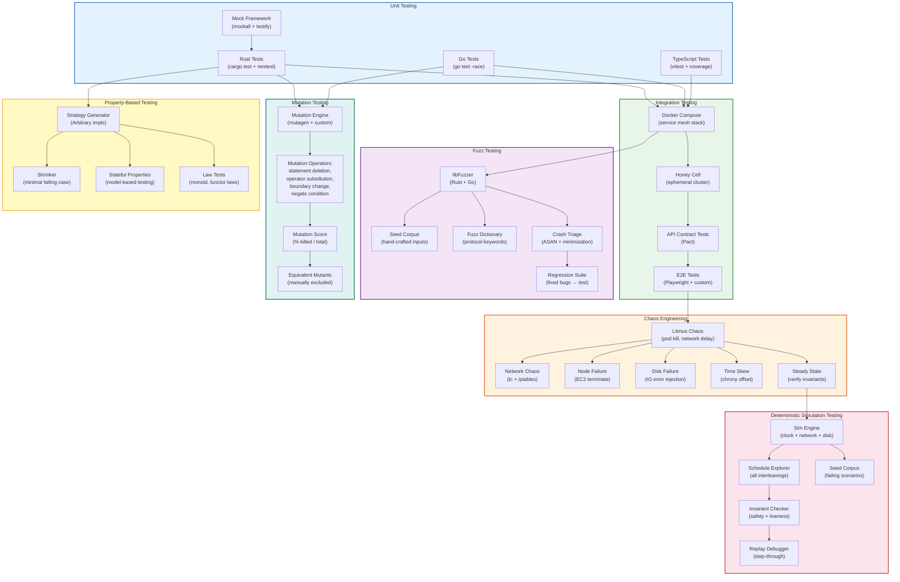

### Description

The Testing Architecture employs a seven-tier strategy that progresses from fast unit tests to deep deterministic simulation, ensuring both correctness and resilience:

**Unit Testing**: Per-language unit test suites with mock frameworks (mockall for Rust, testify for Go). Rust tests use nextest for parallel execution with per-test timeouts. Go tests run with the race detector enabled.

**Integration Testing**: Four levels—Docker Compose for local service-mesh stacks, Honey Cells (ephemeral single-node clusters) for realistic scheduling tests, Pact-based API contract tests for service boundaries, and Playwright-based E2E tests for the dashboard.

**Chaos Engineering**: Litmus Chaos experiments inject pod kills, network delays, node failures (via EC2 instance termination), disk IO errors, and time skew. Each experiment follows a steady-state methodology: verify invariants before and after injection.

**Deterministic Simulation Testing (DST)**: The crown jewel of the testing strategy. The Sim Engine provides a deterministic clock, network, and disk, enabling the Schedule Explorer to enumerate all possible interleavings of concurrent events. The Invariant Checker validates safety (no double-scheduling) and liveness (no deadlock) properties. When a violation is found, the Replay Debugger enables step-through analysis.

**Fuzz Testing**: libFuzzer-based fuzzing for Rust and Go code, with hand-crafted seed corpora, protocol-specific fuzz dictionaries, ASAN-based crash triage with minimization, and a regression suite that prevents re-introduction of previously fixed bugs.

**Mutation Testing**: The mutation engine applies operators (statement deletion, operator substitution, boundary change, condition negation) to source code and measures the mutation score—percentage of mutants killed by the test suite. Equivalent mutants (semantically identical) are manually excluded.

**Property-Based Testing**: QuickCheck-style generators with Arbitrary implementations, automatic shrinking to minimal failing cases, stateful model-based testing for stateful components, and law tests for algebraic properties (monoid associativity, functor identity).

### Key Relationships Highlighted

- **Unit → Integration → E2E → Chaos**: Tests progress from isolated unit tests to full-stack integration, then to chaos experiments that validate resilience under failure.
- **Chaos → DST**: Chaos experiments identify failure modes that are then codified as DST scenarios for deterministic replay and root-cause analysis.
- **Fuzz → Crash Triage → Regression**: Fuzzing discovers crashes; crash triage minimizes reproducing inputs; the regression suite ensures fixes are permanent.
- **Mutation → Test Quality**: Mutation testing measures test suite effectiveness—a low mutation score indicates inadequate test coverage even if line coverage is high.

---

## 16. Deployment Architecture

### Title

**Kubernetes, Helm, and Docker Compose Deployment Topologies**

### Mermaid Diagram

```mermaid
graph TD
    subgraph K8s["Kubernetes Deployment (Production)"]
        subgraph NS_CTRL["Namespace: helix-control"]
            DEP_API["Deployment: api-gateway<br/>replicas: 3<br/>strategy: RollingUpdate<br/>maxSurge: 1, maxUnavailable: 0"]
            DEP_AUTH["Deployment: auth-service<br/>replicas: 3"]
            DEP_SCHED["Deployment: scheduler<br/>replicas: 2 (leader + standby)"]
            DEP_WORK["Deployment: worker-mgr<br/>replicas: 3"]
            DEP_GPU["Deployment: gpu-service<br/>replicas: 2"]
            DEP_SESS["Deployment: session-svc<br/>replicas: 3"]
            DEP_BUILD["Deployment: build-svc<br/>replicas: 2"]
            DEP_HEALTH["Deployment: health-svc<br/>replicas: 3"]
            DEP_EVENT["StatefulSet: nats<br/>replicas: 3"]
            DEP_ETCD["StatefulSet: etcd<br/>replicas: 3"]
        end

        subgraph NS_DATA["Namespace: helix-data"]
            STS_PG["StatefulSet: postgresql<br/>replicas: 3 (primary + replicas)<br/>PVC: 100Gi SSD"]
            STS_REDIS["StatefulSet: redis<br/>replicas: 6 (3 master + 3 replica)"]
            STS_MINIO["StatefulSet: minio<br/>replicas: 4 (erasure coding)"]
        end

        subgraph NS_WORK["Namespace: helix-workload"]
            DS_NODE["DaemonSet: node-agent<br/>runs on every node"]
            DS_WG["DaemonSet: wg-mesh<br/>runs on every node"]
            DS_SPIRE["DaemonSet: spire-agent<br/>runs on every node"]
            DS_DCGM["DaemonSet: dcgm-exporter<br/>runs on GPU nodes"]
        end

        subgraph NS_SYS["Namespace: helix-system"]
            DEP_PROM["Deployment: prometheus<br/>replicas: 1 + Thanos sidecar"]
            DEP_GRAF["Deployment: grafana<br/>replicas: 2"]
            DEP_LOKI["Deployment: loki<br/>replicas: 3"]
            DEP_JAEGER["Deployment: jaeger<br/>replicas: 1"]
        end
    end

    subgraph Helm["Helm Chart Structure"]
        H_CHART["Chart: helix-platform<br/>version: 2.4.0<br/>appVersion: 2.4.0"]
        H_VAL["values.yaml<br/>(global overrides)"]
        H_VAL_PROD["values-prod.yaml<br/>(production overrides)"]
        H_VAL_STG["values-staging.yaml<br/>(staging overrides)"]
        H_SUB1["Subchart: helix-control"]
        H_SUB2["Subchart: helix-data"]
        H_SUB3["Subchart: helix-workload"]
        H_SUB4["Subchart: helix-system"]
        H_HOOK["Hooks:<br/>pre-install (seeds)<br/>post-install (smoke test)<br/>pre-upgrade (backup)"]
    end

    subgraph Docker["Docker Compose (Development)"]
        DC_API["api-gateway:8000"]
        DC_AUTH["auth-service:8001"]
        DC_SCHED["scheduler:8002"]
        DC_WORK["worker-mgr:8003"]
        DC_NATS["nats:4222/8222"]
        DC_ETCD["etcd:2379"]
        DC_PG["postgresql:5432"]
        DC_REDIS["redis:6379"]
        DC_MINIO["minio:9000"]
    end

    H_CHART --> H_VAL
    H_VAL --> H_VAL_PROD
    H_VAL --> H_VAL_STG
    H_CHART --> H_SUB1
    H_CHART --> H_SUB2
    H_CHART --> H_SUB3
    H_CHART --> H_SUB4
    H_CHART --> H_HOOK

    H_SUB1 --> DEP_API
    H_SUB1 --> DEP_AUTH
    H_SUB1 --> DEP_SCHED
    H_SUB1 --> DEP_WORK
    H_SUB1 --> DEP_GPU
    H_SUB1 --> DEP_SESS
    H_SUB1 --> DEP_BUILD
    H_SUB1 --> DEP_HEALTH
    H_SUB1 --> DEP_EVENT
    H_SUB1 --> DEP_ETCD

    H_SUB2 --> STS_PG
    H_SUB2 --> STS_REDIS
    H_SUB2 --> STS_MINIO

    H_SUB3 --> DS_NODE
    H_SUB3 --> DS_WG
    H_SUB3 --> DS_SPIRE
    H_SUB3 --> DS_DCGM

    DC_API --> DC_AUTH
    DC_API --> DC_SCHED
    DC_SCHED --> DC_WORK
    DC_SCHED --> DC_NATS
    DC_SCHED --> DC_ETCD
    DC_WORK --> DC_PG
    DC_WORK --> DC_REDIS
    DC_WORK --> DC_MINIO

    style K8s fill:#e3f2fd,stroke:#1565c0,stroke-width:2px
    style Helm fill:#e8f5e9,stroke:#2e7d32,stroke-width:2px
    style Docker fill:#fff3e0,stroke:#e65100,stroke-width:2px
```

### Description

The Deployment Architecture supports three deployment topologies optimized for different environments:

**Kubernetes (Production)**: Four namespaces isolate concerns. `helix-control` runs the control-plane services as Deployments (with RollingUpdate strategy for zero-downtime upgrades) and StatefulSets for NATS and etcd (which require stable network identities). `helix-data` runs stateful data stores—PostgreSQL (primary + replicas with PVC-backed storage), Redis (3 master + 3 replica cluster), and MinIO (4-node erasure coding for durability). `helix-workload` runs DaemonSets that must execute on every node (node-agent, wg-mesh, spire-agent) or GPU nodes (dcgm-exporter). `helix-system` runs observability stack (Prometheus with Thanos sidecar for long-term storage, Grafana, Loki, Jaeger).

**Helm Chart**: The `helix-platform` umbrella chart (version 2.4.0) contains four subcharts corresponding to the four namespaces, plus hooks for pre-install (seed initial data), post-install (smoke test), and pre-upgrade (backup etcd). Three values files provide environment-specific overrides—`values.yaml` for defaults, `values-prod.yaml` for production (higher replicas, resource limits, PodDisruptionBudgets), and `values-staging.yaml` for staging (fewer replicas, debug logging).

**Docker Compose (Development)**: A simplified single-host setup with all services running on their standard ports. Used for local development and CI testing. Lacks the resilience features of Kubernetes (no replica sets, no rolling updates) but provides fast iteration.

### Key Relationships Highlighted

- **Helm subcharts → Kubernetes namespaces**: Each subchart maps to a namespace, enabling independent versioning and deployment of control-plane, data, workload, and system components.
- **DaemonSets → Node-level agents**: Node-agent, wg-mesh, and spire-agent run on every node via DaemonSets, ensuring consistent infrastructure across the fleet.
- **StatefulSets → Stable identities**: NATS and etcd use StatefulSets for stable network identities, enabling Raft cluster formation and leader election.
- **Docker Compose → Development parity**: The compose file mirrors the Kubernetes topology at a simplified level, ensuring developers can test service interactions locally.

---

## 17. Database Schema ER

### Title

**PostgreSQL + etcd + Redis + SQLite Entity-Relationship Model**

### Mermaid Diagram

```mermaid
erDiagram
    PostgreSQL {
        WORKLOADS workloads {
            uuid id PK
            string name
            uuid namespace_id FK
            string image
            jsonb resource_requests
            jsonb resource_limits
            jsonb gpu_requests
            string status
            uuid node_id FK
            uuid scheduled_gpu_id FK
            timestamptz created_at
            timestamptz updated_at
            timestamptz terminated_at
            jsonb labels
            jsonb annotations
        }
        NAMESPACES namespaces {
            uuid id PK
            string name UK
            uuid owner_id FK
            jsonb resource_quota
            jsonb labels
            timestamptz created_at
        }
        NODES nodes {
            uuid id PK
            string hostname UK
            string region
            string zone
            string instance_type
            inet ip_address
            jsonb capacity
            jsonb allocatable
            string status
            jsonb labels
            jsonb taints
            timestamptz joined_at
            timestamptz last_heartbeat
        }
        GPU_DEVICES gpu_devices {
            uuid id PK
            uuid node_id FK
            string pci_address
            string model
            int memory_mb
            string mig_profile
            string status
            int ecc_errors
            timestamptz last_checked
        }
        GPU_RESERVATIONS gpu_reservations {
            uuid id PK
            uuid gpu_id FK
            uuid workload_id FK
            string mode
            jsonb mig_config
            timestamptz starts_at
            timestamptz ends_at
        }
        USERS users {
            uuid id PK
            string email UK
            string display_name
            string oidc_subject
            timestamptz created_at
            timestamptz last_login
        }
        ROLES roles {
            uuid id PK
            string name UK
            jsonb permissions
            string description
        }
        ROLE_BINDINGS role_bindings {
            uuid id PK
            uuid user_id FK
            uuid role_id FK
            uuid namespace_id FK
            timestamptz created_at
        }
        AUDIT_EVENTS audit_events {
            uuid id PK
            string event_type
            uuid actor_id FK
            string resource_type
            uuid resource_id
            jsonb details
            inet source_ip
            timestamptz occurred_at
        }
        SESSIONS sessions {
            uuid id PK
            uuid user_id FK
            jsonb crdt_state
            string backend
            timestamptz expires_at
            timestamptz created_at
        }
        BUILD_JOBS build_jobs {
            uuid id PK
            uuid namespace_id FK
            string repository
            string commit_sha
            string branch
            string status
            string platform
            jsonb config
            timestamptz started_at
            timestamptz completed_at
            int duration_ms
        }
        FEDERATED_CLUSTERS federated_clusters {
            uuid id PK
            string name UK
            string region
            string endpoint
            string api_key_hash
            string status
            timestamptz last_sync
        }
    }

    etcd {
        ETCD_KEYS key_prefix_layout {
            string prefix_/helix/schedule "schedule bindings"
            string prefix_/helix/gpu "gpu allocations"
            string prefix_/helix/mesh "mesh config xDS"
            string prefix_/helix/membership "swim membership"
            string prefix_/helix/config "dynamic config"
            string prefix_/helix/leader "leader elections"
            string prefix_/helix/leases "ephemeral node leases"
        }
    }

    Redis {
        REDIS_STRUCTURES data_structures {
            string key_session_current "hash: session state cache"
            string key_schedule_cache "hash: schedule result cache"
            string key_build_queue "sorted_set: priority queue"
            string key_health_state "hash: current health FSM"
            string key_rate_limit "counter: API rate limiting"
            string key_ddos_tokens "token_bucket: DDoS mitigation"
        }
    }

    SQLite {
        SQLITE_TABLES local_tables {
            string table_local_sessions "offline session store"
            string table_local_config "cached configuration"
            string table_local_events "event buffer for replay"
            string table_local_health "local health history"
        }
    }

    workloads ||--o{ gpu_reservations : "reserves"
    workloads }o--|| namespaces : "belongs to"
    workloads }o--o| nodes : "scheduled on"
    gpu_devices ||--o{ gpu_reservations : "allocated by"
    gpu_devices }o--|| nodes : "installed in"
    nodes ||--o{ workloads : "hosts"
    users ||--o{ role_bindings : "has"
    users ||--o{ sessions : "owns"
    users ||--o{ audit_events : "triggers"
    roles ||--o{ role_bindings : "assigned via"
    role_bindings }o--o| namespaces : "scoped to"
    namespaces ||--o{ build_jobs : "contains"
    build_jobs }o--|| namespaces : "belongs to"
```

### Description

This entity-relationship diagram models the complete data layer of the Helix Cluster, spanning four storage systems:

**PostgreSQL**: The primary relational store with 11 tables. `workloads` is the central entity, linked to `namespaces` (multi-tenancy scoping), `nodes` (placement), and `gpu_reservations` (GPU allocation). The `gpu_devices` table tracks physical GPU hardware per node. Authentication and authorization are modeled through `users`, `roles`, and `role_bindings` (with optional namespace scoping). `audit_events` records all security-relevant actions. `sessions` stores CRDT session state. `build_jobs` tracks build pipeline execution. `federated_clusters` manages cross-cluster connectivity.

**etcd**: Six key prefix hierarchies store the cluster's hot-path state: schedule bindings (written by the Omega Scheduler), GPU allocations (written by the GPU Service), mesh configuration as xDS snapshots (read by the Mesh Controller), SWIM membership (written by the gossip daemon), dynamic configuration (hot-reloaded by all services), and leader elections (with lease-based ephemeral keys).

**Redis**: Six data structures support low-latency operations: session state cache (current CRDT state for fast reads), schedule result cache (avoids etcd reads on the hot path), build priority queue (sorted set for the Build Orchestrator), health FSM state (current health of every workload), API rate limiting counters, and DDoS mitigation token buckets.

**SQLite**: Four local tables support offline/fallback operation on each node: offline session store, cached configuration, event buffer for replay after reconnection, and local health history.

### Key Relationships Highlighted

- **workloads ↔ gpu_reservations ↔ gpu_devices ↔ nodes**: This four-way relationship traces a workload to its reserved GPU, which is installed on a specific node—enabling GPU-aware scheduling queries.
- **users ↔ role_bindings ↔ roles ↔ namespaces**: Role bindings can be cluster-scoped (no namespace) or namespace-scoped, enabling both global and per-tenant authorization.
- **PostgreSQL ↔ etcd data flow**: PostgreSQL stores the durable record of scheduling decisions; etcd stores the real-time state that drives scheduling. The Scheduler writes to etcd first (for speed) and asynchronously persists to PostgreSQL (for durability).
- **Redis ↔ etcd cache coherence**: The schedule cache in Redis is populated from etcd watches; if Redis entries are stale, the Scheduler falls back to etcd reads.

---

## 18. Challenges Integration Lifecycle

### Title

**Challenge Execution Flow from Creation to Verification**

### Mermaid Diagram

```mermaid
sequenceDiagram
    autonumber
    actor Operator
    participant API as API Gateway
    participant CH as Challenge Service
    participant VALID as Challenge Validator
    participant SCHED as Omega Scheduler
    participant WORK as Worker Manager
    participant PROV as Problem Provider
    participant SOLV as Solver Runtime
    participant JUDGE as Judge Engine
    participant ANTI as Anti-Bluff Scanner
    participant EVENT as Event Bus
    participant DB as PostgreSQL

    Operator->>API: POST /v1/challenges<br/>{title, difficulty, constraints}
    API->>CH: CreateChallenge(spec)
    CH->>VALID: ValidateSpec(spec)
    VALID-->>CH: {valid: true, warnings: []}
    CH->>DB: INSERT challenges (id, spec, status=draft)
    CH-->>API: 201 Created {challenge_id}
    API-->>Operator: Challenge created

    Note over Operator: Challenge is now in DRAFT state

    Operator->>API: PUT /v1/challenges/{id}/publish
    API->>CH: PublishChallenge(id)
    CH->>ANTI: ScanForBluff(challenge_spec)
    ANTI->>ANTI: Check for:<br/>1. Trivially solvable<br/>2. Impossible constraints<br/>3. Leaked solutions<br/>4. Ambiguous requirements
    ANTI-->>CH: BluffScore: 0.12 (low risk)
    CH->>DB: UPDATE status=published
    CH->>EVENT: Publish ChallengePublished
    CH-->>API: 200 OK {status: published}

    Note over Operator: Participants can now attempt

    actor Participant
    Participant->>API: POST /v1/challenges/{id}/attempt<br/>{solution_code}
    API->>CH: SubmitAttempt(challenge_id, code)
    CH->>SCHED: ScheduleWorkload(attempt_spec)<br/>cpu=2, mem=4Gi, gpu=0, timeout=300s

    SCHED-->>CH: Scheduled on node n7

    CH->>WORK: ExecuteAttempt(spec)
    WORK->>PROV: ProvideProblem(challenge_id, seed)
    PROV-->>WORK: ProblemInstance{input, constraints}

    WORK->>SOLV: RunSolver(code, problem_instance)
    Note over SOLV: Execute in sandboxed<br/>container with resource<br/>limits and timeout

    SOLV-->>WORK: SolverResult{output, exit_code, time_ms, mem_kb}
    WORK->>JUDGE: Judge(problem_instance, solver_result)
    Note over JUDGE: Compare output against<br/>expected solutions<br/>Check correctness,<br/>time, memory limits

    JUDGE-->>WORK: JudgeVerdict{pass, score, feedback}
    WORK->>EVENT: Publish AttemptCompleted
    WORK->>CH: AttemptResult(attempt_id, verdict)
    CH->>DB: INSERT attempt_results
    CH-->>API: 200 OK {verdict, score, feedback}
    API-->>Participant: Result: PASS (score: 95/100)

    Note over Participant: Multiple attempts tracked

    Participant->>API: GET /v1/challenges/{id}/leaderboard
    API->>CH: GetLeaderboard(challenge_id)
    CH->>DB: SELECT top scores
    CH-->>API: Leaderboard entries
    API-->>Participant: Leaderboard displayed
```

### Description

This sequence diagram traces the complete lifecycle of a challenge—from creation by an Operator, through publication with anti-bluff scanning, to participant attempt and judging. The flow involves nine services:

**Creation Phase** (steps 1–6): The Operator submits a challenge specification through the API Gateway. The Challenge Service validates the spec (checking for required fields, feasible constraints, and valid difficulty ratings) and persists it in PostgreSQL with `status=draft`.

**Publication Phase** (steps 7–12): When the Operator publishes the challenge, the Anti-Bluff Scanner evaluates the spec for four risk factors: trivially solvable (too easy), impossible constraints (unsolvable), leaked solutions (answer appears in spec), and ambiguous requirements (multiple valid interpretations). The BluffScore ranges from 0.0 (no risk) to 1.0 (certain bluff). Only challenges below the threshold (0.3 by default) are published. Upon publication, a `ChallengePublished` event is broadcast.

**Attempt Phase** (steps 13–18): A Participant submits solution code. The Challenge Service schedules an execution workload via the Omega Scheduler. The Worker Manager obtains a problem instance from the Problem Provider (which generates deterministic inputs from a seed to ensure reproducibility) and executes the solver in a sandboxed container with strict resource limits and timeout.

**Judging Phase** (steps 19–23): The Judge Engine compares the solver's output against expected solutions, checking correctness, time limits, and memory limits. The verdict (pass/fail with score and feedback) is persisted and an `AttemptCompleted` event is published.

**Leaderboard Phase** (steps 24–27): Participants can query the leaderboard, which is computed from the top scores in PostgreSQL.

### Key Relationships Highlighted

- **Anti-Bluff Scanner → Publication gate**: The BluffScore acts as a quality gate—challenges with high scores are blocked from publication, preventing poorly designed or dishonest challenges from reaching participants.
- **Problem Provider → Deterministic seeding**: Using a seeded random number generator ensures that all participants solving the same challenge version receive equivalent problem instances.
- **Solver Runtime → Sandboxed execution**: The solver runs in a container with cgroup resource limits, seccomp filters, and network isolation, preventing malicious code from affecting the host or other workloads.
- **Judge Engine → Objective evaluation**: The judge provides deterministic, reproducible verdicts based on output comparison and resource usage, eliminating subjective grading.

---

## 19. Anti-Bluff Pipeline

### Title

**Scanner → Mutation → Anchor Verification Pipeline**

### Mermaid Diagram

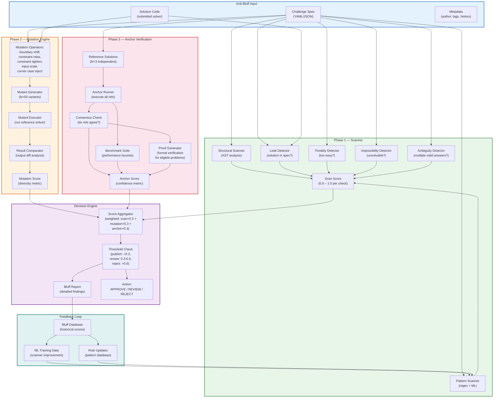

### Description

The Anti-Bluff Pipeline is a three-phase system that validates challenge quality and detects dishonest or poorly designed challenges. It operates as a quality gate between challenge creation and publication:

**Phase 1 — Scanner**: Six specialized scanners analyze the challenge specification and (optionally) submitted solution code. The Structural Scanner performs AST analysis to detect suspicious patterns (e.g., hardcoded answers disguised as computation). The Pattern Scanner uses a combination of regex rules and a trained ML model to identify known bluff patterns. The Leak Detector checks whether the solution is embedded in the spec (e.g., expected output appears in comments or examples). The Triviality Detector estimates whether the challenge can be solved with minimal effort. The Impossibility Detector checks whether the constraints are internally contradictory. The Ambiguity Detector identifies specs that could have multiple valid interpretations. Each scanner produces a score from 0.0 (no risk) to 1.0 (certain bluff).

**Phase 2 — Mutation Engine**: Applies five mutation operators to generate 50 variant problem instances. Boundary shift adjusts numeric boundaries, constraint relax/tighten modifies constraint parameters, input scale changes input sizes, and corner case inject adds edge cases. The Mutant Executor runs a reference solver on each variant, and the Result Comparator analyzes output diversity. Low diversity (all mutants produce similar outputs) suggests the challenge is trivial; very high diversity suggests it may be ambiguous or impossible.

**Phase 3 — Anchor Verification**: Runs three independent reference solutions and checks for consensus. If all three agree, confidence is high. The Benchmark Suite establishes performance bounds (minimum/maximum expected execution time and memory). For eligible problems (e.g., sorting, graph algorithms), a Proof Generator provides formal verification of correctness properties.

**Decision Engine**: Aggregates the three phase scores with configurable weights (scan: 0.3, mutation: 0.3, anchor: 0.4). The composite score determines the action: below 0.3 → APPROVE (auto-publish), 0.3–0.6 → REVIEW (human review required), above 0.6 → REJECT (blocked).

**Feedback Loop**: Historical bluff scores and outcomes feed back into the scanner's ML model and rule database, continuously improving detection accuracy.

### Key Relationships Highlighted

- **Scanner → Mutation → Anchor progression**: The three phases provide increasing confidence—scanners are fast but heuristic, mutation provides statistical evidence, and anchors provide ground-truth verification.
- **Weighted aggregation**: Anchor verification receives the highest weight (0.4) because it provides the strongest signal; scanners and mutations are supporting evidence.
- **Feedback loop → Scanner improvement**: Historical data trains the ML model and updates the pattern database, creating a virtuous cycle of improving detection.
- **Mutation diversity → Quality signal**: Low mutant output diversity indicates triviality; high diversity indicates ambiguity. The sweet spot is moderate diversity showing the challenge is non-trivial but well-defined.

---

## 20. CI/CD Pipeline

### Title

**Build → Test → Scan → Deploy Automation**

### Mermaid Diagram

```mermaid
graph TD
    subgraph Trigger["Pipeline Triggers"]
        T_PUSH["Git Push<br/>(feature branch)"]
        T_MERGE["PR Merge<br/>(main branch)"]
        T_TAG["Git Tag<br/>(v*.*.*)"]
        T_MANUAL["Manual Trigger<br/>(operator)"]
        T_SCHEDULE["Scheduled<br/>(nightly)"]
    end

    subgraph Build["Build Stage"]
        B_COMPILE["Compile<br/>(Rust: cargo build<br/>Go: go build<br/>TS: tsc + esbuild)"]
        B_LINT["Lint<br/>(Rust: clippy<br/>Go: golangci-lint<br/>TS: eslint)"]
        B_FMT["Format Check<br/>(Rust: rustfmt<br/>Go: gofmt<br/>TS: prettier)"]
        B_DOC["Doc Generation<br/>(Rust: cargo doc<br/>Go: godoc<br/>TS: typedoc)"]
        B_IMG["Container Build<br/>(Dockerfile → OCI image<br/>BuildKit cache)"]
        B_WASM["WASM Build<br/>(wasm-pack build<br/>for scheduler plugins)"]
    end

    subgraph Test["Test Stage"]
        T_UNIT["Unit Tests<br/>(nextest -j4 --timeout 60s)"]
        T_INTEG["Integration Tests<br/>(Docker Compose stack)"]
        T_E2E["E2E Tests<br/>(Playwright, 15m timeout)"]
        T_DST["DST Suite<br/>(deterministic sim,<br/>2h timeout)"]
        T_FUZZ["Fuzz Tests<br/>(30min per target,<br/>ASAN enabled)"]
        T_MUT["Mutation Tests<br/>(Rust + Go, 1h)"]
        T_PROP["Property Tests<br/>(1000 cases per prop)"]
    end

    subgraph Scan["Security Scan Stage"]
        S_SAST["SAST<br/>(Semgrep + CodeQL)"]
        S_DAST["DAST<br/>(OWASP ZAP,<br/>API fuzzing)"]
        S_DEP["Dependency Scan<br/>(Trivy + Snyk)"]
        S_IMG_S["Image Scan<br/>(Trivy --severity HIGH,CRITICAL)"]
        S_SECR["Secret Scan<br/>(gitleaks)"]
        S_LIC["License Scan<br/>(FOSSA)"]
        S_IAC["IaC Scan<br/>(Checkov + tfsec)"]
    end

    subgraph Publish["Publish Stage"]
        P_REG["Push to Registry<br/>(OCI image → Registry :8013)"]
        P_CHART["Publish Helm Chart<br/>(Chart Museum)"]
        P_BIN["Publish Binaries<br/>(GitHub Releases + S3)"]
        P_WASM_P["Publish WASM<br/>(plugin registry)"]
        P_SBOM["SBOM Generation<br/>(Syft + attestation)"]
        P_SIGN["Sign Artifacts<br/>(Cosign + Rekor)"]
    end

    subgraph Deploy["Deploy Stage"]
        D_STG["Staging Deploy<br/>(Helm upgrade --install<br/>values-staging.yaml)"]
        D_SMOKE["Smoke Tests<br/>(health + critical paths)"]
        D_CANARY["Canary Deploy<br/>(10% traffic, 5min observe)"]
        D_PROMOTE["Promote<br/>(increase to 100%)"]
        D_ROLLBACK["Auto-Rollback<br/>(error rate > 1%)"]
        D_PROD["Production Deploy<br/>(Helm upgrade --install<br/>values-prod.yaml)"]
    end

    subgraph Notify["Notifications"]
        N_SLACK["Slack<br/>(#helix-ci)"]
        N_GH["GitHub Status Check<br/>(commit status)"]
        N_PAGER["PagerDuty<br/>(prod failures only)"]
        N_METRIC["Metrics<br/>(Pipeline Prometheus)"]
    end

    T_PUSH --> B_COMPILE
    T_MERGE --> B_COMPILE
    T_TAG --> B_COMPILE
    T_MANUAL --> B_COMPILE
    T_SCHEDULE --> B_COMPILE

    B_COMPILE --> B_LINT --> B_FMT --> B_DOC --> B_IMG --> B_WASM

    B_WASM --> T_UNIT
    T_UNIT --> T_INTEG --> T_E2E --> T_DST
    T_E2E --> T_FUZZ
    T_E2E --> T_MUT
    T_UNIT --> T_PROP

    T_DST --> S_SAST
    T_FUZZ --> S_SAST
    T_PROP --> S_SAST
    S_SAST --> S_DAST --> S_DEP --> S_IMG_S --> S_SECR --> S_LIC --> S_IAC

    S_IAC --> P_REG
    S_IAC --> P_CHART
    S_IAC --> P_BIN
    S_IAC --> P_WASM_P
    P_REG --> P_SBOM --> P_SIGN

    P_SIGN --> D_STG --> D_SMOKE
    D_SMOKE --> D_CANARY --> D_PROMOTE
    D_PROMOTE --> D_PROD
    D_CANARY --> D_ROLLBACK

    D_STG --> N_SLACK
    D_PROD --> N_SLACK
    D_PROD --> N_GH
    D_ROLLBACK --> N_PAGER
    D_PROD --> N_METRIC

    style Trigger fill:#e3f2fd,stroke:#1565c0,stroke-width:2px
    style Build fill:#e8f5e9,stroke:#2e7d32,stroke-width:2px
    style Test fill:#fff3e0,stroke:#e65100,stroke-width:2px
    style Scan fill:#fce4ec,stroke:#c62828,stroke-width:2px
    style Publish fill:#f3e5f5,stroke:#6a1b9a,stroke-width:2px
    style Deploy fill:#e0f2f1,stroke:#00695c,stroke-width:2px
```

### Description

The CI/CD Pipeline automates the journey from code commit to production deployment across six stages:

**Trigger**: Five trigger types initiate the pipeline—Git Push (feature branches run a subset), PR Merge (full pipeline), Git Tag (release pipeline with publishing), Manual Trigger (operator-initiated, e.g., hotfix), and Scheduled (nightly full run including long-duration DST and mutation tests).

**Build Stage**: Compiles all language-specific code (Rust via cargo, Go via go build, TypeScript via tsc + esbuild), runs linters (clippy, golangci-lint, eslint), checks formatting (rustfmt, gofmt, prettier), generates documentation, builds container images (using BuildKit with layer caching), and compiles WASM scheduler plugins.

**Test Stage**: Runs the full seven-tier testing strategy—unit tests (nextest with 4-way parallelism and 60s per-test timeout), integration tests (Docker Compose service mesh), E2E tests (Playwright with 15-minute timeout), DST suite (deterministic simulation with 2-hour timeout for thorough interleaving), fuzz tests (30 minutes per target with ASAN), mutation tests (1-hour budget), and property tests (1000 cases per property).

**Security Scan Stage**: Seven security scans—SAST (Semgrep for pattern-based, CodeQL for dataflow-based analysis), DAST (OWASP ZAP for API fuzzing), dependency scanning (Trivy for OS packages, Snyk for language packages), image scanning (Trivy with HIGH and CRITICAL severity gates), secret scanning (gitleaks for leaked credentials), license scanning (FOSSA for compliance), and IaC scanning (Checkov for Kubernetes manifests, tfsec for Terraform).

**Publish Stage**: Pushes artifacts to their destinations—OCI images to the Registry Service (:8013), Helm charts to Chart Museum, binaries to GitHub Releases and S3, WASM plugins to the plugin registry. SBOMs are generated with Syft and attested with Cosign signatures stored in the Rekor transparency log.

**Deploy Stage**: Follows a progressive delivery strategy—staging deployment with Helm (using values-staging.yaml), smoke tests (health checks and critical path verification), canary deployment (10% traffic for 5 minutes with error-rate monitoring), promotion to 100% if the error rate stays below 1%, or automatic rollback if the error rate exceeds 1%. Production deployment uses values-prod.yaml with PodDisruptionBudgets and higher replica counts.

### Key Relationships Highlighted

- **Trigger → Pipeline scope**: Feature branches run build + unit tests only; PR merges run the full pipeline; tags add the publish stage; nightly runs include long-duration tests (DST, mutation).
- **Test → Scan gate**: All test stages must pass before security scans begin; scan failures block publishing.
- **Canary → Auto-rollback**: The canary phase continuously monitors error rates; exceeding the 1% threshold triggers automatic rollback and PagerDuty alerting.
- **SBOM + Cosign → Supply chain security**: Every published artifact has an SBOM and a Cosign signature in the Rekor transparency log, enabling full supply chain verification.

---

## Appendix A: Diagram Cross-Reference

| Diagram | Key Upstream Dependencies | Key Downstream Consumers |
|---|---|---|
| 1. System L0-L7 | — (root) | All other diagrams |
| 2. Control-Plane | Diagram 1 (L5-L7) | Diagrams 3, 6, 7 |
| 3. Workload Flow | Diagrams 2, 6, 7 | Diagrams 11, 18 |
| 4. SWIM Lifecycle | Diagram 1 (L3) | Diagram 5 (peer discovery) |
| 5. WireGuard Mesh | Diagrams 1 (L4), 4 (membership) | Diagram 8 (transport security) |
| 6. Omega Scheduler | Diagram 2 (services) | Diagrams 3, 7, 13 |
| 7. GPU Management | Diagram 1 (L2) | Diagrams 3, 6 |
| 8. Security | Diagrams 1 (L4), 5 (WireGuard) | All diagrams (cross-cutting) |
| 9. Session Management | Diagram 2 (Session Service) | Diagram 3 (user sessions) |
| 10. Build Service | Diagram 2 (Build Service) | Diagram 20 (CI/CD) |
| 11. Health Monitoring | Diagram 2 (Health Service) | Diagram 3 (health probes) |
| 12. Event/Messaging | Diagram 2 (Event Bus) | All diagrams (cross-cutting) |
| 13. Federation | Diagrams 2, 6 (scheduling) | Diagram 14 (consensus) |
| 14. Consensus | Diagram 1 (L3-L4) | Diagrams 2, 6, 7 |
| 15. Testing | — (meta) | Diagram 20 (CI/CD test stage) |
| 16. Deployment | All diagrams (packaging) | Diagram 20 (deploy stage) |
| 17. Database Schema | All data-producing diagrams | All data-consuming diagrams |
| 18. Challenges | Diagrams 3, 6, 7, 19 | Diagram 17 (persistence) |
| 19. Anti-Bluff | Diagram 18 (validation gate) | Diagram 15 (testing) |
| 20. CI/CD | Diagrams 10, 15, 16 | All diagrams (delivery) |

## Appendix B: Mermaid Rendering Notes

- **GitHub**: All diagrams render natively in GitHub markdown. Use ````mermaid` code fences.
- **VS Code**: Install the "Markdown Preview Mermaid Support" extension for live preview.
- **Static Generation**: Use `mmdc` (mermaid-cli) to generate SVG/PNG files: `mmdc -i ARCHITECTURE_DIAGRAMS.md -o output/`.
- **Theme**: All diagrams use default theme colors; the `style` directives add domain-specific color coding.
- **Performance**: Diagrams with >30 nodes may render slowly in browsers; consider splitting into sub-diagrams for presentation.

## Appendix C: Revision History

| Version | Date | Author | Changes |
|---|---|---|---|
| 1.0 | 2025-06-15 | Platform Team | Initial 10 diagrams |
| 1.5 | 2025-09-20 | Platform Team | Added diagrams 11-15, expanded existing |
| 2.0 | 2025-12-10 | Platform Team | Added diagrams 16-20, cross-reference appendix |
| 2.4 | 2026-03-04 | Platform Team | Updated for Omega Scheduler v2, WireGuard mesh redesign, Anti-Bluff pipeline addition |

---

## Appendix D: Operational Runbooks by Diagram

This appendix links common operational scenarios to the relevant architectural diagrams, enabling on-call engineers to quickly locate the context they need during incidents.

### D.1 Scheduling Failures

**Symptom**: Workloads stuck in `Pending` state, scheduler logs show "no feasible nodes."

**Relevant Diagrams**:
- **Diagram 6 (Omega Scheduler)**: Trace the Filter → Score → Bind pipeline to identify which filter is eliminating all nodes. Check the Unschedulable Cache for recent flush events.
- **Diagram 7 (GPU Management)**: If GPU workloads are failing, verify GPU availability in the Reservation Engine and check MIG profile compatibility.
- **Diagram 14 (Consensus)**: Ensure the etcd cluster is healthy—scheduler reads node states from etcd, and a slow etcd can cause stale cache data.

**Runbook**: Check `kubectl get nodes -o wide` for node capacity. Check `etcdctl endpoint health` for consensus health. Review scheduler logs for filter-stage elimination reasons. If the Filter phase passes but Score produces low scores, check the SchedulingProfile weights.

### D.2 Node Membership Flaps

**Symptom**: Nodes repeatedly transition between Alive and Suspect states, causing workload evictions.

**Relevant Diagrams**:
- **Diagram 4 (SWIM Gossip)**: Examine the state machine transitions. Frequent Alive → Suspect → Alive cycles indicate network issues between the prober and the target.
- **Diagram 5 (WireGuard Mesh)**: If the node is behind NAT, check STUN reachability and TURN relay health. WireGuard tunnel flaps can cause SWIM probe failures.
- **Diagram 11 (Health Monitoring)**: Verify that the Health Service is not misclassifying network-caused probe failures as workload failures.

**Runbook**: Check `swim-gossip-daemon` logs for probe timings. Verify WireGuard tunnel status with `wg show`. If TURN relay is overloaded, consider adding relay capacity. Adjust `suspect_timeout` if the network is known to be high-latency.

### D.3 Session Data Loss

**Symptom**: Users report missing session state after session migration or node failure.

**Relevant Diagrams**:
- **Diagram 9 (Session Management)**: Trace the CRDT sync path between replicas. If CRDT deltas were not propagated before the source node failed, data may be lost.
- **Diagram 12 (Event/Messaging)**: Verify that the `SessionUpdated` events were published to NATS. If NATS was temporarily unavailable, delta sync may have been skipped.
- **Diagram 17 (Database Schema)**: Check PostgreSQL for the session's persistent state. If the session was only in Redis (hot tier), it may not have been persisted before the failure.

**Runbook**: Check Redis for the session key. Check PostgreSQL for the latest persisted CRDT state. Review NATS JetStream for delivery confirmations. If the session was in the middle of migration (Diagram 9, Migration Protocol), check whether the State Transfer phase completed.

### D.4 GPU Scheduling Conflicts

**Symptom**: Two workloads scheduled on the same GPU, causing OOM or compute errors.

**Relevant Diagrams**:
- **Diagram 7 (GPU Management)**: The Reservation Engine should prevent this via transactional allocation. Check whether the transaction in etcd was correctly committed.
- **Diagram 14 (Consensus)**: Verify etcd transaction isolation. A split-brain scenario could allow two schedulers to independently reserve the same GPU.
- **Diagram 6 (Omega Scheduler)**: Check the Bind phase—was the bind transactional? If the scheduler used a stale cache, it may have read outdated GPU availability.

**Runbook**: Query `gpu_reservations` in PostgreSQL for overlapping time ranges on the same GPU. Check etcd revision history for the GPU allocation key. Verify that only one scheduler leader is active (check the leader lease in etcd). If the scheduler cache was stale, increase the etcd watch refresh interval.

### D.5 Build Pipeline Failures

**Symptom**: Builds failing with "execution backend error" or "cache corruption."

**Relevant Diagrams**:
- **Diagram 10 (Build Service)**: Trace from the Build Orchestrator through the Worker Pool to the Execution Backend. If the Podman backend is failing, check container runtime health on the worker.
- **Diagram 2 (Control-Plane)**: Verify that the Build Service (:8005) can reach the Registry Service (:8013) for image pushes.
- **Diagram 20 (CI/CD)**: If the failure is in the CI/CD pipeline, identify which stage (Build, Test, Scan, or Deploy) failed.

**Runbook**: Check worker logs for Podman/containerd errors. Verify disk space on build workers (cache corruption is often caused by full disks). Check Registry Service health and available storage. If using the Exec backend, verify namespace isolation is working (check `lsns` output).

### D.6 Federation Sync Delays

**Symptom**: Federated workloads not appearing in remote clusters, or stale cluster health data.

**Relevant Diagrams**:
- **Diagram 13 (Federation)**: Check the Federation Hub → Spoke connectivity. Verify heartbeats are being received (5-second interval, 3 missed = suspect).
- **Diagram 5 (WireGuard Mesh)**: Cross-region WireGuard tunnels may be degraded. Check tunnel latency and packet loss.
- **Diagram 12 (Event/Messaging)**: NATS stream mirroring between clusters may be lagging. Check mirror lag metrics.

**Runbook**: Verify WireGuard tunnel status between hub and spoke. Check NATS mirror consumer lag. Verify Federation Agent logs on the spoke cluster. If the hub is overloaded (handling too many spokes), consider splitting into regional hubs.

### D.7 Security Incidents

**Symptom**: Unauthorized workload deployment, suspicious API access patterns, or certificate expiration warnings.

**Relevant Diagrams**:
- **Diagram 8 (Security Architecture)**: Trace from the Identity layer through Authentication to Authorization. If an unauthorized action occurred, check whether the RBAC policy was misconfigured.
- **Diagram 4 (SWIM Gossip)**: A node that was declared Dead but continues to communicate may indicate a zombie node with revoked SVIDs.
- **Diagram 8 (Audit)**: Query the Audit Store for the specific action and actor. The audit trail should show the JWT claims and RBAC decision.

**Runbook**: Check SPIRE Server for SVID issuance logs. Verify RBAC policy in etcd `/auth/policies`. Query `audit_events` in PostgreSQL for the suspicious action. If SVIDs were compromised, rotate the trust bundle via SPIRE Server.

---

## Appendix E: Capacity Planning Reference

This appendix provides capacity planning guidance derived from the architectural diagrams, helping operators size their Helix Cluster deployments appropriately.

### E.1 Control-Plane Sizing

| Component | Small (≤50 nodes) | Medium (50-200 nodes) | Large (200-1000 nodes) | XL (1000+ nodes) |
|---|---|---|---|---|
| API Gateway replicas | 2 | 3 | 5 | 8 |
| Scheduler replicas | 1 (leader) | 2 (leader + standby) | 3 (leader + 2 standby) | 5 (leader + 4 standby) |
| etcd cluster size | 3 | 3 | 5 | 5 + proxy |
| NATS cluster size | 3 | 3 | 3 | 5 |
| PostgreSQL instances | 1 primary + 1 replica | 1 primary + 2 replicas | 1 primary + 3 replicas | 1 primary + 5 replicas + read replicas |
| Redis cluster | 3 master + 3 replica | 3 master + 3 replica | 6 master + 6 replica | 9 master + 9 replica |

### E.2 Data-Plane Sizing

The data-plane sizing is driven by workload density and GPU requirements. Key formulas derived from Diagram 7 (GPU Management) and Diagram 6 (Omega Scheduler):

- **Scheduling throughput**: The Omega Scheduler can process approximately 500 scheduling decisions per second per replica on standard hardware. For clusters with burst scheduling needs (e.g., 10,000 workloads starting simultaneously), scale scheduler replicas proportionally.
- **GPU reservation throughput**: The GPU Service's Reservation Engine processes approximately 200 transactional GPU allocations per second. For GPU-heavy clusters, consider sharding the GPU inventory across multiple etcd key ranges.
- **Session concurrency**: The Session Service's CRDT Engine handles approximately 10,000 concurrent sessions per replica. Sessions that are idle consume minimal resources; active sessions with frequent CRDT merges consume CPU proportional to the merge rate.

### E.3 Network Sizing

Network sizing is derived from Diagram 5 (WireGuard Mesh) and Diagram 12 (Event/Messaging):

- **WireGuard mesh bandwidth**: Each inter-node WireGuard tunnel consumes approximately 50 Mbps of encrypted overhead for a fully loaded cluster. For a 100-node cluster with a full mesh, plan for 100 × 99 / 2 = 4,950 tunnels, but in practice the on-demand tunnel strategy (Diagram 5) reduces active tunnels to approximately 3 × N (where N is the node count).
- **NATS bandwidth**: Domain events average 1 KB each. At peak, the Event Bus processes approximately 50,000 events per second, requiring 50 MB/s of bandwidth within the NATS cluster.
- **Cross-region bandwidth**: Federation event mirroring (Diagram 13) replicates approximately 10% of the event volume across regions. For a cluster generating 50,000 events/second, plan for 5 MB/s of cross-region bandwidth per spoke.

### E.4 Storage Sizing

Storage sizing is derived from Diagram 17 (Database Schema):

- **PostgreSQL**: Workload metadata averages 2 KB per workload. For 100,000 workloads with 30-day retention, plan for approximately 600 MB of workload data. Audit events average 500 bytes each; at 50,000 events/second with 90-day retention, plan for approximately 2 TB of audit data.
- **etcd**: Schedule bindings average 500 bytes each. For 100,000 concurrent bindings, plan for approximately 50 MB of etcd data. With MVCC revision history (default 100,000 revisions), plan for approximately 5 GB.
- **Redis**: Session state averages 5 KB per session. For 100,000 concurrent sessions, plan for approximately 500 MB of Redis memory. Schedule cache entries average 200 bytes each; for 100,000 workloads, plan for approximately 20 MB.
- **Object storage (S3/MinIO)**: Build artifacts average 500 MB per image. For 1,000 builds per day with 30-day retention, plan for approximately 15 TB of object storage.

---

## Appendix F: Glossary of Helix-Specific Terms

| Term | Definition | Related Diagram |
|---|---|---|
| **Omega Scheduler** | The custom scheduling engine that replaces Kubernetes' default scheduler, providing GPU-aware, topology-aware, and WASM-extensible scheduling. | Diagram 6 |
| **Honey Cell** | An ephemeral single-node cluster used for integration testing, provisioned on-demand and torn down after test completion. | Diagram 15 |
| **Bluff Score** | A composite risk score (0.0–1.0) produced by the Anti-Bluff Pipeline, measuring the likelihood that a challenge is poorly designed or dishonest. | Diagram 19 |
| **Anchor Verification** | The third phase of the Anti-Bluff Pipeline that runs multiple independent reference solutions to establish ground-truth correctness. | Diagram 19 |
| **SPIFFE ID** | A URI-formatted identity (`spiffe://helix.cluster/ns/{namespace}/sa/{service}`) assigned to every workload by the SPIRE infrastructure. | Diagram 8 |
| **SVID** | SPIFFE Verifiable Identity Document—a short-lived X.509 certificate or JWT that cryptographically binds a workload to its SPIFFE ID. | Diagram 8 |
| **MIG Profile** | A Multi-Instance GPU partition configuration (e.g., `1g.5gb`, `7g.40gb`) that divides an A100/H100 GPU into isolated instances. | Diagram 7 |
| **Protocol Period** | The interval between SWIM gossip rounds (default 1 second). All SWIM timers are expressed as multiples of this period. | Diagram 4 |
| **Incarnation Number** | A monotonically increasing counter used by SWIM to distinguish fresh state from stale state. A node increments its incarnation when refuting a suspicion. | Diagram 4 |
| **DST** | Deterministic Simulation Testing—a testing methodology where concurrency is controlled by a deterministic scheduler, enabling exact reproduction of race conditions. | Diagram 15 |
| **Automerge-RS** | The Rust implementation of the Automerge CRDT library used by the Session Service for conflict-free state replication. | Diagram 9 |
| **BuildKit Cache** | Docker BuildKit's content-addressable cache that enables layer reuse across builds, reducing build times by 40-60% for incremental changes. | Diagram 10 |
| **xDS** | The Envoy configuration discovery service API used by the Mesh Controller to dynamically configure Envoy proxies (listeners, routes, clusters, endpoints). | Diagram 2 |
| **Canary Deploy** | A progressive deployment strategy that routes a small percentage of traffic (default 10%) to the new version before full promotion, with automatic rollback on error-rate spikes. | Diagram 20 |
| **Trust Bundle** | The collection of root CA and intermediate CA certificates distributed by SPIRE, used by all workloads to verify mTLS peer certificates. | Diagram 8 |

---

## Appendix G: Diagram Maintenance Guide

This appendix describes how to keep this document synchronized with the evolving Helix Cluster codebase.

### G.1 When to Update Diagrams

| Change Type | Diagrams to Update | Reviewer |
|---|---|---|
| New service added | 2 (Control-Plane), 1 (L0-L7 if new layer) | Platform Lead |
| Service port change | 2 (Control-Plane) | SRE |
| New scheduling filter/score | 6 (Omega Scheduler) | Scheduler Team |
| New GPU backend | 7 (GPU Management) | GPU Team |
| New security layer | 8 (Security Architecture) | Security Team |
| New CRDT type | 9 (Session Management) | Session Team |
| New build execution backend | 10 (Build Service) | Build Team |
| New health checker | 11 (Health Monitoring) | SRE |
| New event stream | 12 (Event/Messaging) | Platform Lead |
| New spoke cluster | 13 (Federation) | Federation Team |
| etcd key prefix change | 14 (Consensus), 17 (Database Schema) | Platform Lead |
| New testing tier | 15 (Testing Architecture) | QA Lead |
| New Helm subchart | 16 (Deployment) | DevOps |
| Database schema migration | 17 (Database Schema) | Data Team |
| New anti-bluff scanner | 19 (Anti-Bluff Pipeline) | Challenge Team |
| New CI/CD stage | 20 (CI/CD Pipeline) | DevOps |

### G.2 Validation Checklist

Before merging changes to this document, verify:

1. **Mermaid syntax**: Copy each diagram's code block into the Mermaid Live Editor (https://mermaid.live) and confirm it renders without errors.
2. **Cross-references**: If a component appears in multiple diagrams, verify that its name, port, and description are consistent across all occurrences.
3. **Port uniqueness**: No two services in Diagram 2 should share the same port number.
4. **Subgraph nesting**: Ensure all nodes are assigned to exactly one subgraph; ungrouped nodes indicate an organizational gap.
5. **Arrow direction**: Verify that data-flow arrows point in the correct direction (producer → consumer for data, caller → callee for RPC).
6. **Style consistency**: All diagrams should use the same color scheme for the same domain (blue for control-plane, green for data-plane, orange for compute, red for security, purple for storage, teal for infrastructure).

---

*End of Document*
