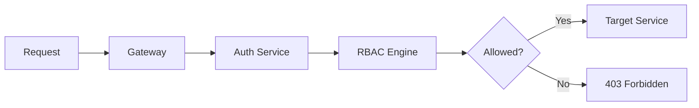

# RBAC Policies

This document describes the default roles, policy examples, and enforcement points for Helix Cluster OS role-based access control.

---

## Default Roles

Helix Cluster OS ships with the following built-in roles:

| Role | Permissions | Intended Users |
|------|-------------|--------------|
| `cluster-admin` | Full access to all resources | Platform operators |
| `namespace-admin` | Full access within a namespace | Team leads |
| `developer` | Create and manage builds, view logs and metrics | Engineers |
| `viewer` | Read-only access to all resources | Auditors, support |
| `build-executor` | Submit builds, view own job status | CI/CD pipelines |
| `service-account` | Internal service identity | Inter-service authentication |

### Role Permission Matrix

| Resource | cluster-admin | namespace-admin | developer | viewer | build-executor |
|----------|:-----------:|:---------------:|:---------:|:------:|:--------------:|
| builds (all) | CRUD | CRUD (ns) | CRUD (ns) | R | — |
| builds (own) | CRUD | CRUD | CRUD | R | CRUD |
| nodes | CRUD | R | R | R | — |
| namespaces | CRUD | R | R | R | — |
| policies | CRUD | R | — | R | — |
| quotas | CRUD | R | — | R | — |
| audit logs | CRUD | R (ns) | — | R | — |
| configs | CRUD | CRUD (ns) | R | R | — |
| metrics | CRUD | R (ns) | R (ns) | R | — |
| logs | CRUD | R (ns) | R (ns) | R | R (own) |
| registry | CRUD | CRUD (ns) | R (ns) | R | R |

> **C** = Create, **R** = Read, **U** = Update, **D** = Delete

---

## Policy Examples

### Example 1: Developer in a Namespace

```yaml
apiVersion: rbac.helix.io/v1
kind: RoleBinding
metadata:
  name: team-alpha-developers
  namespace: alpha
subjects:
  - kind: User
    name: alice@example.com
roleRef:
  kind: Role
  name: developer
```

### Example 2: CI Pipeline Service Account

```yaml
apiVersion: rbac.helix.io/v1
kind: ServiceAccount
metadata:
  name: ci-pipeline
  namespace: default
---
apiVersion: rbac.helix.io/v1
kind: RoleBinding
metadata:
  name: ci-build-executor
  namespace: default
subjects:
  - kind: ServiceAccount
    name: ci-pipeline
roleRef:
  kind: Role
  name: build-executor
```

### Example 3: Custom Role (Read-Only Registry)

```yaml
apiVersion: rbac.helix.io/v1
kind: Role
metadata:
  name: registry-reader
rules:
  - apiGroups: ["registry.helix.io"]
    resources: ["images", "repositories"]
    verbs: ["get", "list"]
```

### Example 4: Deny Policy (Emergency Lockdown)

```yaml
apiVersion: rbac.helix.io/v1
kind: DenyPolicy
metadata:
  name: emergency-build-lockdown
spec:
  subjects:
    - kind: Group
      name: developers
  rules:
    - apiGroups: ["build.helix.io"]
      resources: ["builds"]
      verbs: ["create", "update", "delete"]
```

---

## Enforcement Points

RBAC policies are enforced at the following points:



### 1. Gateway (Primary Enforcement)

Every incoming request is authorized by the Gateway before routing:

- Extracts identity from TLS client certificate or bearer token
- Queries the Auth Service for role bindings
- Evaluates policy against the requested resource and verb
- Returns `403 Forbidden` if denied

### 2. Service-Level Enforcement (Defense in Depth)

Services perform secondary authorization for sensitive operations:

- **Policy Service:** Validates that the caller has permission to create or modify policies
- **Quota Service:** Ensures the caller can manage quotas in the target namespace
- **Audit Service:** Restricts audit log access to `cluster-admin` and `viewer` roles

### 3. etcd Access Control

Services authenticate to etcd using mTLS. etcd does not enforce application-level RBAC; all authorization logic resides in the Helix services.

---

## Policy Storage

RBAC policies are stored in etcd under the prefix `/helix/rbac/`:

| Key Prefix | Content |
|------------|---------|
| `/helix/rbac/roles/` | Role definitions |
| `/helix/rbac/rolebindings/` | Role bindings |
| `/helix/rbac/serviceaccounts/` | Service account tokens and metadata |
| `/helix/rbac/denypolicies/` | Explicit deny policies |

Changes are watched by the Auth Service and propagated to the Gateway within seconds.

---

## Best Practices

1. **Principle of least privilege:** Assign the minimum role necessary.
2. **Use service accounts for automation:** Never use personal credentials in CI/CD.
3. **Regular audits:** Review role bindings quarterly.
4. **Namespace isolation:** Use namespaces to separate teams and environments.
5. **Deny policies:** Use deny policies for emergency access revocation without deleting role bindings.
