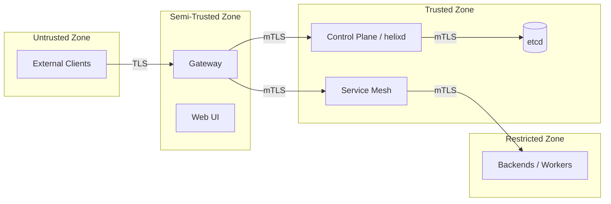

# Threat Model

This document outlines the assets, threats, mitigations, trust boundaries, and attack surfaces for Helix Cluster OS.

---

## Assets

| Asset | Value | Location |
|-------|-------|----------|
| etcd data | Cluster state, secrets, RBAC policies | etcd cluster |
| Container images | Build artifacts, deployment payloads | Registry / Object storage |
| Build logs | Source code, build output, potential secrets | Log service / Object storage |
| API credentials | Service tokens, user sessions | Auth service / etcd |
| Node infrastructure | Compute, network, storage resources | Worker nodes |
| Audit logs | Compliance evidence, incident traces | Audit service / Object storage |

---

## Threats and Mitigations

| ID | Threat | Impact | Mitigation |
|----|--------|--------|------------|
| T1 | Unauthorized API access | Data exfiltration, job manipulation | RBAC enforcement, mTLS, API rate limiting |
| T2 | etcd compromise | Full cluster takeover | mTLS, network segmentation, encrypted volumes, backups |
| T3 | Man-in-the-middle (inter-service) | Credential theft, data tampering | mTLS on all service mesh traffic |
| T4 | Privilege escalation in builds | Host compromise | Sandboxed build workers, seccomp, gVisor (optional) |
| T5 | Denial of service | Service unavailability | Rate limiting, HPA, resource quotas, circuit breakers |
| T6 | Secret leakage in logs | Credential exposure | Automatic secret redaction in Log service |
| T7 | Supply chain attack | Malicious images | Image signing (Sigstore/cosign), admission policies |
| T8 | Insider threat | Unauthorized data access | Audit logging, least-privilege RBAC, periodic access review |

---

## Trust Boundaries

| Boundary | Controls |
|----------|----------|
| Untrusted → Semi-Trusted | TLS 1.3, API authentication, rate limiting |
| Semi-Trusted → Trusted | mTLS, request signing, RBAC enforcement |
| Trusted → Restricted | mTLS, network policies, workload identity |

---

## Attack Surfaces

### External Attack Surfaces

| Surface | Exposure | Controls |
|---------|----------|----------|
| Gateway HTTPS API | Public internet or corporate network | TLS 1.3, WAF, DDoS protection, rate limiting |
| Web UI | Same as gateway | CSP headers, XSS protection, CSRF tokens |
| gRPC API (via gateway) | Public or internal | Authentication, authorization, input validation |

### Internal Attack Surfaces

| Surface | Exposure | Controls |
|---------|----------|----------|
| Inter-service gRPC | Service mesh | mTLS, SPIFFE/SPIRE workload identity (optional) |
| etcd client API | Internal network only | mTLS, peer authentication, network policies |
| Node / Worker hosts | Internal network | Host hardening, SELinux/AppArmor, minimal base images |

### Supply Chain Attack Surfaces

| Surface | Risk | Controls |
|---------|------|----------|
| Base container images | Compromised upstream images | Pin digests, vulnerability scanning, signed images |
| Go module dependencies | Malicious packages | `go mod verify`, dependency scanning, private proxy |
| Build environment | Tampered builds | Reproducible builds, signed artifacts, SLSA compliance |

---

## Risk Acceptance

The following risks are accepted for v0.1.0 with planned remediation:

| Risk | Rationale | Planned Mitigation |
|------|-----------|-------------------|
| SPIFFE/SPIRE not enabled | Adds operational complexity | Evaluate and enable in v0.2.0 |
| gVisor not default for builds | Performance overhead on small clusters | Optional toggle; default in v0.3.0 |
| No automated secret rotation | Manual rotation acceptable for initial release | Automated rotation in v0.2.0 |
